

### 534

|Name|RAJ2000[deg]|DEJ2000[deg] |Ext[arcmin]| Ext,ml | z | z_src| C|GC(XSZ,Delta_z<0.01)| GC(OPT,Delta_z<0.01)|GC| R_sig[arcmin] | R500[arcmin] | R500[Mpc]| CRsig[c/s] | CR500[c/s] |L500[1E44 erg/s]|F500[1E-12 erg/s/cm^2]| M500[1E14 Msun]|Tx[keV]|Cnt_sig|Beta|Rc[arcmin]|Comment|Alias|
|---|---|---|---|---|---|------|---|--------|---------|----------|---|---|---|---|---|---|---|---|---|---|---|---|---|---|
|534| 207.931| 46.353| 2.53| 71.61| 0.0629(0.005)| z1, z_xsz| B| F20, MCXC, PSZ2, SPI, Tar| N| F20, MCXC, N, PSZ2, SPI, Tar, W| 10.262| 9.952| 0.723| 0.176(0.026)| 0.176(0.026)| 0.315(0.030)| 3.300(0.312)| 1.14(0.06)| 2.37(0.07)| 107.5| 0.940(-0.079+0.044)| 5.438(-0.535+0.421)| -| k302|

|[RASS image](../image/534/534_img.pdf)|[filtered image](../image/534/534_fil.pdf)|[Segment image](../image/534/534_seg.pdf)|
|-------------------|--------------------|-------------------|
| 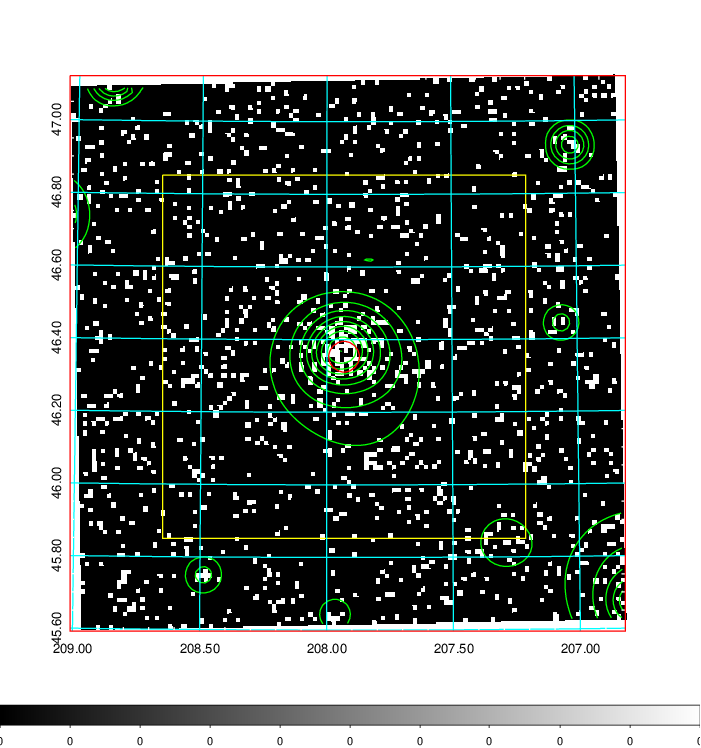  | 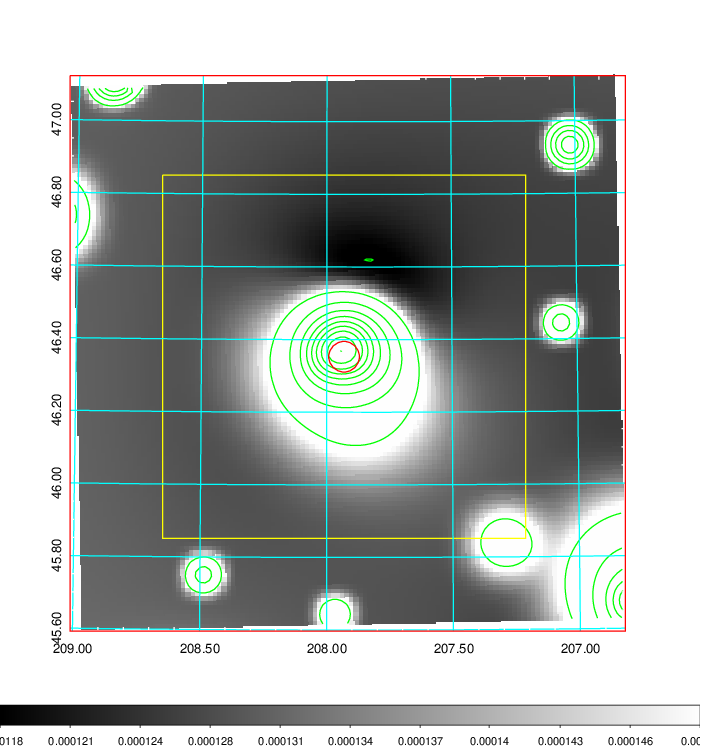   | 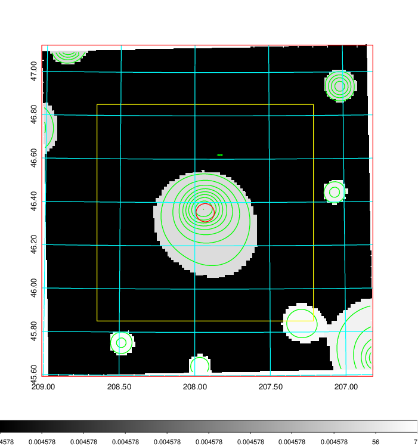  |

|[Exposure image](../image/534/534_mex.pdf)| [nH image](../image/534/534_nh.pdf)| [Planck image](../image/534/534_p.pdf)|
|-------------------|--------------------|-------------------|
|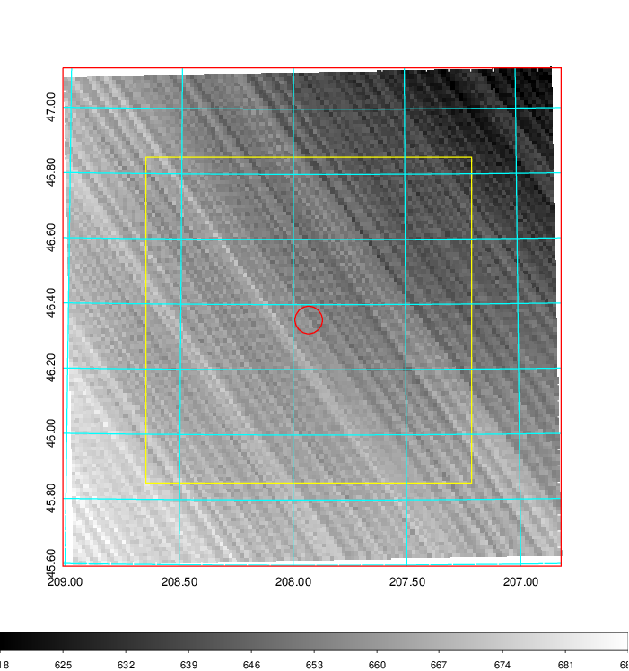   | 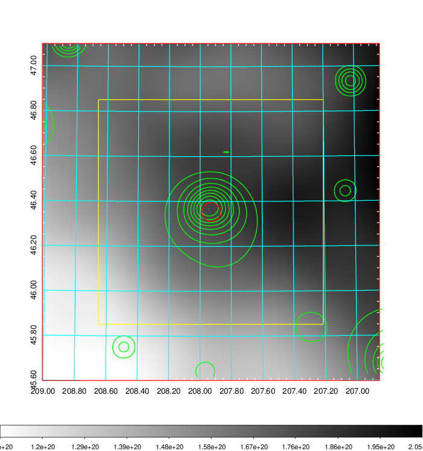    | 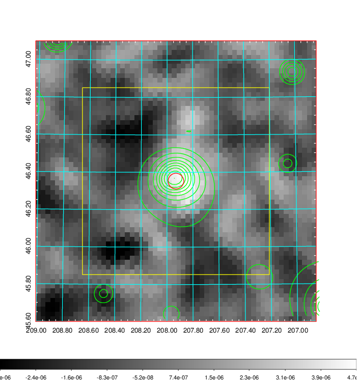 |

|[Redshift Histogram](../image/534/534_zg.pdf) | [DSS image(z1)](../image/534/534_dss_z1.pdf)      |  [DSS image(z2)](../image/534/534_dss_z2.pdf)    |
|-------------------|--------------------|-------------------|
|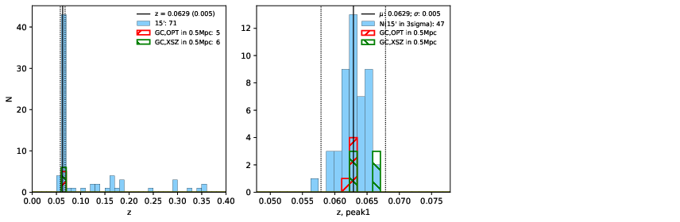 |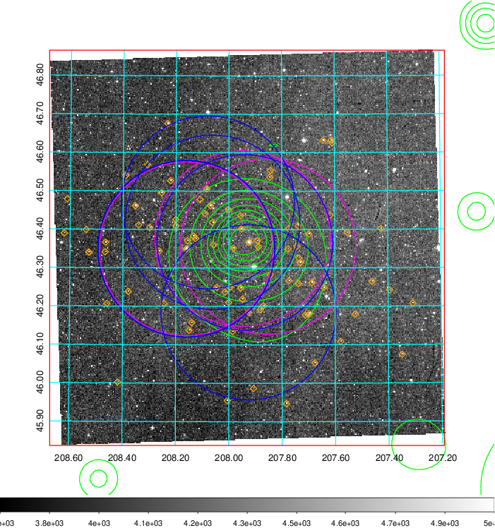  Blue circle for optical clusters;  Magenta circle for XSZ clusters;  all with r=1Mpc;  Only GC with Delta_z<0.01 are shown. | 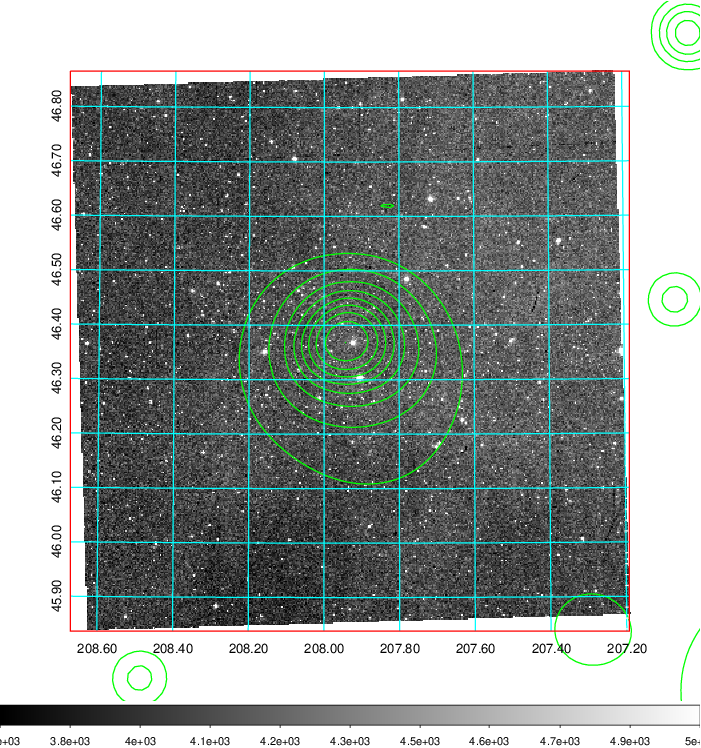 Blue circle for optical clusters;  Magenta circle for XSZ clusters;  all with r=1Mpc;  Only GC with Delta_z<0.01 are shown.  |

|[Previous-identified clusters](../image/534/534_gc.pdf) | [2MASS image](../image/534/534_2mass.pdf)      |[SDSS image](../image/534/534_sdss.pdf)   |
|-------------------|-------------------|-------------------|
|  Green, magenta, and blue circles  for optical, X-ray and SZ clusters  respectively, with redshift of clusters  labelled. The radius of circles  are 1Mpc.|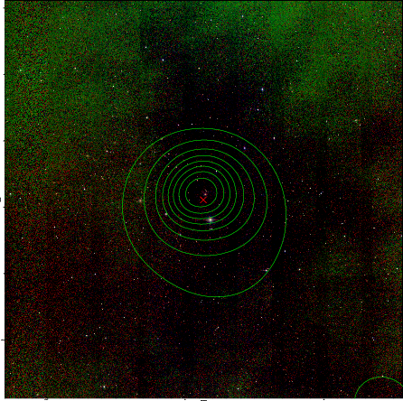  | 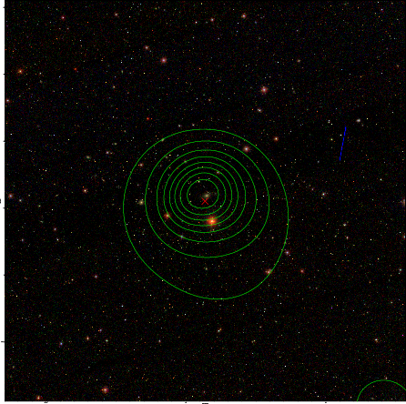  |

