

### 535

|Name|RAJ2000[deg]|DEJ2000[deg] |Ext[arcmin]| Ext,ml | z | z_src| C|GC(XSZ,Delta_z<0.01)| GC(OPT,Delta_z<0.01)|GC| R_sig[arcmin] | R500[arcmin] | R500[Mpc]| CRsig[c/s] | CR500[c/s] |L500[1E44 erg/s]|F500[1E-12 erg/s/cm^2]| M500[1E14 Msun]|Tx[keV]|Cnt_sig|Beta|Rc[arcmin]|Comment|Alias|
|---|---|---|---|---|---|------|---|--------|---------|----------|---|---|---|---|---|---|---|---|---|---|---|---|---|---|
|535| 208.061| -9.758| 3.84| 28.58| 0.2026(0.005)| z2, z_xsz| B| MCXC, Tar| W| A, MCXC, N, PSZ2, Tar, W| 13.188| 5.049| 1.010| 0.110(0.040)| 0.099(0.036)| 2.279(0.540)| 1.927(0.456)| 3.58(0.41)| 5.02(0.37)| 50.0| 0.911(-0.110+0.065)| 5.965(-0.874+0.755)| -| k464|

|[RASS image](../image/535/535_img.pdf)|[filtered image](../image/535/535_fil.pdf)|[Segment image](../image/535/535_seg.pdf)|
|-------------------|--------------------|-------------------|
| 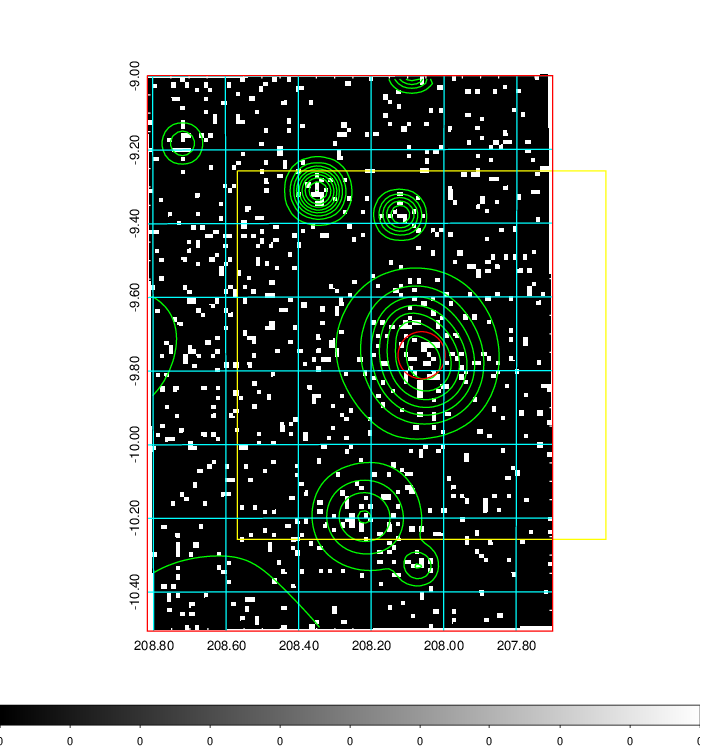  | 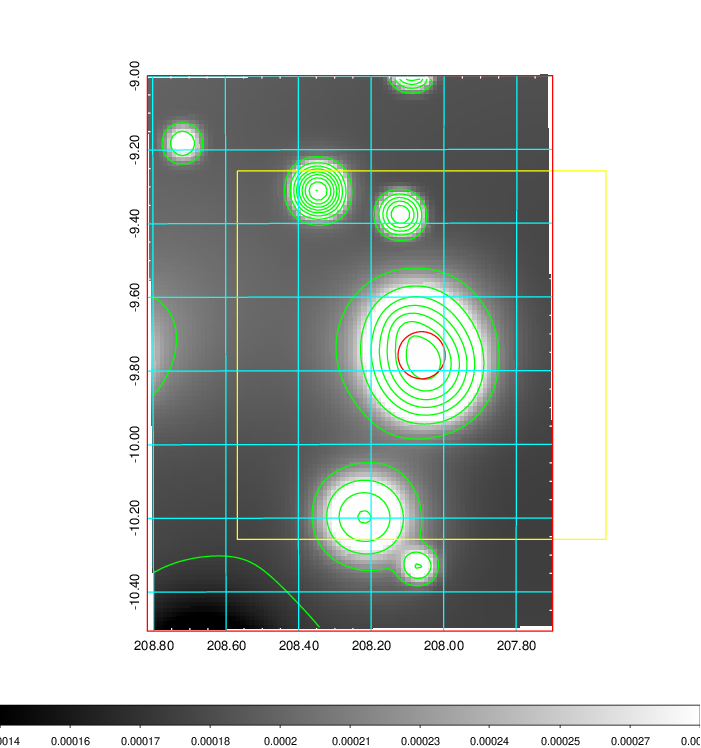   | 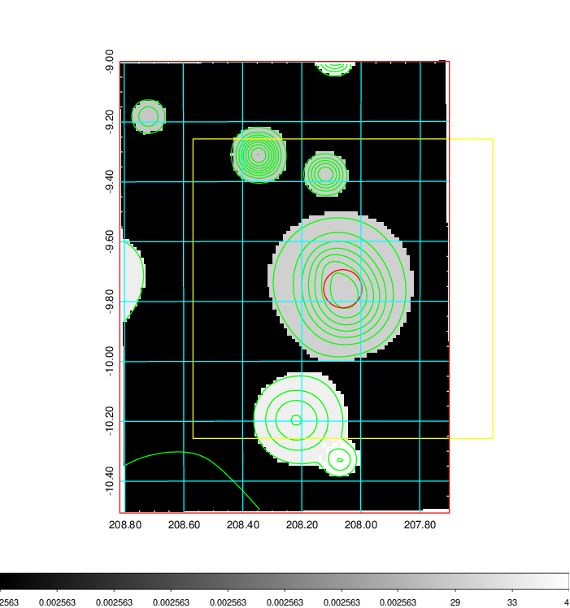  |

|[Exposure image](../image/535/535_mex.pdf)| [nH image](../image/535/535_nh.pdf)| [Planck image](../image/535/535_p.pdf)|
|-------------------|--------------------|-------------------|
|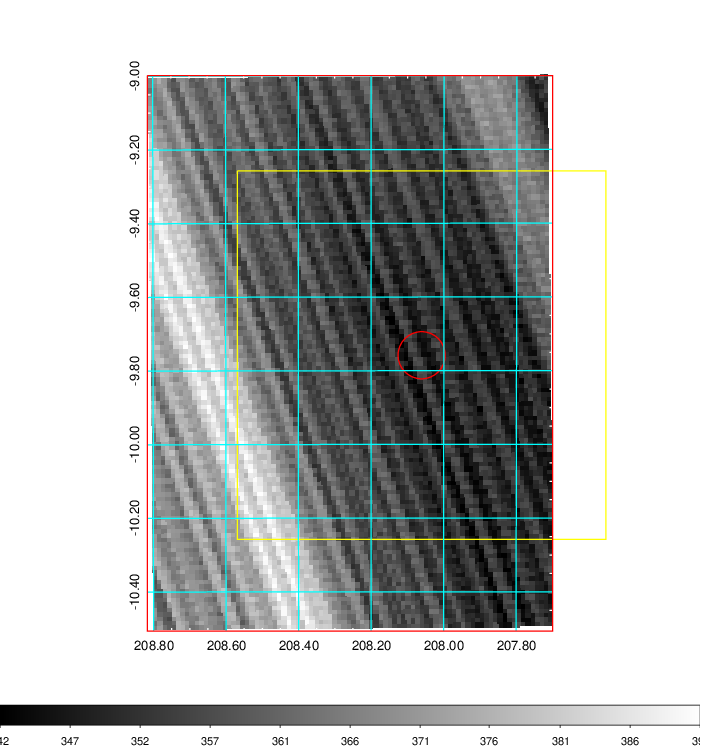   | 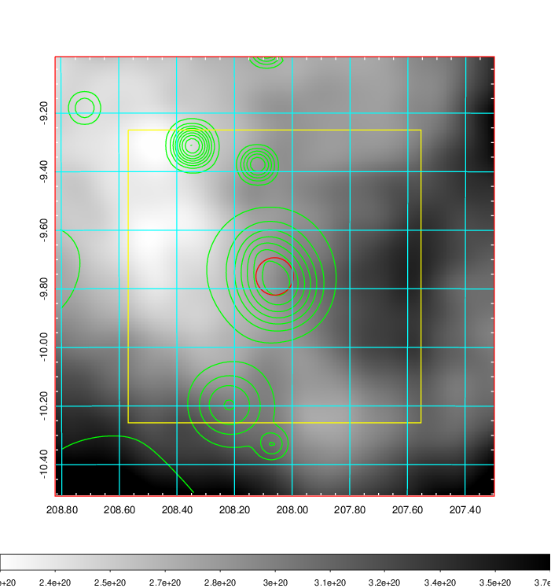    | 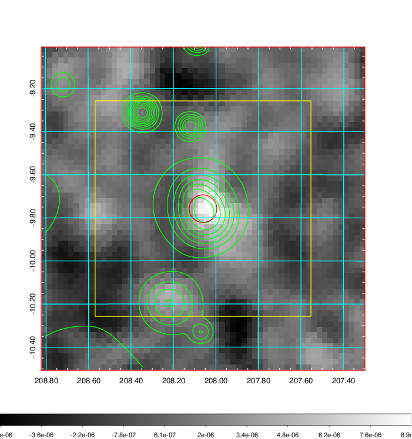 |

|[Redshift Histogram](../image/535/535_zg.pdf) | [DSS image(z1)](../image/535/535_dss_z1.pdf)      |  [DSS image(z2)](../image/535/535_dss_z2.pdf)    |
|-------------------|--------------------|-------------------|
|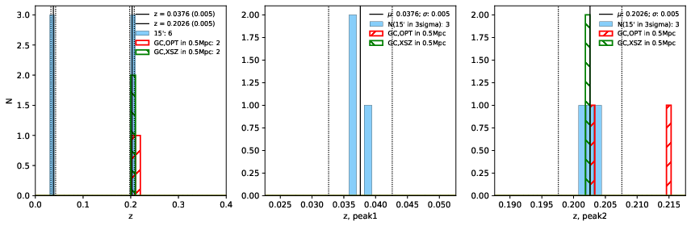 |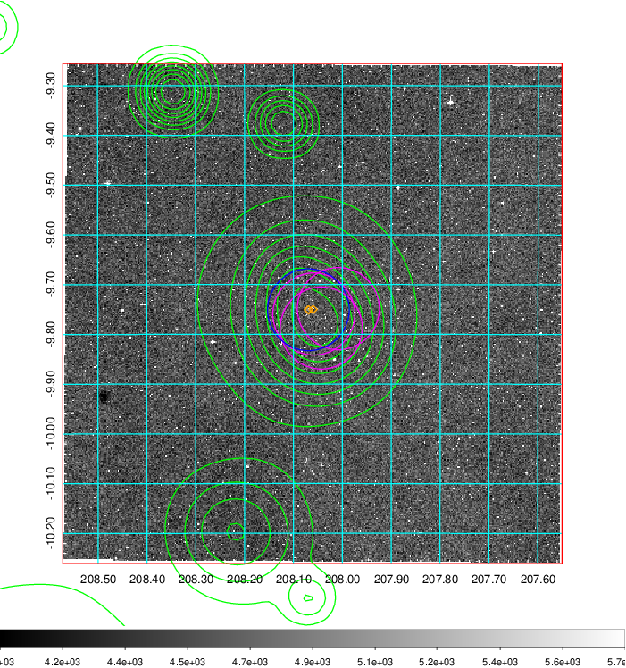  Blue circle for optical clusters;  Magenta circle for XSZ clusters;  all with r=1Mpc;  Only GC with Delta_z<0.01 are shown. | 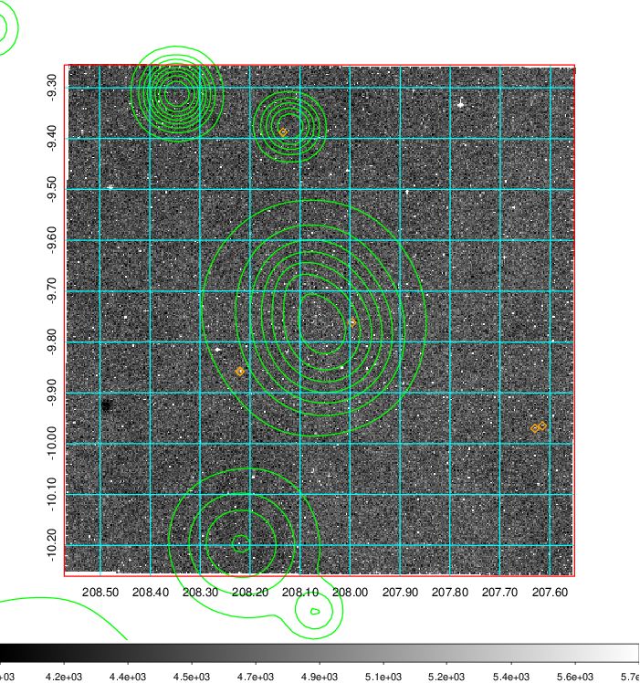 Blue circle for optical clusters;  Magenta circle for XSZ clusters;  all with r=1Mpc;  Only GC with Delta_z<0.01 are shown.  |

|[Previous-identified clusters](../image/535/535_gc.pdf) | [2MASS image](../image/535/535_2mass.pdf)      |
|-------------------|-------------------|
|  Green, magenta, and blue circles  for optical, X-ray and SZ clusters  respectively, with redshift of clusters  labelled. The radius of circles  are 1Mpc.|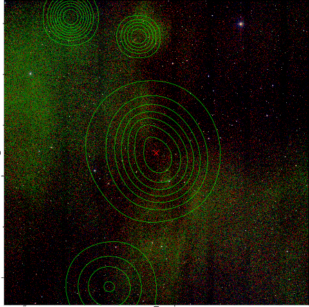  |

|[ATLAS image](../image/535/535_s.pdf)        |
|-------------------|
| 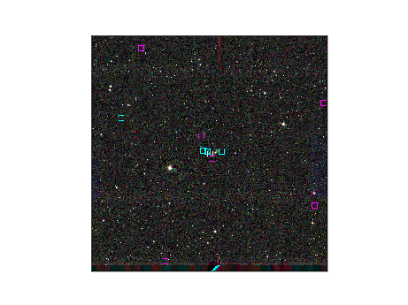  |
