

### 538

|Name|RAJ2000[deg]|DEJ2000[deg] |Ext[arcmin]| Ext,ml | z | z_src| C|GC(XSZ,Delta_z<0.01)| GC(OPT,Delta_z<0.01)|GC| R_sig[arcmin] | R500[arcmin] | R500[Mpc]| CRsig[c/s] | CR500[c/s] |L500[1E44 erg/s]|F500[1E-12 erg/s/cm^2]| M500[1E14 Msun]|Tx[keV]|Cnt_sig|Beta|Rc[arcmin]|Comment|Alias|
|---|---|---|---|---|---|------|---|--------|---------|----------|---|---|---|---|---|---|---|---|---|---|---|---|---|---|
|538| 209.508| 20.638| 4.03| 28.82| 0.0630(0.005)| z1, z_xsz| B| L03, MCXC| A, N, W| A, C, F20, L03, MCXC, N, W| 20.256| 9.228| 0.672| 0.132(0.069)| 0.121(0.063)| 0.213(0.092)| 2.224(0.962)| 0.91(0.20)| 2.07(0.29)| 133.2| 0.604(-0.072+0.139)| 3.540(-1.041+1.666)| -| k481|

|[RASS image](../image/538/538_img.pdf)|[filtered image](../image/538/538_fil.pdf)|[Segment image](../image/538/538_seg.pdf)|
|-------------------|--------------------|-------------------|
| 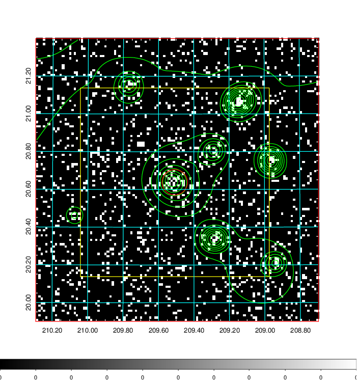  | 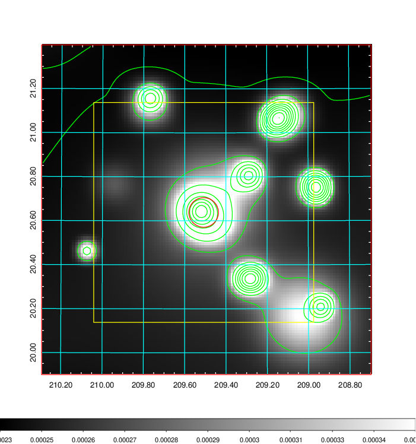   | 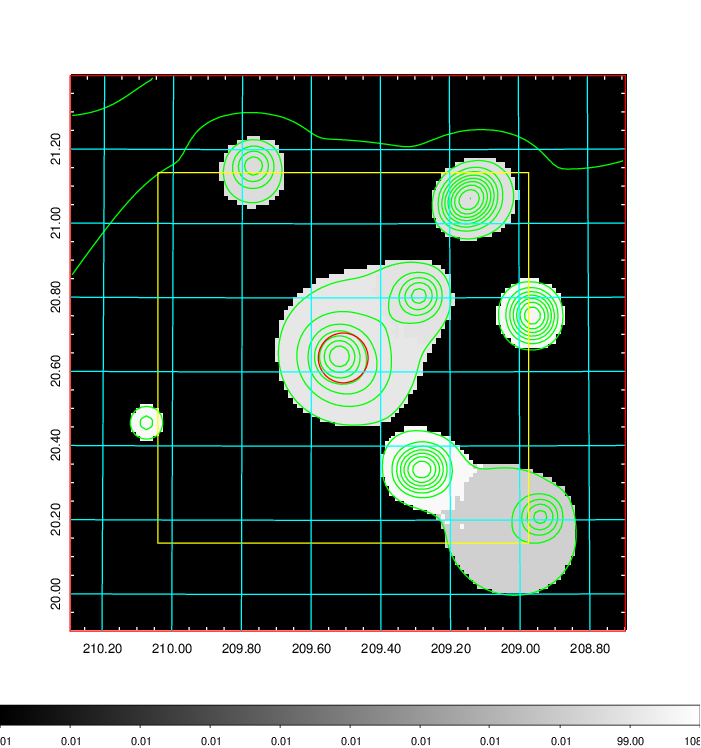  |

|[Exposure image](../image/538/538_mex.pdf)| [nH image](../image/538/538_nh.pdf)| [Planck image](../image/538/538_p.pdf)|
|-------------------|--------------------|-------------------|
|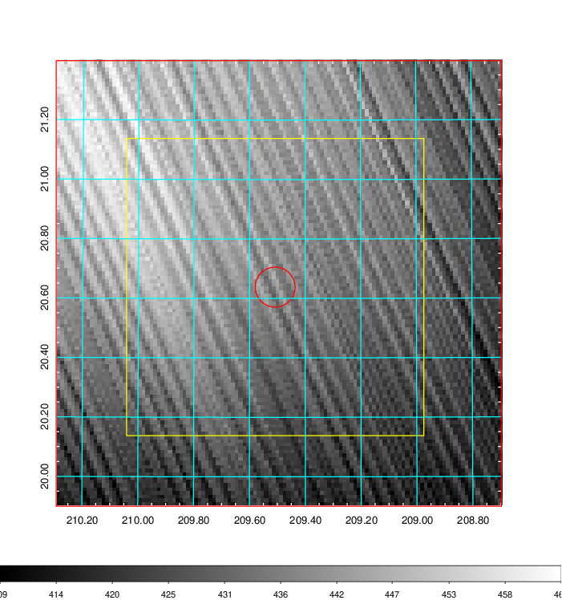   | 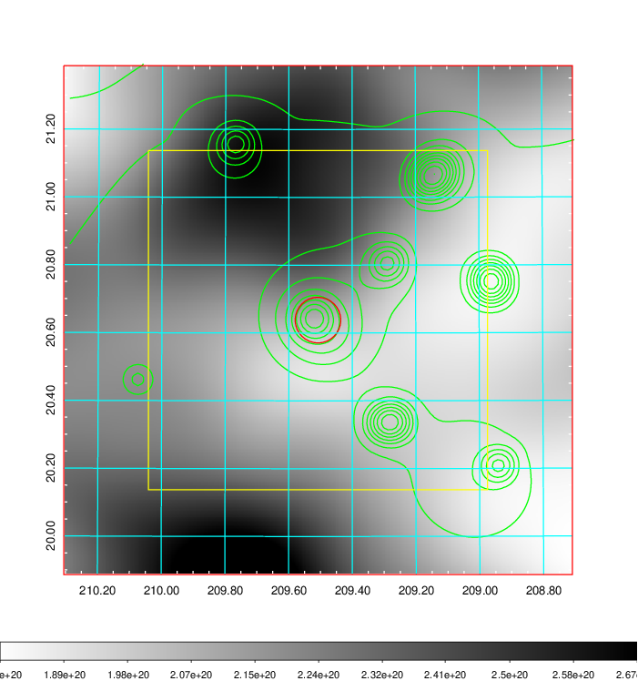    | 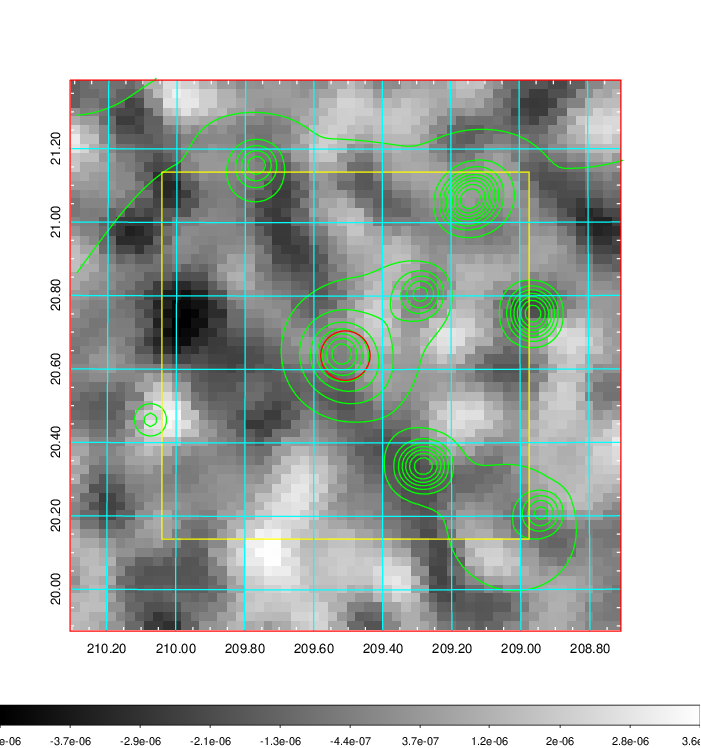 |

|[Redshift Histogram](../image/538/538_zg.pdf) | [DSS image(z1)](../image/538/538_dss_z1.pdf)      |  [DSS image(z2)](../image/538/538_dss_z2.pdf)    |
|-------------------|--------------------|-------------------|
|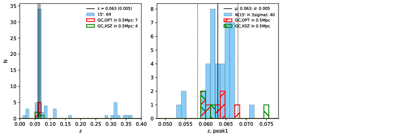 |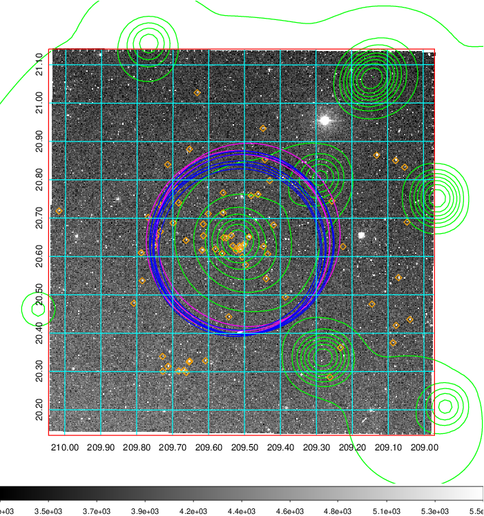  Blue circle for optical clusters;  Magenta circle for XSZ clusters;  all with r=1Mpc;  Only GC with Delta_z<0.01 are shown. | 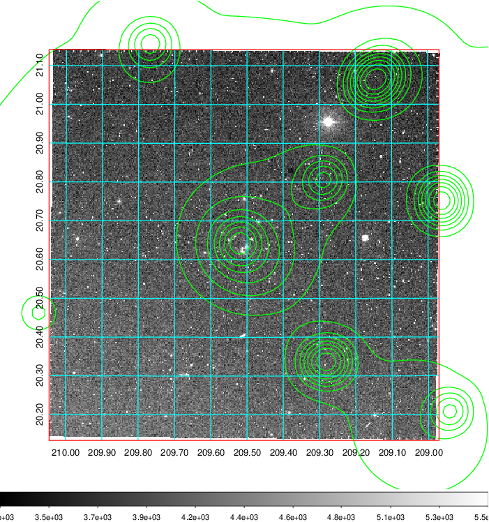 Blue circle for optical clusters;  Magenta circle for XSZ clusters;  all with r=1Mpc;  Only GC with Delta_z<0.01 are shown.  |

|[known Abell/XSZ clusters](../image/538/538_gc.pdf) | [2MASS image](../image/538/538_2mass.pdf)      |[SDSS image](../image/538/538_sdss.pdf)   |
|-------------------|-------------------|-------------------|
|  Magenta, blue and green circles  for optical, X-ray and SZ clusters  respectively, with redshift of clusters  labelled. The radius of circles  are 1Mpc.|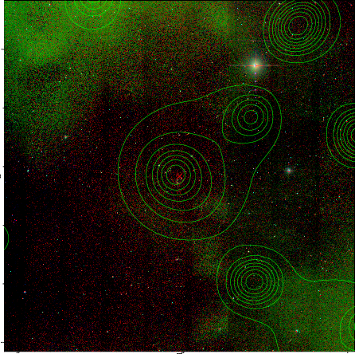  | 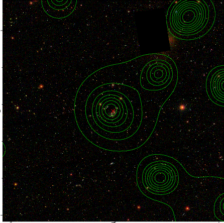  |

