

### 539

|Name|RAJ2000[deg]|DEJ2000[deg] |Ext[arcmin]| Ext,ml | z | z_src| C|GC(XSZ,Delta_z<0.01)| GC(OPT,Delta_z<0.01)|GC| R_sig[arcmin] | R500[arcmin] | R500[Mpc]| CRsig[c/s] | CR500[c/s] |L500[1E44 erg/s]|F500[1E-12 erg/s/cm^2]| M500[1E14 Msun]|Tx[keV]|Cnt_sig|Beta|Rc[arcmin]|Comment|Alias|
|---|---|---|---|---|---|------|---|--------|---------|----------|---|---|---|---|---|---|---|---|---|---|---|---|---|---|
|539| 209.815| 27.977| 2.17| 201.19| 0.0712(0.007)| z1, z_xsz| B| F20, L03| A, N, RM, W| A, C, F20, L03, MCXC, N, PSZ2, Tar, W, XB| 12.700| 11.908| 0.970| 0.585(0.048)| 0.579(0.048)| 1.424(0.060)| 11.526(0.483)| 2.78(0.06)| 4.11(0.05)| 273.4| 0.869(-0.094+0.085)| 4.287(-0.621+0.523)| -| k253|

|[RASS image](../image/539/539_img.pdf)|[filtered image](../image/539/539_fil.pdf)|[Segment image](../image/539/539_seg.pdf)|
|-------------------|--------------------|-------------------|
| 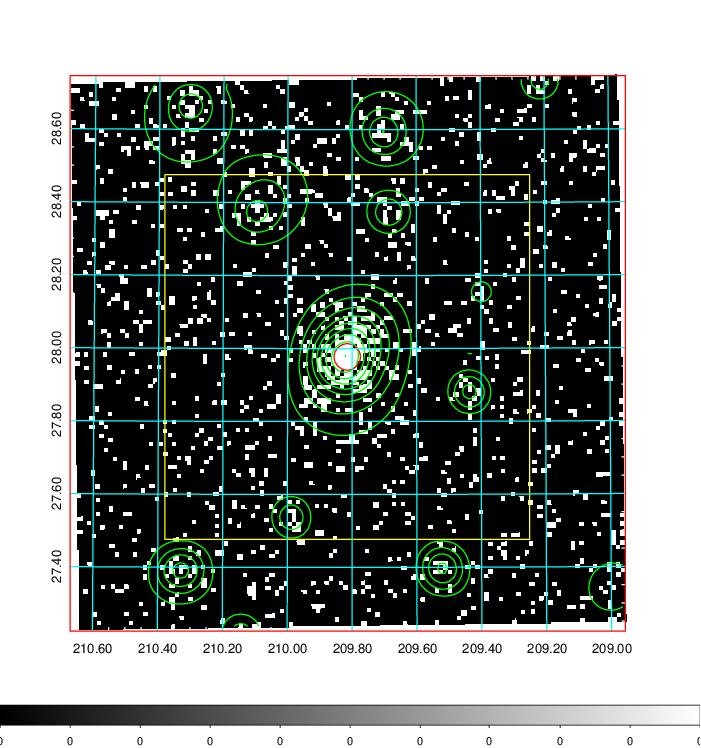  | 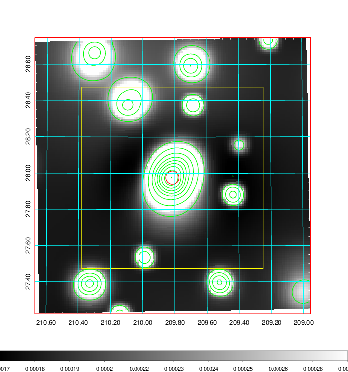   | 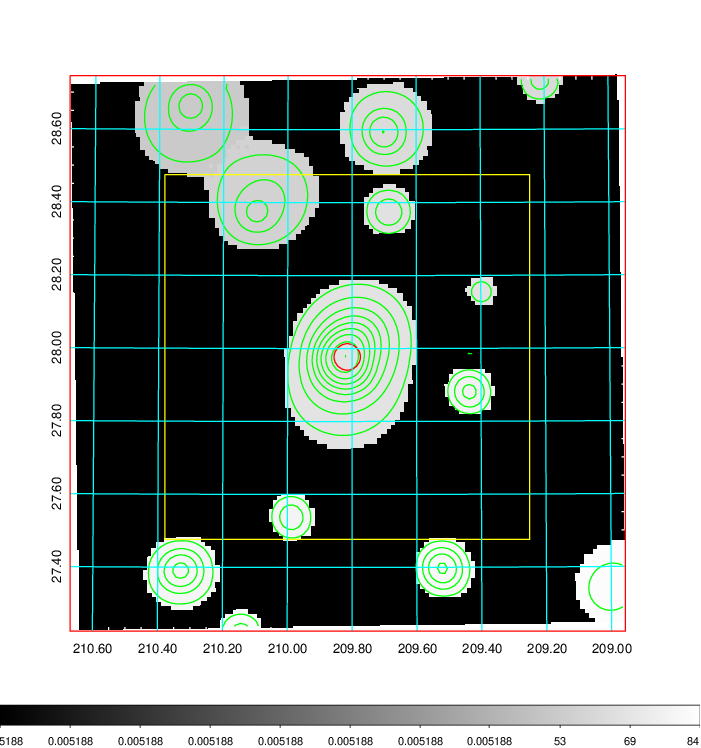  |

|[Exposure image](../image/539/539_mex.pdf)| [nH image](../image/539/539_nh.pdf)| [Planck image](../image/539/539_p.pdf)|
|-------------------|--------------------|-------------------|
|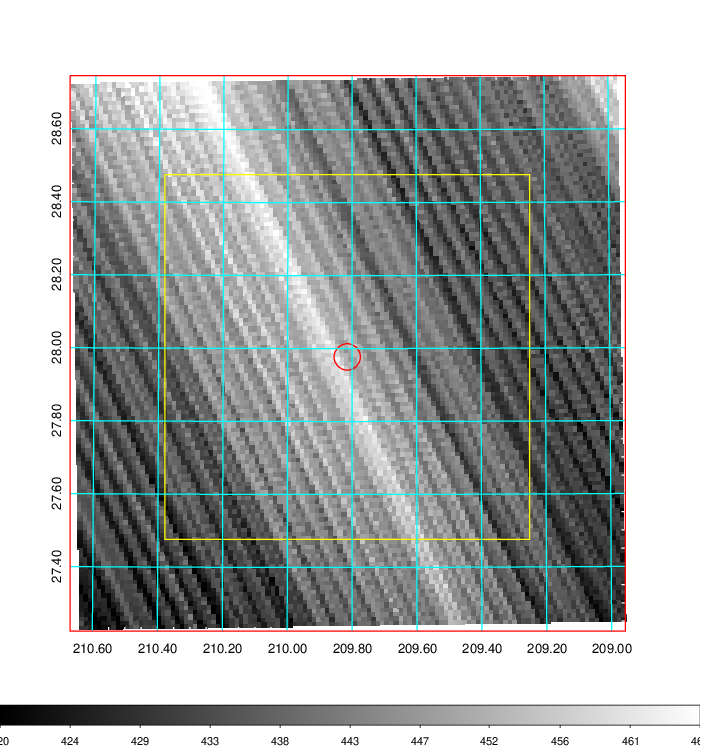   | 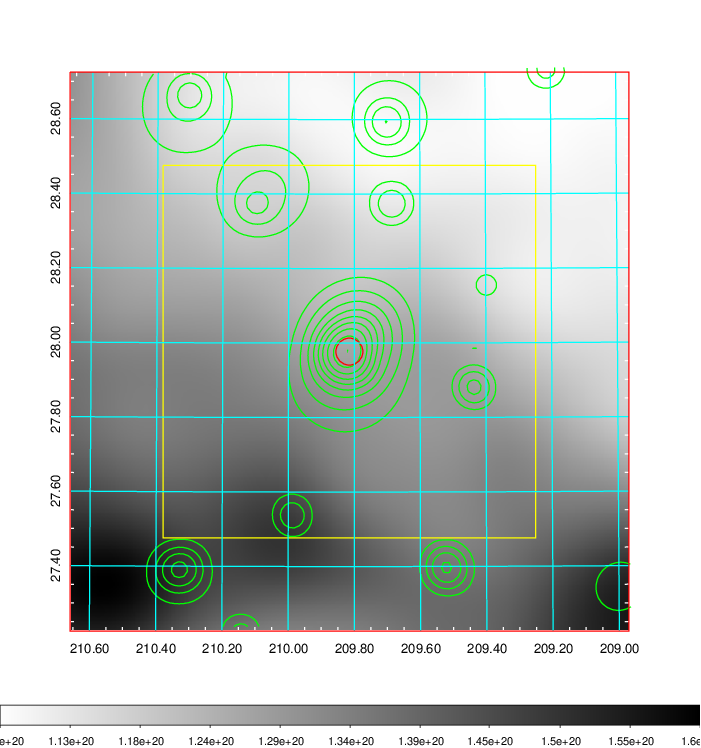    | 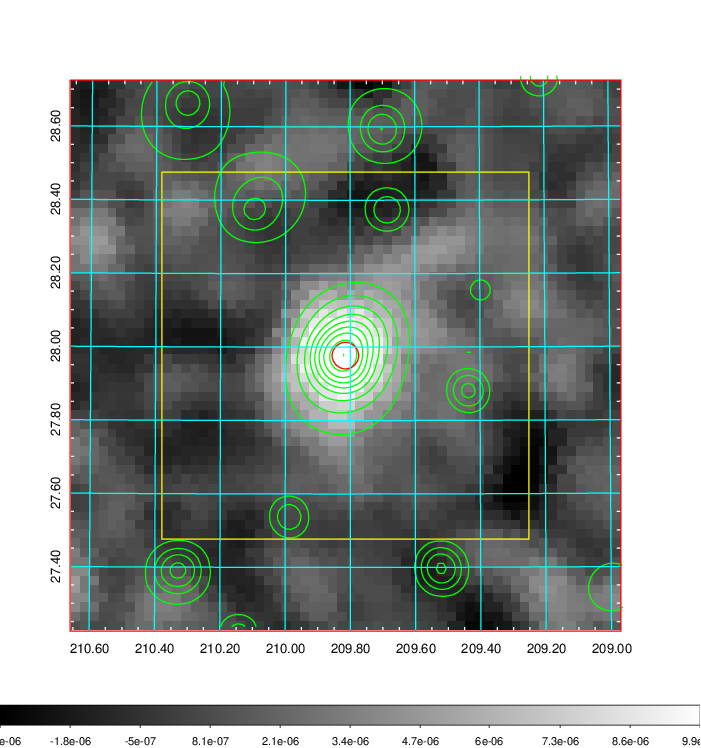 |

|[Redshift Histogram](../image/539/539_zg.pdf) | [DSS image(z1)](../image/539/539_dss_z1.pdf)      |  [DSS image(z2)](../image/539/539_dss_z2.pdf)    |
|-------------------|--------------------|-------------------|
|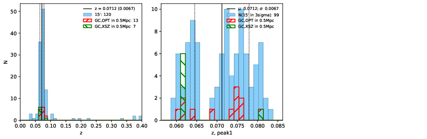 |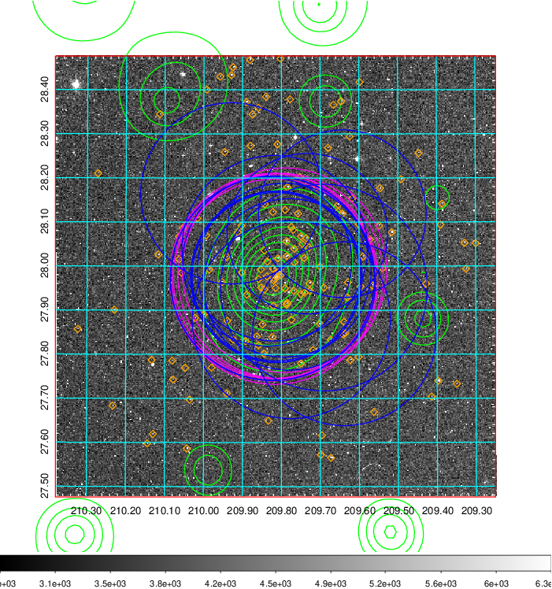  Blue circle for optical clusters;  Magenta circle for XSZ clusters;  all with r=1Mpc;  Only GC with Delta_z<0.01 are shown. | 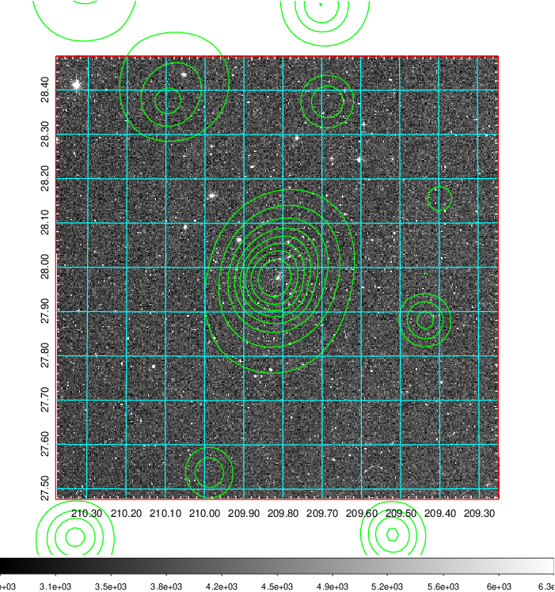 Blue circle for optical clusters;  Magenta circle for XSZ clusters;  all with r=1Mpc;  Only GC with Delta_z<0.01 are shown.  |

|[Previous-identified clusters](../image/539/539_gc.pdf) | [2MASS image](../image/539/539_2mass.pdf)      |[SDSS image](../image/539/539_sdss.pdf)   |
|-------------------|-------------------|-------------------|
|  Green, magenta, and blue circles  for optical, X-ray and SZ clusters  respectively, with redshift of clusters  labelled. The radius of circles  are 1Mpc.|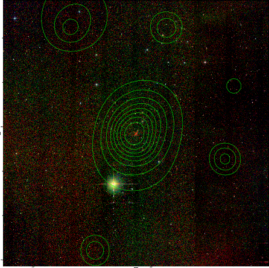  | 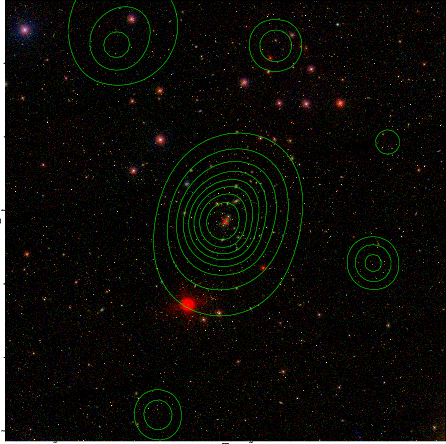  |

