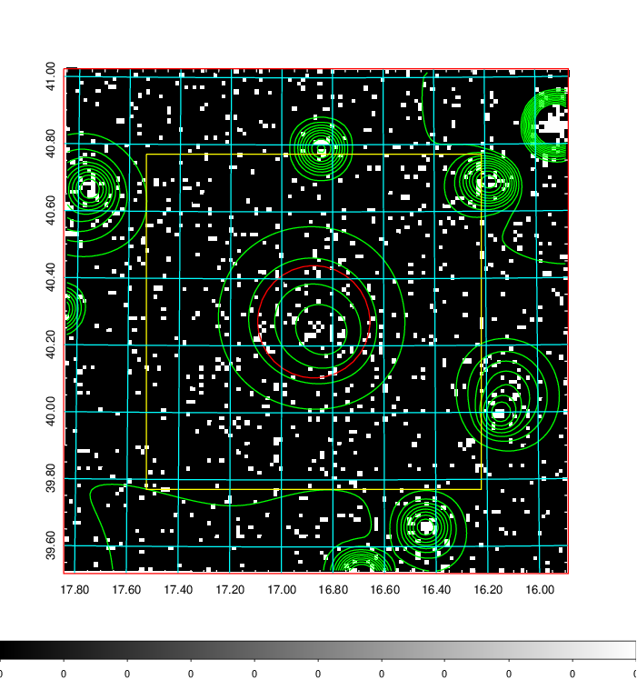
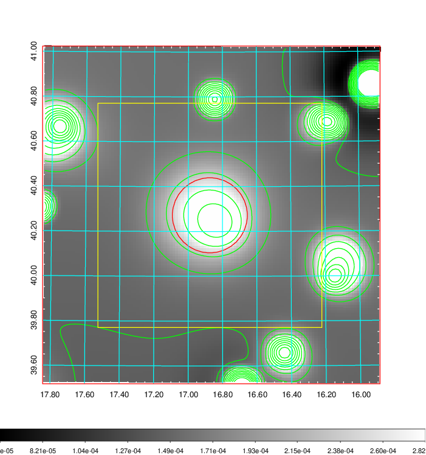
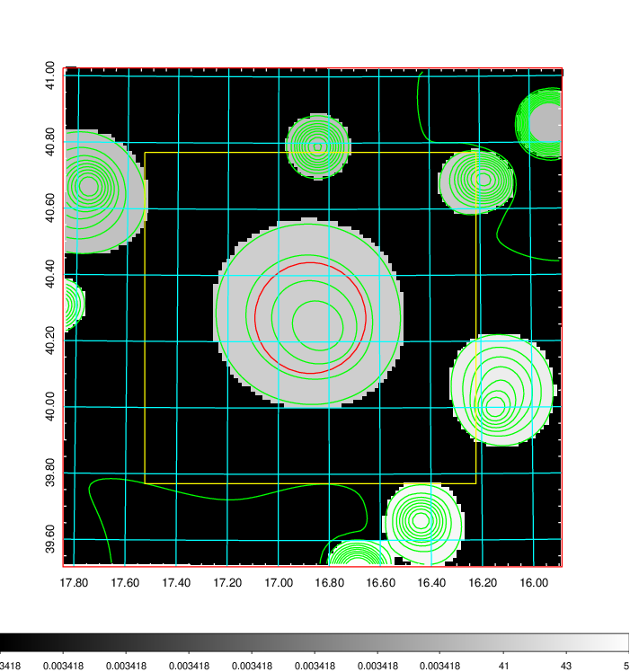
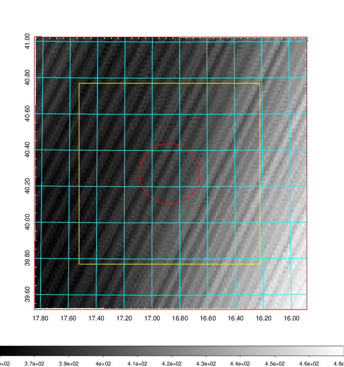
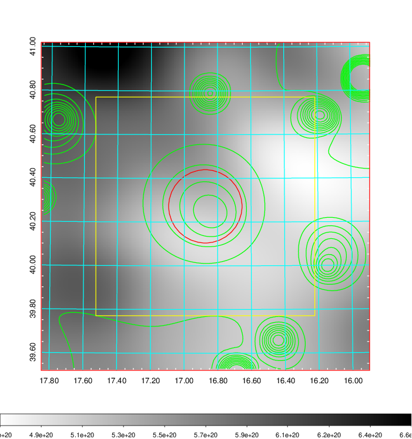
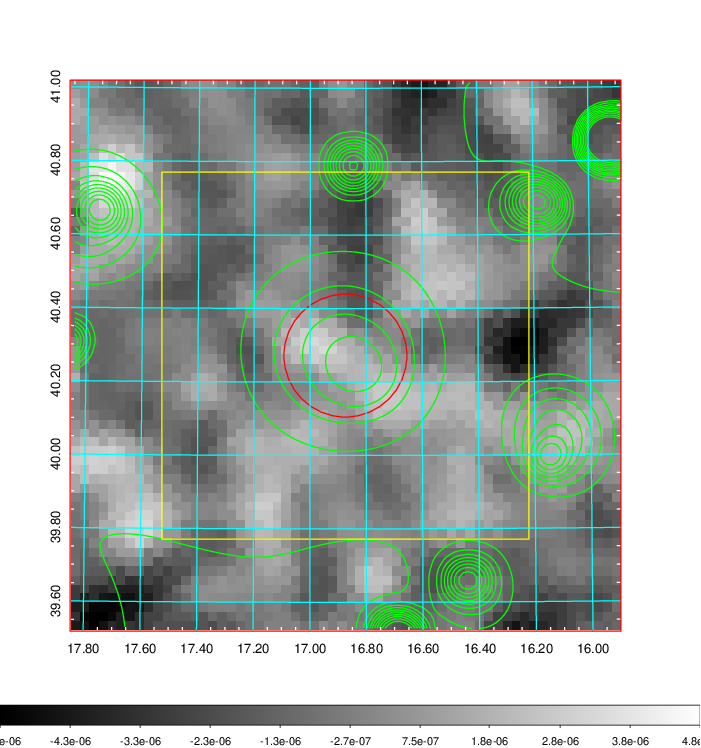
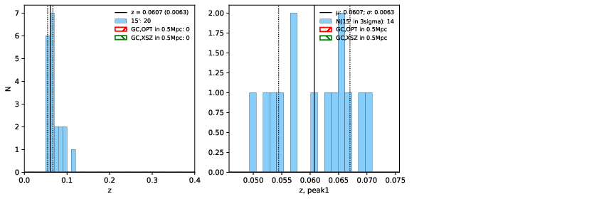
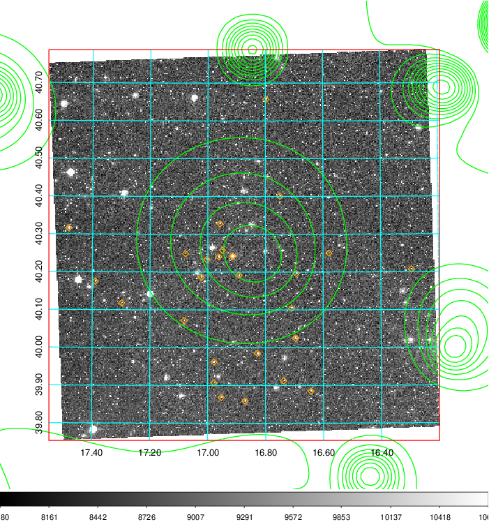
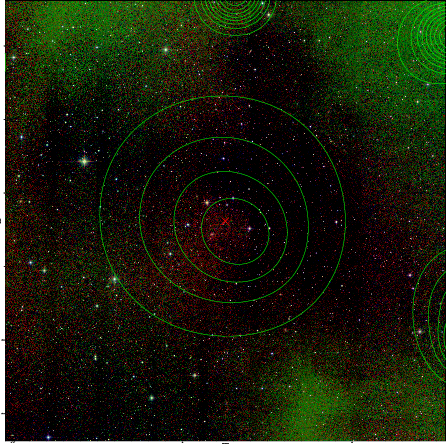
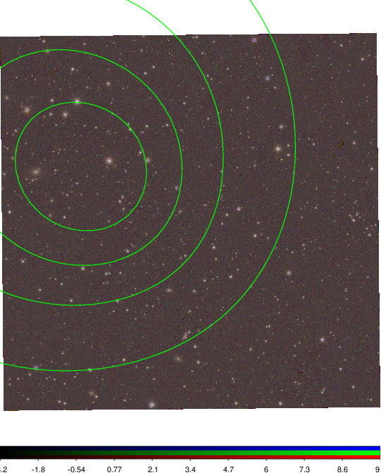

### 54

|Name|RAJ2000[deg]|DEJ2000[deg] |Ext[arcmin]| Ext,ml | z | z_src| C|GC(XSZ,Delta_z<0.01)| GC(OPT,Delta_z<0.01)|GC| R_sig[arcmin] | R500[arcmin] | R500[Mpc]| CRsig[c/s] | CR500[c/s] |L500[1E44 erg/s]|F500[1E-12 erg/s/cm^2]| M500[1E14 Msun]|Tx[keV]|Cnt_sig|Beta|Rc[arcmin]|Comment|Alias|
|---|---|---|---|---|---|------|---|--------|---------|----------|---|---|---|---|---|---|---|---|---|---|---|---|---|---|
|54| 16.874| 40.272| 10.05| 25.55| 0.0607(0.006)| z1,| G| -| -| -| 41.095| 10.837| 0.762| 0.255(0.088)| 0.227(0.079)| 0.347(0.151)| 3.920(1.708)| 1.33(0.30)| 2.60(0.36)| 127.0| 0.517(-0.013+0.025)| 5.766(-0.569+0.622)| -| t441|

|[RASS image](../image/54/54_img.pdf)|[filtered image](../image/54/54_fil.pdf)|[Segment image](../image/54/54_seg.pdf)|
|-------------------|--------------------|-------------------|
|   |    |   |

|[Exposure image](../image/54/54_mex.pdf)| [nH image](../image/54/54_nh.pdf)| [Planck image](../image/54/54_p.pdf)|
|-------------------|--------------------|-------------------|
|   |     |  |

|[Redshift Histogram](../image/54/54_zg.pdf) | [DSS image(z1)](../image/54/54_dss_z1.pdf)      |  [DSS image(z2)](../image/54/54_dss_z2.pdf)    |
|-------------------|--------------------|-------------------|
| |  Blue circle for optical clusters;  Magenta circle for XSZ clusters;  all with r=1Mpc;  Only GC with Delta_z<0.01 are shown. |  Blue circle for optical clusters;  Magenta circle for XSZ clusters;  all with r=1Mpc;  Only GC with Delta_z<0.01 are shown.  |

|[Previous-identified clusters](../image/54/54_gc.pdf) | [2MASS image](../image/54/54_2mass.pdf)      |
|-------------------|-------------------|
|  Green, magenta, and blue circles  for optical, X-ray and SZ clusters  respectively, with redshift of clusters  labelled. The radius of circles  are 1Mpc.|  |

|[PS1 image](../image/54/54_ps1.pdf)            |
|-------------------|
|   |
