

### 540

|Name|RAJ2000[deg]|DEJ2000[deg] |Ext[arcmin]| Ext,ml | z | z_src| C|GC(XSZ,Delta_z<0.01)| GC(OPT,Delta_z<0.01)|GC| R_sig[arcmin] | R500[arcmin] | R500[Mpc]| CRsig[c/s] | CR500[c/s] |L500[1E44 erg/s]|F500[1E-12 erg/s/cm^2]| M500[1E14 Msun]|Tx[keV]|Cnt_sig|Beta|Rc[arcmin]|Comment|Alias|
|---|---|---|---|---|---|------|---|--------|---------|----------|---|---|---|---|---|---|---|---|---|---|---|---|---|---|
|540| 210.261| 2.875| 0.68| 36.95| 0.2526(0.006)| z1, z_xsz| B| F20, MCXC, PSZ2, Tar, XB| A, C, W| A, C, F20, MCXC, N, PSZ2, SPI, Tar, W, XB| 9.775| 6.642| 1.570| 0.609(0.052)| 0.578(0.049)| 22.852(0.678)| 11.747(0.348)| 14.21(0.19)| 11.97(0.10)| 223.2| 0.660(-0.061+0.090)| 1.261(-0.450+0.506)| -| k002|

|[RASS image](../image/540/540_img.pdf)|[filtered image](../image/540/540_fil.pdf)|[Segment image](../image/540/540_seg.pdf)|
|-------------------|--------------------|-------------------|
| 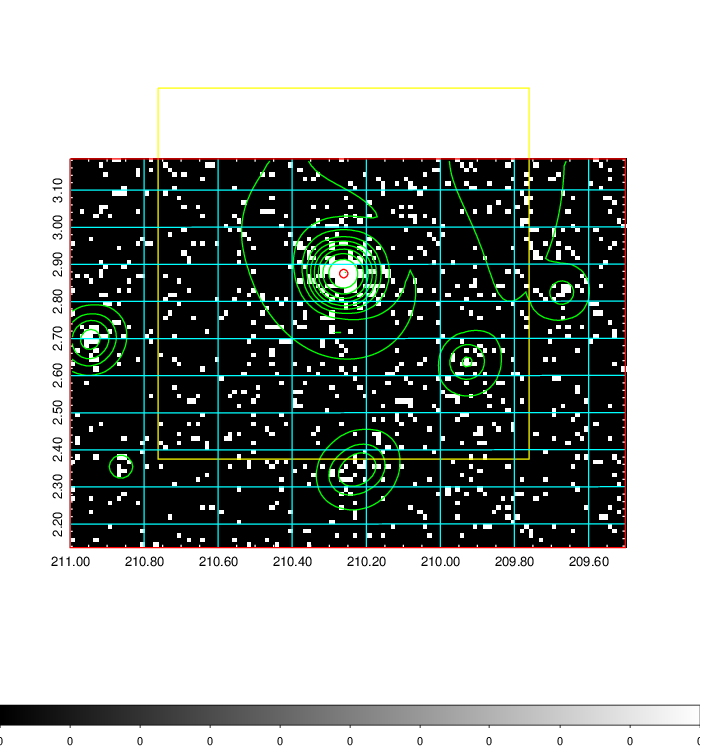  | 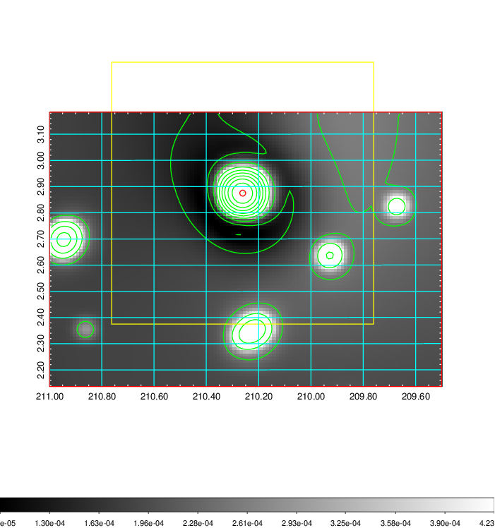   | 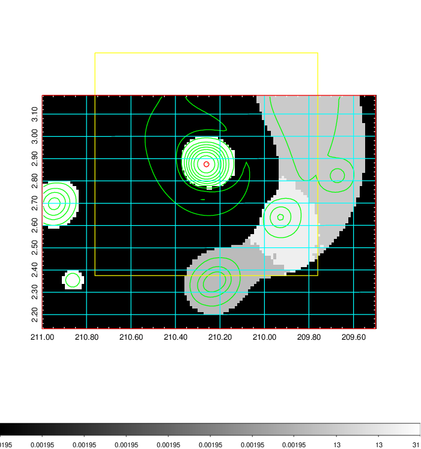  |

|[Exposure image](../image/540/540_mex.pdf)| [nH image](../image/540/540_nh.pdf)| [Planck image](../image/540/540_p.pdf)|
|-------------------|--------------------|-------------------|
|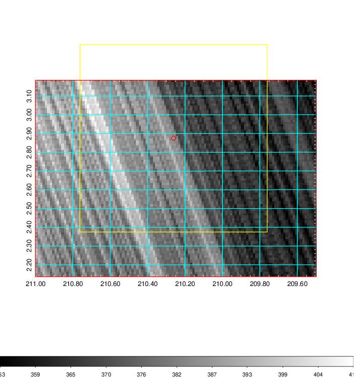   | 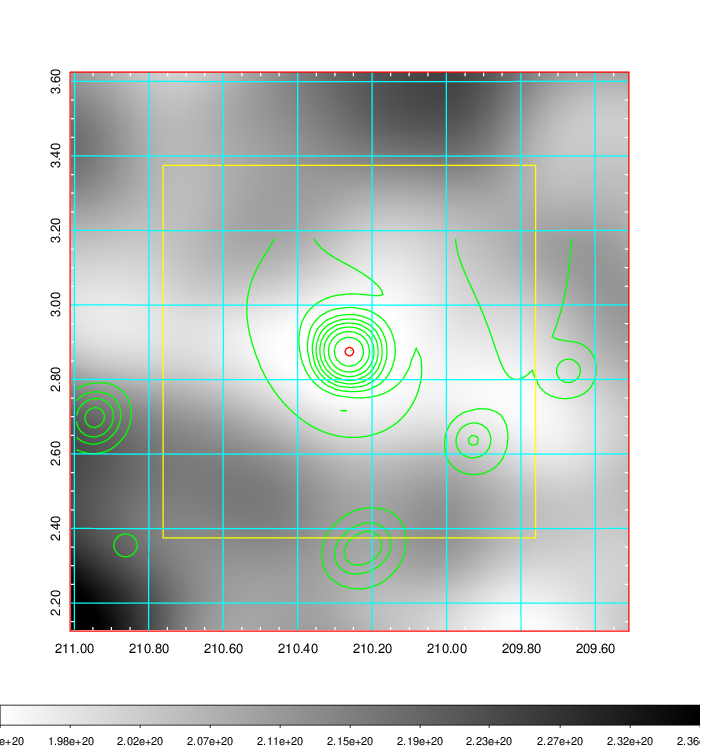    | 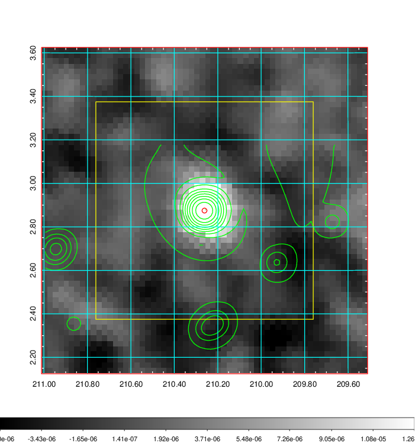 |

|[Redshift Histogram](../image/540/540_zg.pdf) | [DSS image(z1)](../image/540/540_dss_z1.pdf)      |  [DSS image(z2)](../image/540/540_dss_z2.pdf)    |
|-------------------|--------------------|-------------------|
|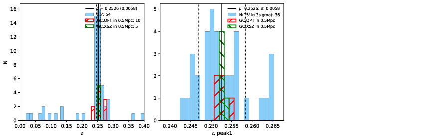 |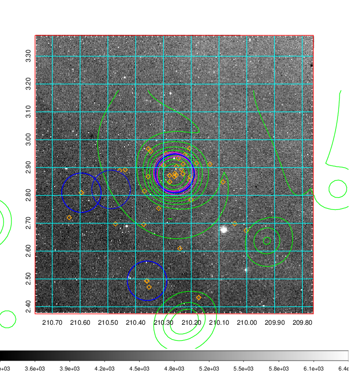  Blue circle for optical clusters;  Magenta circle for XSZ clusters;  all with r=1Mpc;  Only GC with Delta_z<0.01 are shown. | 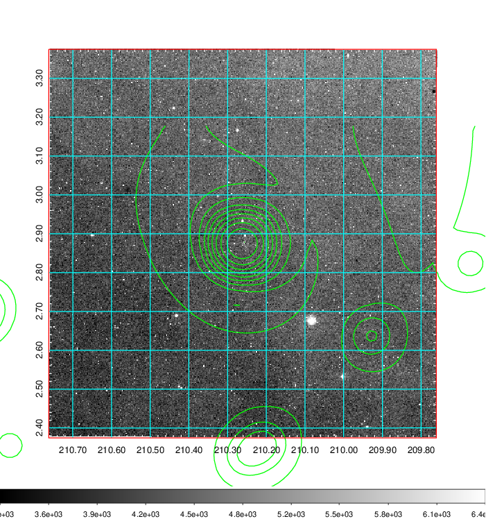 Blue circle for optical clusters;  Magenta circle for XSZ clusters;  all with r=1Mpc;  Only GC with Delta_z<0.01 are shown.  |

|[Previous-identified clusters](../image/540/540_gc.pdf) | [2MASS image](../image/540/540_2mass.pdf)      |[SDSS image](../image/540/540_sdss.pdf)   |
|-------------------|-------------------|-------------------|
|  Green, magenta, and blue circles  for optical, X-ray and SZ clusters  respectively, with redshift of clusters  labelled. The radius of circles  are 1Mpc.|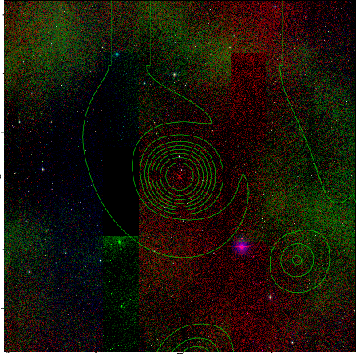  | 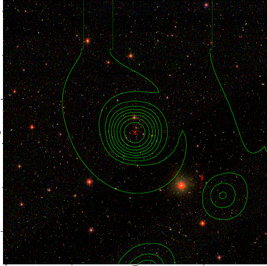  |

