

### 541

|Name|RAJ2000[deg]|DEJ2000[deg] |Ext[arcmin]| Ext,ml | z | z_src| C|GC(XSZ,Delta_z<0.01)| GC(OPT,Delta_z<0.01)|GC| R_sig[arcmin] | R500[arcmin] | R500[Mpc]| CRsig[c/s] | CR500[c/s] |L500[1E44 erg/s]|F500[1E-12 erg/s/cm^2]| M500[1E14 Msun]|Tx[keV]|Cnt_sig|Beta|Rc[arcmin]|Comment|Alias|
|---|---|---|---|---|---|------|---|--------|---------|----------|---|---|---|---|---|---|---|---|---|---|---|---|---|---|
|541| 210.292| 57.001| 6.14| 33.66| 0.0645(0.009)| z1,| G| -| -| C, N, W| 14.162| 8.662| 0.644| 0.106(0.027)| 0.099(0.025)| 0.185(0.044)| 1.841(0.443)| 0.81(0.10)| 1.92(0.15)| 64.2| 0.838(-0.162+0.114)| 7.814(-1.667+1.242)| -| t311|

|[RASS image](../image/541/541_img.pdf)|[filtered image](../image/541/541_fil.pdf)|[Segment image](../image/541/541_seg.pdf)|
|-------------------|--------------------|-------------------|
| 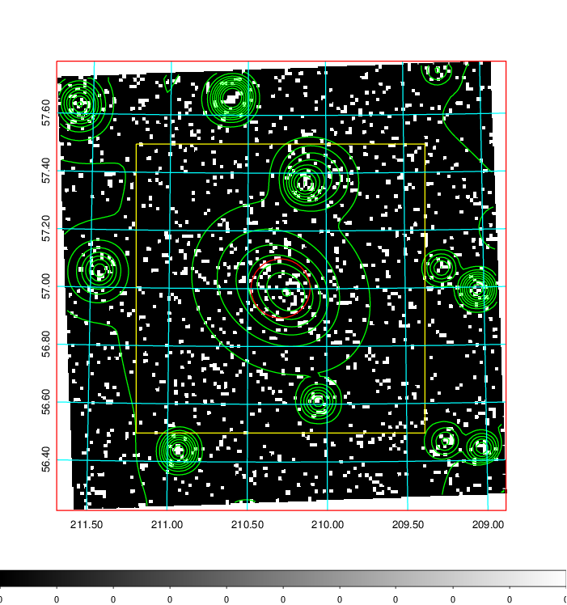  | 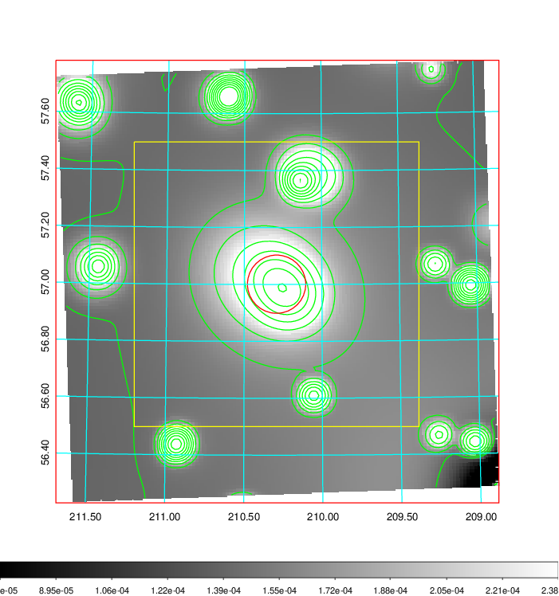   | 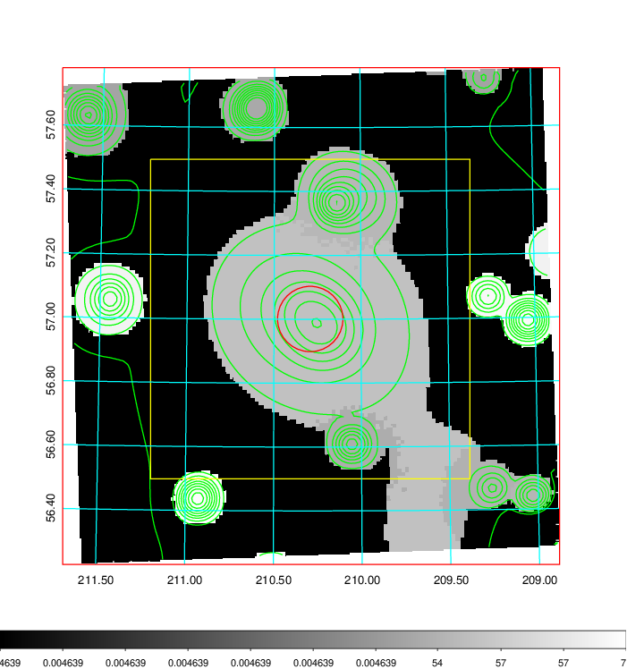  |

|[Exposure image](../image/541/541_mex.pdf)| [nH image](../image/541/541_nh.pdf)| [Planck image](../image/541/541_p.pdf)|
|-------------------|--------------------|-------------------|
|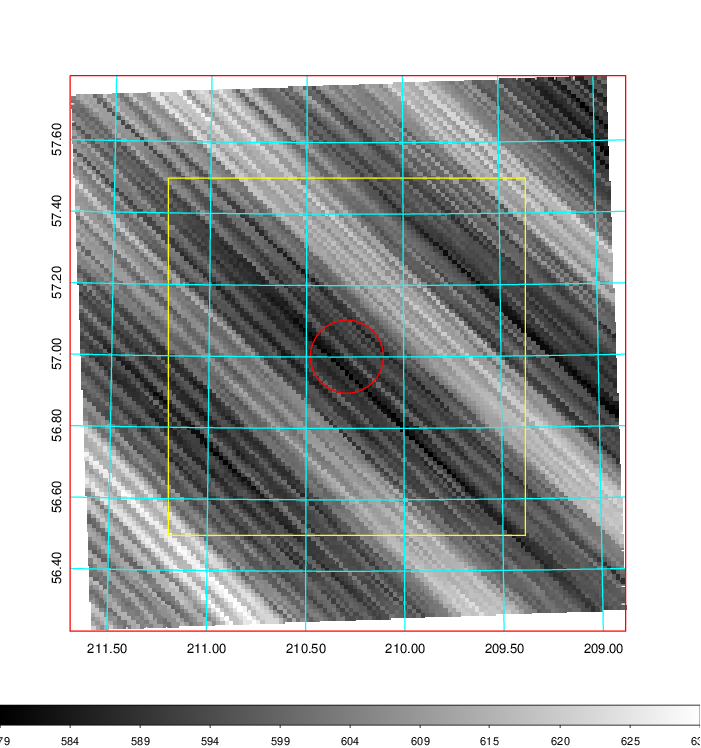   | 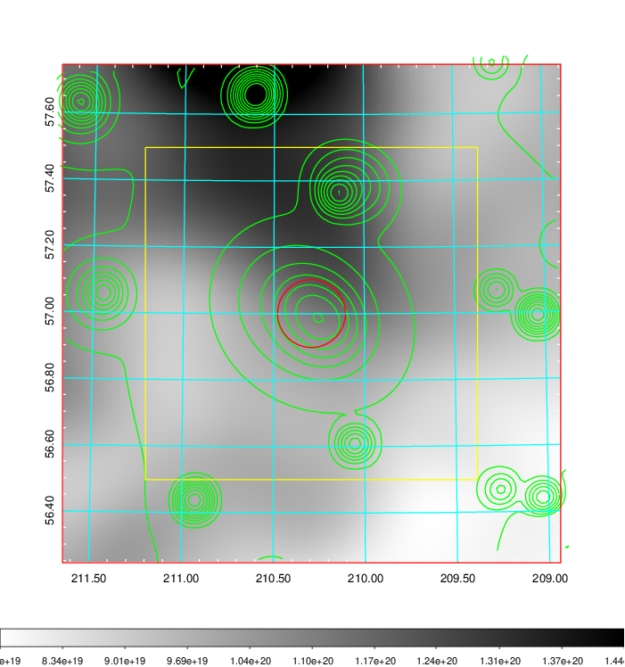    | 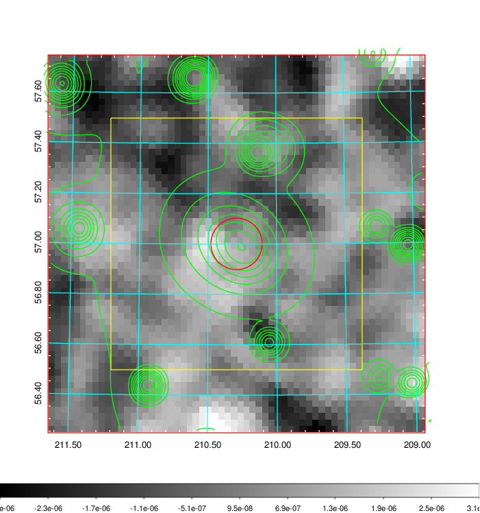 |

|[Redshift Histogram](../image/541/541_zg.pdf) | [DSS image(z1)](../image/541/541_dss_z1.pdf)      |  [DSS image(z2)](../image/541/541_dss_z2.pdf)    |
|-------------------|--------------------|-------------------|
|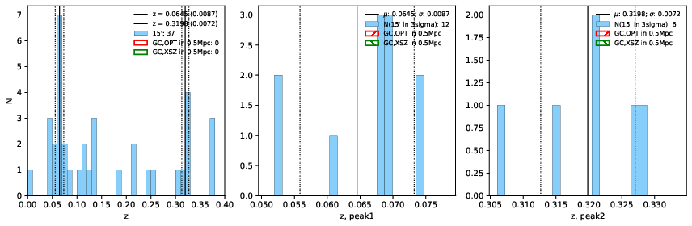 |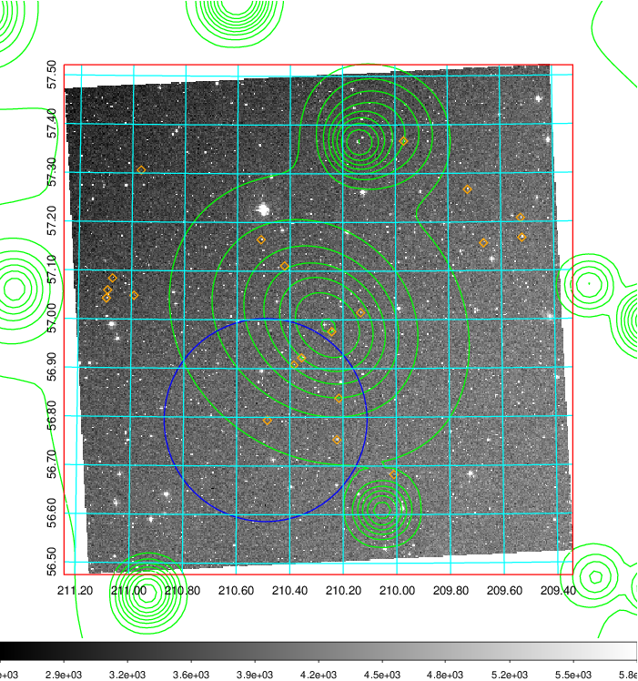  Blue circle for optical clusters;  Magenta circle for XSZ clusters;  all with r=1Mpc;  Only GC with Delta_z<0.01 are shown. | 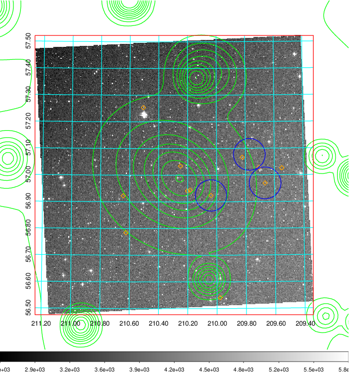 Blue circle for optical clusters;  Magenta circle for XSZ clusters;  all with r=1Mpc;  Only GC with Delta_z<0.01 are shown.  |

|[Previous-identified clusters](../image/541/541_gc.pdf) | [2MASS image](../image/541/541_2mass.pdf)      |[SDSS image](../image/541/541_sdss.pdf)   |
|-------------------|-------------------|-------------------|
|  Green, magenta, and blue circles  for optical, X-ray and SZ clusters  respectively, with redshift of clusters  labelled. The radius of circles  are 1Mpc.|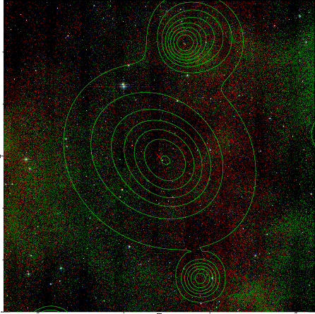  | 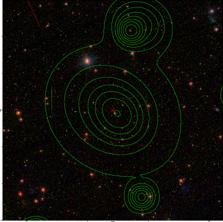  |

