

### 542

|Name|RAJ2000[deg]|DEJ2000[deg] |Ext[arcmin]| Ext,ml | z | z_src| C|GC(XSZ,Delta_z<0.01)| GC(OPT,Delta_z<0.01)|GC| R_sig[arcmin] | R500[arcmin] | R500[Mpc]| CRsig[c/s] | CR500[c/s] |L500[1E44 erg/s]|F500[1E-12 erg/s/cm^2]| M500[1E14 Msun]|Tx[keV]|Cnt_sig|Beta|Rc[arcmin]|Comment|Alias|
|---|---|---|---|---|---|------|---|--------|---------|----------|---|---|---|---|---|---|---|---|---|---|---|---|---|---|
|542| 210.396| -11.132| 1.79| 38.76| 0.0696(0.005)| z1, z_xsz| B| L03, MCXC, Tar, XB| A, N, W| A, L03, MCXC, N, Tar, W, XB| 29.638| 11.438| 0.913| 0.466(0.076)| 0.423(0.069)| 0.904(0.104)| 7.673(0.879)| 2.31(0.13)| 3.67(0.13)| 154.7| 0.515(-0.011+0.021)| 1.861(-0.223+0.308)| -| k170|

|[RASS image](../image/542/542_img.pdf)|[filtered image](../image/542/542_fil.pdf)|[Segment image](../image/542/542_seg.pdf)|
|-------------------|--------------------|-------------------|
| 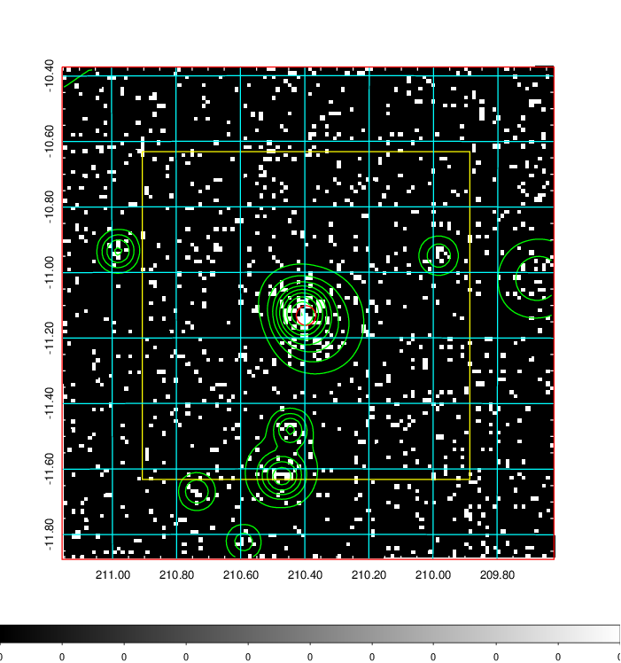  | 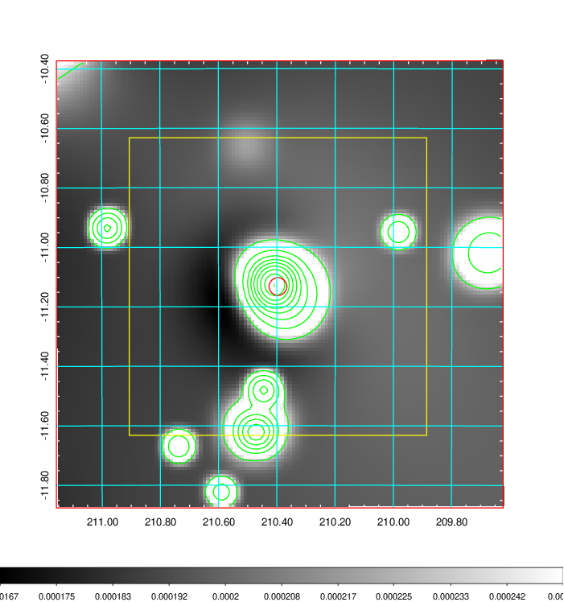   | 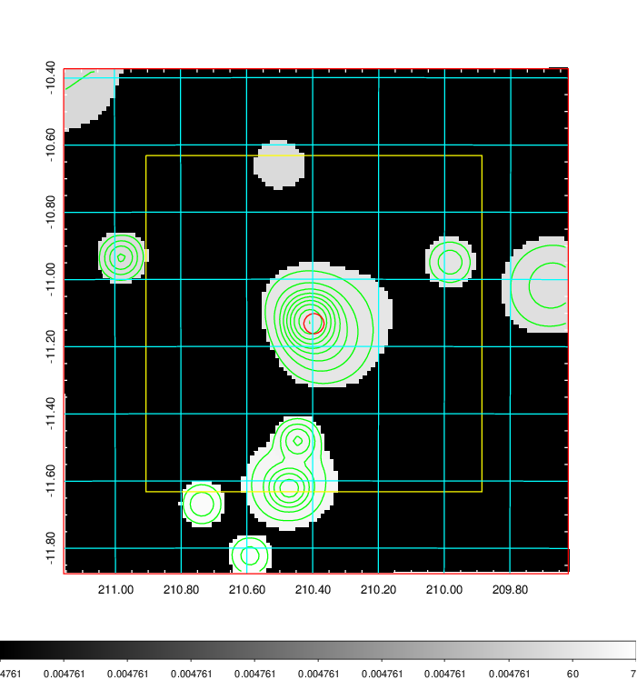  |

|[Exposure image](../image/542/542_mex.pdf)| [nH image](../image/542/542_nh.pdf)| [Planck image](../image/542/542_p.pdf)|
|-------------------|--------------------|-------------------|
|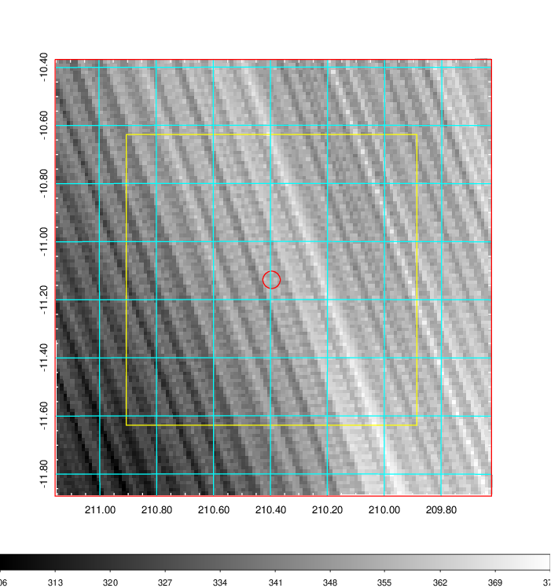   | 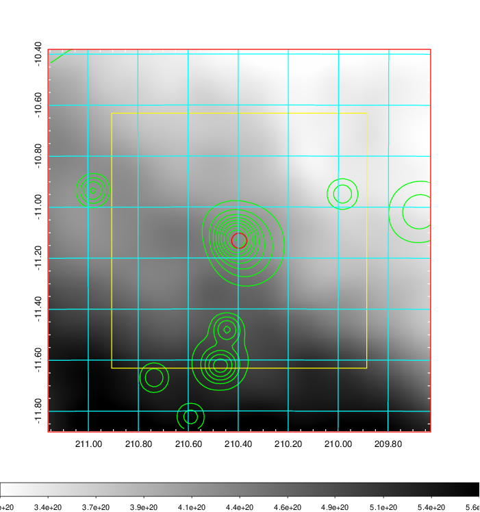    | 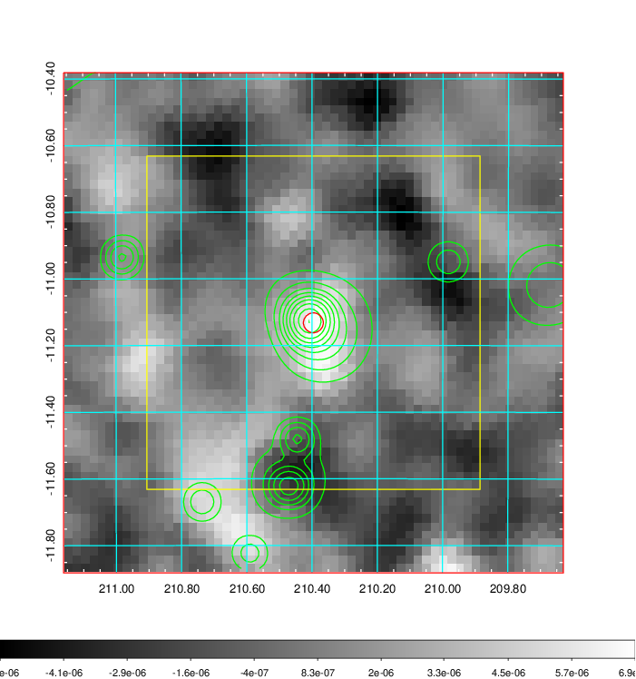 |

|[Redshift Histogram](../image/542/542_zg.pdf) | [DSS image(z1)](../image/542/542_dss_z1.pdf)      |  [DSS image(z2)](../image/542/542_dss_z2.pdf)    |
|-------------------|--------------------|-------------------|
|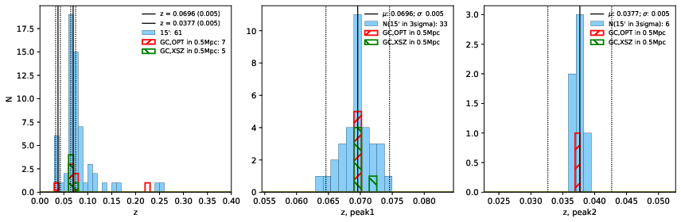 |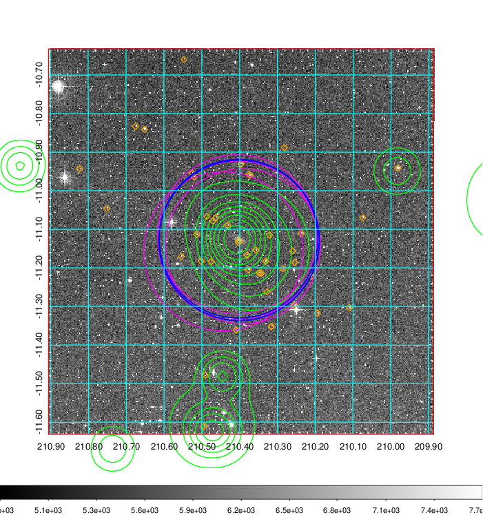  Blue circle for optical clusters;  Magenta circle for XSZ clusters;  all with r=1Mpc;  Only GC with Delta_z<0.01 are shown. | 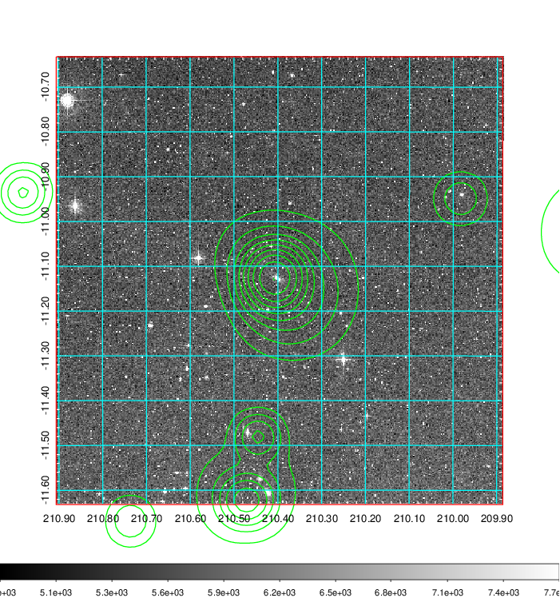 Blue circle for optical clusters;  Magenta circle for XSZ clusters;  all with r=1Mpc;  Only GC with Delta_z<0.01 are shown.  |

|[Previous-identified clusters](../image/542/542_gc.pdf) | [2MASS image](../image/542/542_2mass.pdf)      |[SDSS image](../image/542/542_sdss.pdf)   |
|-------------------|-------------------|-------------------|
|  Green, magenta, and blue circles  for optical, X-ray and SZ clusters  respectively, with redshift of clusters  labelled. The radius of circles  are 1Mpc.|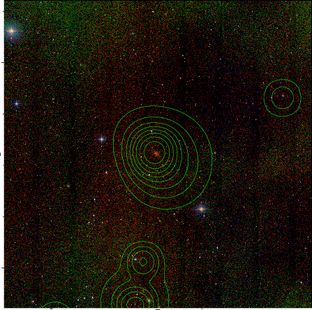  | 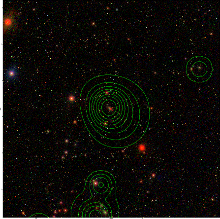  |

|[ATLAS image](../image/542/542_s.pdf)        |
|-------------------|
| 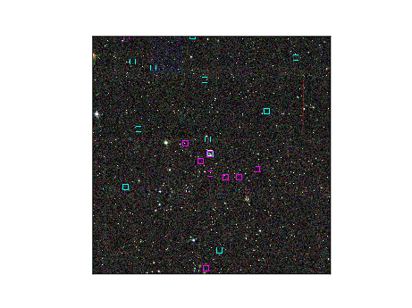  |
