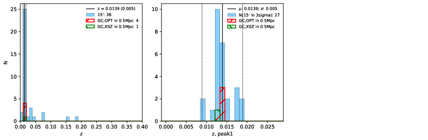

### 543

|Name|RAJ2000[deg]|DEJ2000[deg] |Ext[arcmin]| Ext,ml | z | z_src| C|GC(XSZ,Delta_z<0.01)| GC(OPT,Delta_z<0.01)|GC| R_sig[arcmin] | R500[arcmin] | R500[Mpc]| CRsig[c/s] | CR500[c/s] |L500[1E44 erg/s]|F500[1E-12 erg/s/cm^2]| M500[1E14 Msun]|Tx[keV]|Cnt_sig|Beta|Rc[arcmin]|Comment|Alias|
|---|---|---|---|---|---|------|---|--------|---------|----------|---|---|---|---|---|---|---|---|---|---|---|---|---|---|
|543| 210.876| -33.965| 8.44| 104.99| 0.0139(0.005)| z1, z_xsz| B| MCXC| A, N| A, MCXC, N| 46.045| 34.877| 0.594| 1.382(0.177)| 1.330(0.171)| 0.085(0.007)| 19.687(1.684)| 0.60(0.03)| 1.58(0.04)| 274.1| 0.508(-0.006+0.012)| 7.215(-0.405+0.541)| -| k565|

|[RASS image](../image/543/543_img.pdf)|[filtered image](../image/543/543_fil.pdf)|[Segment image](../image/543/543_seg.pdf)|
|-------------------|--------------------|-------------------|
|   |    |   |

|[Exposure image](../image/543/543_mex.pdf)| [nH image](../image/543/543_nh.pdf)| [Planck image](../image/543/543_p.pdf)|
|-------------------|--------------------|-------------------|
|   |     |  |

|[Redshift Histogram](../image/543/543_zg.pdf) | [DSS image(z1)](../image/543/543_dss_z1.pdf)      |  [DSS image(z2)](../image/543/543_dss_z2.pdf)    |
|-------------------|--------------------|-------------------|
| |  Blue circle for optical clusters;  Magenta circle for XSZ clusters;  all with r=1Mpc;  Only GC with Delta_z<0.01 are shown. |  Blue circle for optical clusters;  Magenta circle for XSZ clusters;  all with r=1Mpc;  Only GC with Delta_z<0.01 are shown.  |

|[known Abell/XSZ clusters](../image/543/543_gc.pdf) | [2MASS image](../image/543/543_2mass.pdf)      |
|-------------------|-------------------|
|  Magenta, blue and green circles  for optical, X-ray and SZ clusters  respectively, with redshift of clusters  labelled. The radius of circles  are 1Mpc.|  |

