

### 545

|Name|RAJ2000[deg]|DEJ2000[deg] |Ext[arcmin]| Ext,ml | z | z_src| C|GC(XSZ,Delta_z<0.01)| GC(OPT,Delta_z<0.01)|GC| R_sig[arcmin] | R500[arcmin] | R500[Mpc]| CRsig[c/s] | CR500[c/s] |L500[1E44 erg/s]|F500[1E-12 erg/s/cm^2]| M500[1E14 Msun]|Tx[keV]|Cnt_sig|Beta|Rc[arcmin]|Comment|Alias|
|---|---|---|---|---|---|------|---|--------|---------|----------|---|---|---|---|---|---|---|---|---|---|---|---|---|---|
|545| 211.876| -27.019| 1.50| 188.81| 0.0221(0.005)| z1, z_xsz| B| MCXC, XB| A| A, MCXC, XB| 12.700| 28.043| 0.752| 1.263(0.079)| 1.579(0.097)| 0.305(0.012)| 27.499(1.094)| 1.23(0.03)| 2.45(0.03)| 392.7| 0.621(-0.040+0.048)| 1.955(-0.352+0.392)| -| k115|

|[RASS image](../image/545/545_img.pdf)|[filtered image](../image/545/545_fil.pdf)|[Segment image](../image/545/545_seg.pdf)|
|-------------------|--------------------|-------------------|
| 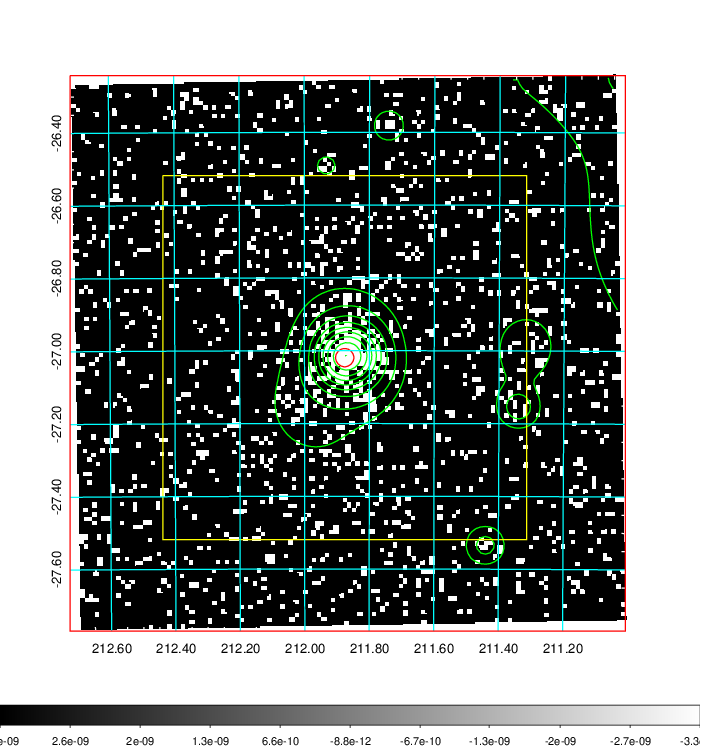  | 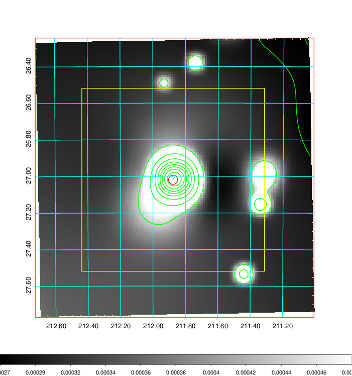   | 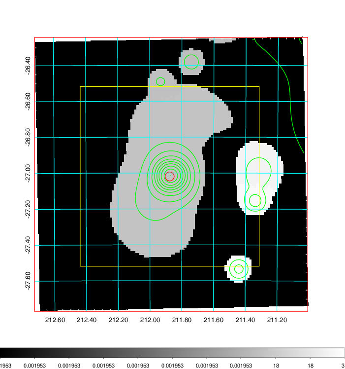  |

|[Exposure image](../image/545/545_mex.pdf)| [nH image](../image/545/545_nh.pdf)| [Planck image](../image/545/545_p.pdf)|
|-------------------|--------------------|-------------------|
|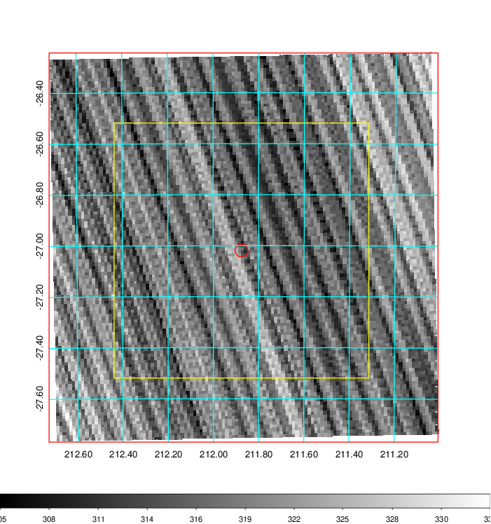   | 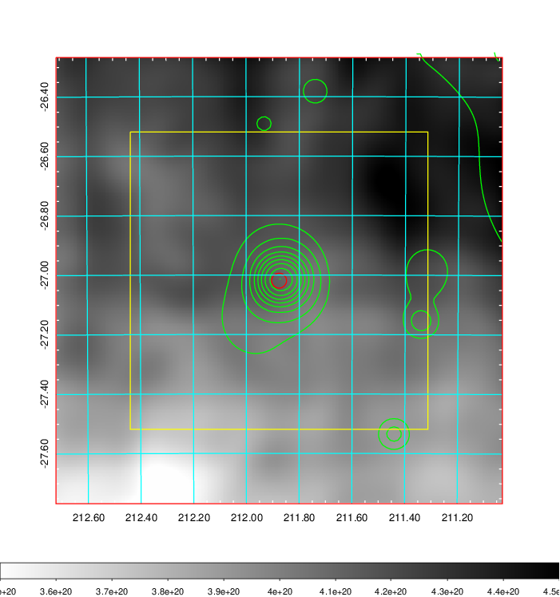    | 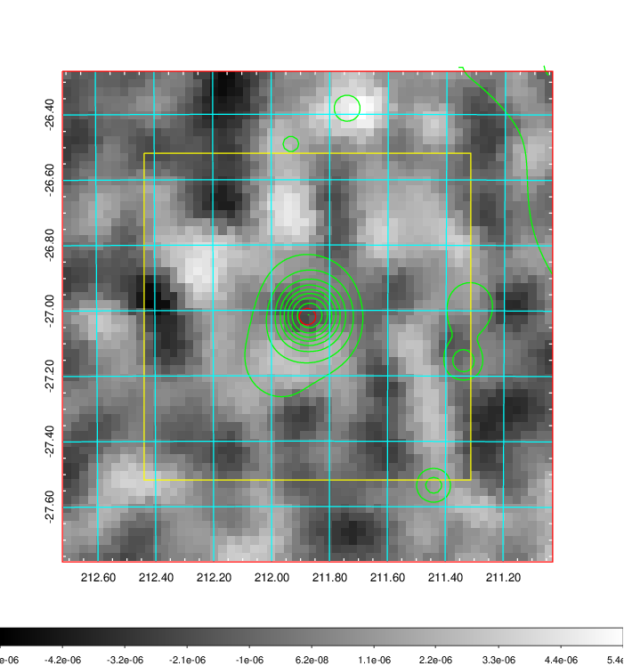 |

|[Redshift Histogram](../image/545/545_zg.pdf) | [DSS image(z1)](../image/545/545_dss_z1.pdf)      |  [DSS image(z2)](../image/545/545_dss_z2.pdf)    |
|-------------------|--------------------|-------------------|
|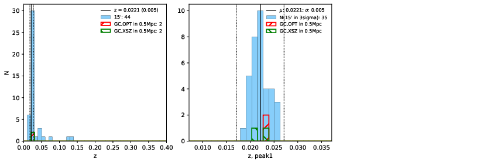 |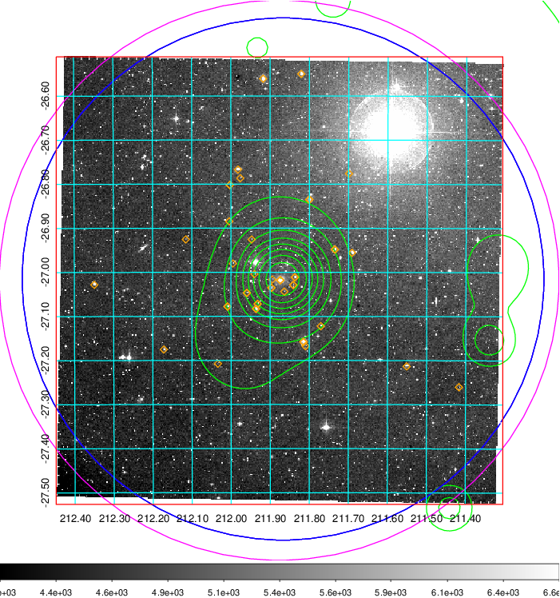  Blue circle for optical clusters;  Magenta circle for XSZ clusters;  all with r=1Mpc;  Only GC with Delta_z<0.01 are shown. | 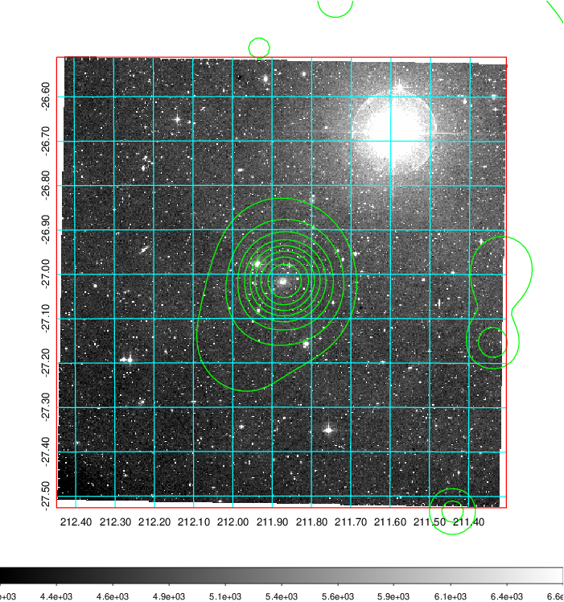 Blue circle for optical clusters;  Magenta circle for XSZ clusters;  all with r=1Mpc;  Only GC with Delta_z<0.01 are shown.  |

|[Previous-identified clusters](../image/545/545_gc.pdf) | [2MASS image](../image/545/545_2mass.pdf)      |
|-------------------|-------------------|
|  Green, magenta, and blue circles  for optical, X-ray and SZ clusters  respectively, with redshift of clusters  labelled. The radius of circles  are 1Mpc.|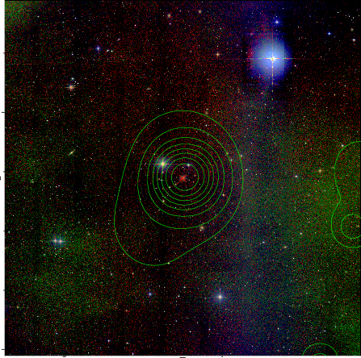  |

|[PS1 image](../image/545/545_ps1.pdf)            |
|-------------------|
| 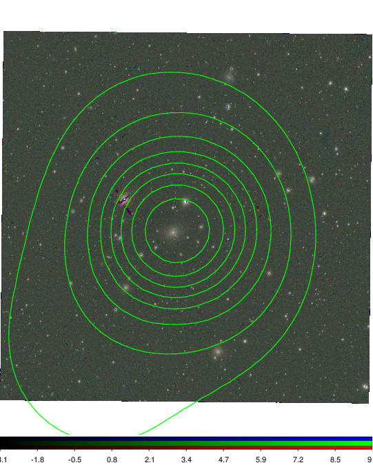  |
