

### 546

|Name|RAJ2000[deg]|DEJ2000[deg] |Ext[arcmin]| Ext,ml | z | z_src| C|GC(XSZ,Delta_z<0.01)| GC(OPT,Delta_z<0.01)|GC| R_sig[arcmin] | R500[arcmin] | R500[Mpc]| CRsig[c/s] | CR500[c/s] |L500[1E44 erg/s]|F500[1E-12 erg/s/cm^2]| M500[1E14 Msun]|Tx[keV]|Cnt_sig|Beta|Rc[arcmin]|Comment|Alias|
|---|---|---|---|---|---|------|---|--------|---------|----------|---|---|---|---|---|---|---|---|---|---|---|---|---|---|
|546| 212.032| -9.080| 3.25| 59.82| 0.0352(0.005)| z1, z_xsz| B| MCXC| N| MCXC, N| 9.775| 14.991| 0.630| 0.257(0.042)| 0.282(0.046)| 0.135(0.016)| 4.701(0.560)| 0.74(0.05)| 1.79(0.07)| 75.2| 0.929(-0.092+0.052)| 6.920(-0.752+0.592)| -| k402|

|[RASS image](../image/546/546_img.pdf)|[filtered image](../image/546/546_fil.pdf)|[Segment image](../image/546/546_seg.pdf)|
|-------------------|--------------------|-------------------|
| 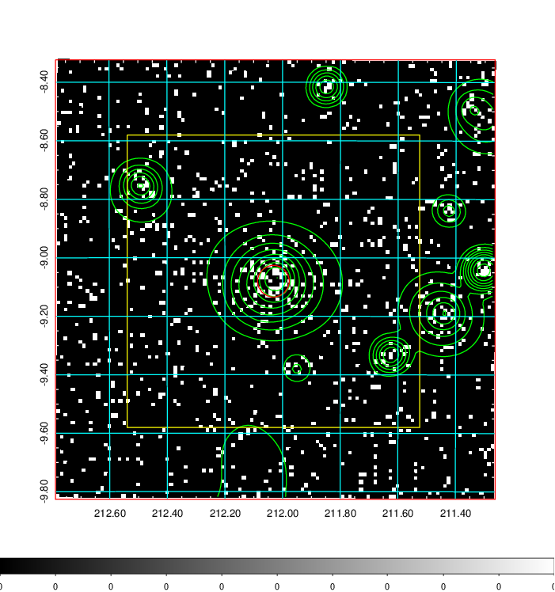  | 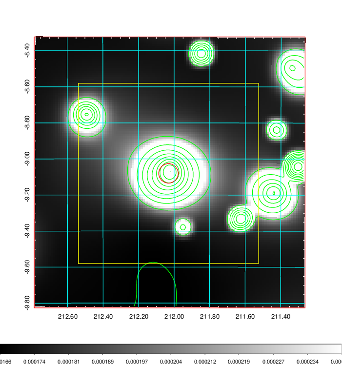   | 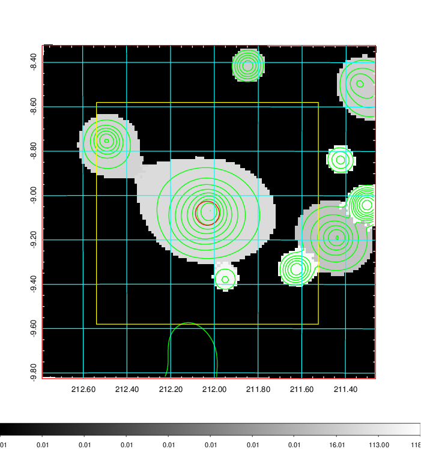  |

|[Exposure image](../image/546/546_mex.pdf)| [nH image](../image/546/546_nh.pdf)| [Planck image](../image/546/546_p.pdf)|
|-------------------|--------------------|-------------------|
|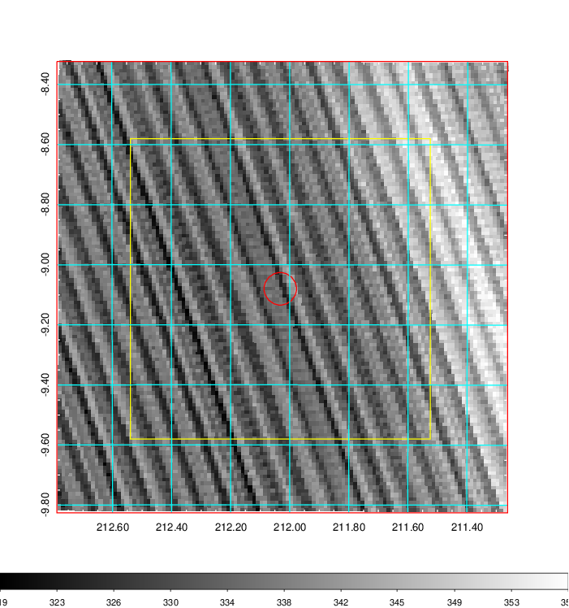   | 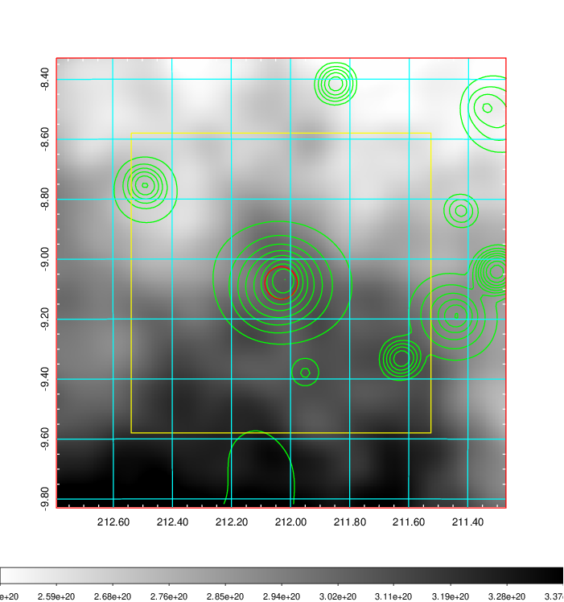    | 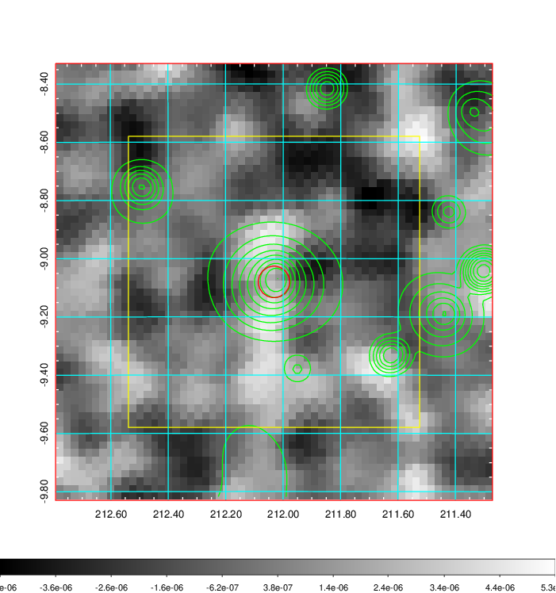 |

|[Redshift Histogram](../image/546/546_zg.pdf) | [DSS image(z1)](../image/546/546_dss_z1.pdf)      |  [DSS image(z2)](../image/546/546_dss_z2.pdf)    |
|-------------------|--------------------|-------------------|
|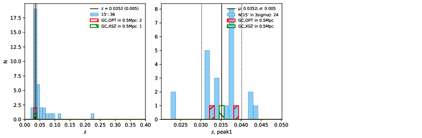 |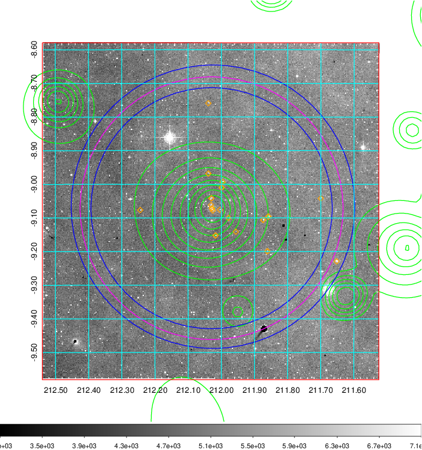  Blue circle for optical clusters;  Magenta circle for XSZ clusters;  all with r=1Mpc;  Only GC with Delta_z<0.01 are shown. | 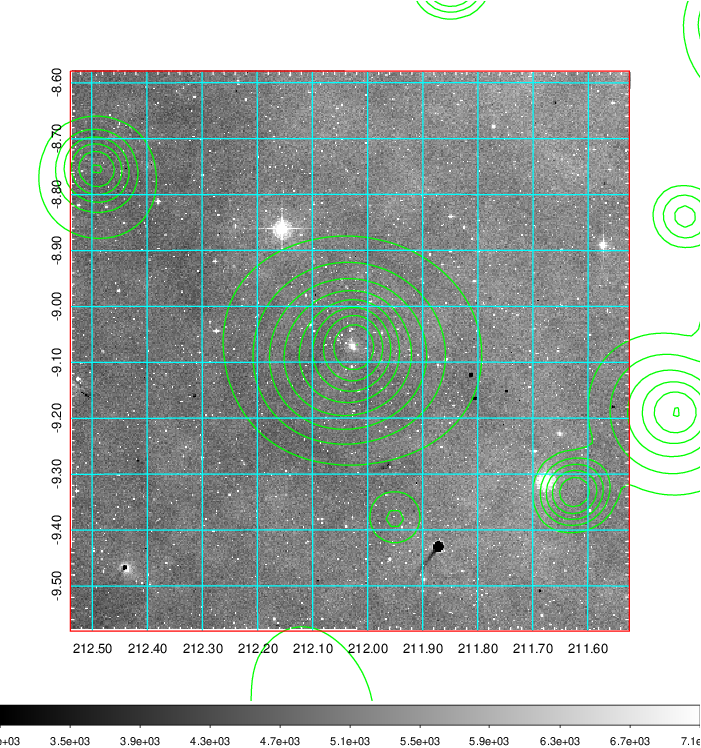 Blue circle for optical clusters;  Magenta circle for XSZ clusters;  all with r=1Mpc;  Only GC with Delta_z<0.01 are shown.  |

|[Previous-identified clusters](../image/546/546_gc.pdf) | [2MASS image](../image/546/546_2mass.pdf)      |
|-------------------|-------------------|
|  Green, magenta, and blue circles  for optical, X-ray and SZ clusters  respectively, with redshift of clusters  labelled. The radius of circles  are 1Mpc.|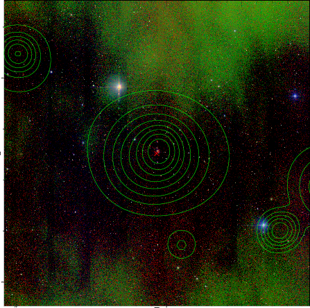  |

|[ATLAS image](../image/546/546_s.pdf)        |
|-------------------|
| 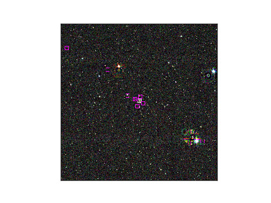  |
