

### 547

|Name|RAJ2000[deg]|DEJ2000[deg] |Ext[arcmin]| Ext,ml | z | z_src| C|GC(XSZ,Delta_z<0.01)| GC(OPT,Delta_z<0.01)|GC| R_sig[arcmin] | R500[arcmin] | R500[Mpc]| CRsig[c/s] | CR500[c/s] |L500[1E44 erg/s]|F500[1E-12 erg/s/cm^2]| M500[1E14 Msun]|Tx[keV]|Cnt_sig|Beta|Rc[arcmin]|Comment|Alias|
|---|---|---|---|---|---|------|---|--------|---------|----------|---|---|---|---|---|---|---|---|---|---|---|---|---|---|
|547| 212.174| 55.504| 3.18| 26.17| 0.0742(0.005)| z1, z_xsz| B| F20, SPI| N, W| C, F20, N, SPI, W| 9.288| 8.083| 0.684| 0.100(0.025)| 0.098(0.025)| 0.252(0.057)| 1.867(0.419)| 0.98(0.11)| 2.16(0.16)| 55.9| 0.832(-0.152+0.117)| 5.530(-1.284+0.994)| -| t140|

|[RASS image](../image/547/547_img.pdf)|[filtered image](../image/547/547_fil.pdf)|[Segment image](../image/547/547_seg.pdf)|
|-------------------|--------------------|-------------------|
| 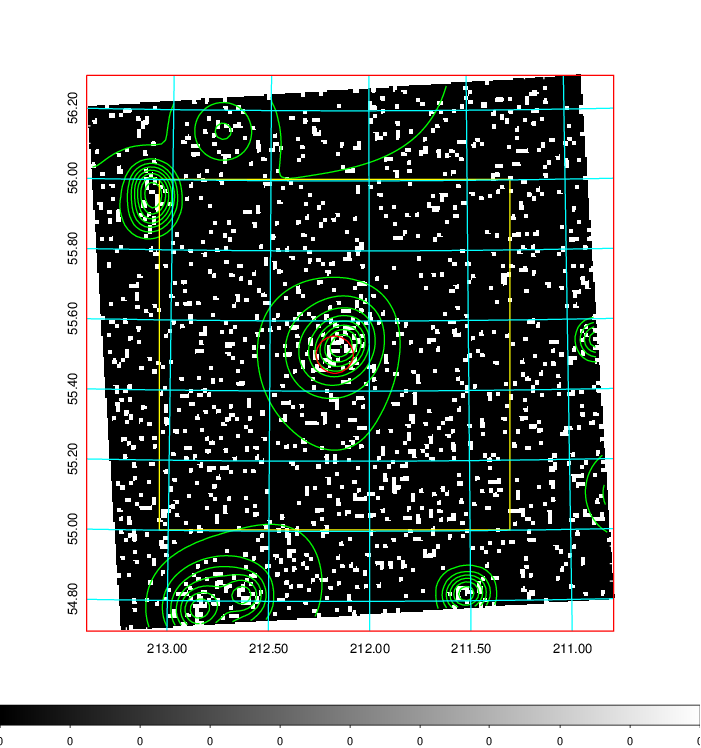  | 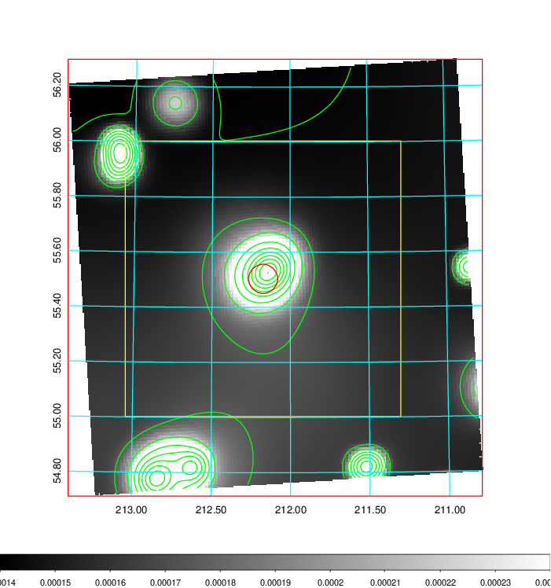   | 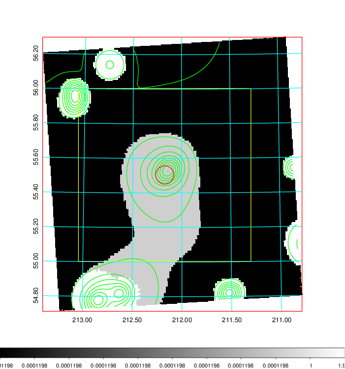  |

|[Exposure image](../image/547/547_mex.pdf)| [nH image](../image/547/547_nh.pdf)| [Planck image](../image/547/547_p.pdf)|
|-------------------|--------------------|-------------------|
|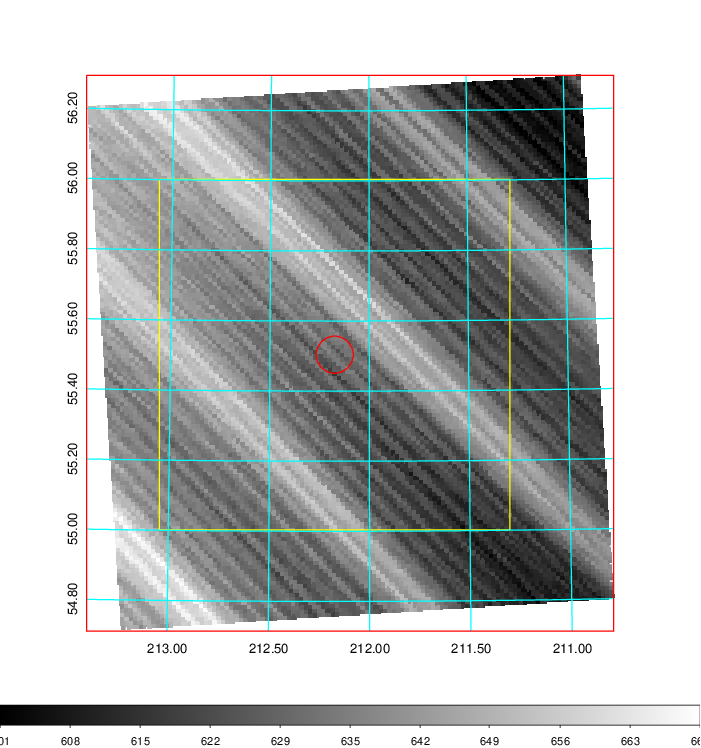   | 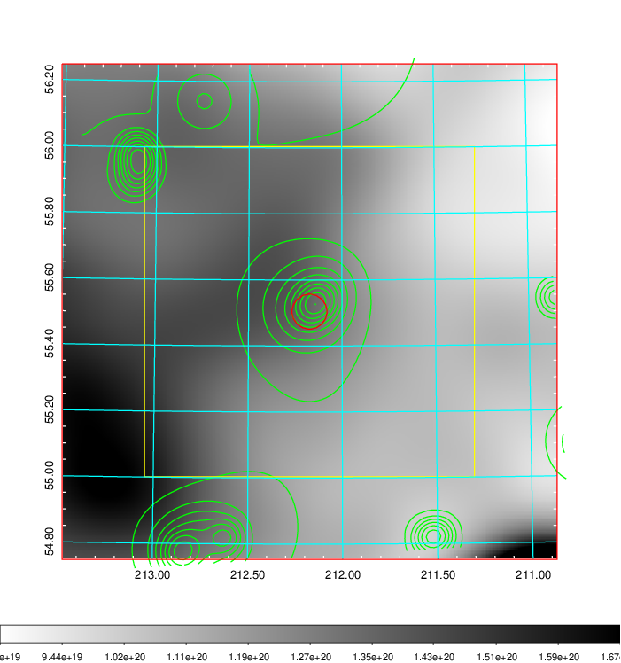    | 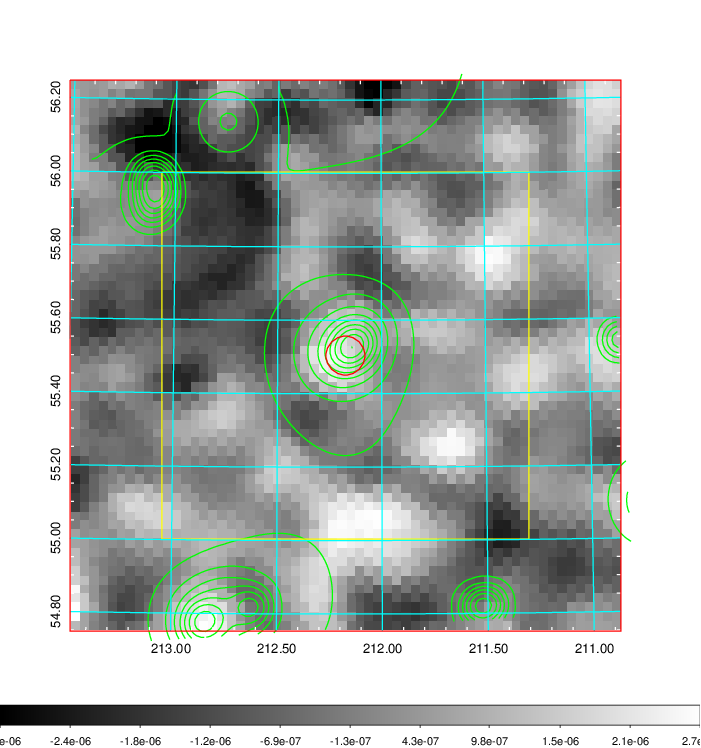 |

|[Redshift Histogram](../image/547/547_zg.pdf) | [DSS image(z1)](../image/547/547_dss_z1.pdf)      |  [DSS image(z2)](../image/547/547_dss_z2.pdf)    |
|-------------------|--------------------|-------------------|
|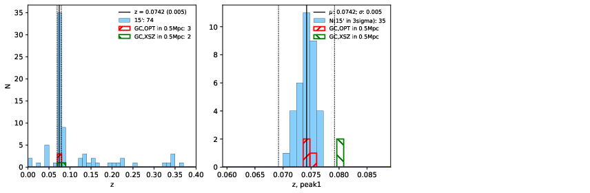 |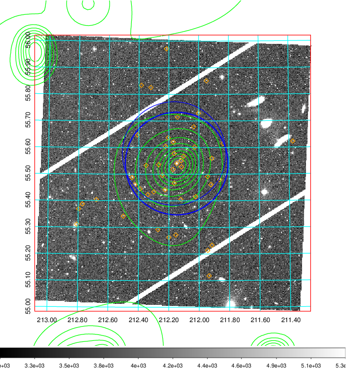  Blue circle for optical clusters;  Magenta circle for XSZ clusters;  all with r=1Mpc;  Only GC with Delta_z<0.01 are shown. | 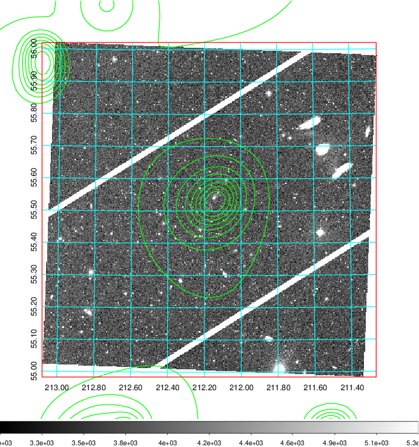 Blue circle for optical clusters;  Magenta circle for XSZ clusters;  all with r=1Mpc;  Only GC with Delta_z<0.01 are shown.  |

|[known Abell/XSZ clusters](../image/547/547_gc.pdf) | [2MASS image](../image/547/547_2mass.pdf)      |[SDSS image](../image/547/547_sdss.pdf)   |
|-------------------|-------------------|-------------------|
|  Magenta, blue and green circles  for optical, X-ray and SZ clusters  respectively, with redshift of clusters  labelled. The radius of circles  are 1Mpc.|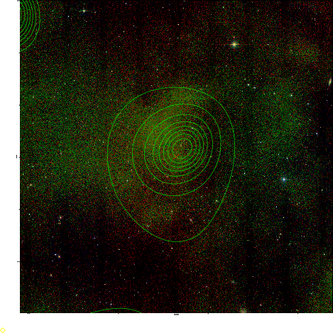  | 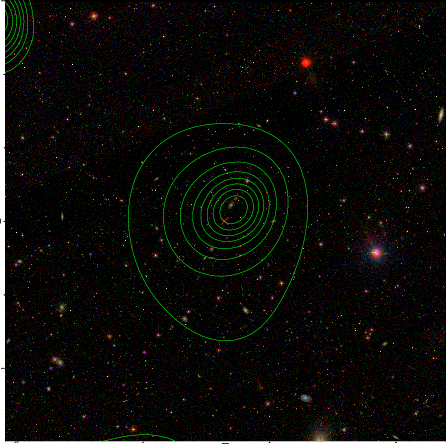  |

