

### 548

|Name|RAJ2000[deg]|DEJ2000[deg] |Ext[arcmin]| Ext,ml | z | z_src| C|GC(XSZ,Delta_z<0.01)| GC(OPT,Delta_z<0.01)|GC| R_sig[arcmin] | R500[arcmin] | R500[Mpc]| CRsig[c/s] | CR500[c/s] |L500[1E44 erg/s]|F500[1E-12 erg/s/cm^2]| M500[1E14 Msun]|Tx[keV]|Cnt_sig|Beta|Rc[arcmin]|Comment|Alias|
|---|---|---|---|---|---|------|---|--------|---------|----------|---|---|---|---|---|---|---|---|---|---|---|---|---|---|
|548| 212.174| 7.416| 36.10| 125.33| 0.0836(0.005)| z1,| G| -| -| C, N, W| 15.138| 8.342| 0.786| 0.165(0.048)| 0.153(0.045)| 0.504(0.390)| 2.908(2.250)| 1.50(0.59)| 2.82(0.70)| 96.0| 0.542(-0.032+0.090)| 6.395(-0.709+1.260)| -| t661|

|[RASS image](../image/548/548_img.pdf)|[filtered image](../image/548/548_fil.pdf)|[Segment image](../image/548/548_seg.pdf)|
|-------------------|--------------------|-------------------|
| 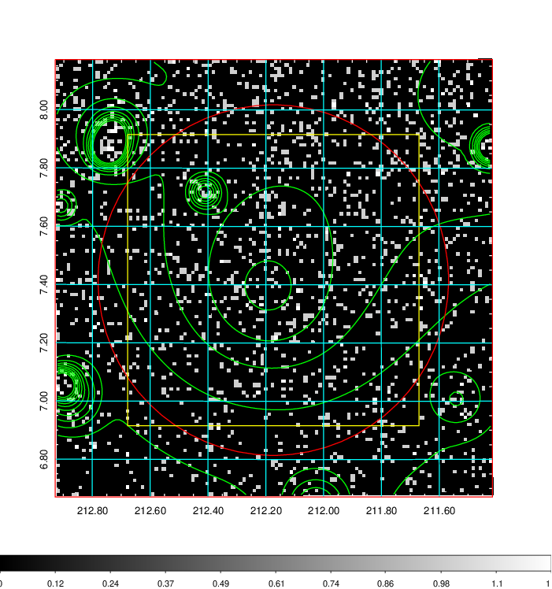  | 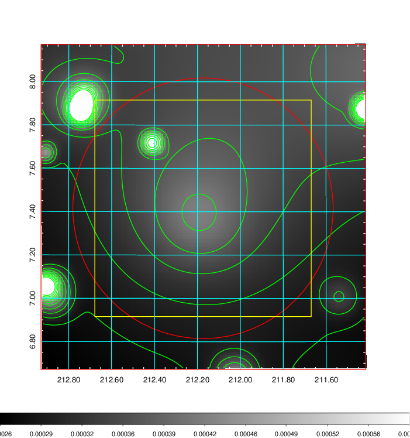   | 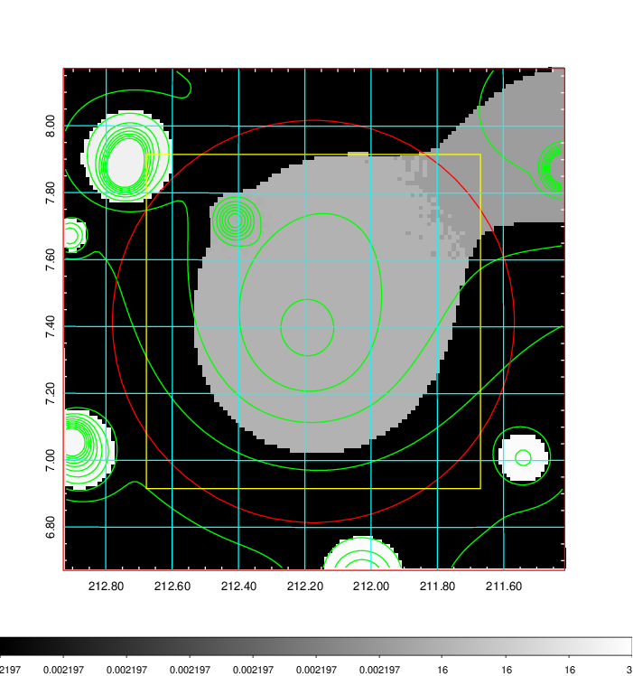  |

|[Exposure image](../image/548/548_mex.pdf)| [nH image](../image/548/548_nh.pdf)| [Planck image](../image/548/548_p.pdf)|
|-------------------|--------------------|-------------------|
|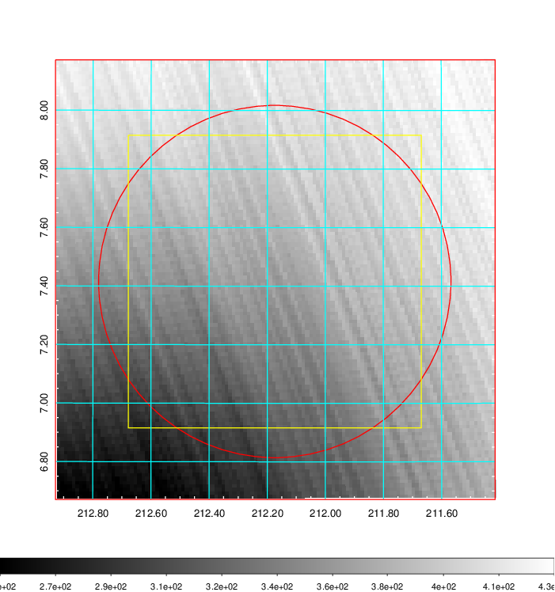   | 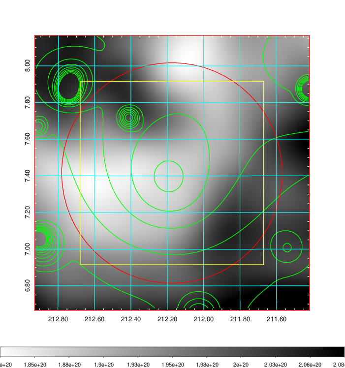    | 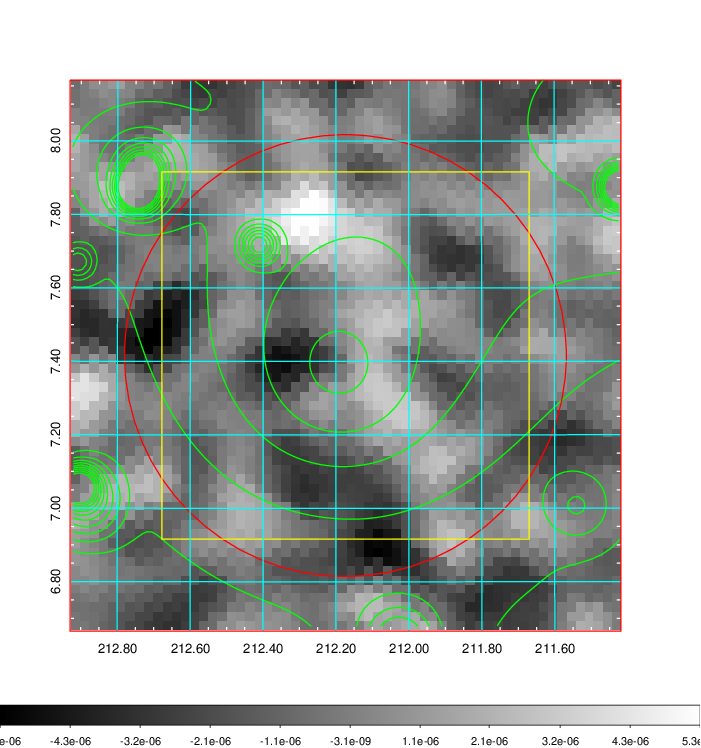 |

|[Redshift Histogram](../image/548/548_zg.pdf) | [DSS image(z1)](../image/548/548_dss_z1.pdf)      |  [DSS image(z2)](../image/548/548_dss_z2.pdf)    |
|-------------------|--------------------|-------------------|
|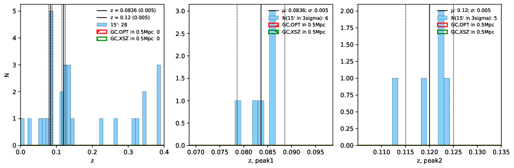 |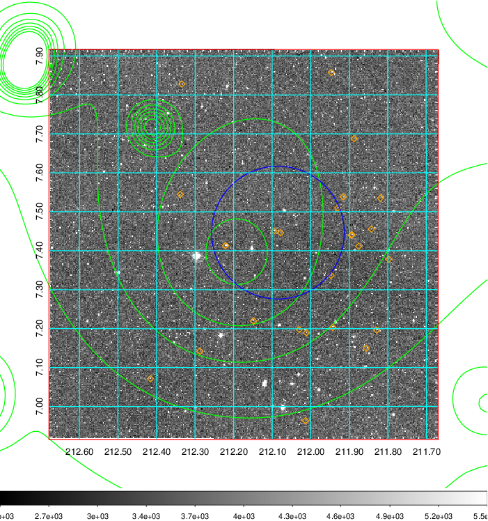  Blue circle for optical clusters;  Magenta circle for XSZ clusters;  all with r=1Mpc;  Only GC with Delta_z<0.01 are shown. | 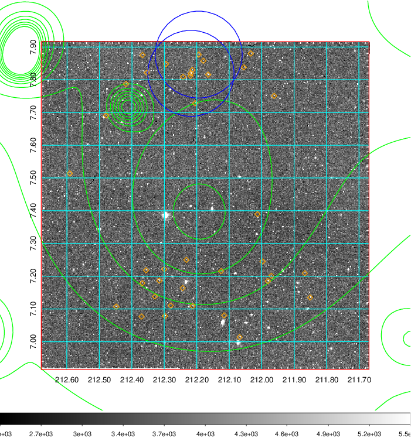 Blue circle for optical clusters;  Magenta circle for XSZ clusters;  all with r=1Mpc;  Only GC with Delta_z<0.01 are shown.  |

|[known Abell/XSZ clusters](../image/548/548_gc.pdf) | [2MASS image](../image/548/548_2mass.pdf)      |[SDSS image](../image/548/548_sdss.pdf)   |
|-------------------|-------------------|-------------------|
|  Magenta, blue and green circles  for optical, X-ray and SZ clusters  respectively, with redshift of clusters  labelled. The radius of circles  are 1Mpc.|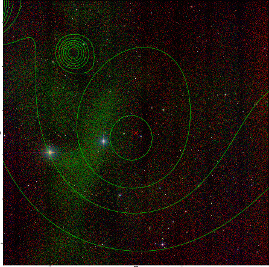  | 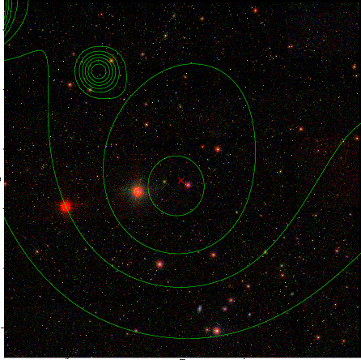  |

