

### 549

|Name|RAJ2000[deg]|DEJ2000[deg] |Ext[arcmin]| Ext,ml | z | z_src| C|GC(XSZ,Delta_z<0.01)| GC(OPT,Delta_z<0.01)|GC| R_sig[arcmin] | R500[arcmin] | R500[Mpc]| CRsig[c/s] | CR500[c/s] |L500[1E44 erg/s]|F500[1E-12 erg/s/cm^2]| M500[1E14 Msun]|Tx[keV]|Cnt_sig|Beta|Rc[arcmin]|Comment|Alias|
|---|---|---|---|---|---|------|---|--------|---------|----------|---|---|---|---|---|---|---|---|---|---|---|---|---|---|
|549| 213.288| -7.833| 4.40| 33.33| 0.0704(0.005)| z1,| G| -| -| -| 10.750| 9.037| 0.729| 0.148(0.038)| 0.144(0.037)| 0.312(0.057)| 2.588(0.474)| 1.18(0.11)| 2.42(0.14)| 42.2| 0.868(-0.142+0.094)| 6.799(-1.293+1.028)| -| t227|

|[RASS image](../image/549/549_img.pdf)|[filtered image](../image/549/549_fil.pdf)|[Segment image](../image/549/549_seg.pdf)|
|-------------------|--------------------|-------------------|
| 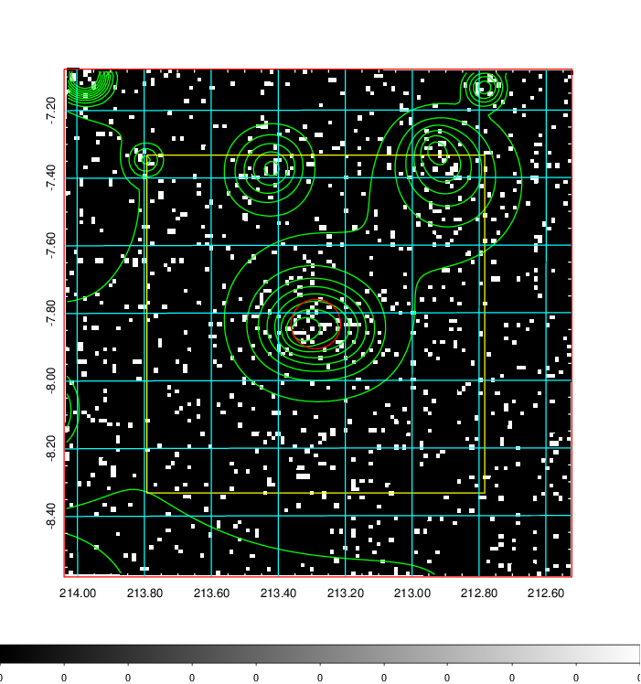  | 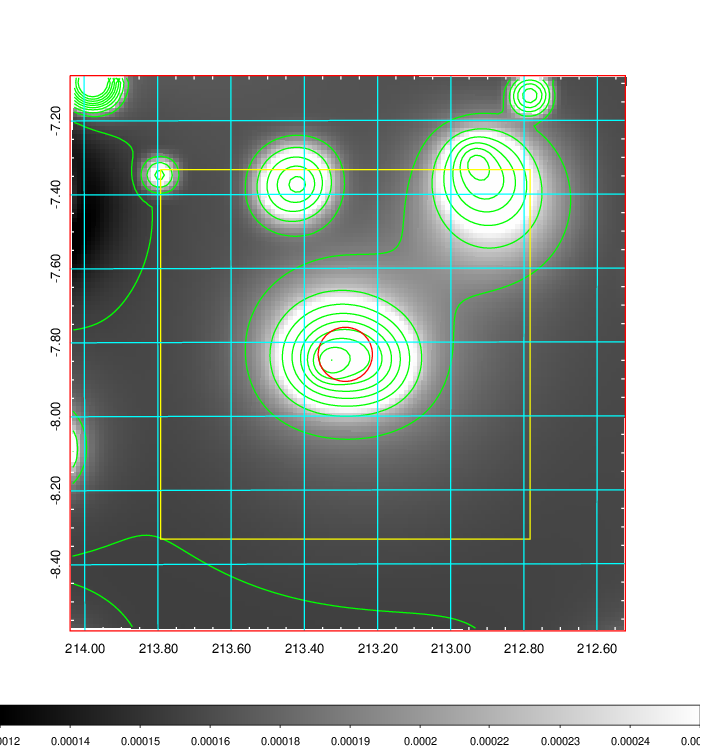   | 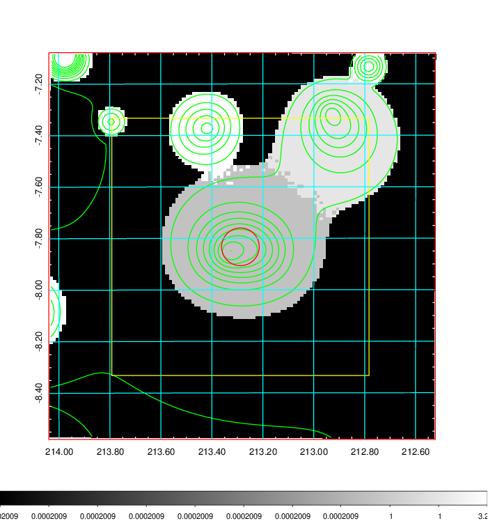  |

|[Exposure image](../image/549/549_mex.pdf)| [nH image](../image/549/549_nh.pdf)| [Planck image](../image/549/549_p.pdf)|
|-------------------|--------------------|-------------------|
|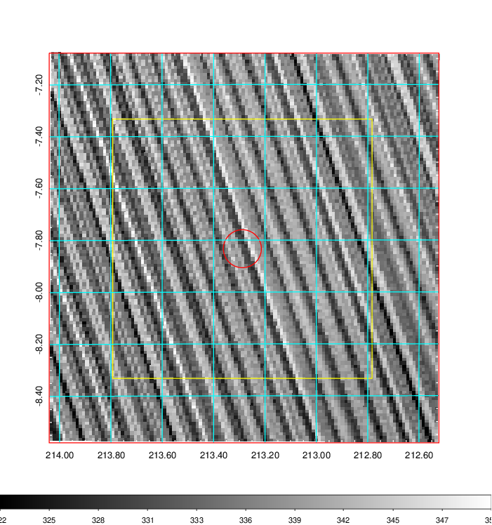   | 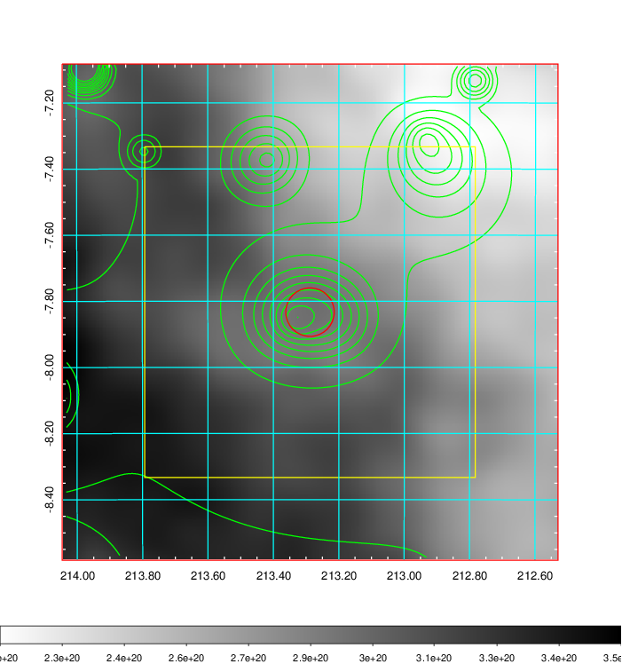    | 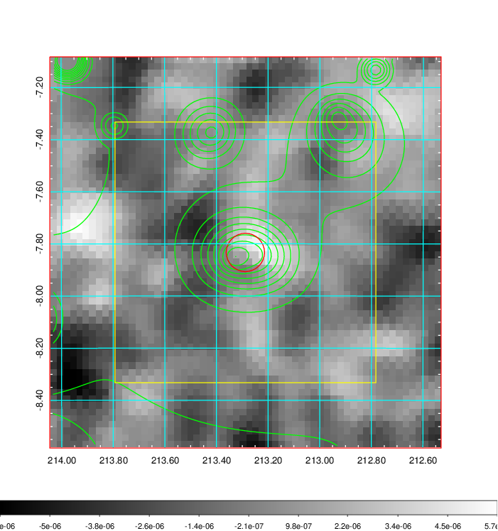 |

|[Redshift Histogram](../image/549/549_zg.pdf) | [DSS image(z1)](../image/549/549_dss_z1.pdf)      |  [DSS image(z2)](../image/549/549_dss_z2.pdf)    |
|-------------------|--------------------|-------------------|
|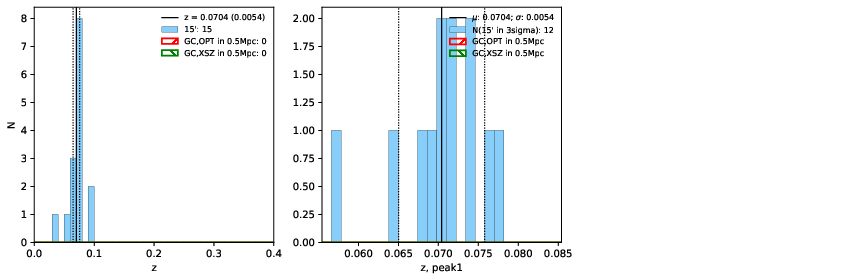 |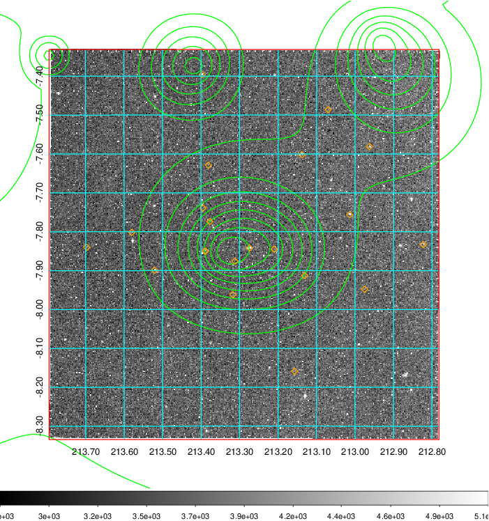  Blue circle for optical clusters;  Magenta circle for XSZ clusters;  all with r=1Mpc;  Only GC with Delta_z<0.01 are shown. | 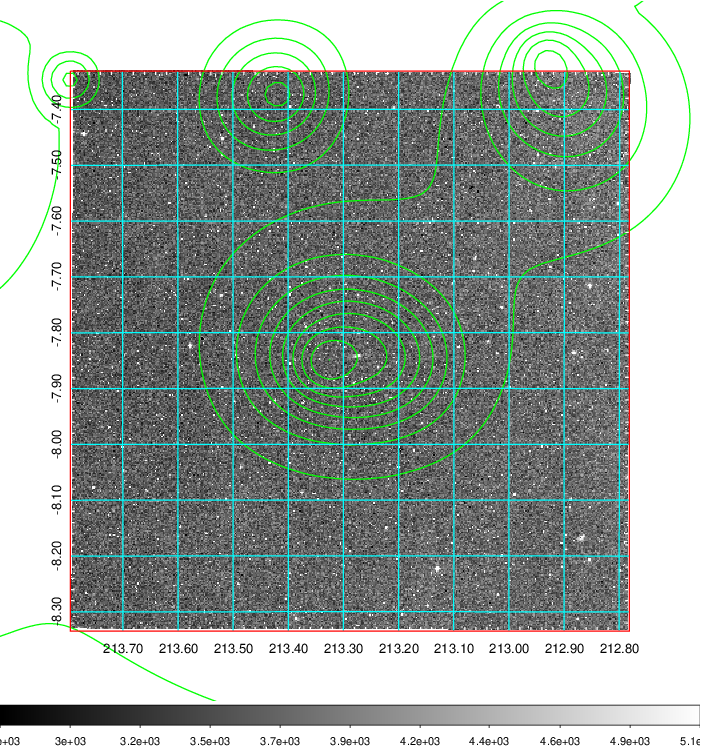 Blue circle for optical clusters;  Magenta circle for XSZ clusters;  all with r=1Mpc;  Only GC with Delta_z<0.01 are shown.  |

|[Previous-identified clusters](../image/549/549_gc.pdf) | [2MASS image](../image/549/549_2mass.pdf)      |
|-------------------|-------------------|
|  Green, magenta, and blue circles  for optical, X-ray and SZ clusters  respectively, with redshift of clusters  labelled. The radius of circles  are 1Mpc.|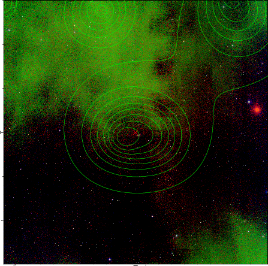  |

|[ATLAS image](../image/549/549_s.pdf)        |
|-------------------|
| 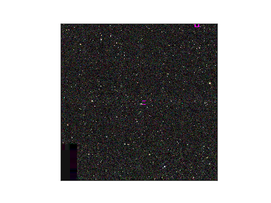  |
