

### 55

|Name|RAJ2000[deg]|DEJ2000[deg] |Ext[arcmin]| Ext,ml | z | z_src| C|GC(XSZ,Delta_z<0.01)| GC(OPT,Delta_z<0.01)|GC| R_sig[arcmin] | R500[arcmin] | R500[Mpc]| CRsig[c/s] | CR500[c/s] |L500[1E44 erg/s]|F500[1E-12 erg/s/cm^2]| M500[1E14 Msun]|Tx[keV]|Cnt_sig|Beta|Rc[arcmin]|Comment|Alias|
|---|---|---|---|---|---|------|---|--------|---------|----------|---|---|---|---|---|---|---|---|---|---|---|---|---|---|
|55| 17.053| 2.179| 4.20| 131.26| 0.0442(0.005)| z1, z_xsz| B| L03, MCXC, Tar, XB| A, N| A, C, F20, L03, MCXC, N, SPI, Tar, W, XB| 10.750| 12.762| 0.666| 0.231(0.037)| 0.238(0.038)| 0.193(0.020)| 4.210(0.442)| 0.88(0.05)| 2.00(0.07)| 108.8| 0.897(-0.115+0.073)| 5.652(-0.879+0.618)| -| k490|

|[RASS image](../image/55/55_img.pdf)|[filtered image](../image/55/55_fil.pdf)|[Segment image](../image/55/55_seg.pdf)|
|-------------------|--------------------|-------------------|
| 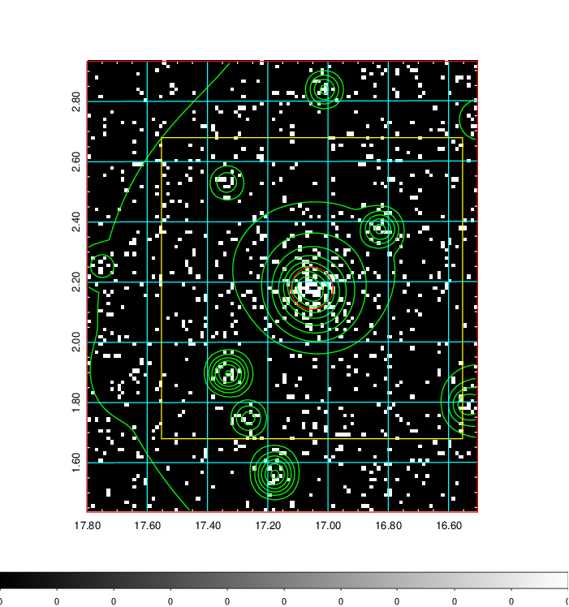  | 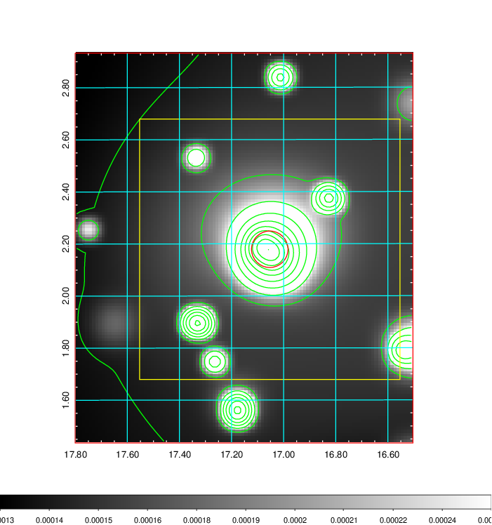   | 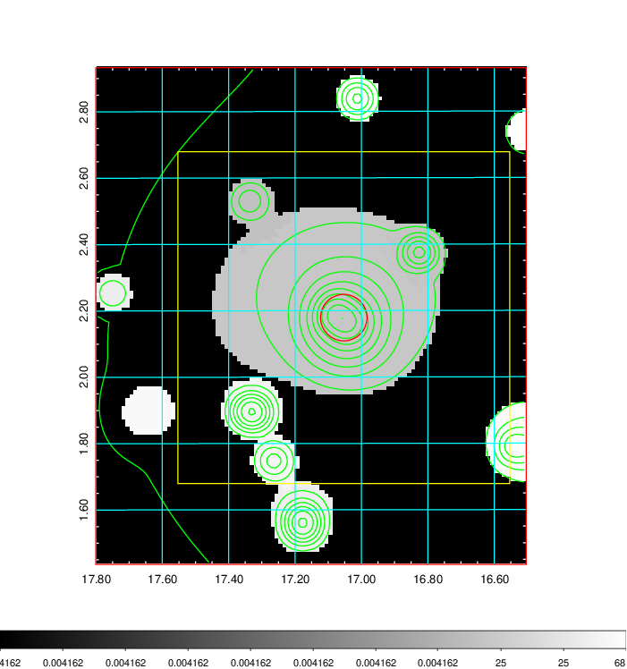  |

|[Exposure image](../image/55/55_mex.pdf)| [nH image](../image/55/55_nh.pdf)| [Planck image](../image/55/55_p.pdf)|
|-------------------|--------------------|-------------------|
|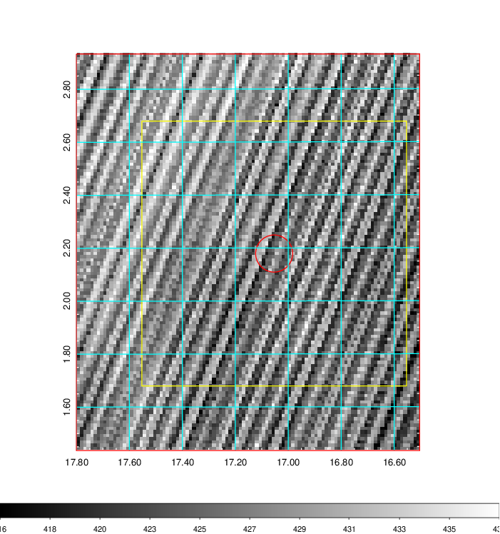   | 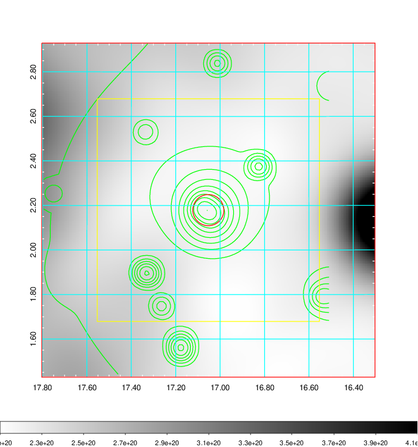    | 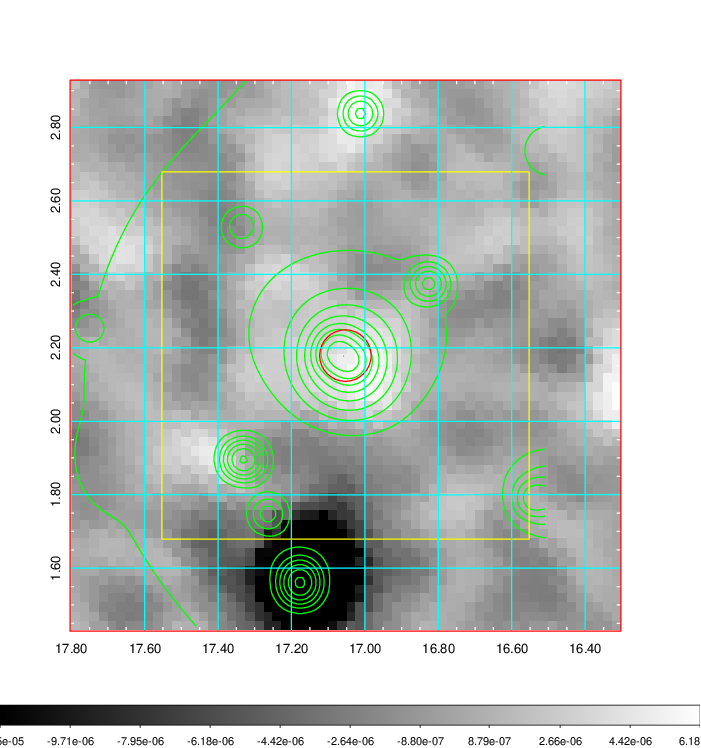 |

|[Redshift Histogram](../image/55/55_zg.pdf) | [DSS image(z1)](../image/55/55_dss_z1.pdf)      |  [DSS image(z2)](../image/55/55_dss_z2.pdf)    |
|-------------------|--------------------|-------------------|
|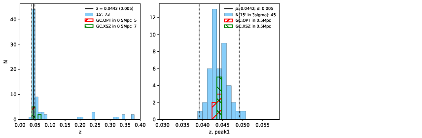 |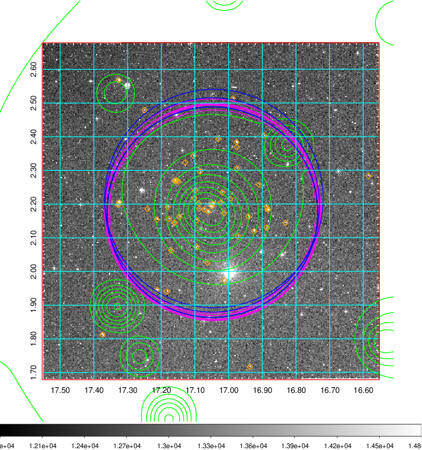  Blue circle for optical clusters;  Magenta circle for XSZ clusters;  all with r=1Mpc;  Only GC with Delta_z<0.01 are shown. | 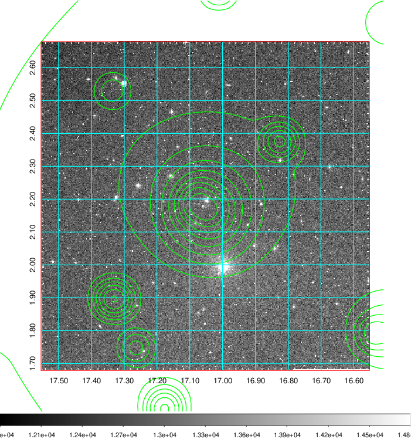 Blue circle for optical clusters;  Magenta circle for XSZ clusters;  all with r=1Mpc;  Only GC with Delta_z<0.01 are shown.  |

|[known Abell/XSZ clusters](../image/55/55_gc.pdf) | [2MASS image](../image/55/55_2mass.pdf)      |[SDSS image](../image/55/55_sdss.pdf)   |
|-------------------|-------------------|-------------------|
|  Magenta, blue and green circles  for optical, X-ray and SZ clusters  respectively, with redshift of clusters  labelled. The radius of circles  are 1Mpc.|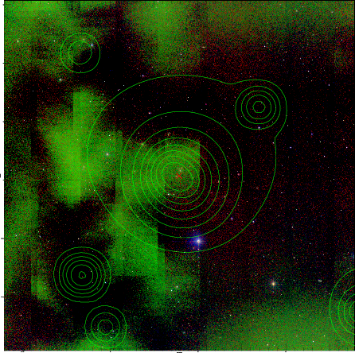  | 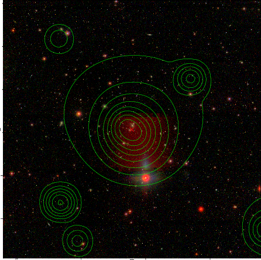  |

|[DES image](../image/55/55_des.pdf)   |
|-------------------|
|   |
