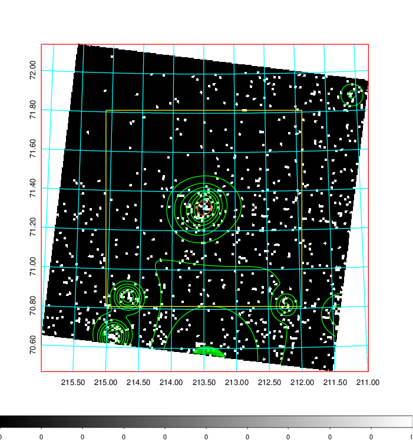
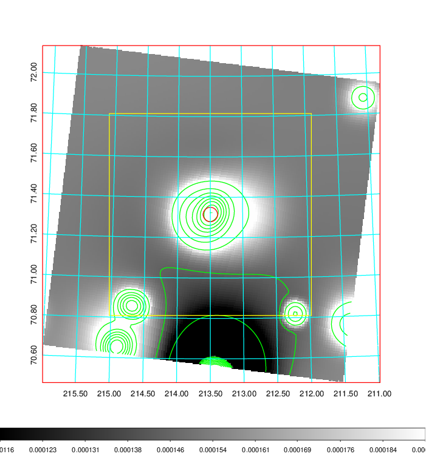
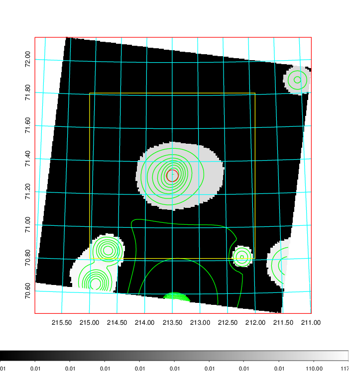
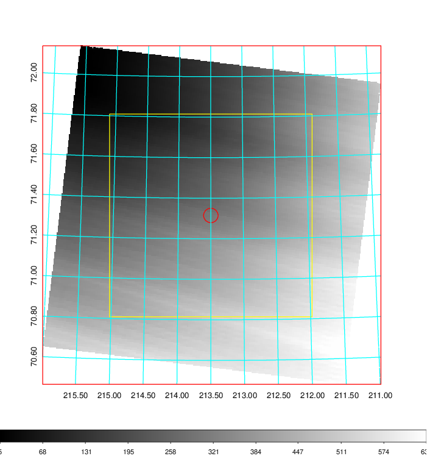
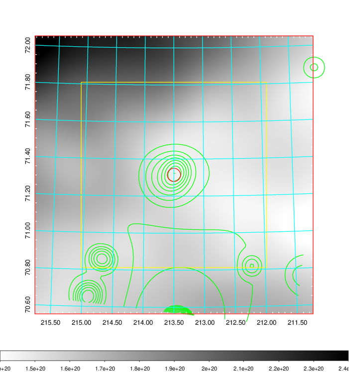
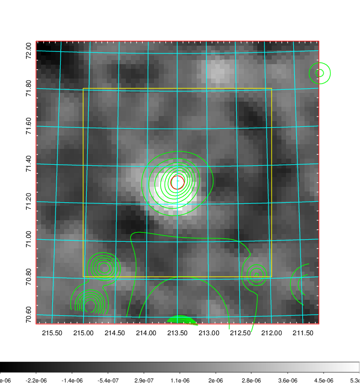
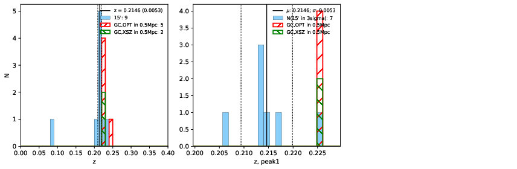
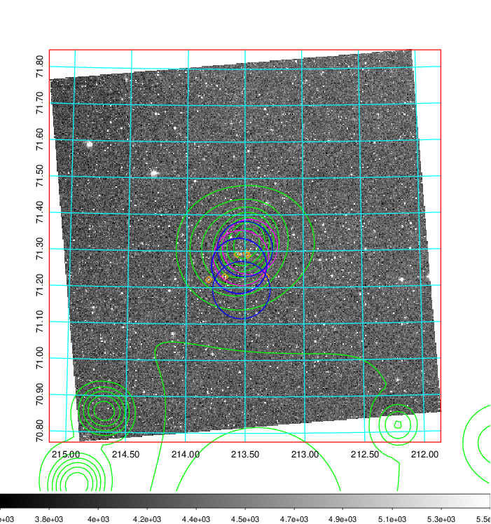
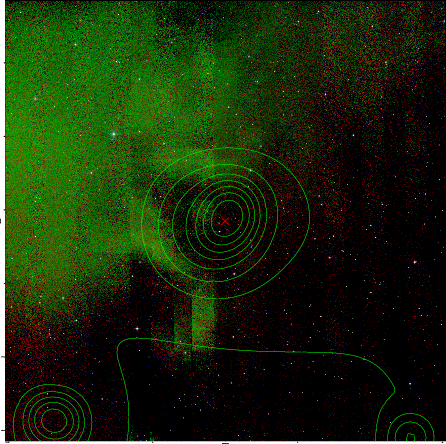

### 551

|Name|RAJ2000[deg]|DEJ2000[deg] |Ext[arcmin]| Ext,ml | z | z_src| C|GC(XSZ,Delta_z<0.01)| GC(OPT,Delta_z<0.01)|GC| R_sig[arcmin] | R500[arcmin] | R500[Mpc]| CRsig[c/s] | CR500[c/s] |L500[1E44 erg/s]|F500[1E-12 erg/s/cm^2]| M500[1E14 Msun]|Tx[keV]|Cnt_sig|Beta|Rc[arcmin]|Comment|Alias|
|---|---|---|---|---|---|------|---|--------|---------|----------|---|---|---|---|---|---|---|---|---|---|---|---|---|---|
|551| 213.499| 71.315| 2.15| 25.05| 0.2146(0.005)| z1,| G| -| -| A, MCXC, N, PSZ2, Tar, W| 7.338| 5.522| 1.155| 0.183(0.038)| 0.176(0.036)| 4.867(0.552)| 3.616(0.410)| 5.43(0.29)| 6.52(0.22)| 45.9| 0.861(-0.137+0.097)| 4.108(-0.909+0.696)| -| k247|

|[RASS image](../image/551/551_img.pdf)|[filtered image](../image/551/551_fil.pdf)|[Segment image](../image/551/551_seg.pdf)|
|-------------------|--------------------|-------------------|
|   |    |   |

|[Exposure image](../image/551/551_mex.pdf)| [nH image](../image/551/551_nh.pdf)| [Planck image](../image/551/551_p.pdf)|
|-------------------|--------------------|-------------------|
|   |     |  |

|[Redshift Histogram](../image/551/551_zg.pdf) | [DSS image(z1)](../image/551/551_dss_z1.pdf)      |  [DSS image(z2)](../image/551/551_dss_z2.pdf)    |
|-------------------|--------------------|-------------------|
| |  Blue circle for optical clusters;  Magenta circle for XSZ clusters;  all with r=1Mpc;  Only GC with Delta_z<0.01 are shown. |  Blue circle for optical clusters;  Magenta circle for XSZ clusters;  all with r=1Mpc;  Only GC with Delta_z<0.01 are shown.  |

|[known Abell/XSZ clusters](../image/551/551_gc.pdf) | [2MASS image](../image/551/551_2mass.pdf)      |
|-------------------|-------------------|
|  Magenta, blue and green circles  for optical, X-ray and SZ clusters  respectively, with redshift of clusters  labelled. The radius of circles  are 1Mpc.|  |

|[PS1 image](../image/551/551_ps1.pdf)            |
|-------------------|
|   |
