

### 552

|Name|RAJ2000[deg]|DEJ2000[deg] |Ext[arcmin]| Ext,ml | z | z_src| C|GC(XSZ,Delta_z<0.01)| GC(OPT,Delta_z<0.01)|GC| R_sig[arcmin] | R500[arcmin] | R500[Mpc]| CRsig[c/s] | CR500[c/s] |L500[1E44 erg/s]|F500[1E-12 erg/s/cm^2]| M500[1E14 Msun]|Tx[keV]|Cnt_sig|Beta|Rc[arcmin]|Comment|Alias|
|---|---|---|---|---|---|------|---|--------|---------|----------|---|---|---|---|---|---|---|---|---|---|---|---|---|---|
|552| 213.776| -0.456| 4.07| 34.13| 0.1361(0.006)| z1, z_xsz| B| F20| A, C, N, W| A, C, F20, MCXC, N, Tak, Tar, W| 41.590| 8.016| 1.159| 0.435(0.080)| 0.383(0.071)| 3.634(0.795)| 7.382(1.616)| 5.05(0.53)| 6.07(0.41)| 197.5| 0.504(-0.003+0.006)| 5.788(-0.441+0.485)| -| t201|

|[RASS image](../image/552/552_img.pdf)|[filtered image](../image/552/552_fil.pdf)|[Segment image](../image/552/552_seg.pdf)|
|-------------------|--------------------|-------------------|
| 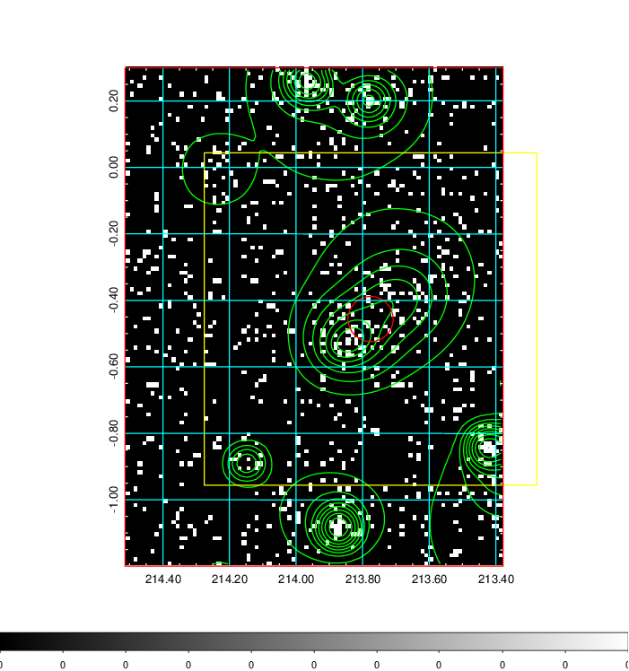  | 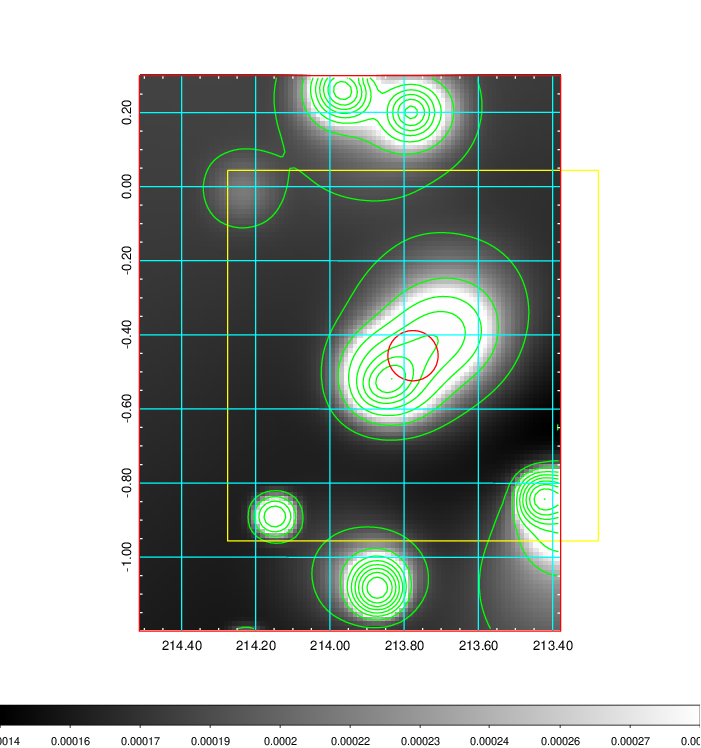   | 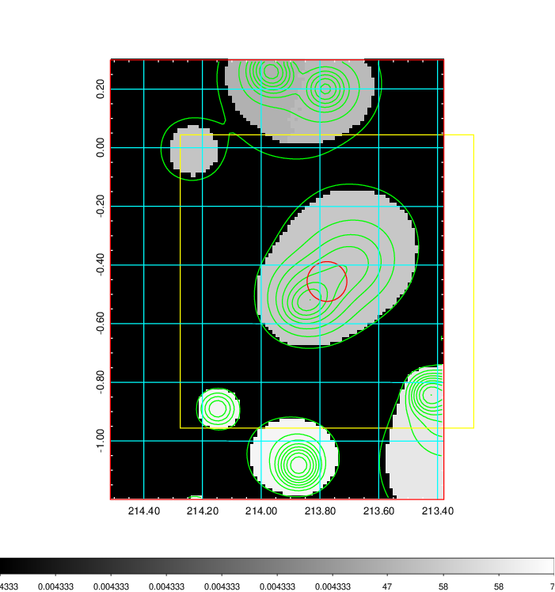  |

|[Exposure image](../image/552/552_mex.pdf)| [nH image](../image/552/552_nh.pdf)| [Planck image](../image/552/552_p.pdf)|
|-------------------|--------------------|-------------------|
|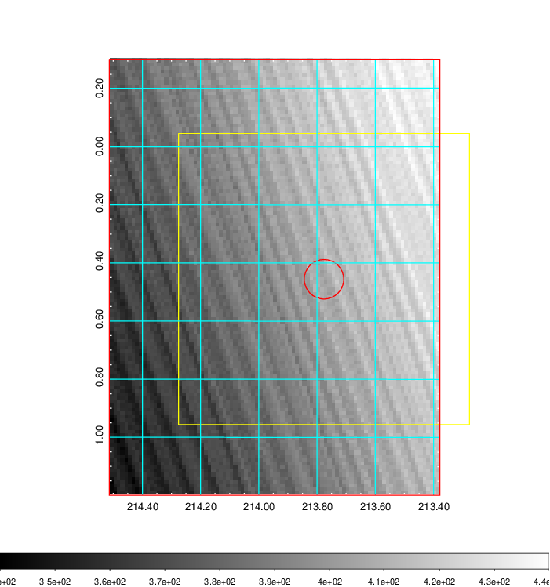   | 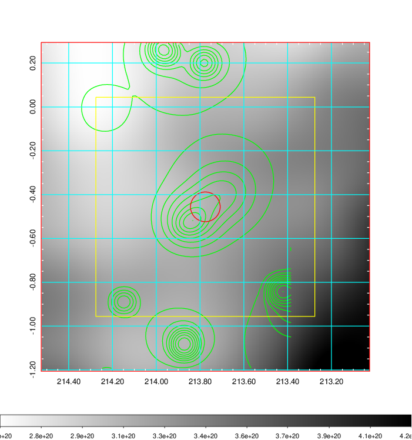    | 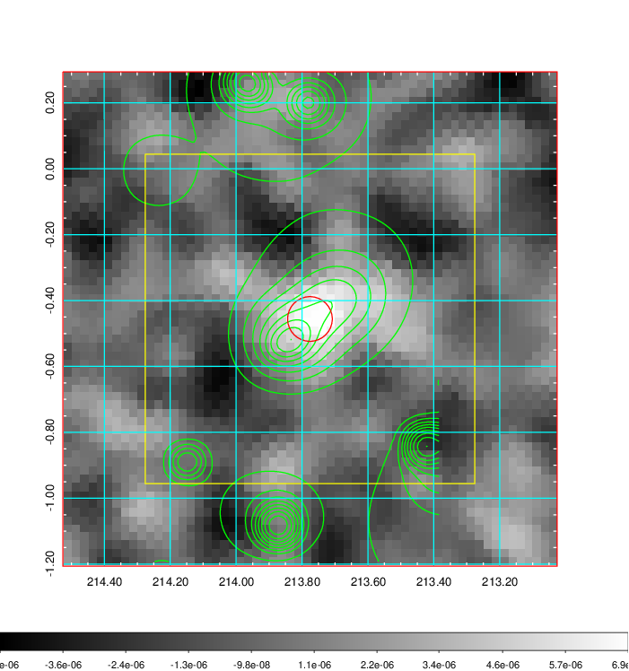 |

|[Redshift Histogram](../image/552/552_zg.pdf) | [DSS image(z1)](../image/552/552_dss_z1.pdf)      |  [DSS image(z2)](../image/552/552_dss_z2.pdf)    |
|-------------------|--------------------|-------------------|
|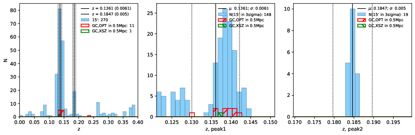 |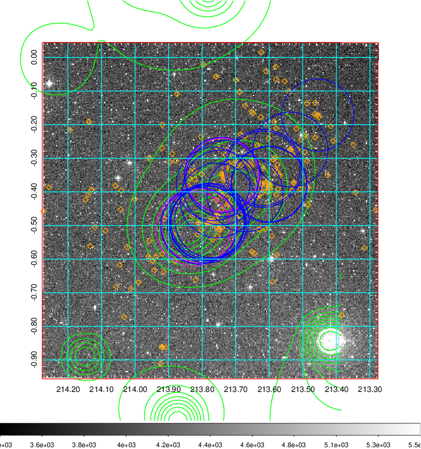  Blue circle for optical clusters;  Magenta circle for XSZ clusters;  all with r=1Mpc;  Only GC with Delta_z<0.01 are shown. | 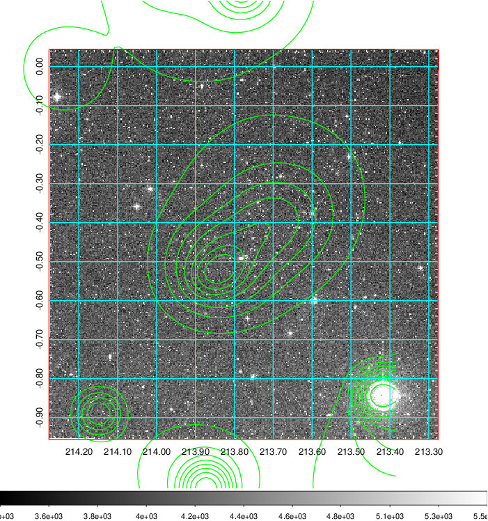 Blue circle for optical clusters;  Magenta circle for XSZ clusters;  all with r=1Mpc;  Only GC with Delta_z<0.01 are shown.  |

|[Previous-identified clusters](../image/552/552_gc.pdf) | [2MASS image](../image/552/552_2mass.pdf)      |[SDSS image](../image/552/552_sdss.pdf)   |
|-------------------|-------------------|-------------------|
|  Green, magenta, and blue circles  for optical, X-ray and SZ clusters  respectively, with redshift of clusters  labelled. The radius of circles  are 1Mpc.|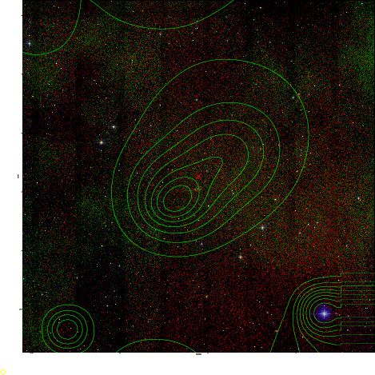  | 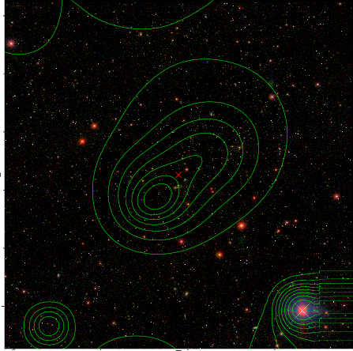  |

