

### 553

|Name|RAJ2000[deg]|DEJ2000[deg] |Ext[arcmin]| Ext,ml | z | z_src| C|GC(XSZ,Delta_z<0.01)| GC(OPT,Delta_z<0.01)|GC| R_sig[arcmin] | R500[arcmin] | R500[Mpc]| CRsig[c/s] | CR500[c/s] |L500[1E44 erg/s]|F500[1E-12 erg/s/cm^2]| M500[1E14 Msun]|Tx[keV]|Cnt_sig|Beta|Rc[arcmin]|Comment|Alias|
|---|---|---|---|---|---|------|---|--------|---------|----------|---|---|---|---|---|---|---|---|---|---|---|---|---|---|
|553| 214.365| 8.204| 5.68| 161.83| 0.0575(0.005)| z1, z_xsz| B| L03, Tar| A, N, W| A, C, F20, L03, N, SWXCS, Tar, W| 8.312| 11.248| 0.752| 0.237(0.043)| 0.251(0.046)| 0.364(0.040)| 4.604(0.503)| 1.28(0.07)| 2.53(0.09)| 108.2| 0.933(-0.087+0.049)| 7.048(-0.728+0.589)| -| t294|

|[RASS image](../image/553/553_img.pdf)|[filtered image](../image/553/553_fil.pdf)|[Segment image](../image/553/553_seg.pdf)|
|-------------------|--------------------|-------------------|
| 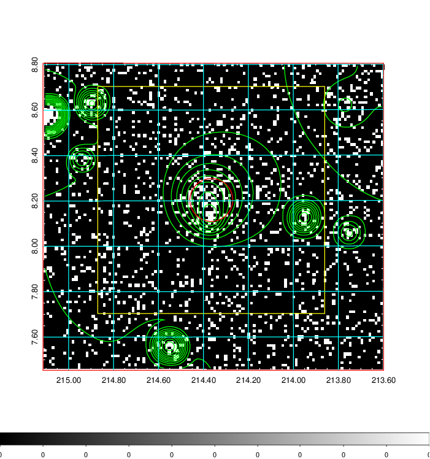  | 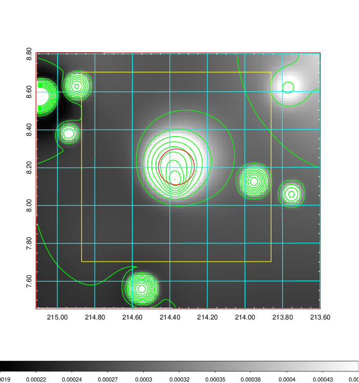   | 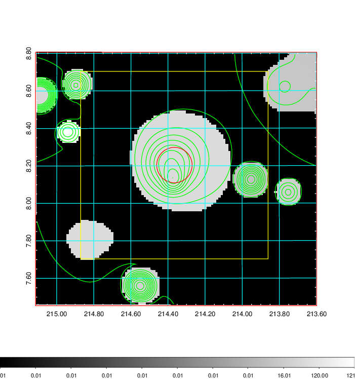  |

|[Exposure image](../image/553/553_mex.pdf)| [nH image](../image/553/553_nh.pdf)| [Planck image](../image/553/553_p.pdf)|
|-------------------|--------------------|-------------------|
|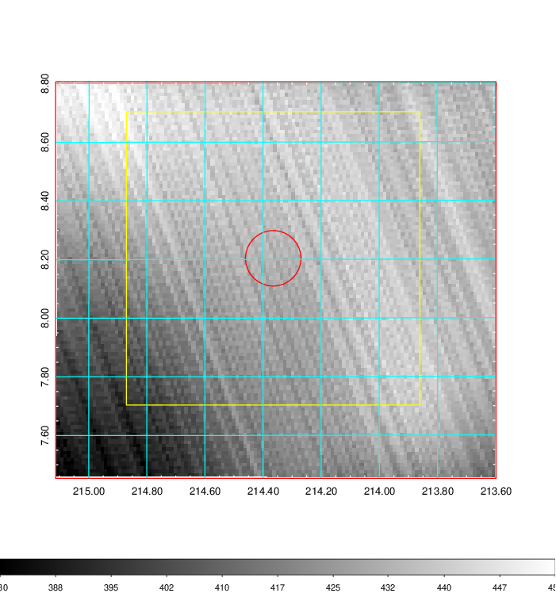   | 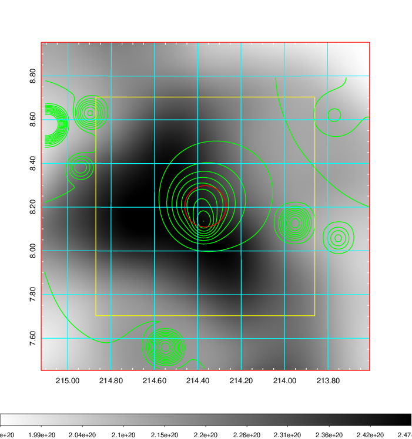    | 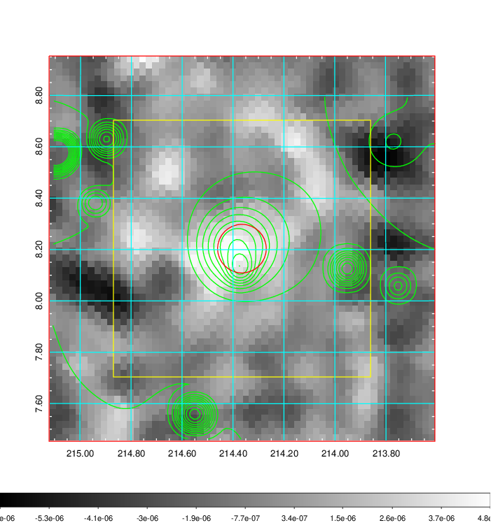 |

|[Redshift Histogram](../image/553/553_zg.pdf) | [DSS image(z1)](../image/553/553_dss_z1.pdf)      |  [DSS image(z2)](../image/553/553_dss_z2.pdf)    |
|-------------------|--------------------|-------------------|
|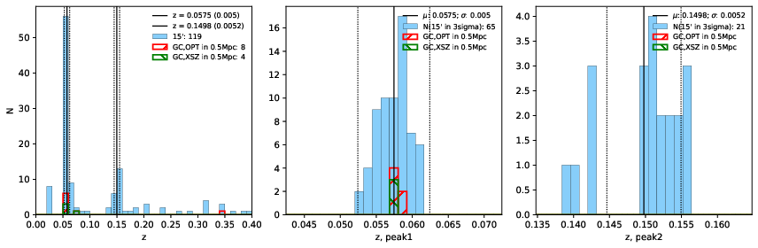 |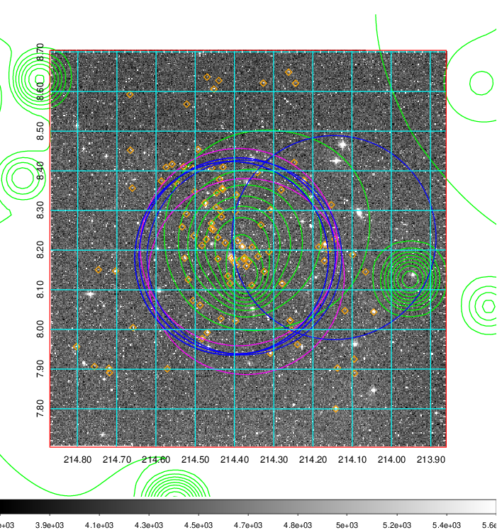  Blue circle for optical clusters;  Magenta circle for XSZ clusters;  all with r=1Mpc;  Only GC with Delta_z<0.01 are shown. | 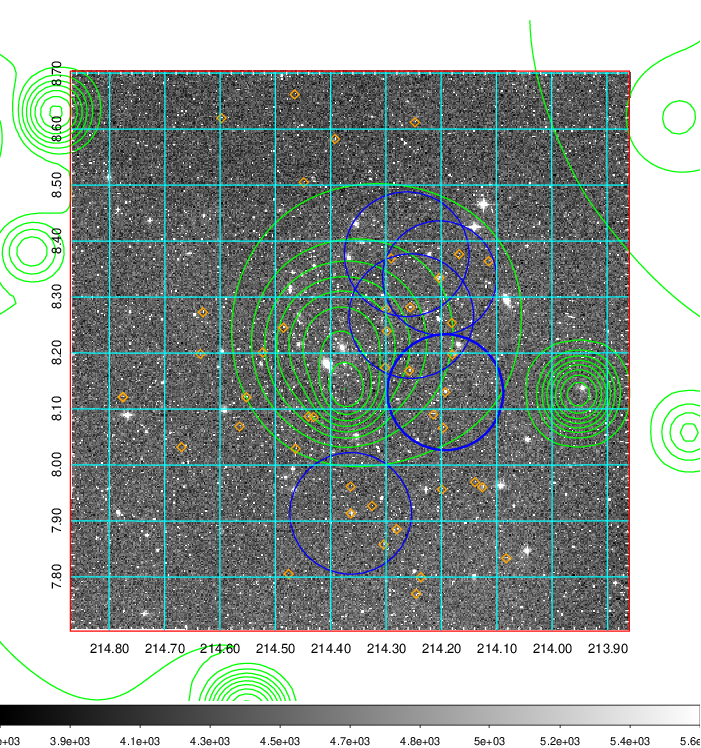 Blue circle for optical clusters;  Magenta circle for XSZ clusters;  all with r=1Mpc;  Only GC with Delta_z<0.01 are shown.  |

|[known Abell/XSZ clusters](../image/553/553_gc.pdf) | [2MASS image](../image/553/553_2mass.pdf)      |[SDSS image](../image/553/553_sdss.pdf)   |
|-------------------|-------------------|-------------------|
|  Magenta, blue and green circles  for optical, X-ray and SZ clusters  respectively, with redshift of clusters  labelled. The radius of circles  are 1Mpc.|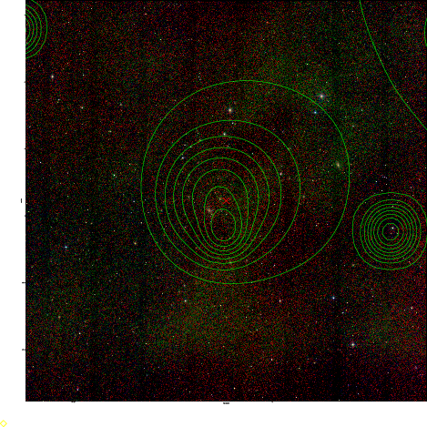  | 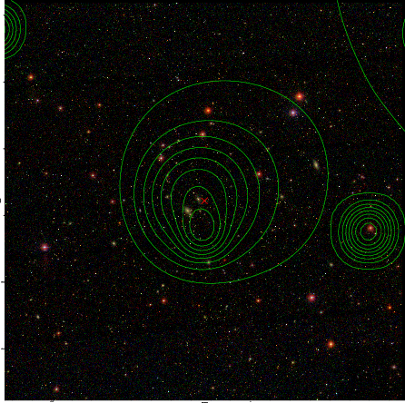  |

