

### 554

|Name|RAJ2000[deg]|DEJ2000[deg] |Ext[arcmin]| Ext,ml | z | z_src| C|GC(XSZ,Delta_z<0.01)| GC(OPT,Delta_z<0.01)|GC| R_sig[arcmin] | R500[arcmin] | R500[Mpc]| CRsig[c/s] | CR500[c/s] |L500[1E44 erg/s]|F500[1E-12 erg/s/cm^2]| M500[1E14 Msun]|Tx[keV]|Cnt_sig|Beta|Rc[arcmin]|Comment|Alias|
|---|---|---|---|---|---|------|---|--------|---------|----------|---|---|---|---|---|---|---|---|---|---|---|---|---|---|
|554| 214.450| 2.058| 4.12| 39.05| 0.0544(0.005)| z1, z_opt| S| -| N, W| C, F20, N, W| 8.800| 9.759| 0.619| 0.109(0.030)| 0.111(0.030)| 0.132(0.027)| 1.867(0.381)| 0.71(0.07)| 1.77(0.12)| 50.9| 0.838(-0.160+0.115)| 5.999(-1.347+1.155)| -| t206|

|[RASS image](../image/554/554_img.pdf)|[filtered image](../image/554/554_fil.pdf)|[Segment image](../image/554/554_seg.pdf)|
|-------------------|--------------------|-------------------|
| 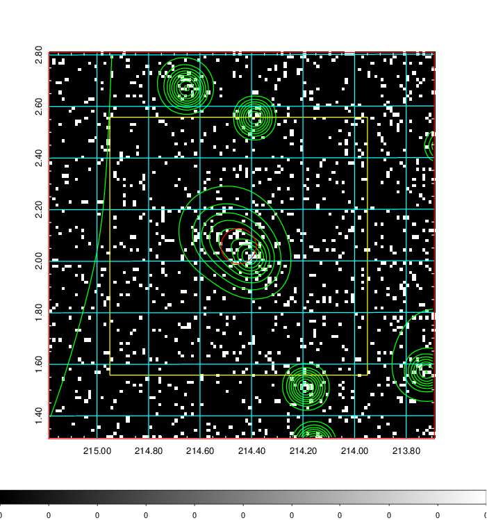  | 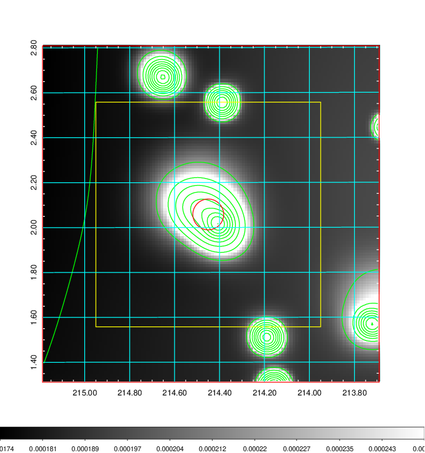   | 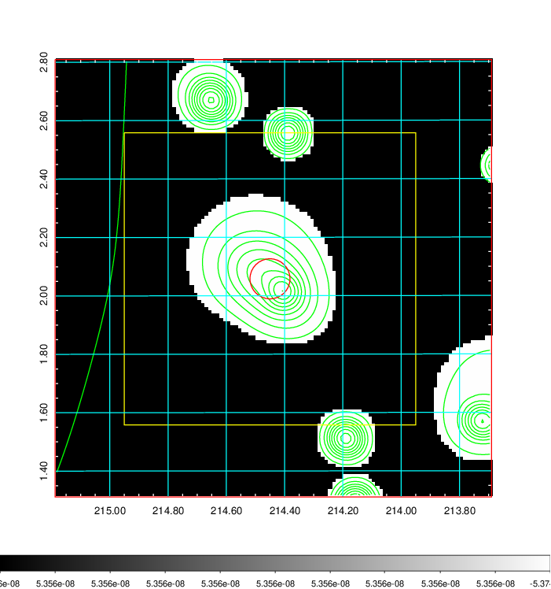  |

|[Exposure image](../image/554/554_mex.pdf)| [nH image](../image/554/554_nh.pdf)| [Planck image](../image/554/554_p.pdf)|
|-------------------|--------------------|-------------------|
|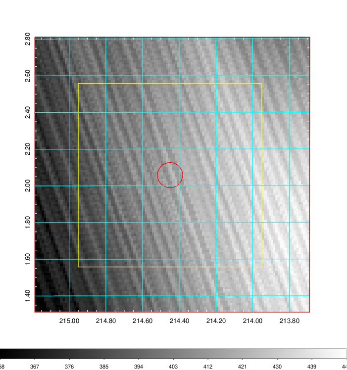   | 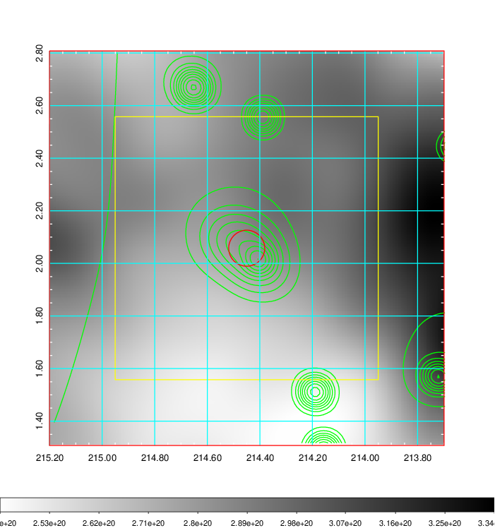    | 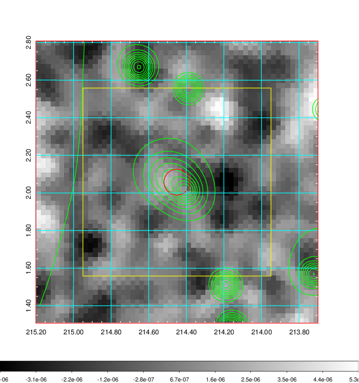 |

|[Redshift Histogram](../image/554/554_zg.pdf) | [DSS image(z1)](../image/554/554_dss_z1.pdf)      |  [DSS image(z2)](../image/554/554_dss_z2.pdf)    |
|-------------------|--------------------|-------------------|
|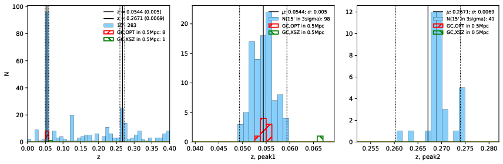 |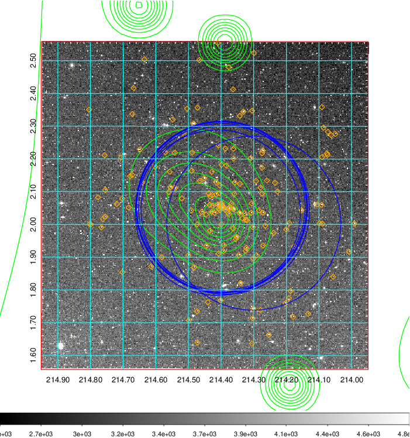  Blue circle for optical clusters;  Magenta circle for XSZ clusters;  all with r=1Mpc;  Only GC with Delta_z<0.01 are shown. | 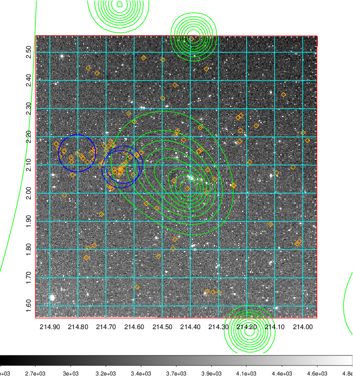 Blue circle for optical clusters;  Magenta circle for XSZ clusters;  all with r=1Mpc;  Only GC with Delta_z<0.01 are shown.  |

|[Previous-identified clusters](../image/554/554_gc.pdf) | [2MASS image](../image/554/554_2mass.pdf)      |[SDSS image](../image/554/554_sdss.pdf)   |
|-------------------|-------------------|-------------------|
|  Green, magenta, and blue circles  for optical, X-ray and SZ clusters  respectively, with redshift of clusters  labelled. The radius of circles  are 1Mpc.|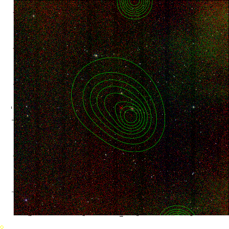  | 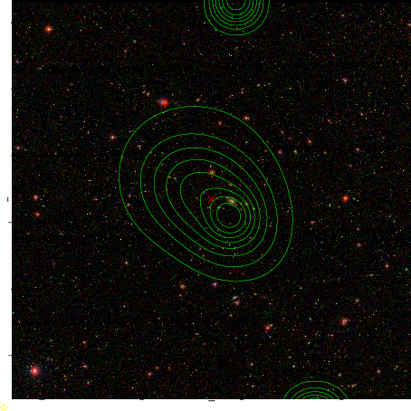  |

