

### 556

|Name|RAJ2000[deg]|DEJ2000[deg] |Ext[arcmin]| Ext,ml | z | z_src| C|GC(XSZ,Delta_z<0.01)| GC(OPT,Delta_z<0.01)|GC| R_sig[arcmin] | R500[arcmin] | R500[Mpc]| CRsig[c/s] | CR500[c/s] |L500[1E44 erg/s]|F500[1E-12 erg/s/cm^2]| M500[1E14 Msun]|Tx[keV]|Cnt_sig|Beta|Rc[arcmin]|Comment|Alias|
|---|---|---|---|---|---|------|---|--------|---------|----------|---|---|---|---|---|---|---|---|---|---|---|---|---|---|
|556| 214.622| -27.468| 7.45| 38.54| 0.0243(0.005)| z1, z_opt| S| -| A, N| A, N, W| 11.238| 18.839| 0.554| 0.279(0.076)| 0.314(0.085)| 0.061(0.011)| 4.550(0.840)| 0.49(0.05)| 1.40(0.08)| 43.6| 0.815(-0.180+0.132)| 13.218(-2.886+2.675)| -| t374|

|[RASS image](../image/556/556_img.pdf)|[filtered image](../image/556/556_fil.pdf)|[Segment image](../image/556/556_seg.pdf)|
|-------------------|--------------------|-------------------|
| 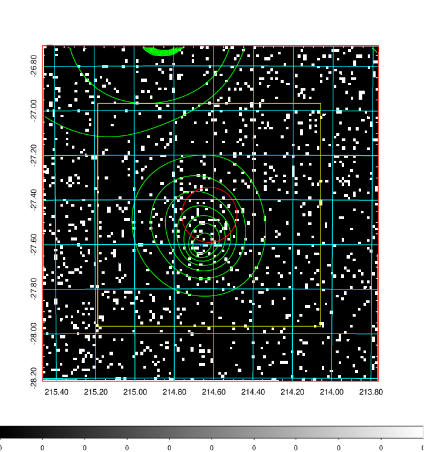  | 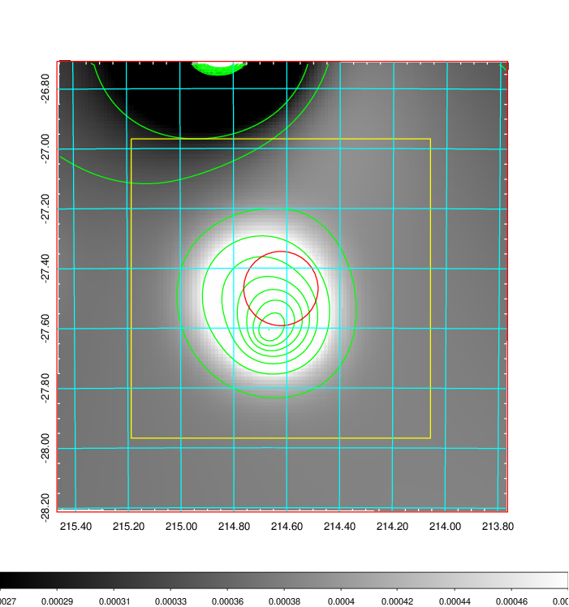   | 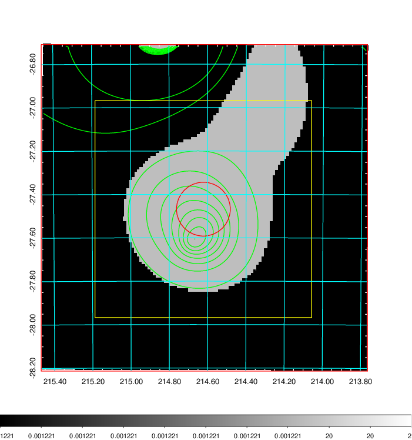  |

|[Exposure image](../image/556/556_mex.pdf)| [nH image](../image/556/556_nh.pdf)| [Planck image](../image/556/556_p.pdf)|
|-------------------|--------------------|-------------------|
|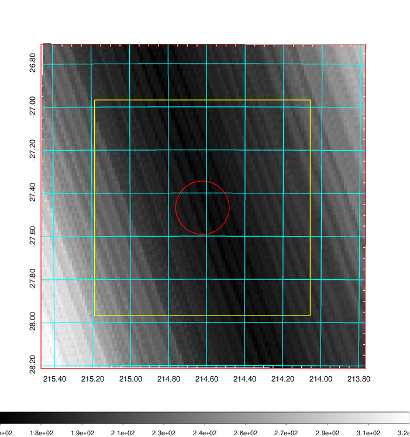   | 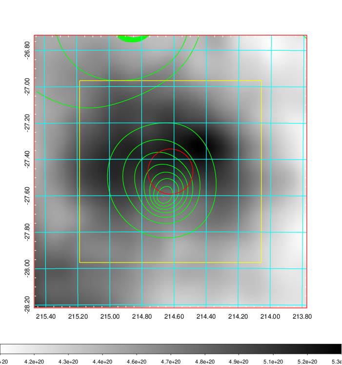    | 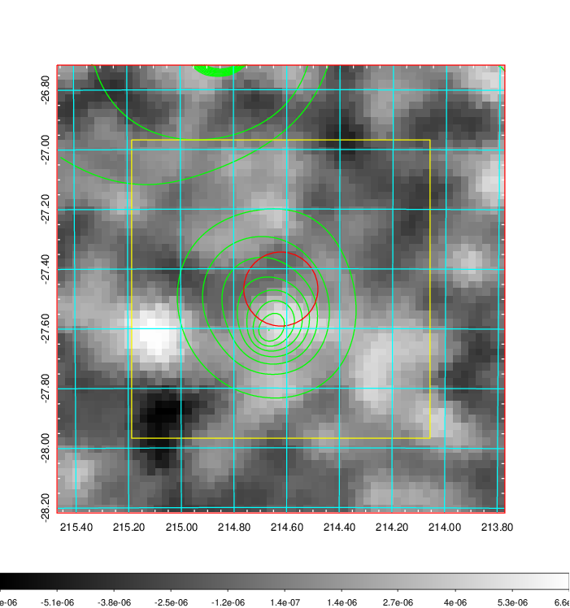 |

|[Redshift Histogram](../image/556/556_zg.pdf) | [DSS image(z1)](../image/556/556_dss_z1.pdf)      |  [DSS image(z2)](../image/556/556_dss_z2.pdf)    |
|-------------------|--------------------|-------------------|
|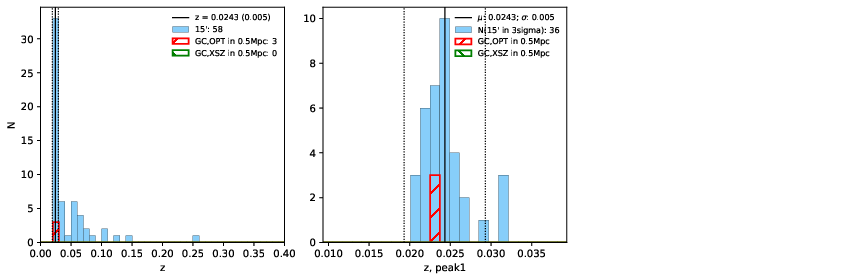 |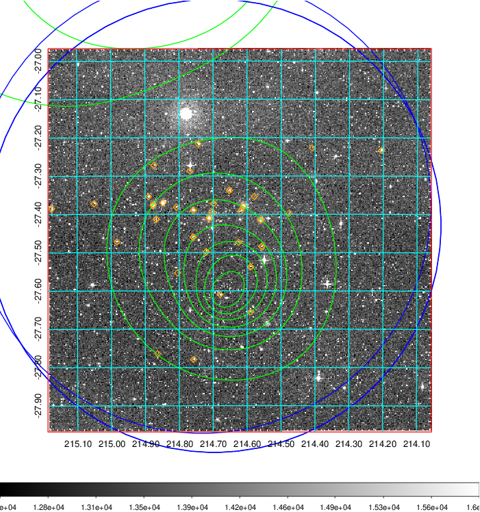  Blue circle for optical clusters;  Magenta circle for XSZ clusters;  all with r=1Mpc;  Only GC with Delta_z<0.01 are shown. | 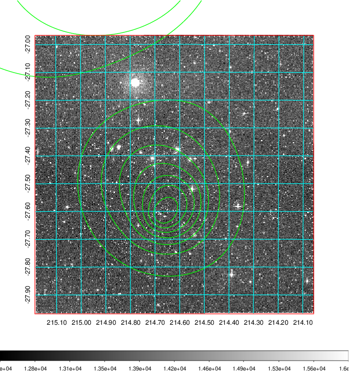 Blue circle for optical clusters;  Magenta circle for XSZ clusters;  all with r=1Mpc;  Only GC with Delta_z<0.01 are shown.  |

|[Previous-identified clusters](../image/556/556_gc.pdf) | [2MASS image](../image/556/556_2mass.pdf)      |
|-------------------|-------------------|
|  Green, magenta, and blue circles  for optical, X-ray and SZ clusters  respectively, with redshift of clusters  labelled. The radius of circles  are 1Mpc.|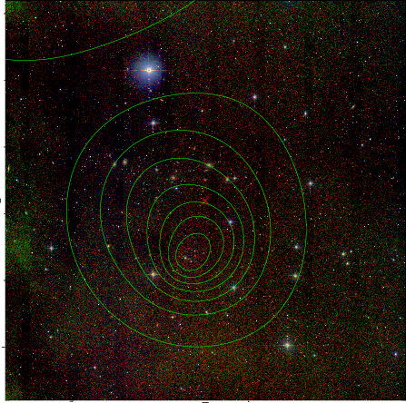  |

|[PS1 image](../image/556/556_ps1.pdf)            |
|-------------------|
| 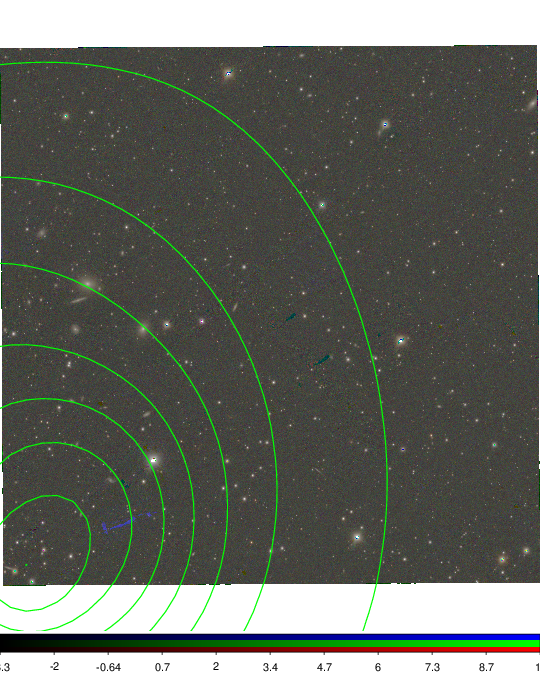  |
