

### 557

|Name|RAJ2000[deg]|DEJ2000[deg] |Ext[arcmin]| Ext,ml | z | z_src| C|GC(XSZ,Delta_z<0.01)| GC(OPT,Delta_z<0.01)|GC| R_sig[arcmin] | R500[arcmin] | R500[Mpc]| CRsig[c/s] | CR500[c/s] |L500[1E44 erg/s]|F500[1E-12 erg/s/cm^2]| M500[1E14 Msun]|Tx[keV]|Cnt_sig|Beta|Rc[arcmin]|Comment|Alias|
|---|---|---|---|---|---|------|---|--------|---------|----------|---|---|---|---|---|---|---|---|---|---|---|---|---|---|
|557| 215.422| 37.303| 1.22| 43.93| 0.1622(0.005)| z1, z_xsz| B| F20, PSZ2, SPI, Tar, XB| A, C, N, RM, W| A, C, F20, MCXC, N, PSZ2, SPI, Tar, W, XB| 14.650| 6.740| 1.128| 0.282(0.035)| 0.259(0.032)| 3.903(0.267)| 5.403(0.370)| 4.78(0.16)| 5.92(0.12)| 186.2| 0.534(-0.026+0.054)| 1.067(-0.353+0.527)| -| k064|

|[RASS image](../image/557/557_img.pdf)|[filtered image](../image/557/557_fil.pdf)|[Segment image](../image/557/557_seg.pdf)|
|-------------------|--------------------|-------------------|
| 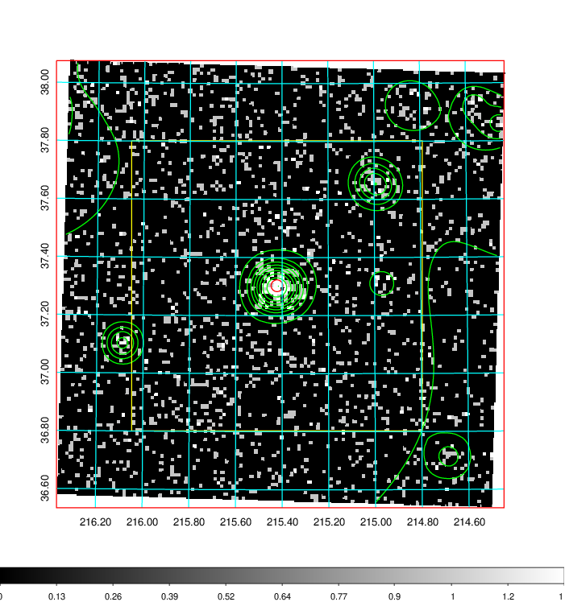  | 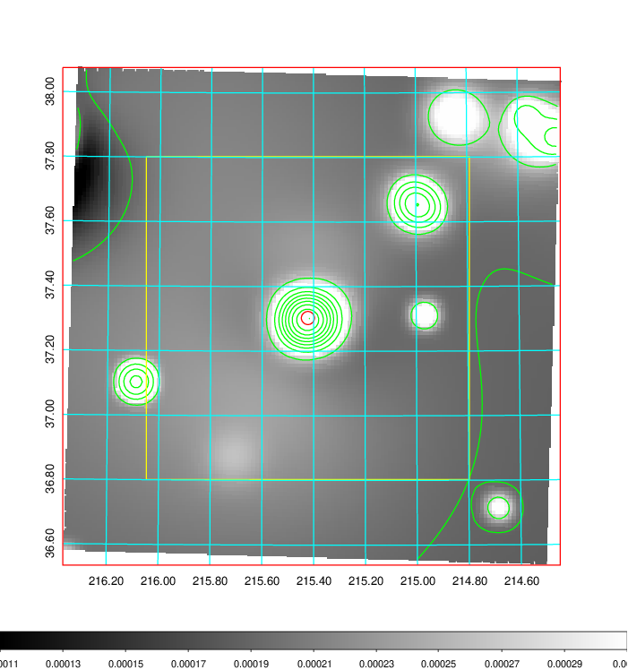   | 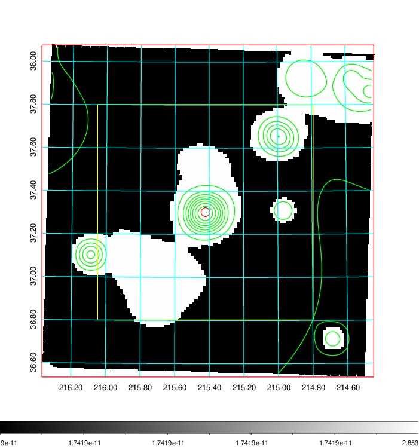  |

|[Exposure image](../image/557/557_mex.pdf)| [nH image](../image/557/557_nh.pdf)| [Planck image](../image/557/557_p.pdf)|
|-------------------|--------------------|-------------------|
|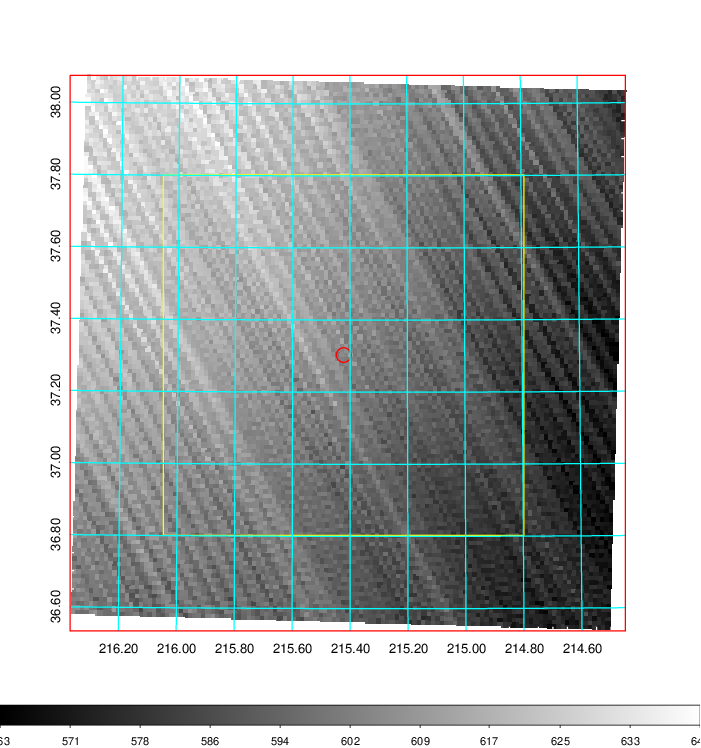   | 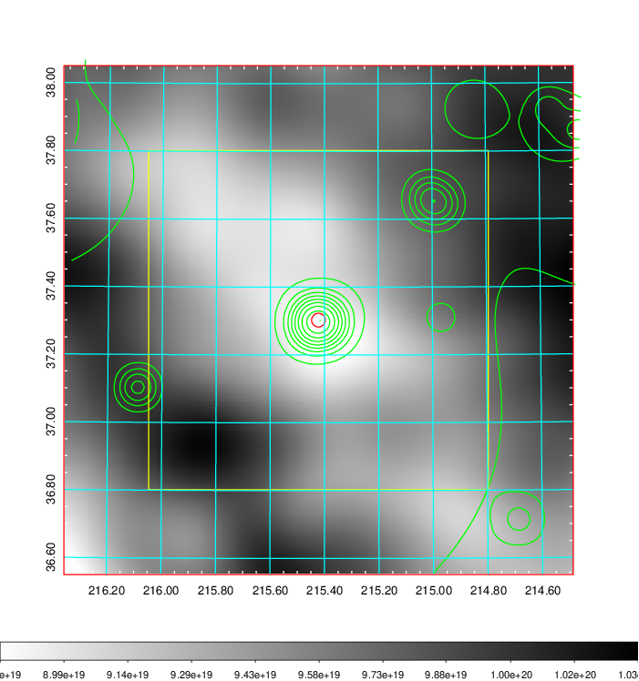    | 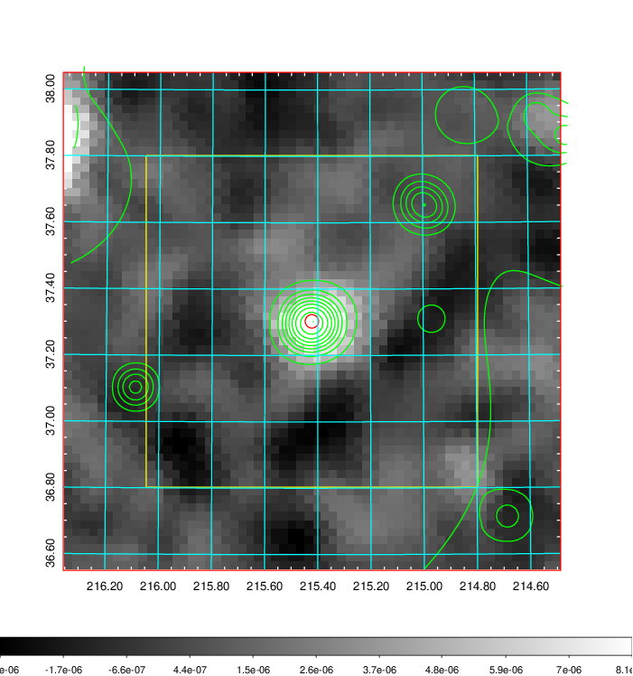 |

|[Redshift Histogram](../image/557/557_zg.pdf) | [DSS image(z1)](../image/557/557_dss_z1.pdf)      |  [DSS image(z2)](../image/557/557_dss_z2.pdf)    |
|-------------------|--------------------|-------------------|
|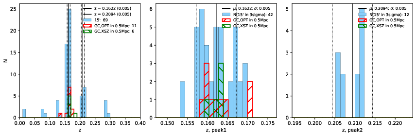 |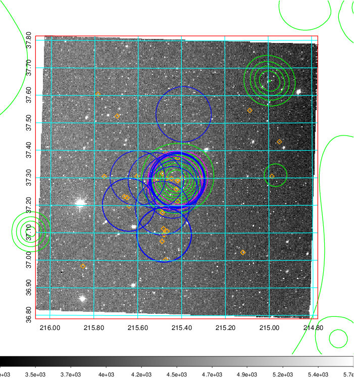  Blue circle for optical clusters;  Magenta circle for XSZ clusters;  all with r=1Mpc;  Only GC with Delta_z<0.01 are shown. | 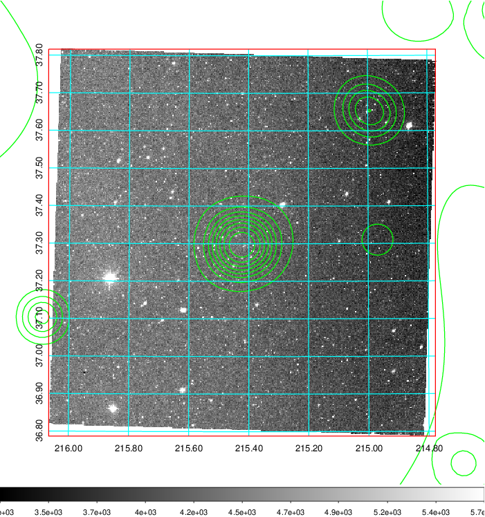 Blue circle for optical clusters;  Magenta circle for XSZ clusters;  all with r=1Mpc;  Only GC with Delta_z<0.01 are shown.  |

|[known Abell/XSZ clusters](../image/557/557_gc.pdf) | [2MASS image](../image/557/557_2mass.pdf)      |[SDSS image](../image/557/557_sdss.pdf)   |
|-------------------|-------------------|-------------------|
|  Magenta, blue and green circles  for optical, X-ray and SZ clusters  respectively, with redshift of clusters  labelled. The radius of circles  are 1Mpc.|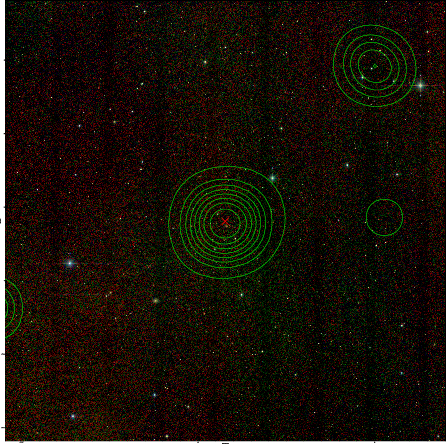  | 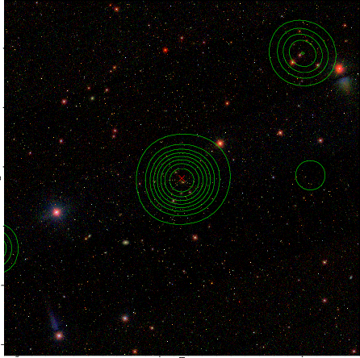  |

