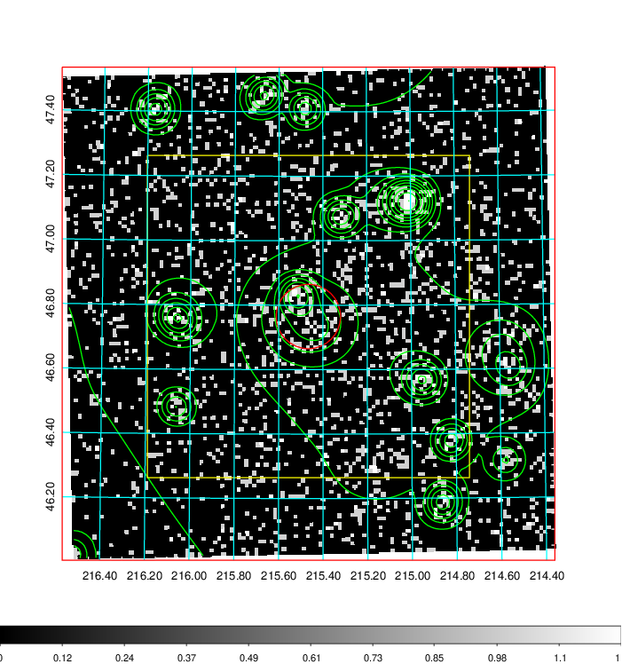
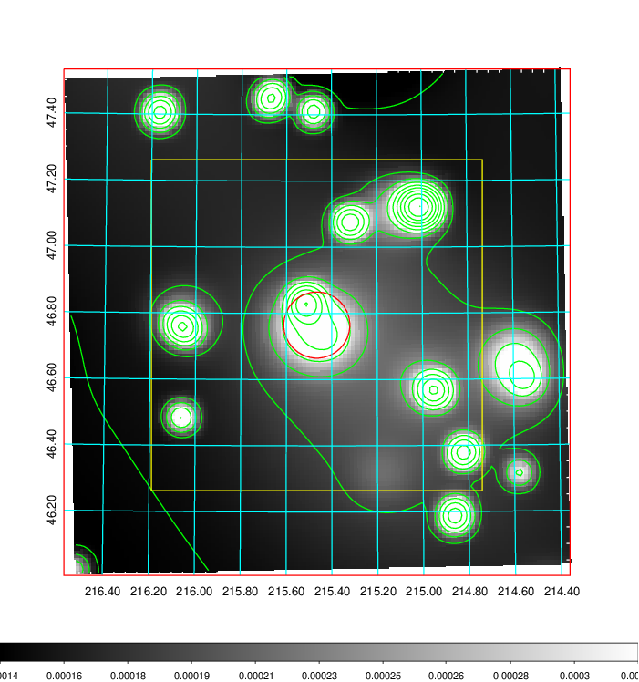
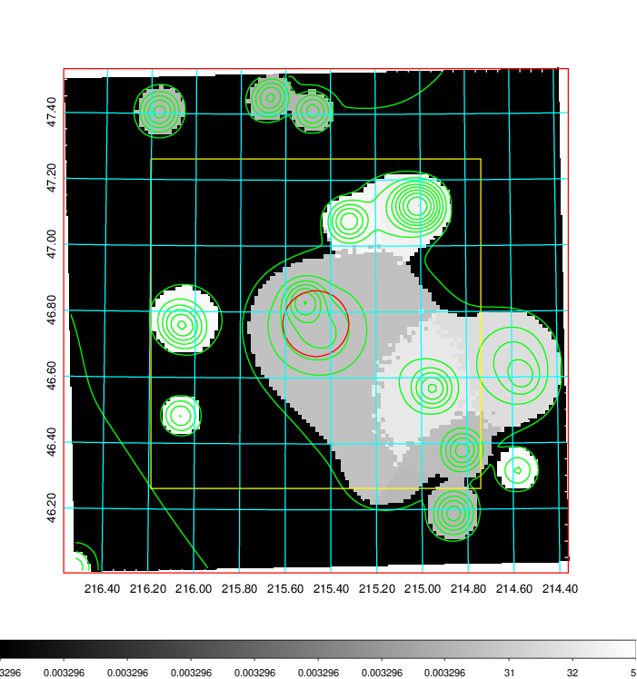
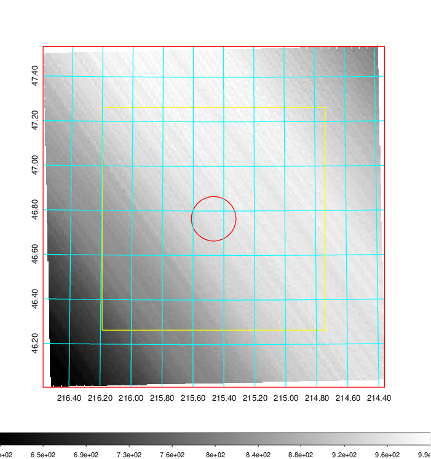
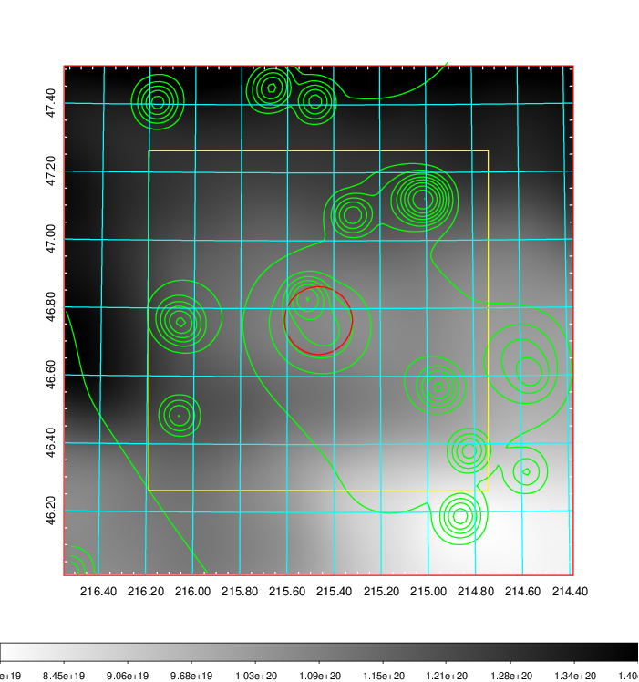
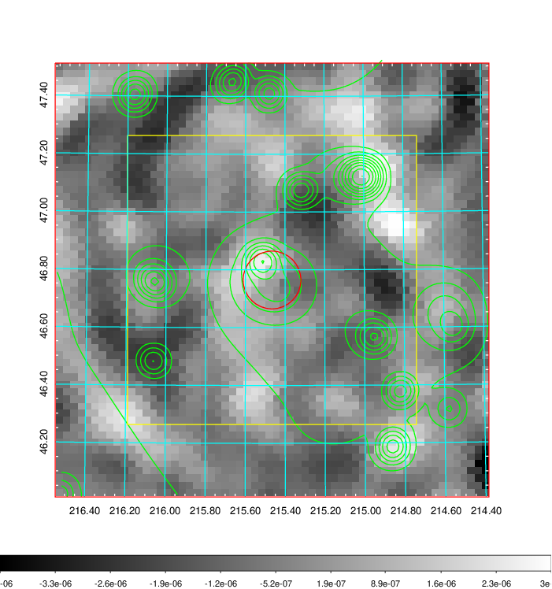
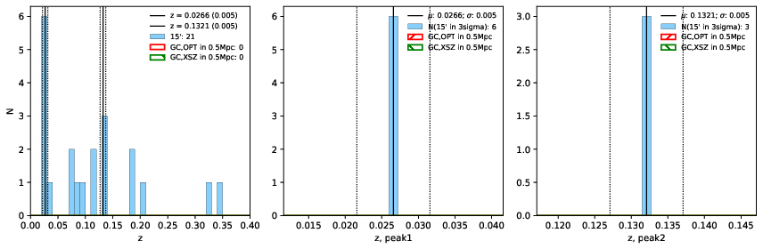
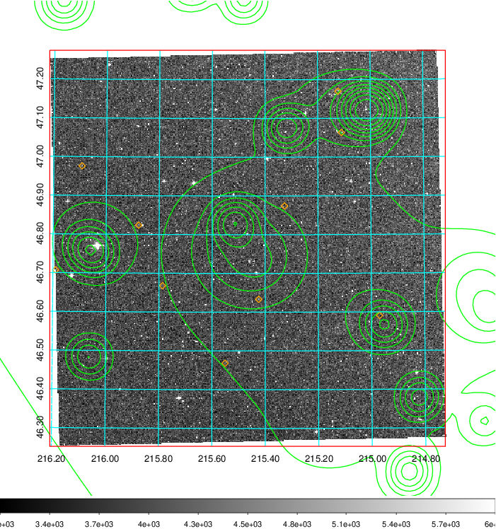
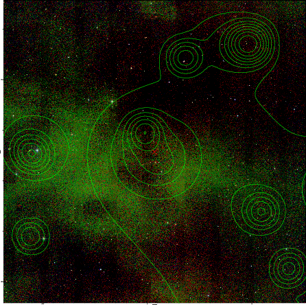
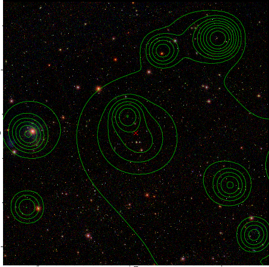

### 558

|Name|RAJ2000[deg]|DEJ2000[deg] |Ext[arcmin]| Ext,ml | z | z_src| C|GC(XSZ,Delta_z<0.01)| GC(OPT,Delta_z<0.01)|GC| R_sig[arcmin] | R500[arcmin] | R500[Mpc]| CRsig[c/s] | CR500[c/s] |L500[1E44 erg/s]|F500[1E-12 erg/s/cm^2]| M500[1E14 Msun]|Tx[keV]|Cnt_sig|Beta|Rc[arcmin]|Comment|Alias|
|---|---|---|---|---|---|------|---|--------|---------|----------|---|---|---|---|---|---|---|---|---|---|---|---|---|---|
|558| 215.466| 46.765| 5.99| 58.21| 0.0266(0.005)| z1,| G| -| -| C, N, W| 14.650| 14.139| 0.454| 0.112(0.023)| 0.112(0.023)| 0.026(0.005)| 1.593(0.304)| 0.27(0.03)| 0.97(0.06)| 101.6| 0.870(-0.144+0.093)| 8.296(-1.478+1.073)| -| t306|

|[RASS image](../image/558/558_img.pdf)|[filtered image](../image/558/558_fil.pdf)|[Segment image](../image/558/558_seg.pdf)|
|-------------------|--------------------|-------------------|
|   |    |   |

|[Exposure image](../image/558/558_mex.pdf)| [nH image](../image/558/558_nh.pdf)| [Planck image](../image/558/558_p.pdf)|
|-------------------|--------------------|-------------------|
|   |     |  |

|[Redshift Histogram](../image/558/558_zg.pdf) | [DSS image(z1)](../image/558/558_dss_z1.pdf)      |  [DSS image(z2)](../image/558/558_dss_z2.pdf)    |
|-------------------|--------------------|-------------------|
| |  Blue circle for optical clusters;  Magenta circle for XSZ clusters;  all with r=1Mpc;  Only GC with Delta_z<0.01 are shown. |  Blue circle for optical clusters;  Magenta circle for XSZ clusters;  all with r=1Mpc;  Only GC with Delta_z<0.01 are shown.  |

|[known Abell/XSZ clusters](../image/558/558_gc.pdf) | [2MASS image](../image/558/558_2mass.pdf)      |[SDSS image](../image/558/558_sdss.pdf)   |
|-------------------|-------------------|-------------------|
|  Magenta, blue and green circles  for optical, X-ray and SZ clusters  respectively, with redshift of clusters  labelled. The radius of circles  are 1Mpc.|  |   |

