

### 559

|Name|RAJ2000[deg]|DEJ2000[deg] |Ext[arcmin]| Ext,ml | z | z_src| C|GC(XSZ,Delta_z<0.01)| GC(OPT,Delta_z<0.01)|GC| R_sig[arcmin] | R500[arcmin] | R500[Mpc]| CRsig[c/s] | CR500[c/s] |L500[1E44 erg/s]|F500[1E-12 erg/s/cm^2]| M500[1E14 Msun]|Tx[keV]|Cnt_sig|Beta|Rc[arcmin]|Comment|Alias|
|---|---|---|---|---|---|------|---|--------|---------|----------|---|---|---|---|---|---|---|---|---|---|---|---|---|---|
|559| 215.528| 48.501| 3.88| 169.72| 0.0714(0.005)| z1, z_xsz| B| F20, L03, PSZ2, SPI, Tar| A, N, W| A, C, F20, L03, N, PSZ2, SPI, Tar, W| 16.600| 10.305| 0.842| 0.307(0.028)| 0.289(0.026)| 0.685(0.045)| 5.513(0.359)| 1.81(0.06)| 3.16(0.07)| 248.4| 0.698(-0.103+0.145)| 6.048(-1.279+1.557)| -| k468|

|[RASS image](../image/559/559_img.pdf)|[filtered image](../image/559/559_fil.pdf)|[Segment image](../image/559/559_seg.pdf)|
|-------------------|--------------------|-------------------|
| 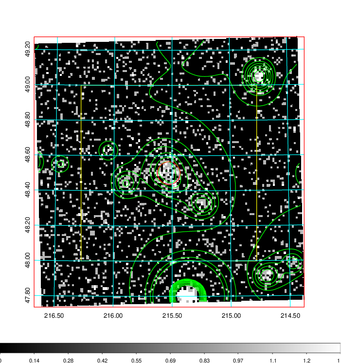  | 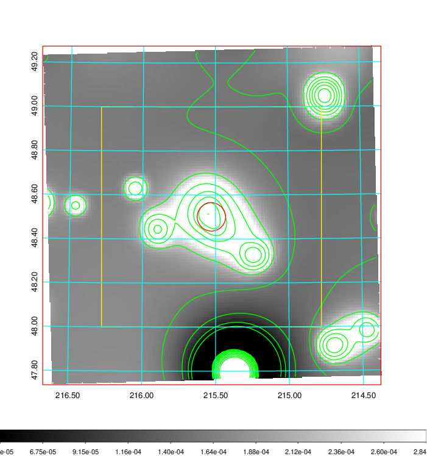   | 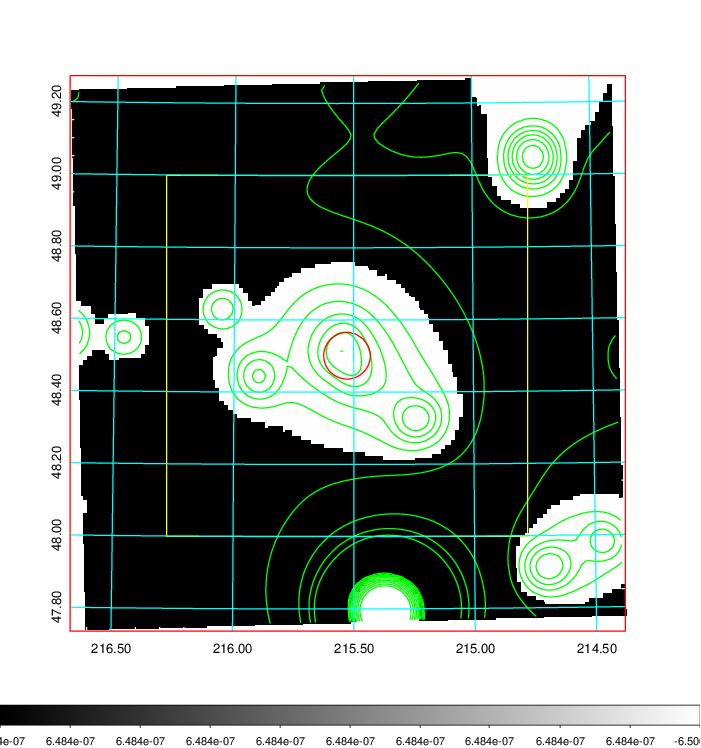  |

|[Exposure image](../image/559/559_mex.pdf)| [nH image](../image/559/559_nh.pdf)| [Planck image](../image/559/559_p.pdf)|
|-------------------|--------------------|-------------------|
|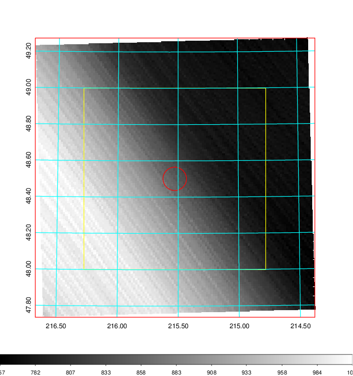   | 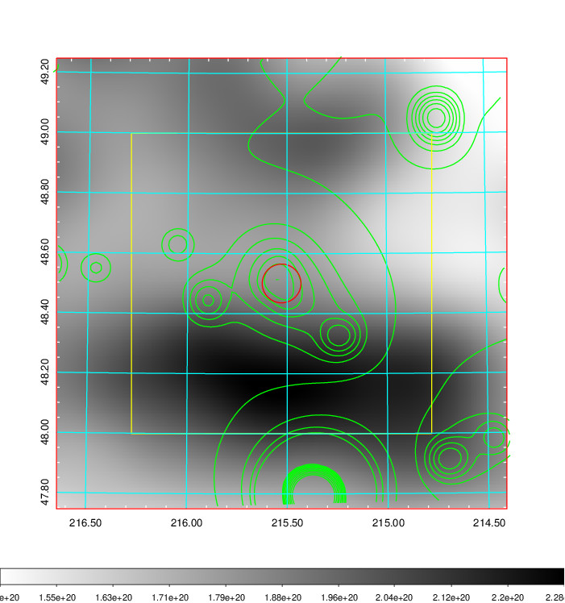    | 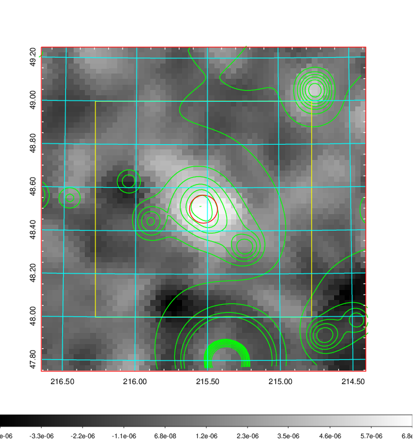 |

|[Redshift Histogram](../image/559/559_zg.pdf) | [DSS image(z1)](../image/559/559_dss_z1.pdf)      |  [DSS image(z2)](../image/559/559_dss_z2.pdf)    |
|-------------------|--------------------|-------------------|
|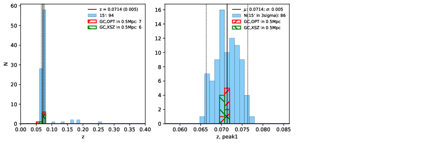 |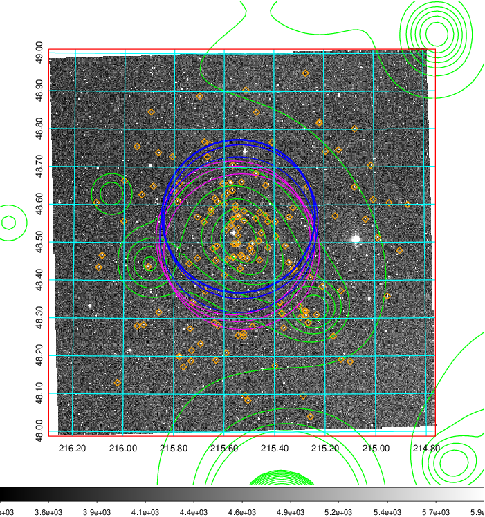  Blue circle for optical clusters;  Magenta circle for XSZ clusters;  all with r=1Mpc;  Only GC with Delta_z<0.01 are shown. | 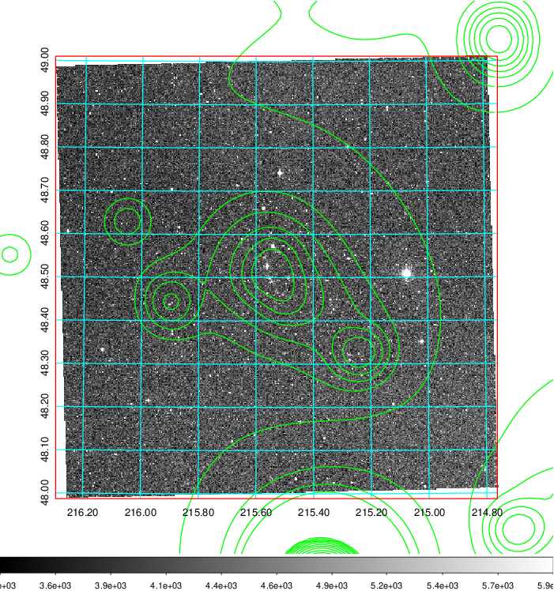 Blue circle for optical clusters;  Magenta circle for XSZ clusters;  all with r=1Mpc;  Only GC with Delta_z<0.01 are shown.  |

|[known Abell/XSZ clusters](../image/559/559_gc.pdf) | [2MASS image](../image/559/559_2mass.pdf)      |[SDSS image](../image/559/559_sdss.pdf)   |
|-------------------|-------------------|-------------------|
|  Magenta, blue and green circles  for optical, X-ray and SZ clusters  respectively, with redshift of clusters  labelled. The radius of circles  are 1Mpc.|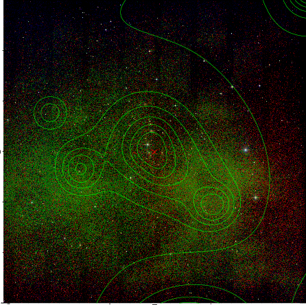  | 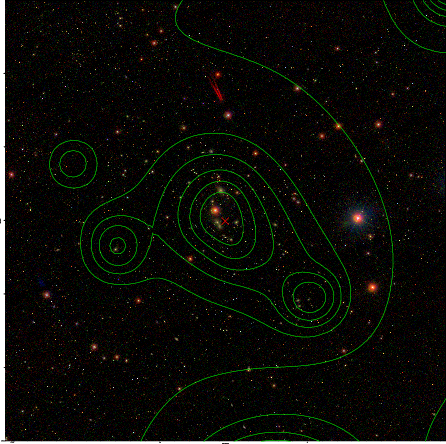  |

