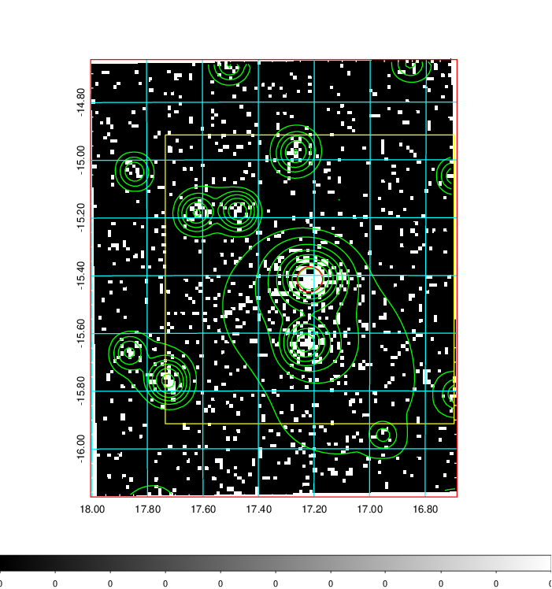
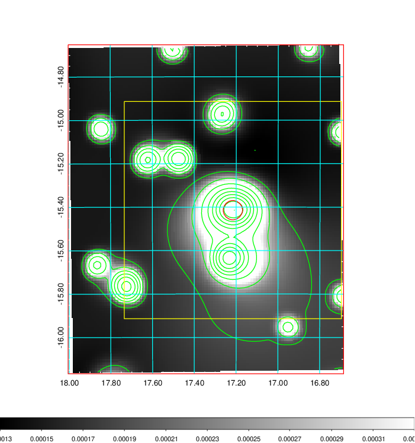
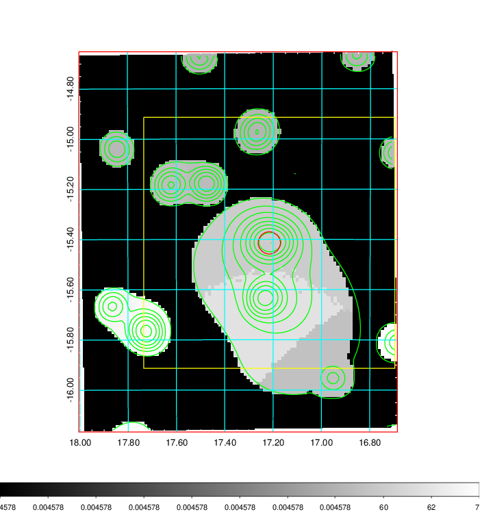
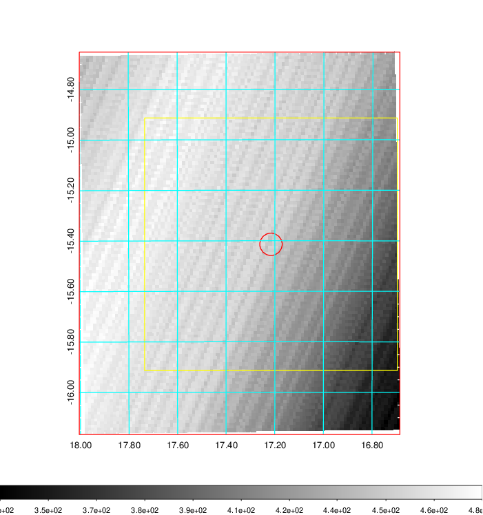
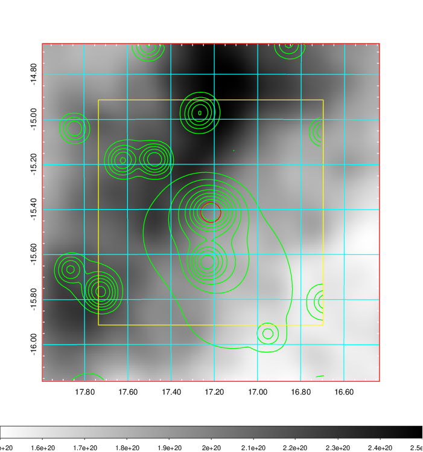
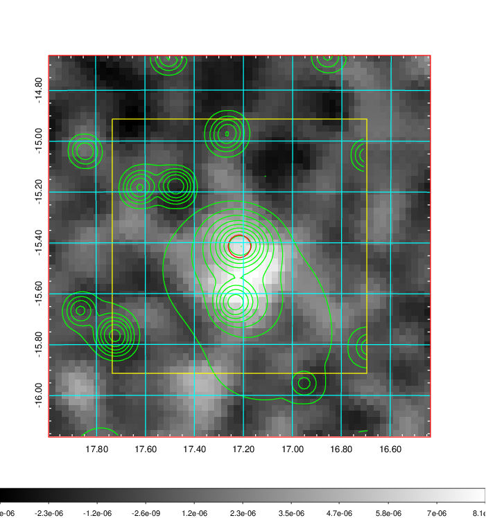
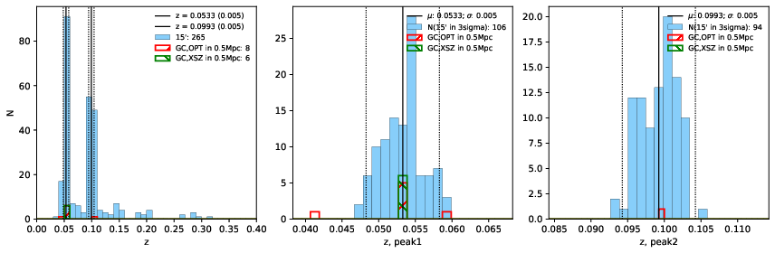
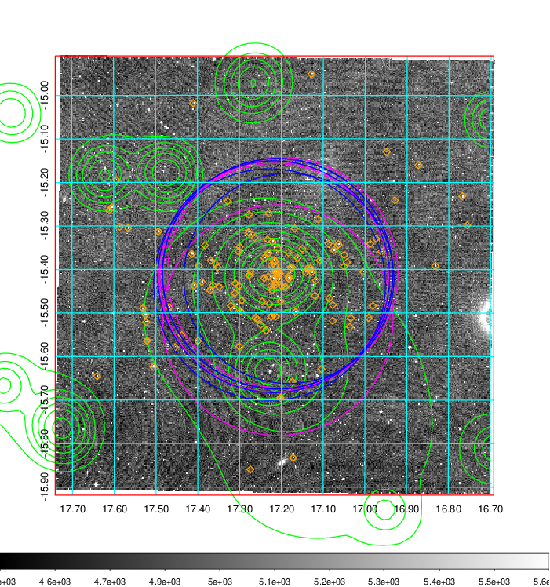
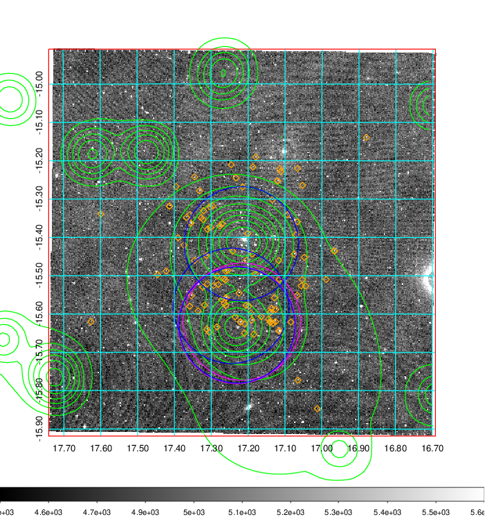
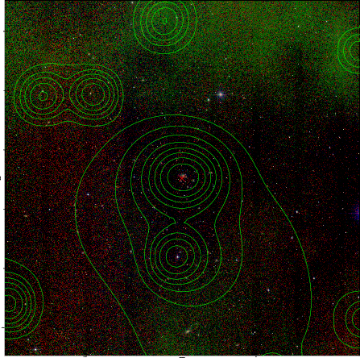

### 56

|Name|RAJ2000[deg]|DEJ2000[deg] |Ext[arcmin]| Ext,ml | z | z_src| C|GC(XSZ,Delta_z<0.01)| GC(OPT,Delta_z<0.01)|GC| R_sig[arcmin] | R500[arcmin] | R500[Mpc]| CRsig[c/s] | CR500[c/s] |L500[1E44 erg/s]|F500[1E-12 erg/s/cm^2]| M500[1E14 Msun]|Tx[keV]|Cnt_sig|Beta|Rc[arcmin]|Comment|Alias|
|---|---|---|---|---|---|------|---|--------|---------|----------|---|---|---|---|---|---|---|---|---|---|---|---|---|---|
|56| 17.216| -15.414| 2.66| 160.16| 0.0533(0.005)| z1, z_xsz| B| L03, MCXC, PSZ2, Tar, XB| A, N, W| A, L03, MCXC, N, PSZ2, Tar, W, XB| 32.106| 14.724| 0.917| 0.829(0.067)| 0.761(0.062)| 0.987(0.061)| 14.623(0.900)| 2.31(0.07)| 3.65(0.07)| 390.0| 0.503(-0.002+0.005)| 2.634(-0.138+0.156)| -| k331|

|[RASS image](../image/56/56_img.pdf)|[filtered image](../image/56/56_fil.pdf)|[Segment image](../image/56/56_seg.pdf)|
|-------------------|--------------------|-------------------|
|   |    |   |

|[Exposure image](../image/56/56_mex.pdf)| [nH image](../image/56/56_nh.pdf)| [Planck image](../image/56/56_p.pdf)|
|-------------------|--------------------|-------------------|
|   |     |  |

|[Redshift Histogram](../image/56/56_zg.pdf) | [DSS image(z1)](../image/56/56_dss_z1.pdf)      |  [DSS image(z2)](../image/56/56_dss_z2.pdf)    |
|-------------------|--------------------|-------------------|
| |  Blue circle for optical clusters;  Magenta circle for XSZ clusters;  all with r=1Mpc;  Only GC with Delta_z<0.01 are shown. |  Blue circle for optical clusters;  Magenta circle for XSZ clusters;  all with r=1Mpc;  Only GC with Delta_z<0.01 are shown.  |

|[known Abell/XSZ clusters](../image/56/56_gc.pdf) | [2MASS image](../image/56/56_2mass.pdf)      |
|-------------------|-------------------|
|  Magenta, blue and green circles  for optical, X-ray and SZ clusters  respectively, with redshift of clusters  labelled. The radius of circles  are 1Mpc.|  |

|[DES image](../image/56/56_des.pdf)   |[ATLAS image](../image/56/56_s.pdf)        |
|-------------------|-------------------|
|   |   |
