

### 562

|Name|RAJ2000[deg]|DEJ2000[deg] |Ext[arcmin]| Ext,ml | z | z_src| C|GC(XSZ,Delta_z<0.01)| GC(OPT,Delta_z<0.01)|GC| R_sig[arcmin] | R500[arcmin] | R500[Mpc]| CRsig[c/s] | CR500[c/s] |L500[1E44 erg/s]|F500[1E-12 erg/s/cm^2]| M500[1E14 Msun]|Tx[keV]|Cnt_sig|Beta|Rc[arcmin]|Comment|Alias|
|---|---|---|---|---|---|------|---|--------|---------|----------|---|---|---|---|---|---|---|---|---|---|---|---|---|---|
|562| 216.506| 37.833| 0.85| 103.30| 0.1666(0.005)| z1, z_xsz| B| F20, MCXC, PSZ2, SPI, Tar, XB| A, N, RM, W| A, C, F20, MCXC, N, PSZ2, SPI, Tar, W, XB, XCS| 8.312| 8.096| 1.385| 0.653(0.041)| 0.651(0.041)| 10.359(0.250)| 13.518(0.326)| 8.89(0.10)| 8.70(0.06)| 414.7| 0.865(-0.085+0.084)| 2.534(-0.414+0.362)| -| k018|

|[RASS image](../image/562/562_img.pdf)|[filtered image](../image/562/562_fil.pdf)|[Segment image](../image/562/562_seg.pdf)|
|-------------------|--------------------|-------------------|
| 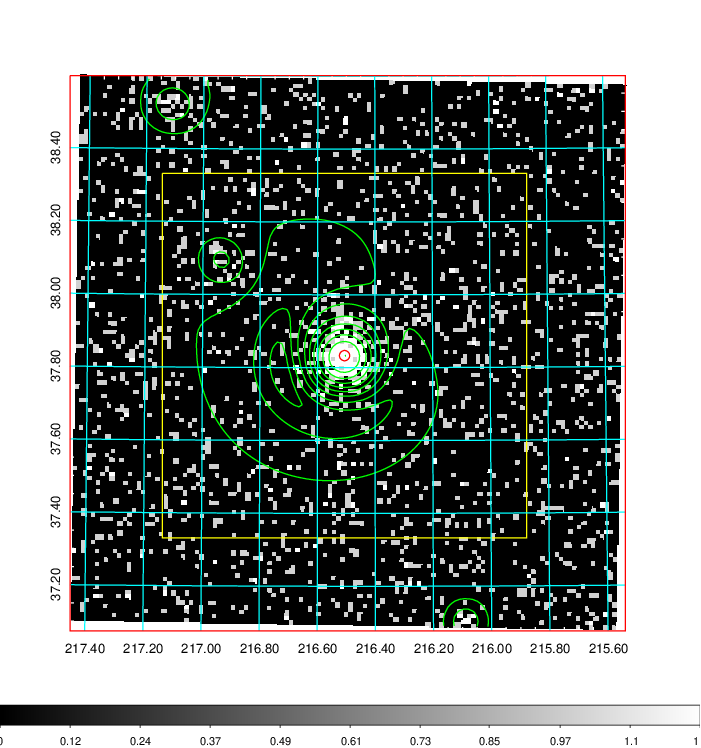  | 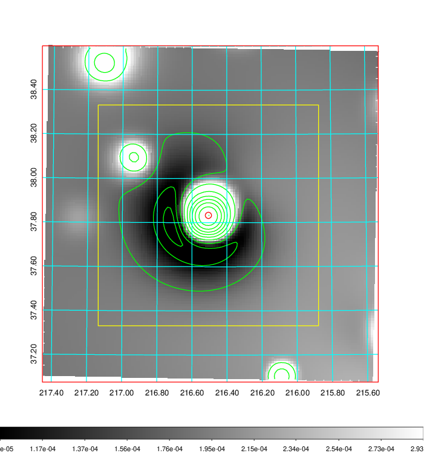   | 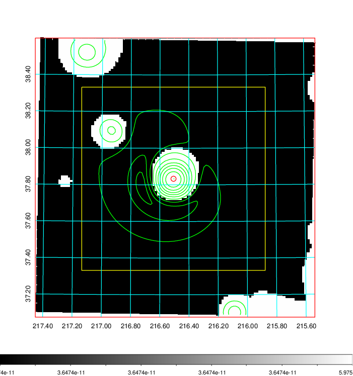  |

|[Exposure image](../image/562/562_mex.pdf)| [nH image](../image/562/562_nh.pdf)| [Planck image](../image/562/562_p.pdf)|
|-------------------|--------------------|-------------------|
|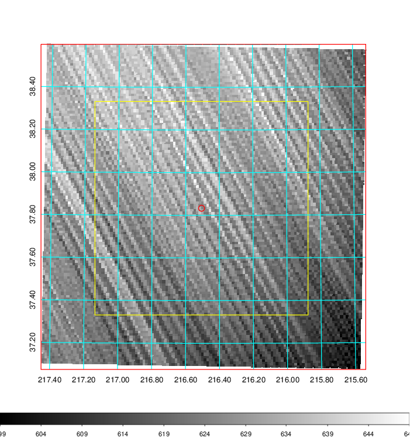   | 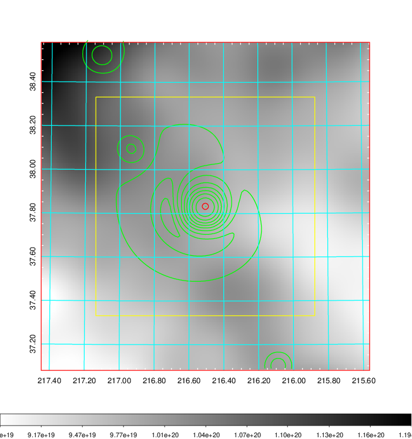    | 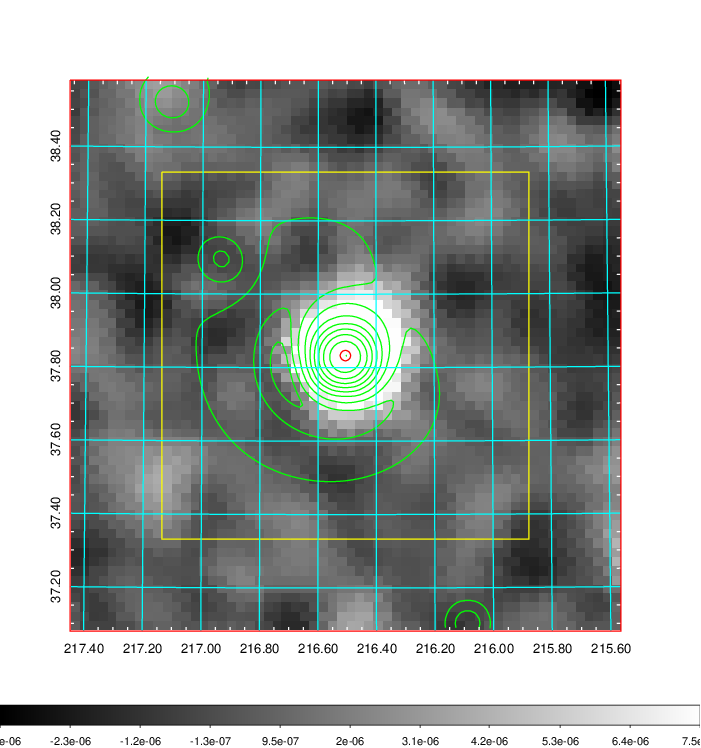 |

|[Redshift Histogram](../image/562/562_zg.pdf) | [DSS image(z1)](../image/562/562_dss_z1.pdf)      |  [DSS image(z2)](../image/562/562_dss_z2.pdf)    |
|-------------------|--------------------|-------------------|
|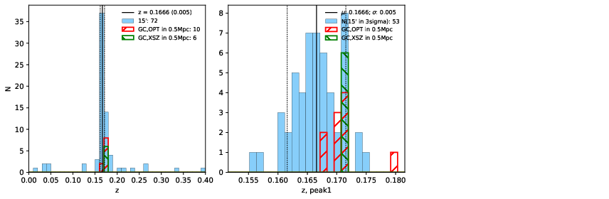 |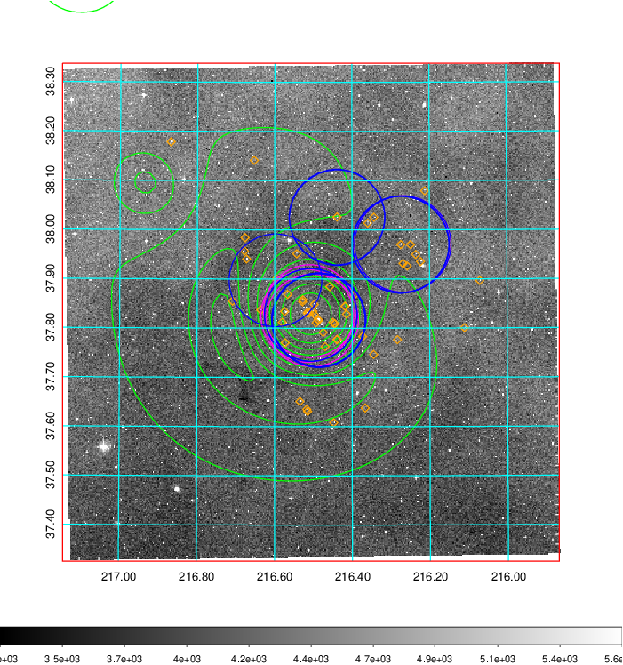  Blue circle for optical clusters;  Magenta circle for XSZ clusters;  all with r=1Mpc;  Only GC with Delta_z<0.01 are shown. | 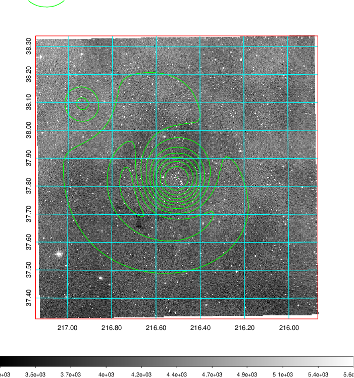 Blue circle for optical clusters;  Magenta circle for XSZ clusters;  all with r=1Mpc;  Only GC with Delta_z<0.01 are shown.  |

|[Previous-identified clusters](../image/562/562_gc.pdf) | [2MASS image](../image/562/562_2mass.pdf)      |
|-------------------|-------------------|
|  Green, magenta, and blue circles  for optical, X-ray and SZ clusters  respectively, with redshift of clusters  labelled. The radius of circles  are 1Mpc.|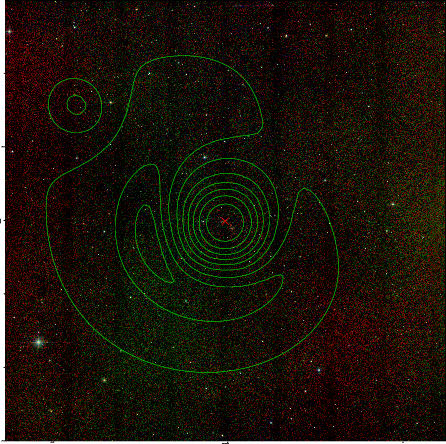  |

|[PS1 image](../image/562/562_ps1.pdf)            |
|-------------------|
| 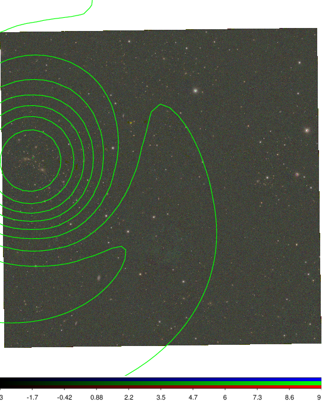  |
