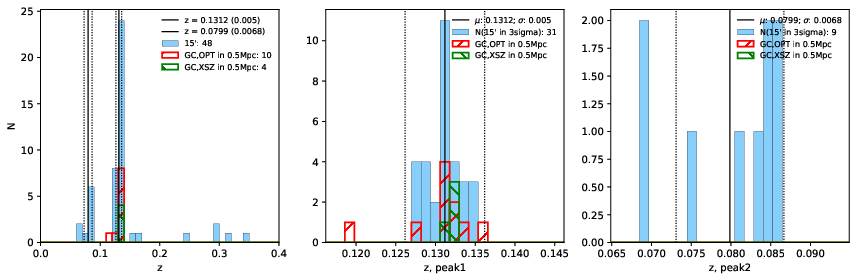

### 564

|Name|RAJ2000[deg]|DEJ2000[deg] |Ext[arcmin]| Ext,ml | z | z_src| C|GC(XSZ,Delta_z<0.01)| GC(OPT,Delta_z<0.01)|GC| R_sig[arcmin] | R500[arcmin] | R500[Mpc]| CRsig[c/s] | CR500[c/s] |L500[1E44 erg/s]|F500[1E-12 erg/s/cm^2]| M500[1E14 Msun]|Tx[keV]|Cnt_sig|Beta|Rc[arcmin]|Comment|Alias|
|---|---|---|---|---|---|------|---|--------|---------|----------|---|---|---|---|---|---|---|---|---|---|---|---|---|---|
|564| 216.850| 55.775| 2.63| 75.85| 0.1312(0.005)| z1, z_xsz| B| F20, PSZ2, SPI, Tar| A, C, N, RM, W| A, C, F20, N, PSZ2, SPI, Tar, W| 8.312| 6.839| 0.958| 0.178(0.026)| 0.173(0.025)| 1.606(0.154)| 3.532(0.338)| 2.84(0.13)| 4.25(0.13)| 117.9| 0.938(-0.083+0.045)| 5.406(-0.553+0.424)| -| k325|

|[RASS image](../image/564/564_img.pdf)|[filtered image](../image/564/564_fil.pdf)|[Segment image](../image/564/564_seg.pdf)|
|-------------------|--------------------|-------------------|
|   |    |   |

|[Exposure image](../image/564/564_mex.pdf)| [nH image](../image/564/564_nh.pdf)| [Planck image](../image/564/564_p.pdf)|
|-------------------|--------------------|-------------------|
|   |     |  |

|[Redshift Histogram](../image/564/564_zg.pdf) | [DSS image(z1)](../image/564/564_dss_z1.pdf)      |  [DSS image(z2)](../image/564/564_dss_z2.pdf)    |
|-------------------|--------------------|-------------------|
| |  Blue circle for optical clusters;  Magenta circle for XSZ clusters;  all with r=1Mpc;  Only GC with Delta_z<0.01 are shown. |  Blue circle for optical clusters;  Magenta circle for XSZ clusters;  all with r=1Mpc;  Only GC with Delta_z<0.01 are shown.  |

|[Previous-identified clusters](../image/564/564_gc.pdf) | [2MASS image](../image/564/564_2mass.pdf)      |[SDSS image](../image/564/564_sdss.pdf)   |
|-------------------|-------------------|-------------------|
|  Green, magenta, and blue circles  for optical, X-ray and SZ clusters  respectively, with redshift of clusters  labelled. The radius of circles  are 1Mpc.|  |   |

