

### 567

|Name|RAJ2000[deg]|DEJ2000[deg] |Ext[arcmin]| Ext,ml | z | z_src| C|GC(XSZ,Delta_z<0.01)| GC(OPT,Delta_z<0.01)|GC| R_sig[arcmin] | R500[arcmin] | R500[Mpc]| CRsig[c/s] | CR500[c/s] |L500[1E44 erg/s]|F500[1E-12 erg/s/cm^2]| M500[1E14 Msun]|Tx[keV]|Cnt_sig|Beta|Rc[arcmin]|Comment|Alias|
|---|---|---|---|---|---|------|---|--------|---------|----------|---|---|---|---|---|---|---|---|---|---|---|---|---|---|
|567| 218.156| 31.649| 2.23| 50.80| 0.1313(0.005)| z1, z_xsz| B| MCXC, Tar, XB| A, N, W| A, C, F20, MCXC, N, PSZ2, Tar, W, XB| 27.662| 7.258| 1.018| 0.258(0.058)| 0.230(0.051)| 2.145(0.300)| 4.711(0.660)| 3.40(0.23)| 4.75(0.21)| 183.7| 0.630(-0.054+0.077)| 2.510(-0.593+0.741)| -| k258|

|[RASS image](../image/567/567_img.pdf)|[filtered image](../image/567/567_fil.pdf)|[Segment image](../image/567/567_seg.pdf)|
|-------------------|--------------------|-------------------|
| 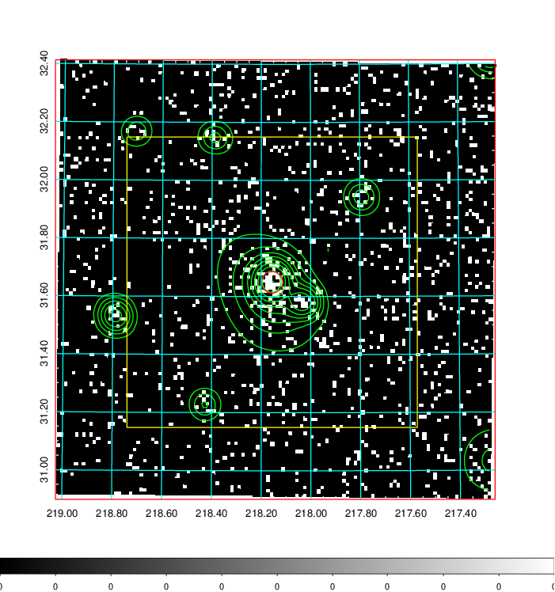  | 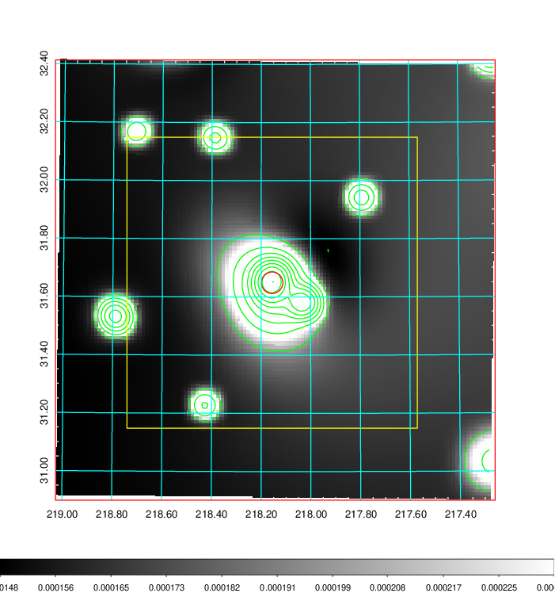   | 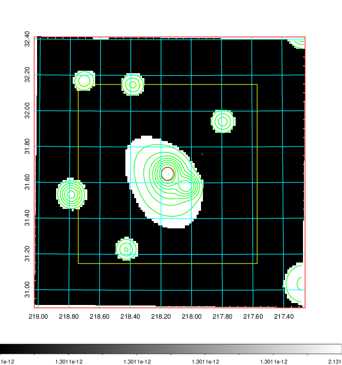  |

|[Exposure image](../image/567/567_mex.pdf)| [nH image](../image/567/567_nh.pdf)| [Planck image](../image/567/567_p.pdf)|
|-------------------|--------------------|-------------------|
|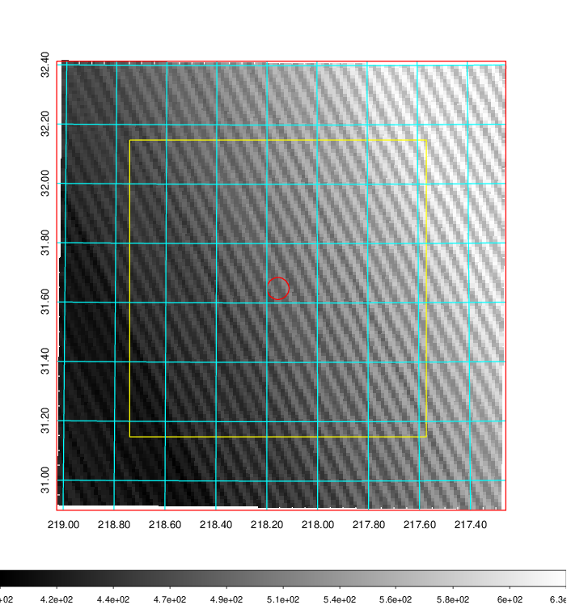   | 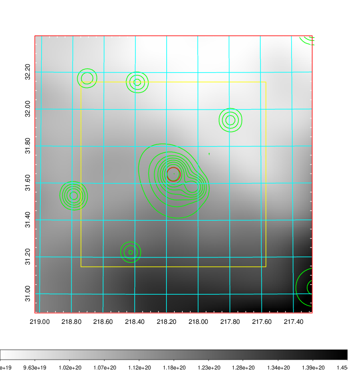    | 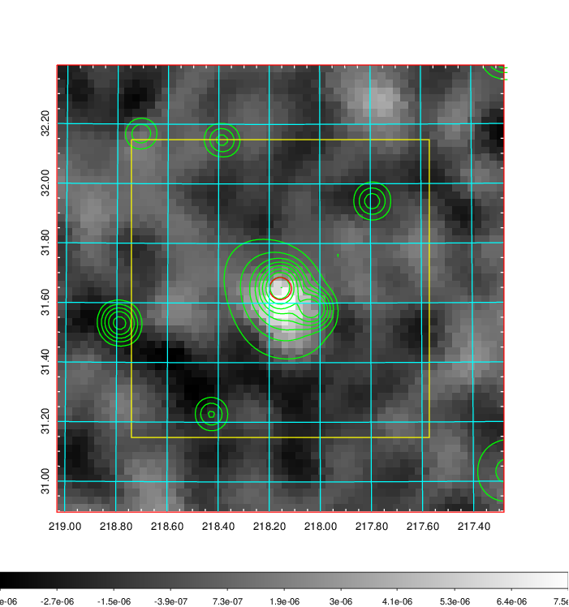 |

|[Redshift Histogram](../image/567/567_zg.pdf) | [DSS image(z1)](../image/567/567_dss_z1.pdf)      |  [DSS image(z2)](../image/567/567_dss_z2.pdf)    |
|-------------------|--------------------|-------------------|
|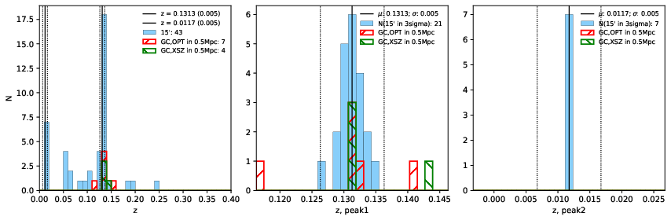 |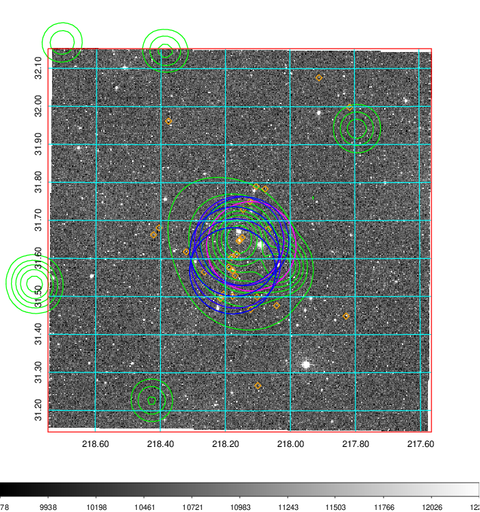  Blue circle for optical clusters;  Magenta circle for XSZ clusters;  all with r=1Mpc;  Only GC with Delta_z<0.01 are shown. | 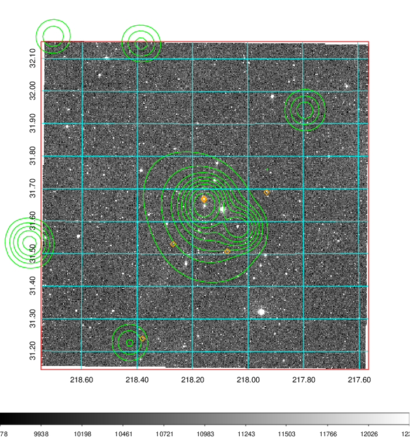 Blue circle for optical clusters;  Magenta circle for XSZ clusters;  all with r=1Mpc;  Only GC with Delta_z<0.01 are shown.  |

|[known Abell/XSZ clusters](../image/567/567_gc.pdf) | [2MASS image](../image/567/567_2mass.pdf)      |[SDSS image](../image/567/567_sdss.pdf)   |
|-------------------|-------------------|-------------------|
|  Magenta, blue and green circles  for optical, X-ray and SZ clusters  respectively, with redshift of clusters  labelled. The radius of circles  are 1Mpc.|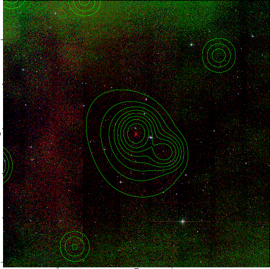  | 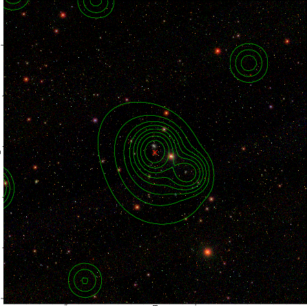  |

