

### 569

|Name|RAJ2000[deg]|DEJ2000[deg] |Ext[arcmin]| Ext,ml | z | z_src| C|GC(XSZ,Delta_z<0.01)| GC(OPT,Delta_z<0.01)|GC| R_sig[arcmin] | R500[arcmin] | R500[Mpc]| CRsig[c/s] | CR500[c/s] |L500[1E44 erg/s]|F500[1E-12 erg/s/cm^2]| M500[1E14 Msun]|Tx[keV]|Cnt_sig|Beta|Rc[arcmin]|Comment|Alias|
|---|---|---|---|---|---|------|---|--------|---------|----------|---|---|---|---|---|---|---|---|---|---|---|---|---|---|
|569| 218.870| 55.128| 2.39| 76.90| 0.1377(0.005)| z1, z_xsz| B| F20, PSZ2, SPI, Tar| A, C, N, RM, W| A, C, F20, MCXC, N, PSZ2, SPI, Tar, W| 13.188| 6.554| 0.957| 0.169(0.027)| 0.156(0.025)| 1.614(0.154)| 3.197(0.305)| 2.85(0.13)| 4.27(0.13)| 119.1| 0.894(-0.112+0.076)| 4.892(-0.728+0.533)| -| k279|

|[RASS image](../image/569/569_img.pdf)|[filtered image](../image/569/569_fil.pdf)|[Segment image](../image/569/569_seg.pdf)|
|-------------------|--------------------|-------------------|
| 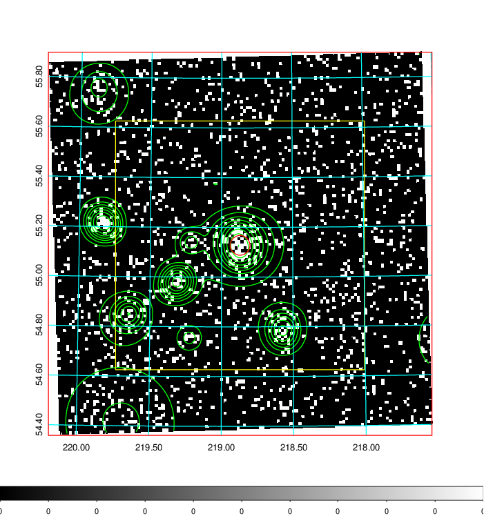  | 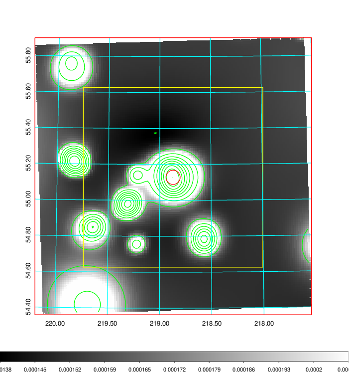   | 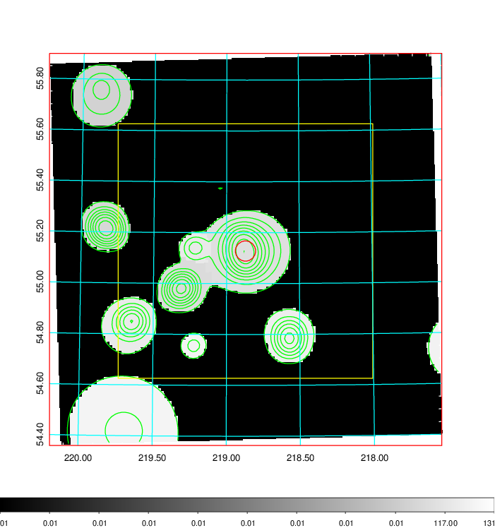  |

|[Exposure image](../image/569/569_mex.pdf)| [nH image](../image/569/569_nh.pdf)| [Planck image](../image/569/569_p.pdf)|
|-------------------|--------------------|-------------------|
|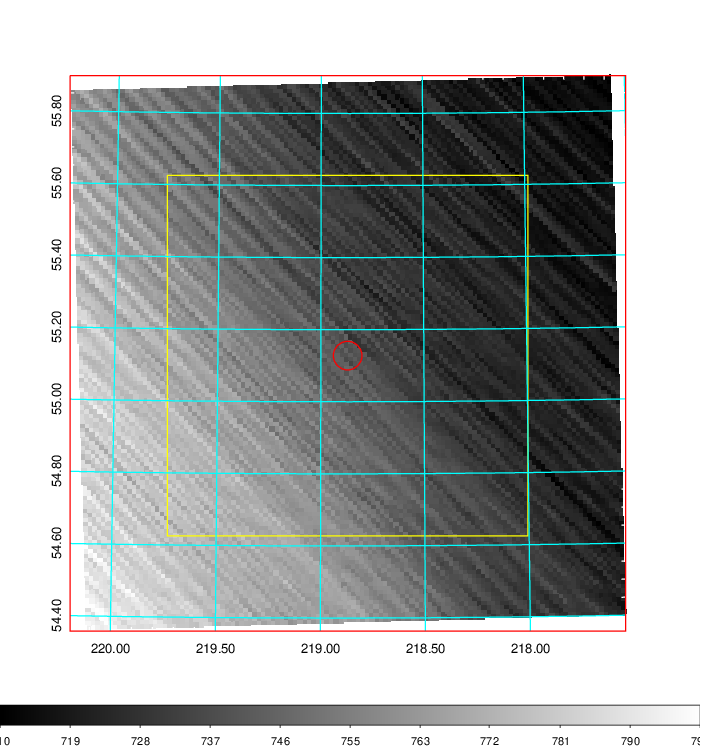   | 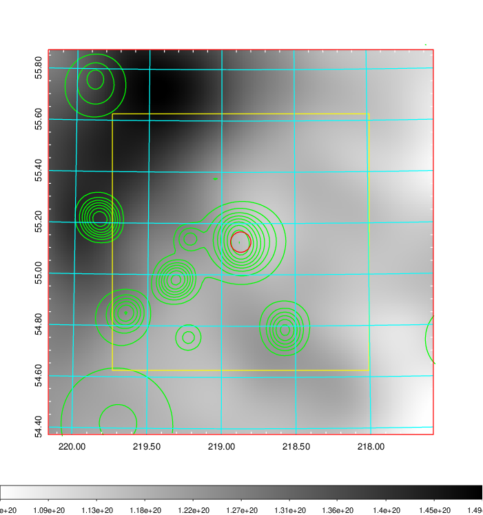    | 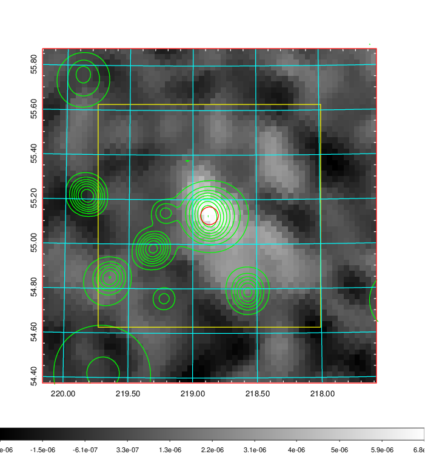 |

|[Redshift Histogram](../image/569/569_zg.pdf) | [DSS image(z1)](../image/569/569_dss_z1.pdf)      |  [DSS image(z2)](../image/569/569_dss_z2.pdf)    |
|-------------------|--------------------|-------------------|
|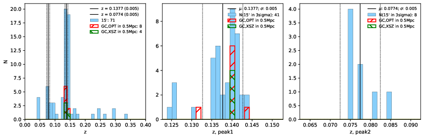 |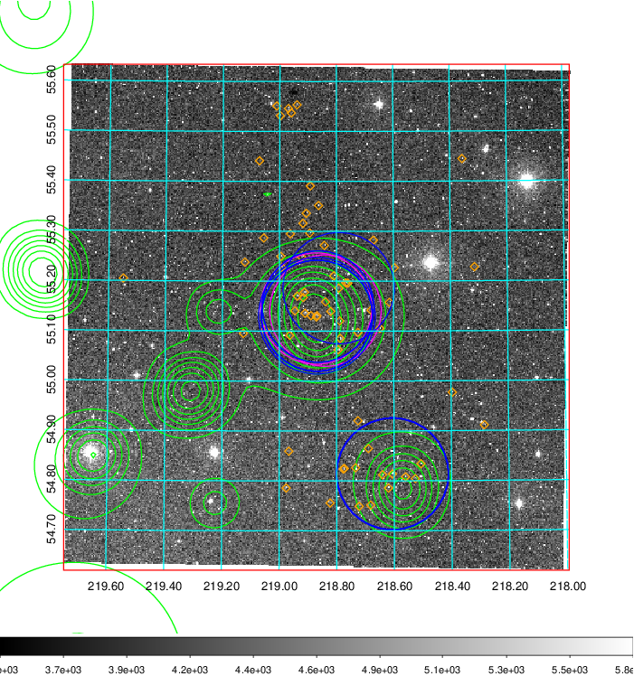  Blue circle for optical clusters;  Magenta circle for XSZ clusters;  all with r=1Mpc;  Only GC with Delta_z<0.01 are shown. | 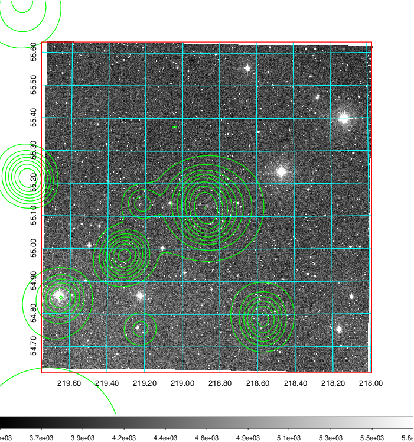 Blue circle for optical clusters;  Magenta circle for XSZ clusters;  all with r=1Mpc;  Only GC with Delta_z<0.01 are shown.  |

|[known Abell/XSZ clusters](../image/569/569_gc.pdf) | [2MASS image](../image/569/569_2mass.pdf)      |[SDSS image](../image/569/569_sdss.pdf)   |
|-------------------|-------------------|-------------------|
|  Magenta, blue and green circles  for optical, X-ray and SZ clusters  respectively, with redshift of clusters  labelled. The radius of circles  are 1Mpc.|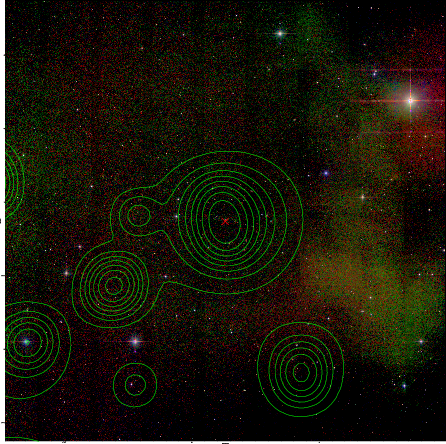  | 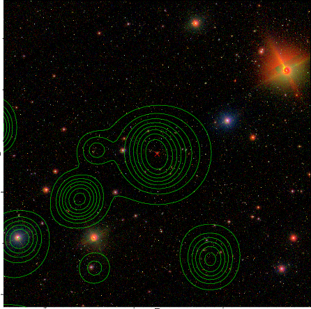  |

