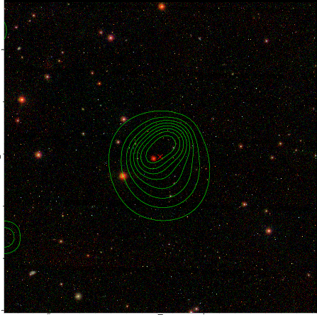

### 57

|Name|RAJ2000[deg]|DEJ2000[deg] |Ext[arcmin]| Ext,ml | z | z_src| C|GC(XSZ,Delta_z<0.01)| GC(OPT,Delta_z<0.01)|GC| R_sig[arcmin] | R500[arcmin] | R500[Mpc]| CRsig[c/s] | CR500[c/s] |L500[1E44 erg/s]|F500[1E-12 erg/s/cm^2]| M500[1E14 Msun]|Tx[keV]|Cnt_sig|Beta|Rc[arcmin]|Comment|Alias|
|---|---|---|---|---|---|------|---|--------|---------|----------|---|---|---|---|---|---|---|---|---|---|---|---|---|---|
|57| 17.390| -7.176| 2.54| 31.15| 0.3132(0.005)| z1,| G| -| -| C, N, W| 11.238| 4.420| 1.217| 0.125(0.031)| 0.113(0.028)| 6.761(0.709)| 2.122(0.222)| 7.07(0.34)| 7.95(0.24)| 39.9| 0.888(-0.124+0.080)| 5.345(-0.899+0.721)| -| t098|

|[RASS image](../image/57/57_img.pdf)|[filtered image](../image/57/57_fil.pdf)|[Segment image](../image/57/57_seg.pdf)|
|-------------------|--------------------|-------------------|
|   |    |   |

|[Exposure image](../image/57/57_mex.pdf)| [nH image](../image/57/57_nh.pdf)| [Planck image](../image/57/57_p.pdf)|
|-------------------|--------------------|-------------------|
|   |     |  |

|[Redshift Histogram](../image/57/57_zg.pdf) | [DSS image(z1)](../image/57/57_dss_z1.pdf)      |  [DSS image(z2)](../image/57/57_dss_z2.pdf)    |
|-------------------|--------------------|-------------------|
| |  Blue circle for optical clusters;  Magenta circle for XSZ clusters;  all with r=1Mpc;  Only GC with Delta_z<0.01 are shown. |  Blue circle for optical clusters;  Magenta circle for XSZ clusters;  all with r=1Mpc;  Only GC with Delta_z<0.01 are shown.  |

|[known Abell/XSZ clusters](../image/57/57_gc.pdf) | [2MASS image](../image/57/57_2mass.pdf)      |[SDSS image](../image/57/57_sdss.pdf)   |
|-------------------|-------------------|-------------------|
|  Magenta, blue and green circles  for optical, X-ray and SZ clusters  respectively, with redshift of clusters  labelled. The radius of circles  are 1Mpc.|  |   |

|[DES image](../image/57/57_des.pdf)   |
|-------------------|
|   |
