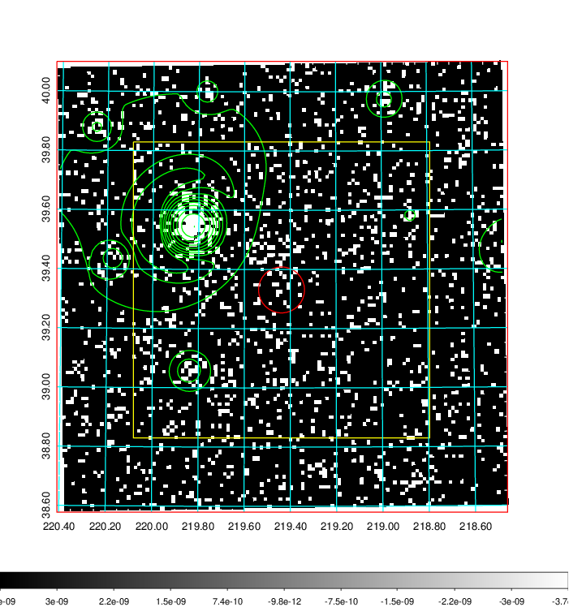
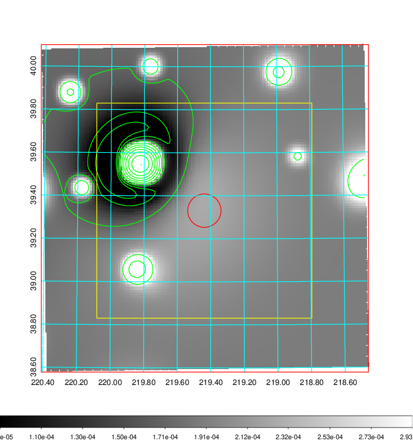
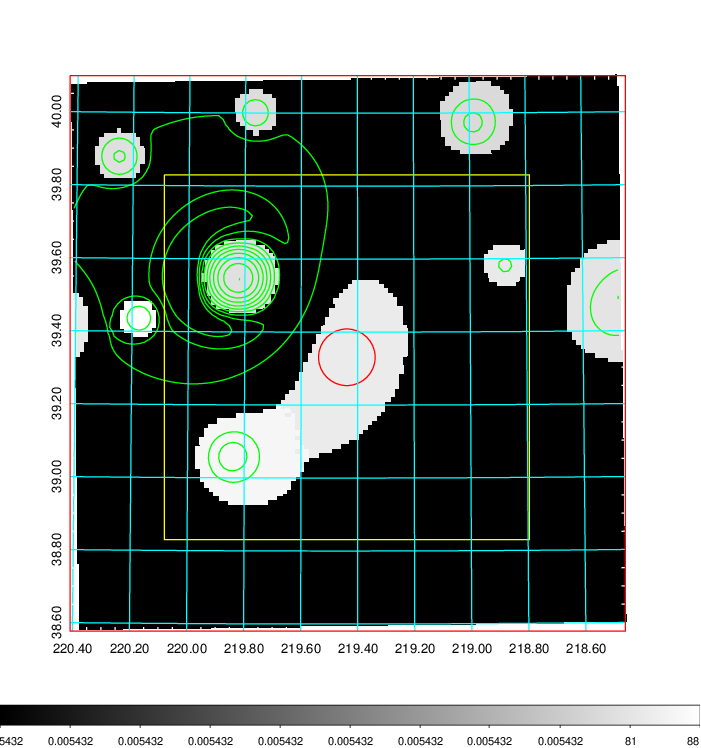
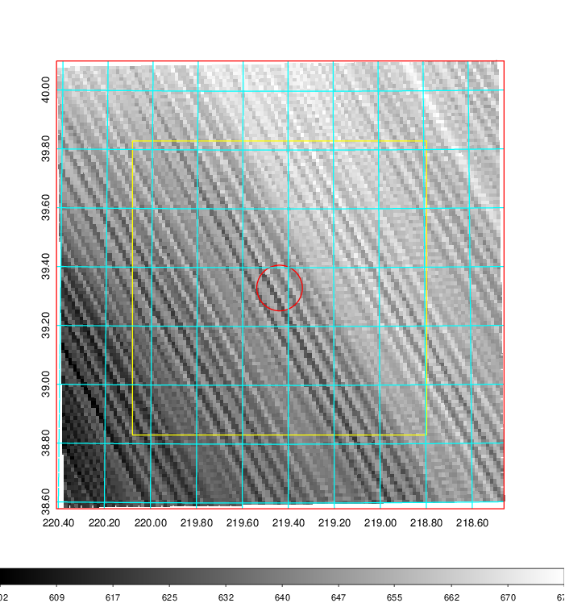
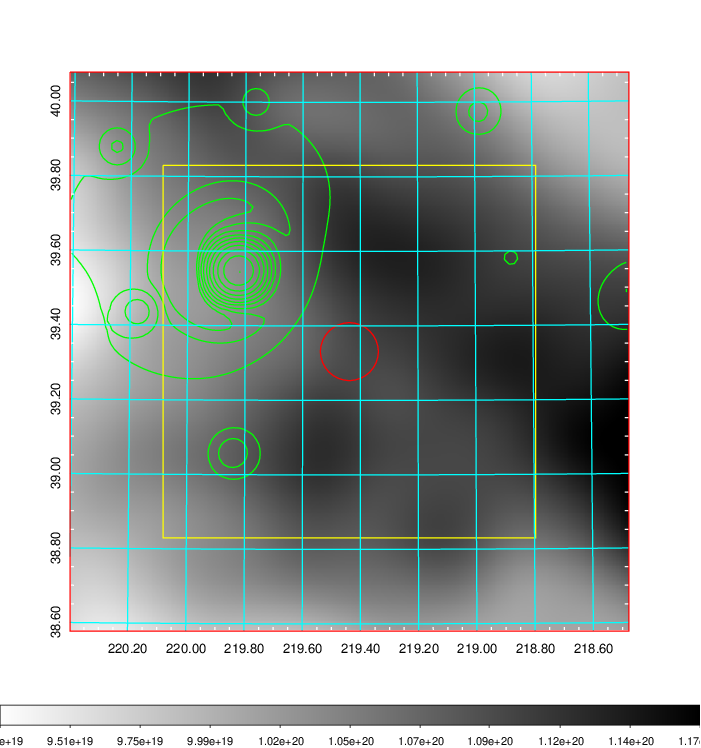
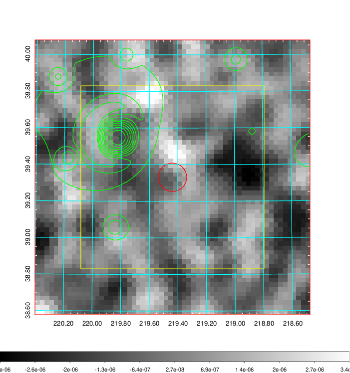
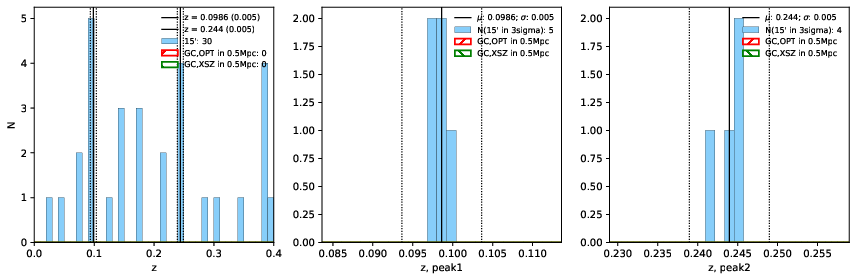
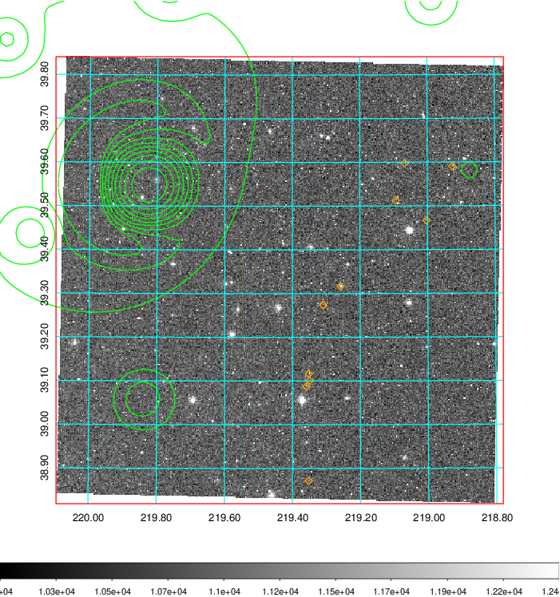
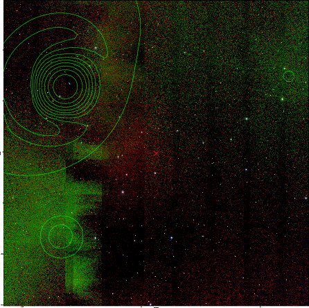
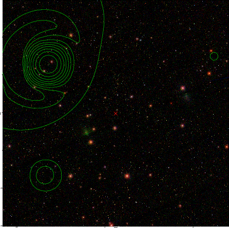

### 570

|Name|RAJ2000[deg]|DEJ2000[deg] |Ext[arcmin]| Ext,ml | z | z_src| C|GC(XSZ,Delta_z<0.01)| GC(OPT,Delta_z<0.01)|GC| R_sig[arcmin] | R500[arcmin] | R500[Mpc]| CRsig[c/s] | CR500[c/s] |L500[1E44 erg/s]|F500[1E-12 erg/s/cm^2]| M500[1E14 Msun]|Tx[keV]|Cnt_sig|Beta|Rc[arcmin]|Comment|Alias|
|---|---|---|---|---|---|------|---|--------|---------|----------|---|---|---|---|---|---|---|---|---|---|---|---|---|---|
|570| 219.438| 39.331| 4.66| 28.52| 0.2440(0.005)| z2,| G| -| -| A, C, N, W| 26.181| 5.006| 1.153| 0.164(0.050)| 0.145(0.044)| 5.404(21.070)| 3.005(11.718)| 5.58(10.21)| 6.70(7.84)| 415.9| 0.502(-0.002+0.004)| 4.443(-0.168+0.754)| An Abell cluster with no $z$ and offset = 1.71 Mpc(7.29 arcmin)| t242|

|[RASS image](../image/570/570_img.pdf)|[filtered image](../image/570/570_fil.pdf)|[Segment image](../image/570/570_seg.pdf)|
|-------------------|--------------------|-------------------|
|   |    |   |

|[Exposure image](../image/570/570_mex.pdf)| [nH image](../image/570/570_nh.pdf)| [Planck image](../image/570/570_p.pdf)|
|-------------------|--------------------|-------------------|
|   |     |  |

|[Redshift Histogram](../image/570/570_zg.pdf) | [DSS image(z1)](../image/570/570_dss_z1.pdf)      |  [DSS image(z2)](../image/570/570_dss_z2.pdf)    |
|-------------------|--------------------|-------------------|
| |  Blue circle for optical clusters;  Magenta circle for XSZ clusters;  all with r=1Mpc;  Only GC with Delta_z<0.01 are shown. |  Blue circle for optical clusters;  Magenta circle for XSZ clusters;  all with r=1Mpc;  Only GC with Delta_z<0.01 are shown.  |

|[known Abell/XSZ clusters](../image/570/570_gc.pdf) | [2MASS image](../image/570/570_2mass.pdf)      |[SDSS image](../image/570/570_sdss.pdf)   |
|-------------------|-------------------|-------------------|
|  Magenta, blue and green circles  for optical, X-ray and SZ clusters  respectively, with redshift of clusters  labelled. The radius of circles  are 1Mpc.|  |   |

