

### 571

|Name|RAJ2000[deg]|DEJ2000[deg] |Ext[arcmin]| Ext,ml | z | z_src| C|GC(XSZ,Delta_z<0.01)| GC(OPT,Delta_z<0.01)|GC| R_sig[arcmin] | R500[arcmin] | R500[Mpc]| CRsig[c/s] | CR500[c/s] |L500[1E44 erg/s]|F500[1E-12 erg/s/cm^2]| M500[1E14 Msun]|Tx[keV]|Cnt_sig|Beta|Rc[arcmin]|Comment|Alias|
|---|---|---|---|---|---|------|---|--------|---------|----------|---|---|---|---|---|---|---|---|---|---|---|---|---|---|
|571| 220.023| 37.136| 2.84| 66.38| 0.0979(0.005)| z1, z_xsz| B| F20, SPI| C, N, RM, W| C, F20, N, SPI, W| 14.162| 8.001| 0.869| 0.202(0.030)| 0.188(0.028)| 0.921(0.103)| 3.803(0.425)| 2.05(0.11)| 3.44(0.12)| 139.4| 0.688(-0.109+0.157)| 4.167(-1.095+1.330)| -| t126|

|[RASS image](../image/571/571_img.pdf)|[filtered image](../image/571/571_fil.pdf)|[Segment image](../image/571/571_seg.pdf)|
|-------------------|--------------------|-------------------|
| 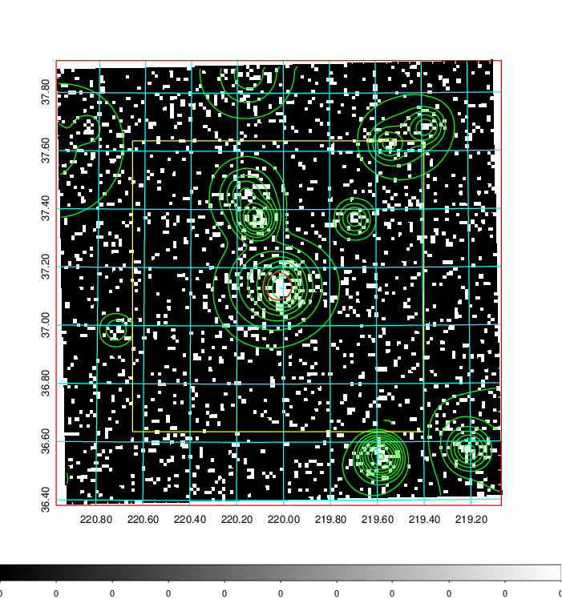  | 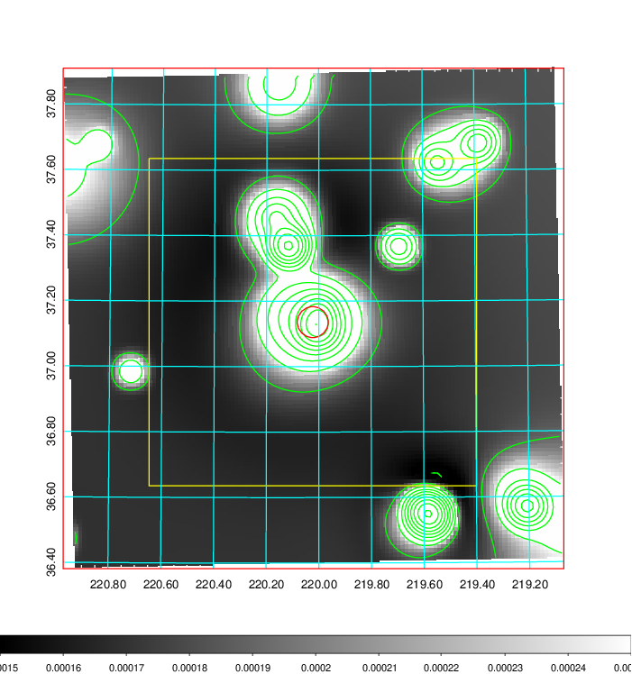   | 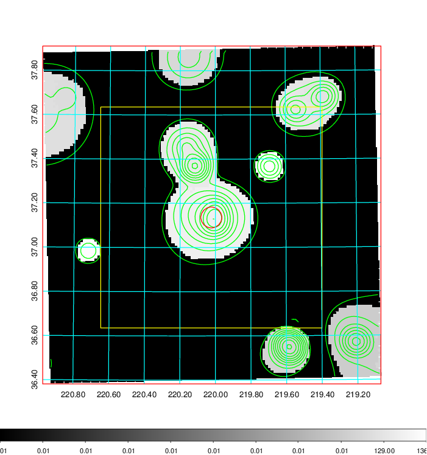  |

|[Exposure image](../image/571/571_mex.pdf)| [nH image](../image/571/571_nh.pdf)| [Planck image](../image/571/571_p.pdf)|
|-------------------|--------------------|-------------------|
|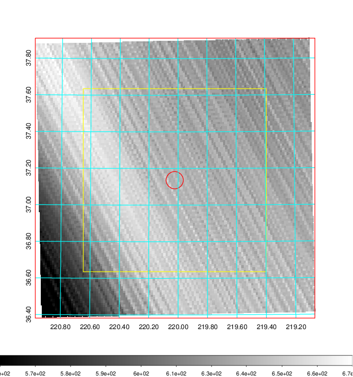   | 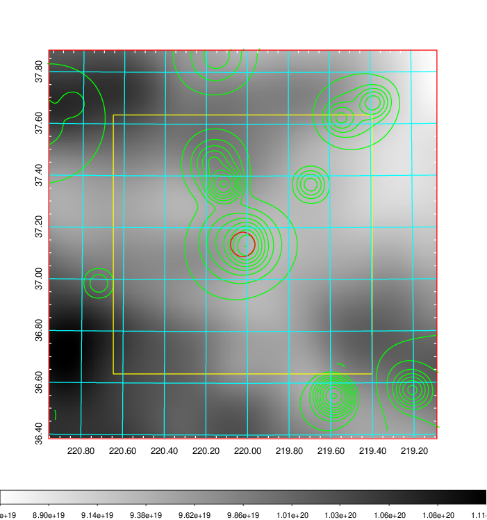    | 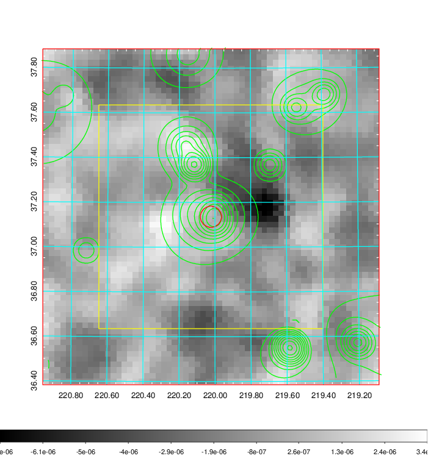 |

|[Redshift Histogram](../image/571/571_zg.pdf) | [DSS image(z1)](../image/571/571_dss_z1.pdf)      |  [DSS image(z2)](../image/571/571_dss_z2.pdf)    |
|-------------------|--------------------|-------------------|
|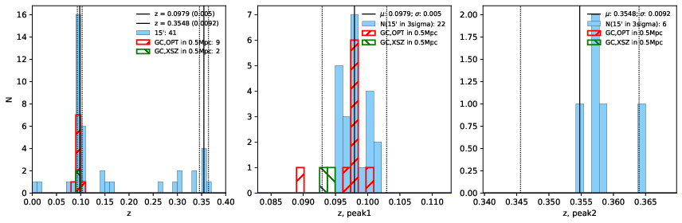 |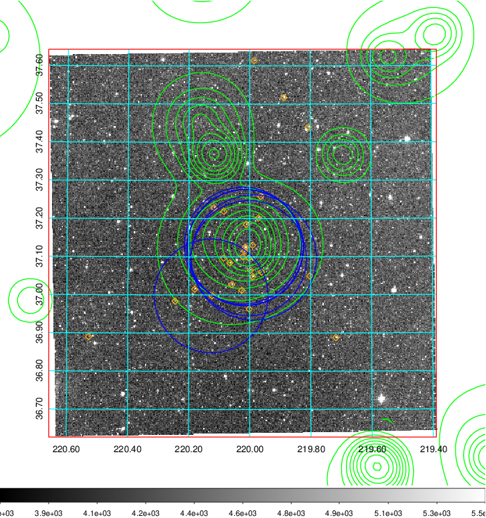  Blue circle for optical clusters;  Magenta circle for XSZ clusters;  all with r=1Mpc;  Only GC with Delta_z<0.01 are shown. | 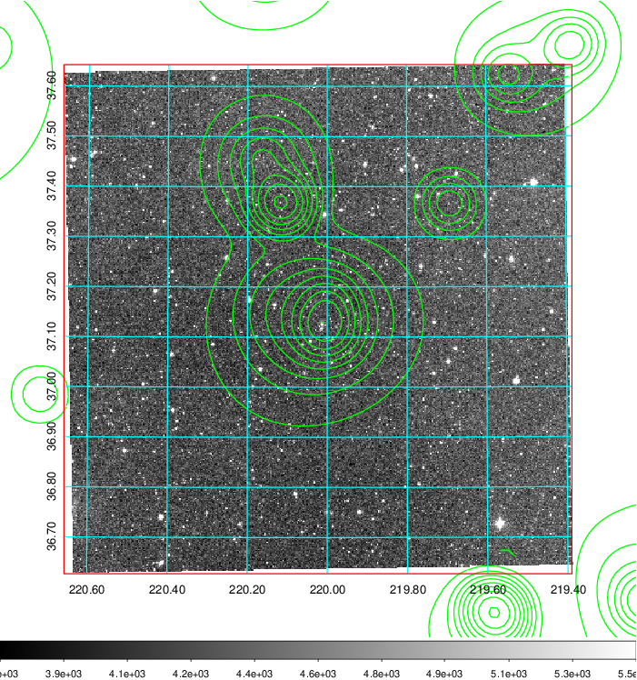 Blue circle for optical clusters;  Magenta circle for XSZ clusters;  all with r=1Mpc;  Only GC with Delta_z<0.01 are shown.  |

|[Previous-identified clusters](../image/571/571_gc.pdf) | [2MASS image](../image/571/571_2mass.pdf)      |[SDSS image](../image/571/571_sdss.pdf)   |
|-------------------|-------------------|-------------------|
|  Green, magenta, and blue circles  for optical, X-ray and SZ clusters  respectively, with redshift of clusters  labelled. The radius of circles  are 1Mpc.|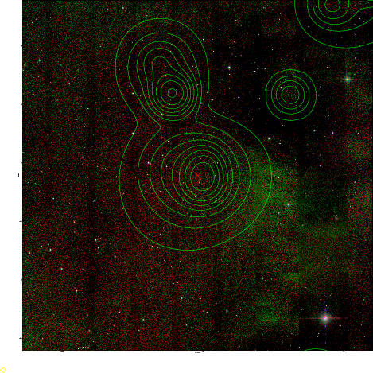  | 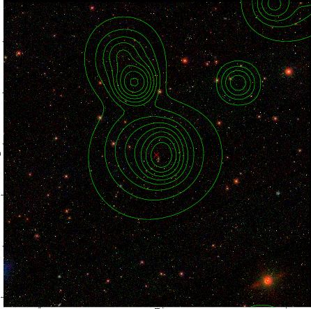  |

