

### 572

|Name|RAJ2000[deg]|DEJ2000[deg] |Ext[arcmin]| Ext,ml | z | z_src| C|GC(XSZ,Delta_z<0.01)| GC(OPT,Delta_z<0.01)|GC| R_sig[arcmin] | R500[arcmin] | R500[Mpc]| CRsig[c/s] | CR500[c/s] |L500[1E44 erg/s]|F500[1E-12 erg/s/cm^2]| M500[1E14 Msun]|Tx[keV]|Cnt_sig|Beta|Rc[arcmin]|Comment|Alias|
|---|---|---|---|---|---|------|---|--------|---------|----------|---|---|---|---|---|---|---|---|---|---|---|---|---|---|
|572| 220.159| 3.470| 4.24| 217.53| 0.0271(0.005)| z1, z_xsz| B| MCXC, PSZ2, Tar| N| C, F20, MCXC, N, PSZ2, Tar, W, XCS| 38.620| 22.457| 0.734| 1.053(0.117)| 0.985(0.109)| 0.299(0.024)| 17.820(1.457)| 1.15(0.05)| 2.36(0.06)| 311.5| 0.506(-0.004+0.008)| 2.987(-0.161+0.209)| -| k494|

|[RASS image](../image/572/572_img.pdf)|[filtered image](../image/572/572_fil.pdf)|[Segment image](../image/572/572_seg.pdf)|
|-------------------|--------------------|-------------------|
| 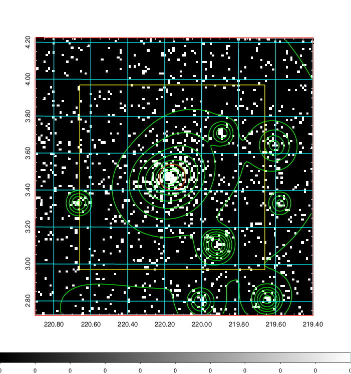  | 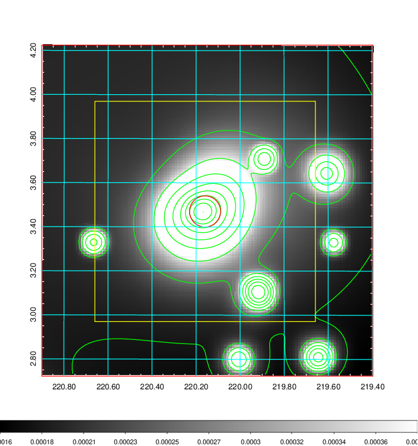   | 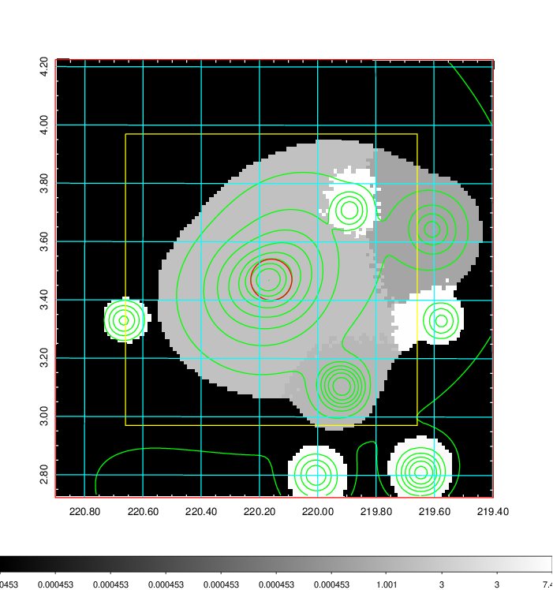  |

|[Exposure image](../image/572/572_mex.pdf)| [nH image](../image/572/572_nh.pdf)| [Planck image](../image/572/572_p.pdf)|
|-------------------|--------------------|-------------------|
|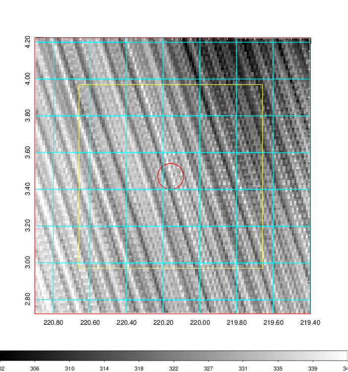   | 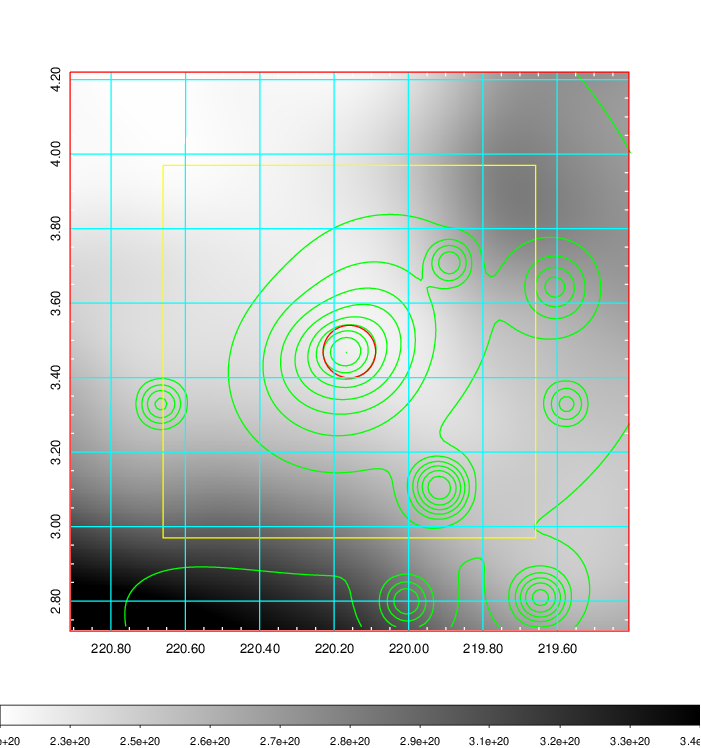    | 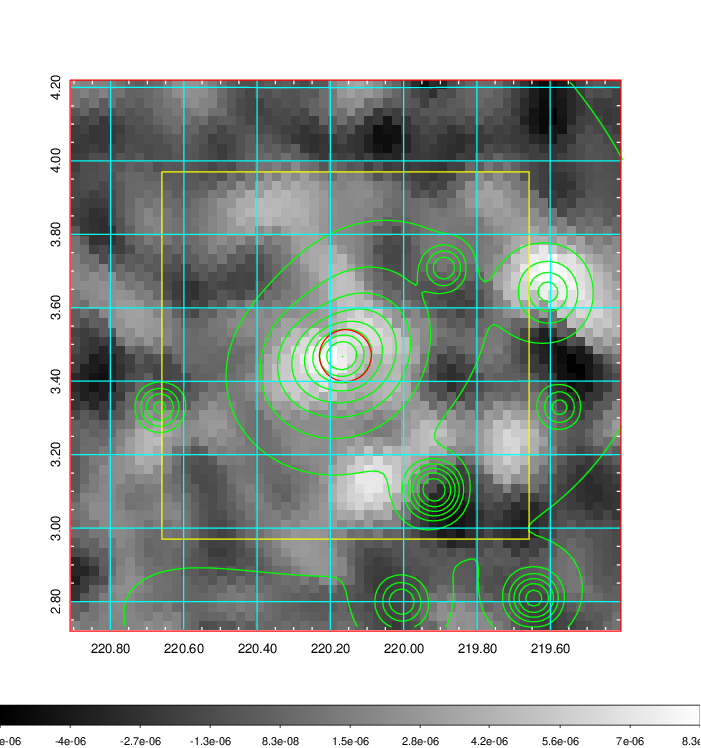 |

|[Redshift Histogram](../image/572/572_zg.pdf) | [DSS image(z1)](../image/572/572_dss_z1.pdf)      |  [DSS image(z2)](../image/572/572_dss_z2.pdf)    |
|-------------------|--------------------|-------------------|
|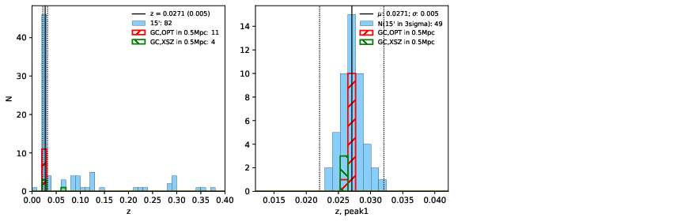 |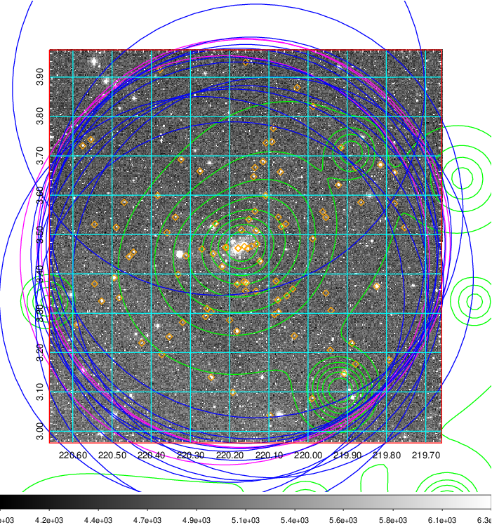  Blue circle for optical clusters;  Magenta circle for XSZ clusters;  all with r=1Mpc;  Only GC with Delta_z<0.01 are shown. | 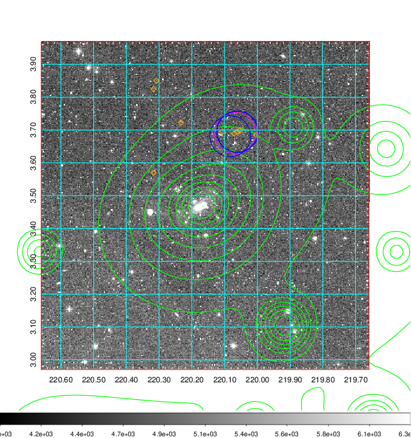 Blue circle for optical clusters;  Magenta circle for XSZ clusters;  all with r=1Mpc;  Only GC with Delta_z<0.01 are shown.  |

|[Previous-identified clusters](../image/572/572_gc.pdf) | [2MASS image](../image/572/572_2mass.pdf)      |[SDSS image](../image/572/572_sdss.pdf)   |
|-------------------|-------------------|-------------------|
|  Green, magenta, and blue circles  for optical, X-ray and SZ clusters  respectively, with redshift of clusters  labelled. The radius of circles  are 1Mpc.|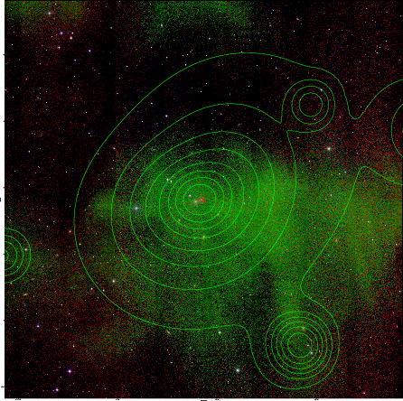  | 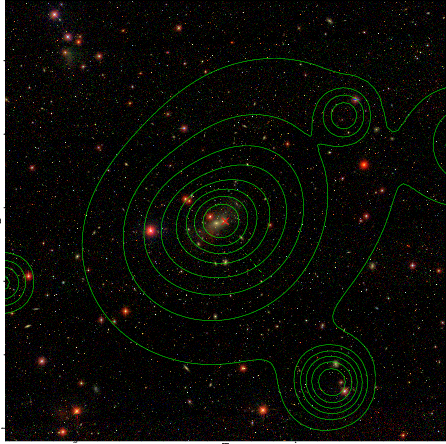  |

