

### 573

|Name|RAJ2000[deg]|DEJ2000[deg] |Ext[arcmin]| Ext,ml | z | z_src| C|GC(XSZ,Delta_z<0.01)| GC(OPT,Delta_z<0.01)|GC| R_sig[arcmin] | R500[arcmin] | R500[Mpc]| CRsig[c/s] | CR500[c/s] |L500[1E44 erg/s]|F500[1E-12 erg/s/cm^2]| M500[1E14 Msun]|Tx[keV]|Cnt_sig|Beta|Rc[arcmin]|Comment|Alias|
|---|---|---|---|---|---|------|---|--------|---------|----------|---|---|---|---|---|---|---|---|---|---|---|---|---|---|
|573| 220.581| 22.302| 0.92| 41.36| 0.0934(0.006)| z1, z_xsz| B| MCXC| N, RM, Zw| C, F20, MCXC, N, W| 10.262| 8.999| 0.937| 0.292(0.037)| 0.286(0.037)| 1.202(0.074)| 5.485(0.339)| 2.56(0.08)| 3.94(0.08)| 187.0| 0.819(-0.115+0.117)| 2.150(-0.573+0.493)| -| k026|

|[RASS image](../image/573/573_img.pdf)|[filtered image](../image/573/573_fil.pdf)|[Segment image](../image/573/573_seg.pdf)|
|-------------------|--------------------|-------------------|
| 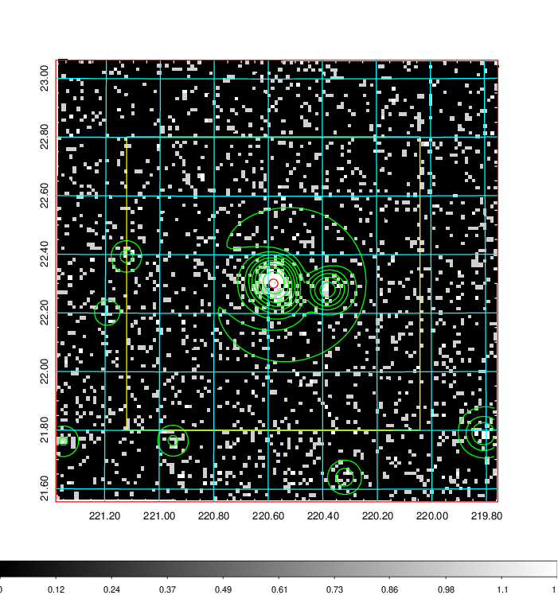  | 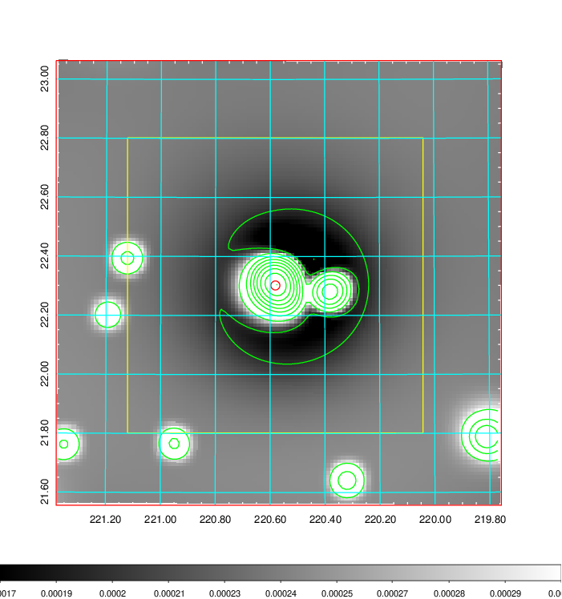   | 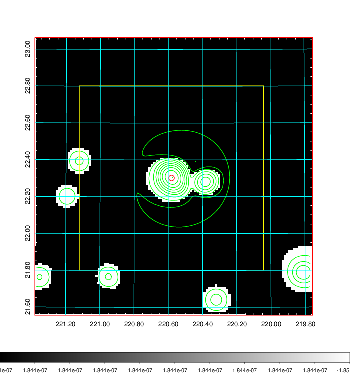  |

|[Exposure image](../image/573/573_mex.pdf)| [nH image](../image/573/573_nh.pdf)| [Planck image](../image/573/573_p.pdf)|
|-------------------|--------------------|-------------------|
|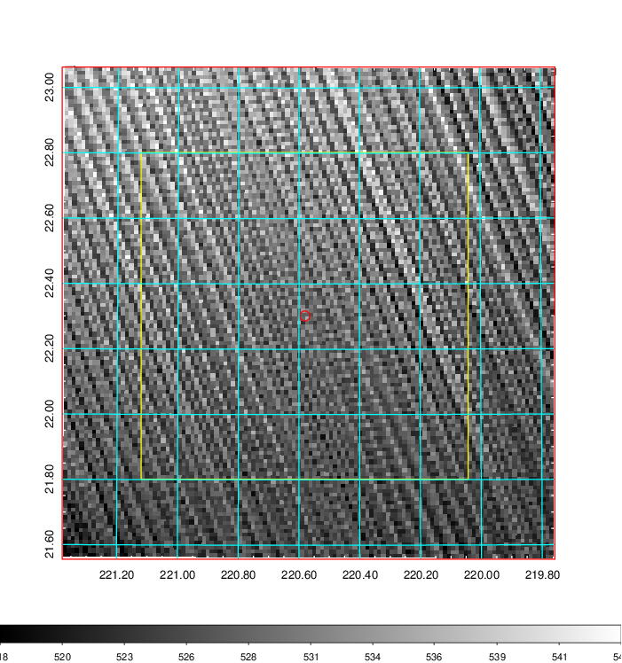   | 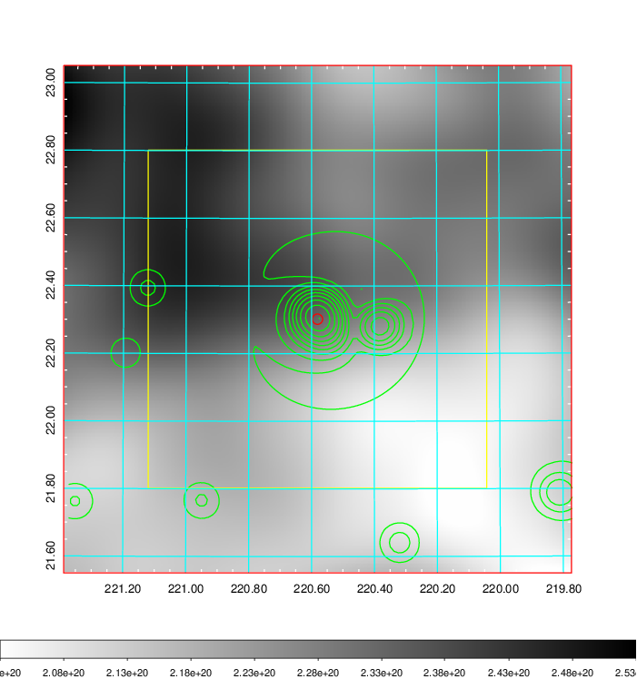    | 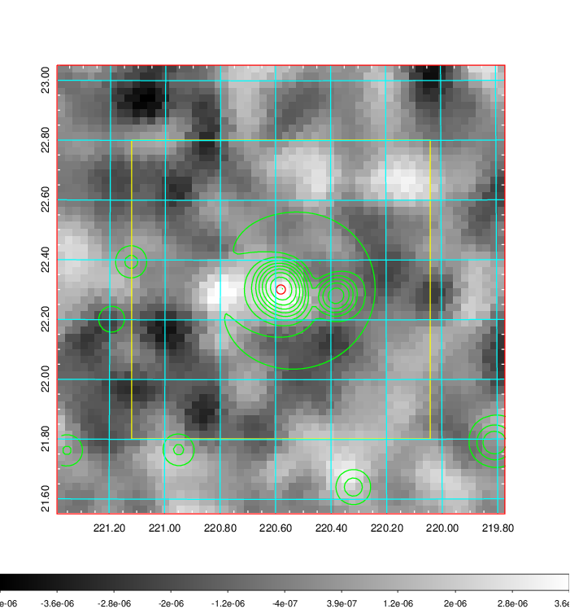 |

|[Redshift Histogram](../image/573/573_zg.pdf) | [DSS image(z1)](../image/573/573_dss_z1.pdf)      |  [DSS image(z2)](../image/573/573_dss_z2.pdf)    |
|-------------------|--------------------|-------------------|
|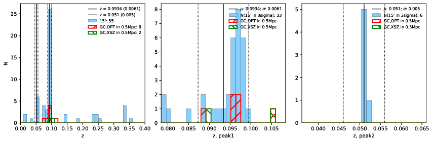 |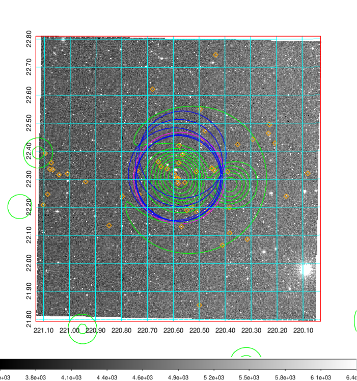  Blue circle for optical clusters;  Magenta circle for XSZ clusters;  all with r=1Mpc;  Only GC with Delta_z<0.01 are shown. | 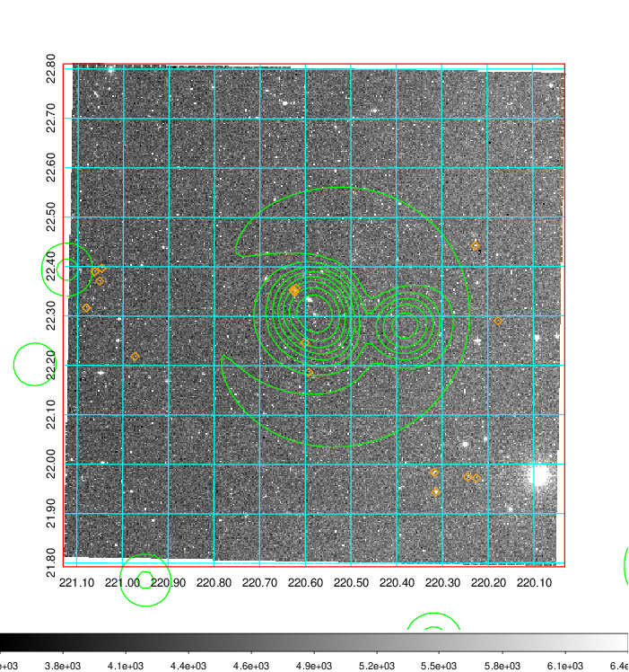 Blue circle for optical clusters;  Magenta circle for XSZ clusters;  all with r=1Mpc;  Only GC with Delta_z<0.01 are shown.  |

|[Previous-identified clusters](../image/573/573_gc.pdf) | [2MASS image](../image/573/573_2mass.pdf)      |[SDSS image](../image/573/573_sdss.pdf)   |
|-------------------|-------------------|-------------------|
|  Green, magenta, and blue circles  for optical, X-ray and SZ clusters  respectively, with redshift of clusters  labelled. The radius of circles  are 1Mpc.|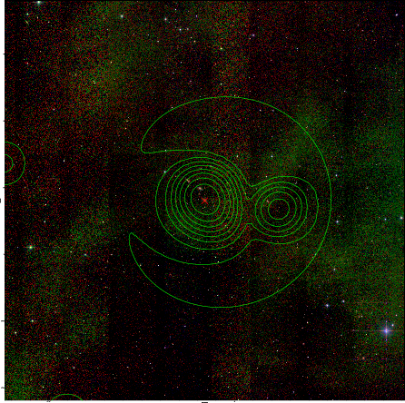  | 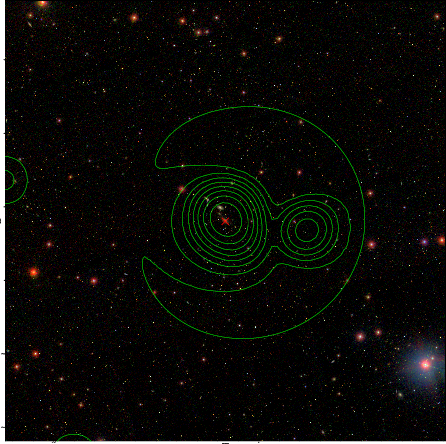  |

