

### 574

|Name|RAJ2000[deg]|DEJ2000[deg] |Ext[arcmin]| Ext,ml | z | z_src| C|GC(XSZ,Delta_z<0.01)| GC(OPT,Delta_z<0.01)|GC| R_sig[arcmin] | R500[arcmin] | R500[Mpc]| CRsig[c/s] | CR500[c/s] |L500[1E44 erg/s]|F500[1E-12 erg/s/cm^2]| M500[1E14 Msun]|Tx[keV]|Cnt_sig|Beta|Rc[arcmin]|Comment|Alias|
|---|---|---|---|---|---|------|---|--------|---------|----------|---|---|---|---|---|---|---|---|---|---|---|---|---|---|
|574| 220.591| 32.582| 1.67| 33.68| 0.2409(0.006)| z1, z_xsz| B| F20, SPI| C, RM, W| C, F20, N, SPI, Tar, W| 5.875| 4.405| 1.005| 0.079(0.026)| 0.076(0.025)| 2.757(0.498)| 1.578(0.285)| 3.68(0.32)| 5.18(0.29)| 44.0| 0.930(-0.087+0.051)| 4.514(-0.560+0.515)| An SZ cluster with $z$ = 0.2410 and offset = 0.63 Mpc (2.72 arcmin)| t037|

|[RASS image](../image/574/574_img.pdf)|[filtered image](../image/574/574_fil.pdf)|[Segment image](../image/574/574_seg.pdf)|
|-------------------|--------------------|-------------------|
| 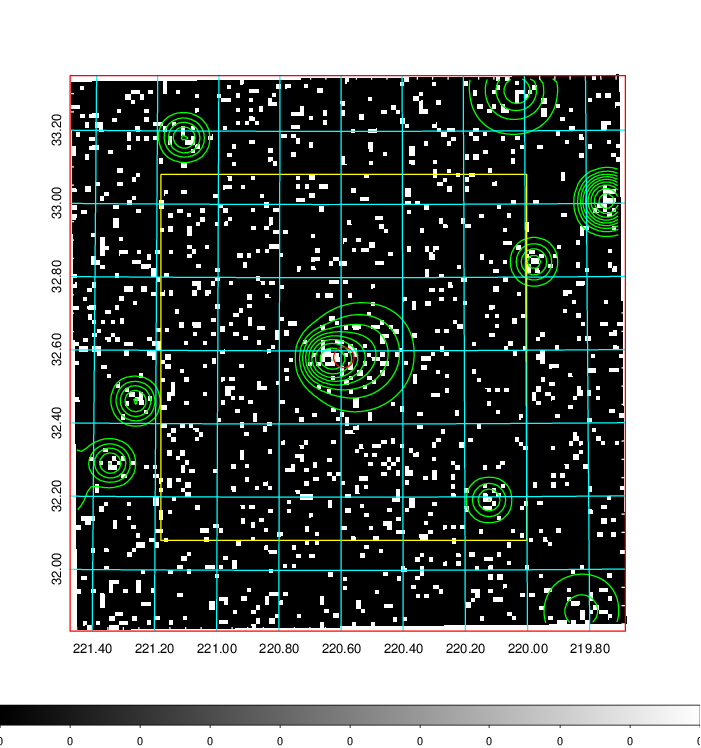  | 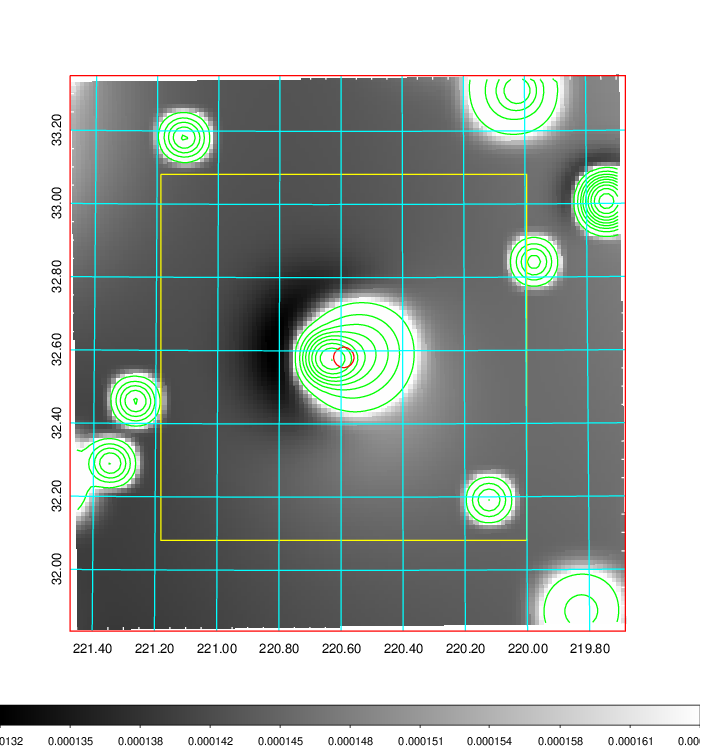   | 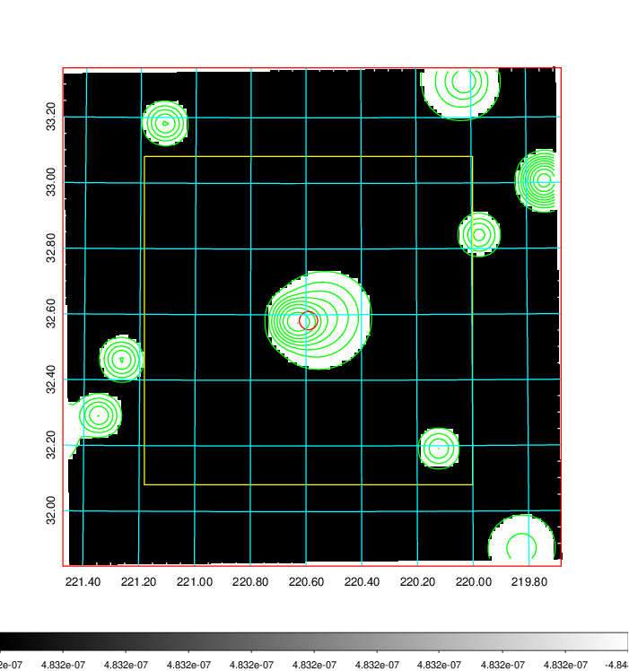  |

|[Exposure image](../image/574/574_mex.pdf)| [nH image](../image/574/574_nh.pdf)| [Planck image](../image/574/574_p.pdf)|
|-------------------|--------------------|-------------------|
|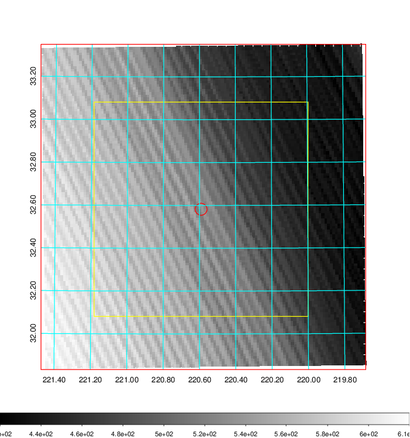   | 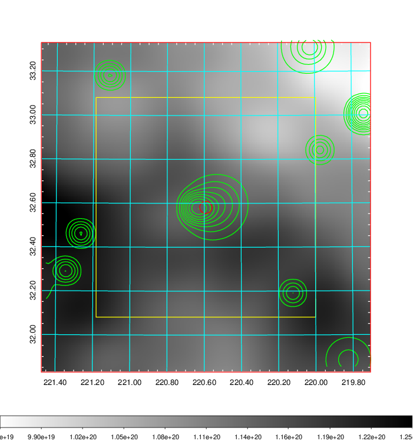    | 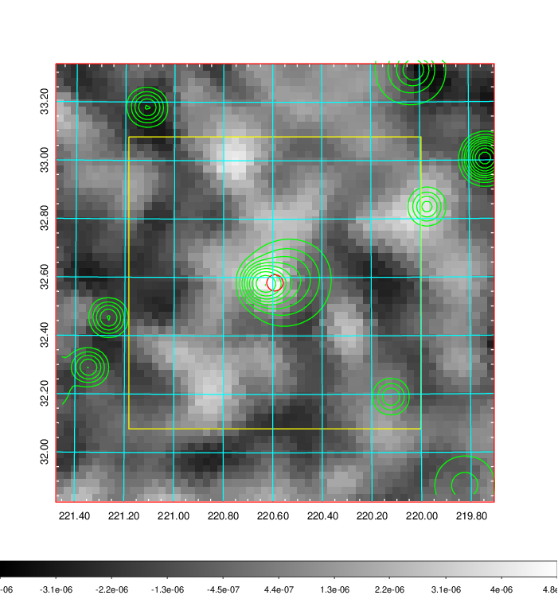 |

|[Redshift Histogram](../image/574/574_zg.pdf) | [DSS image(z1)](../image/574/574_dss_z1.pdf)      |  [DSS image(z2)](../image/574/574_dss_z2.pdf)    |
|-------------------|--------------------|-------------------|
|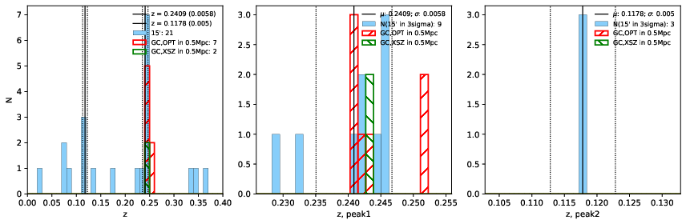 |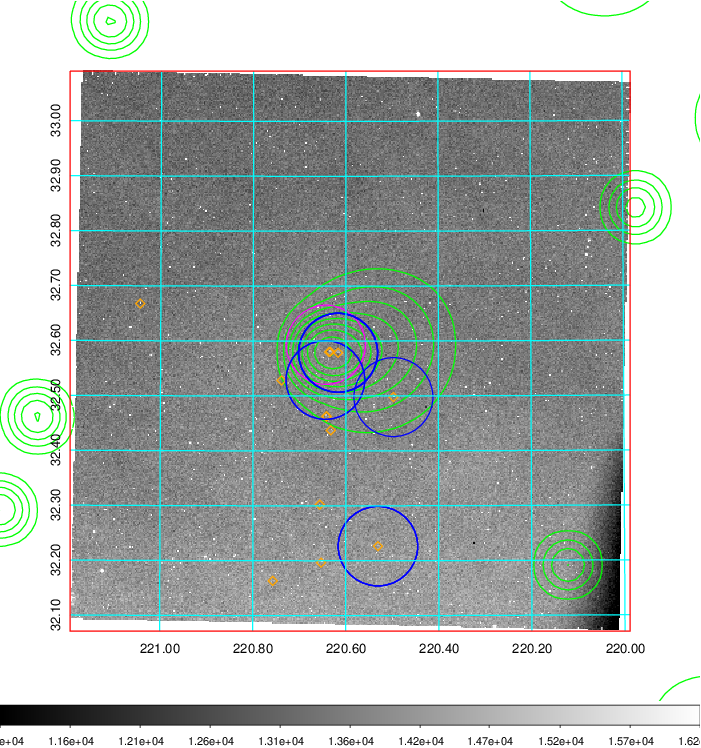  Blue circle for optical clusters;  Magenta circle for XSZ clusters;  all with r=1Mpc;  Only GC with Delta_z<0.01 are shown. | 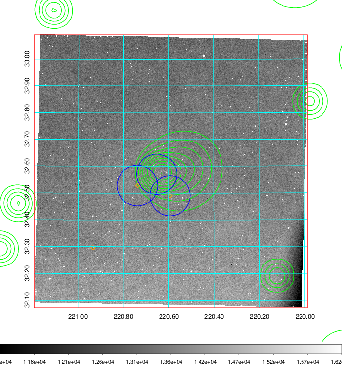 Blue circle for optical clusters;  Magenta circle for XSZ clusters;  all with r=1Mpc;  Only GC with Delta_z<0.01 are shown.  |

|[Previous-identified clusters](../image/574/574_gc.pdf) | [2MASS image](../image/574/574_2mass.pdf)      |[SDSS image](../image/574/574_sdss.pdf)   |
|-------------------|-------------------|-------------------|
|  Green, magenta, and blue circles  for optical, X-ray and SZ clusters  respectively, with redshift of clusters  labelled. The radius of circles  are 1Mpc.|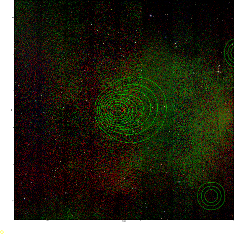  | 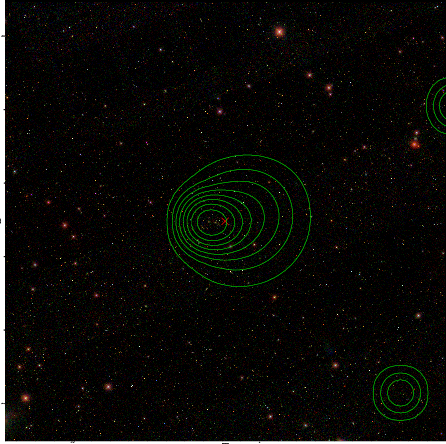  |

