

### 575

|Name|RAJ2000[deg]|DEJ2000[deg] |Ext[arcmin]| Ext,ml | z | z_src| C|GC(XSZ,Delta_z<0.01)| GC(OPT,Delta_z<0.01)|GC| R_sig[arcmin] | R500[arcmin] | R500[Mpc]| CRsig[c/s] | CR500[c/s] |L500[1E44 erg/s]|F500[1E-12 erg/s/cm^2]| M500[1E14 Msun]|Tx[keV]|Cnt_sig|Beta|Rc[arcmin]|Comment|Alias|
|---|---|---|---|---|---|------|---|--------|---------|----------|---|---|---|---|---|---|---|---|---|---|---|---|---|---|
|575| 221.150| 58.824| 4.21| 31.36| 0.1472(0.009)| z2, z_opt| S| -| N| A, C, F20, N, SPI, W| 12.212| 5.402| 0.834| 0.079(0.027)| 0.073(0.025)| 0.867(0.464)| 1.484(0.795)| 1.91(0.51)| 3.34(0.56)| 61.1| 0.786(-0.168+0.147)| 7.341(-1.813+1.379)| -| t213|

|[RASS image](../image/575/575_img.pdf)|[filtered image](../image/575/575_fil.pdf)|[Segment image](../image/575/575_seg.pdf)|
|-------------------|--------------------|-------------------|
| 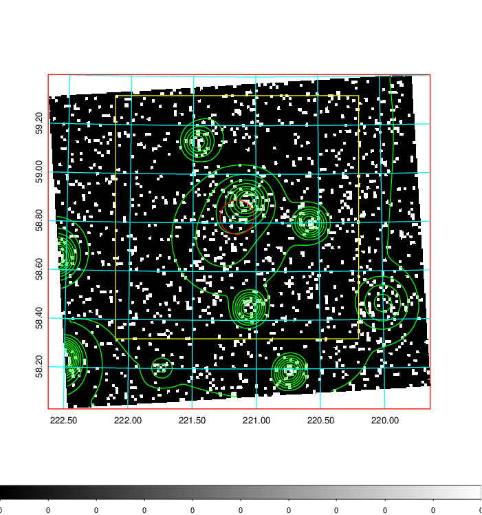  | 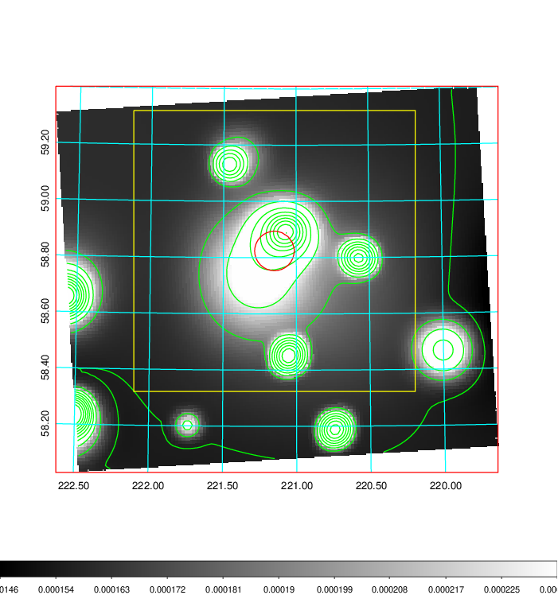   | 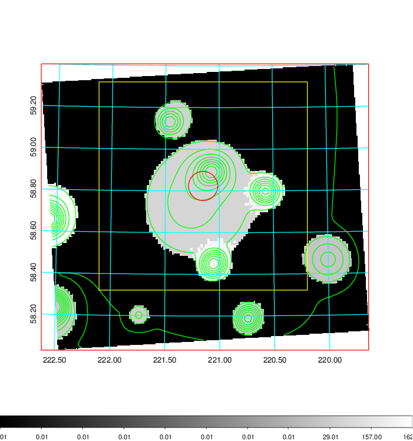  |

|[Exposure image](../image/575/575_mex.pdf)| [nH image](../image/575/575_nh.pdf)| [Planck image](../image/575/575_p.pdf)|
|-------------------|--------------------|-------------------|
|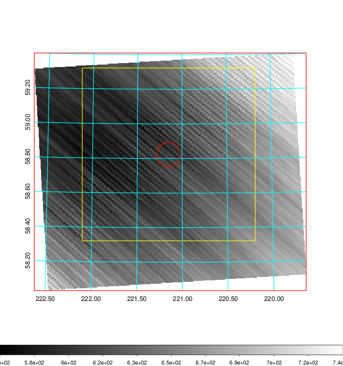   | 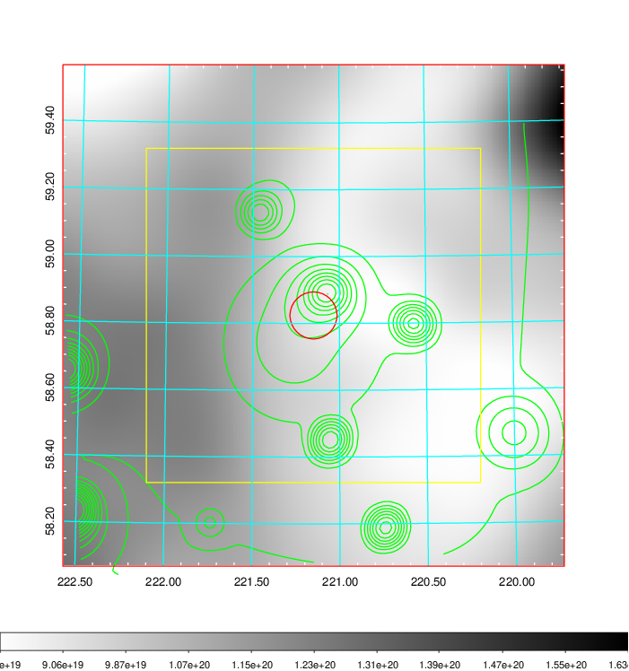    | 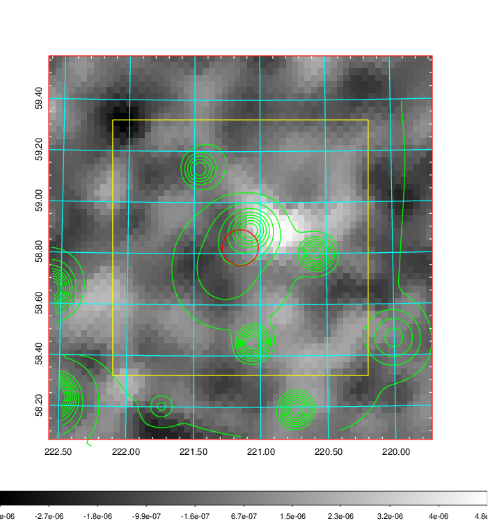 |

|[Redshift Histogram](../image/575/575_zg.pdf) | [DSS image(z1)](../image/575/575_dss_z1.pdf)      |  [DSS image(z2)](../image/575/575_dss_z2.pdf)    |
|-------------------|--------------------|-------------------|
|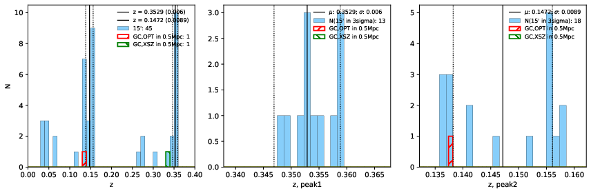 |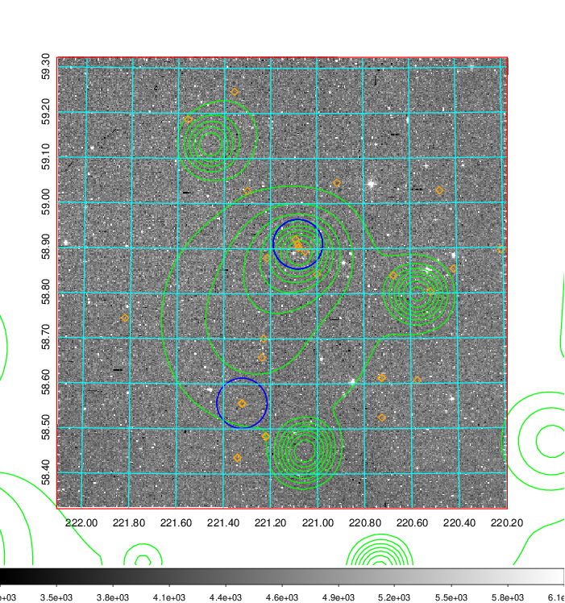  Blue circle for optical clusters;  Magenta circle for XSZ clusters;  all with r=1Mpc;  Only GC with Delta_z<0.01 are shown. | 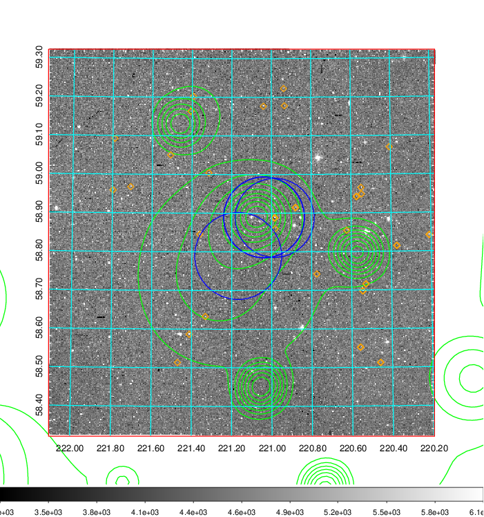 Blue circle for optical clusters;  Magenta circle for XSZ clusters;  all with r=1Mpc;  Only GC with Delta_z<0.01 are shown.  |

|[Previous-identified clusters](../image/575/575_gc.pdf) | [2MASS image](../image/575/575_2mass.pdf)      |[SDSS image](../image/575/575_sdss.pdf)   |
|-------------------|-------------------|-------------------|
|  Green, magenta, and blue circles  for optical, X-ray and SZ clusters  respectively, with redshift of clusters  labelled. The radius of circles  are 1Mpc.|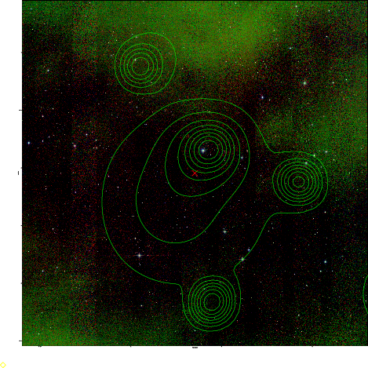  | 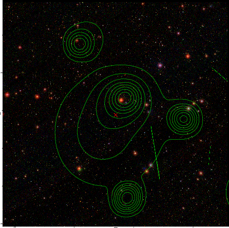  |

