

### 577

|Name|RAJ2000[deg]|DEJ2000[deg] |Ext[arcmin]| Ext,ml | z | z_src| C|GC(XSZ,Delta_z<0.01)| GC(OPT,Delta_z<0.01)|GC| R_sig[arcmin] | R500[arcmin] | R500[Mpc]| CRsig[c/s] | CR500[c/s] |L500[1E44 erg/s]|F500[1E-12 erg/s/cm^2]| M500[1E14 Msun]|Tx[keV]|Cnt_sig|Beta|Rc[arcmin]|Comment|Alias|
|---|---|---|---|---|---|------|---|--------|---------|----------|---|---|---|---|---|---|---|---|---|---|---|---|---|---|
|577| 223.226| 58.049| 1.26| 26.26| 0.3224(0.005)| z1, z_xsz| B| MCXC, PSZ2, Tar| A, N, W| A, C, F20, MCXC, N, PSZ2, SPI, Tar, W| 21.244| 4.493| 1.261| 0.164(0.042)| 0.145(0.037)| 10.290(1.521)| 3.020(0.446)| 7.96(0.53)| 8.58(0.37)| 149.4| 0.632(-0.055+0.080)| 1.725(-0.510+0.622)| -| k069|

|[RASS image](../image/577/577_img.pdf)|[filtered image](../image/577/577_fil.pdf)|[Segment image](../image/577/577_seg.pdf)|
|-------------------|--------------------|-------------------|
| 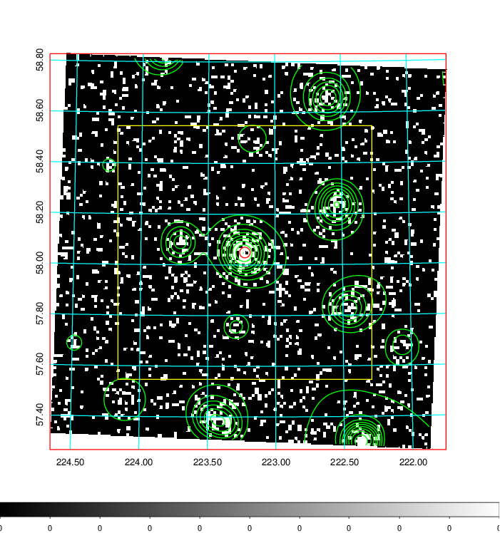  | 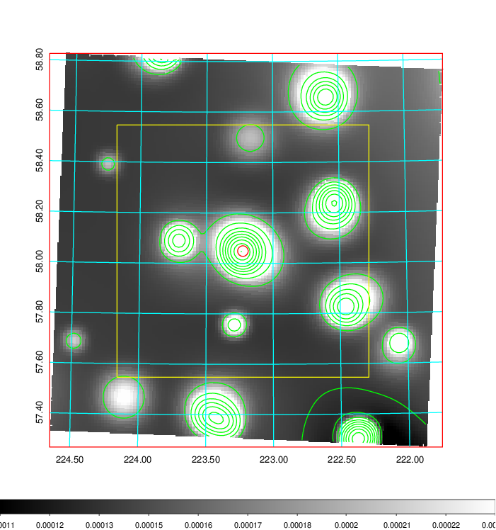   | 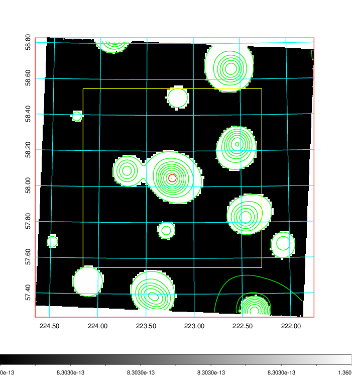  |

|[Exposure image](../image/577/577_mex.pdf)| [nH image](../image/577/577_nh.pdf)| [Planck image](../image/577/577_p.pdf)|
|-------------------|--------------------|-------------------|
|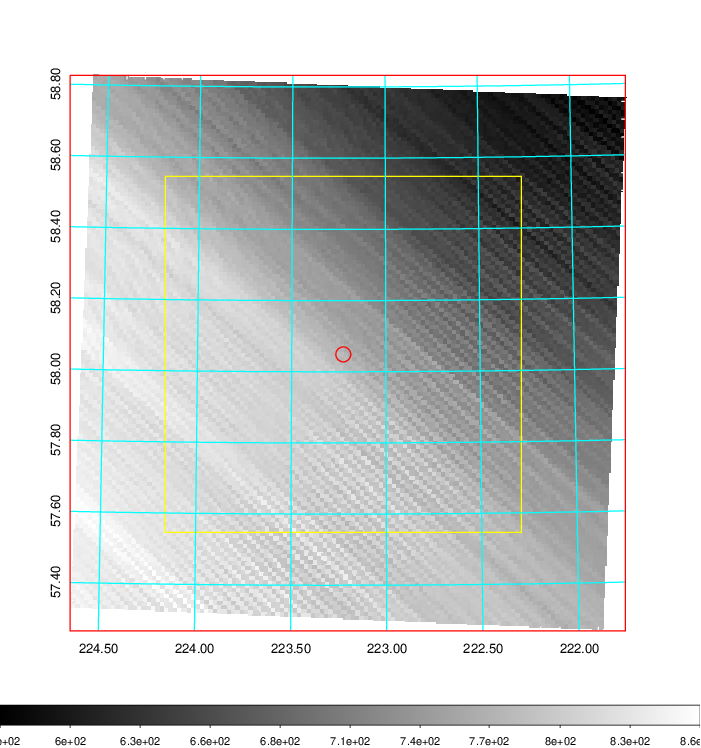   | 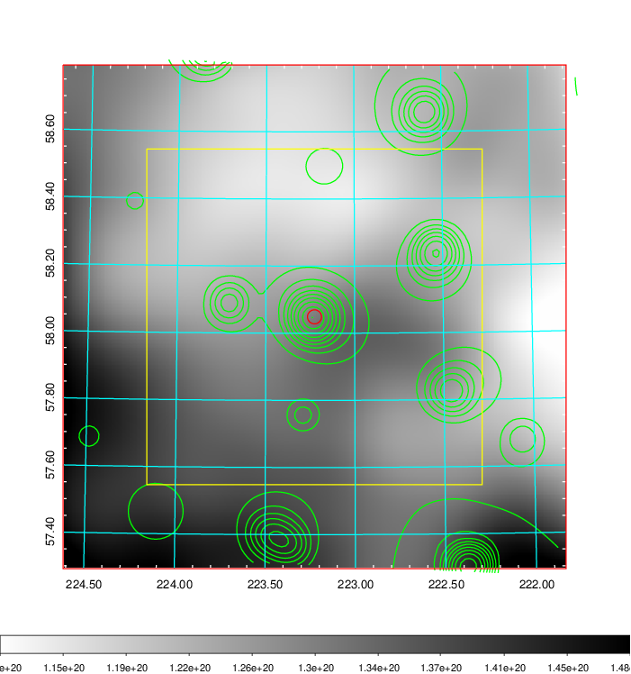    | 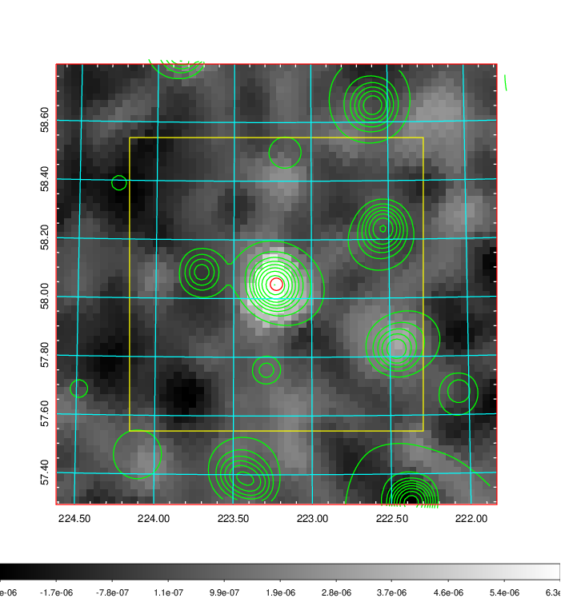 |

|[Redshift Histogram](../image/577/577_zg.pdf) | [DSS image(z1)](../image/577/577_dss_z1.pdf)      |  [DSS image(z2)](../image/577/577_dss_z2.pdf)    |
|-------------------|--------------------|-------------------|
|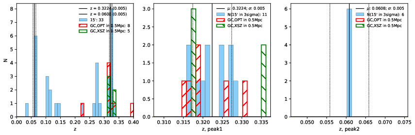 |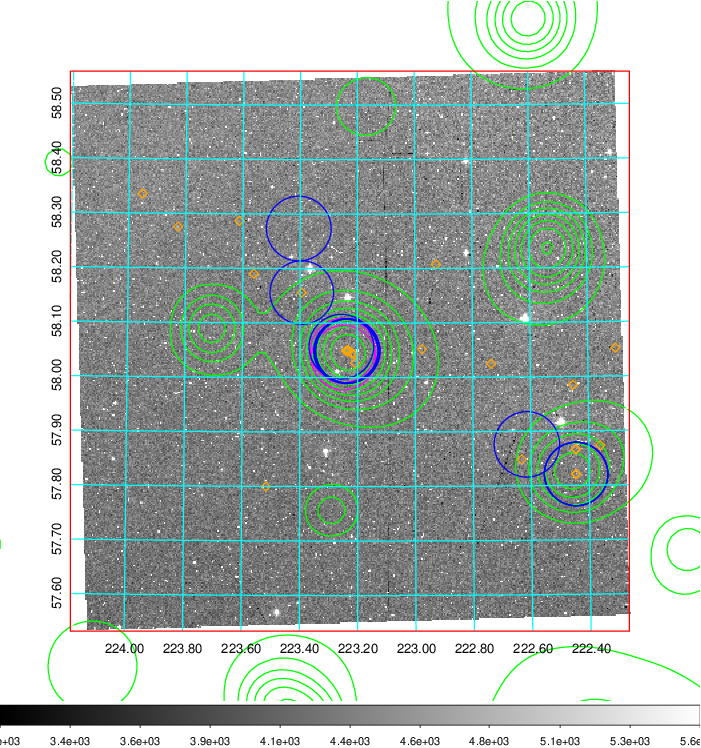  Blue circle for optical clusters;  Magenta circle for XSZ clusters;  all with r=1Mpc;  Only GC with Delta_z<0.01 are shown. | 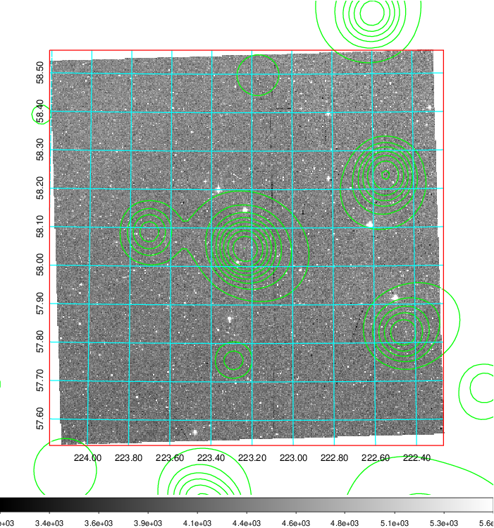 Blue circle for optical clusters;  Magenta circle for XSZ clusters;  all with r=1Mpc;  Only GC with Delta_z<0.01 are shown.  |

|[known Abell/XSZ clusters](../image/577/577_gc.pdf) | [2MASS image](../image/577/577_2mass.pdf)      |[SDSS image](../image/577/577_sdss.pdf)   |
|-------------------|-------------------|-------------------|
|  Magenta, blue and green circles  for optical, X-ray and SZ clusters  respectively, with redshift of clusters  labelled. The radius of circles  are 1Mpc.|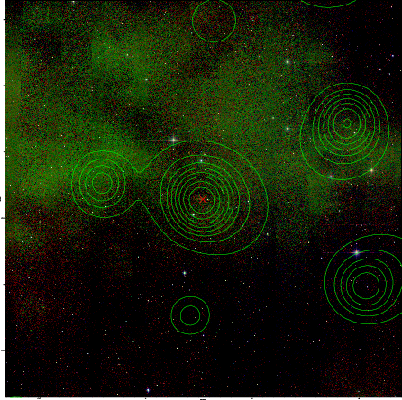  | 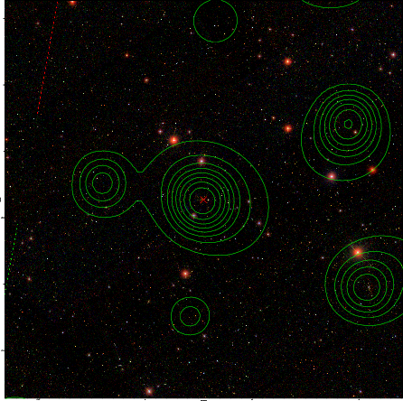  |

