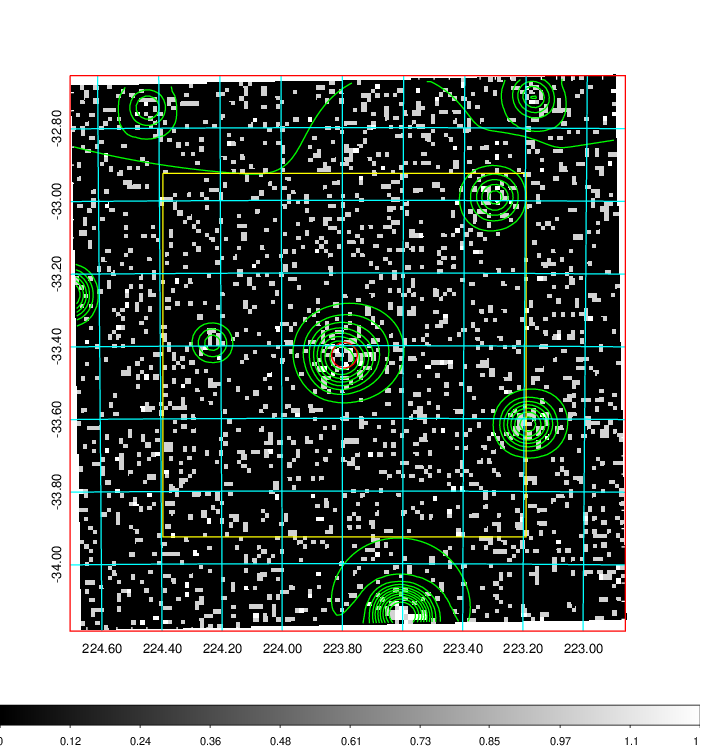
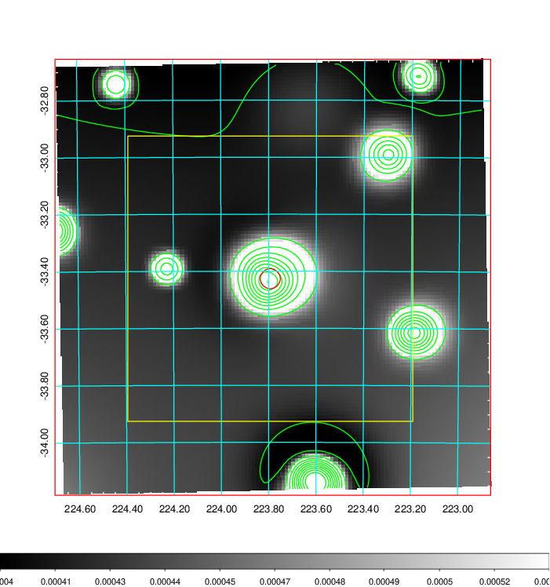
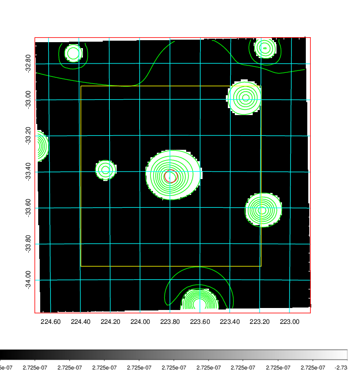
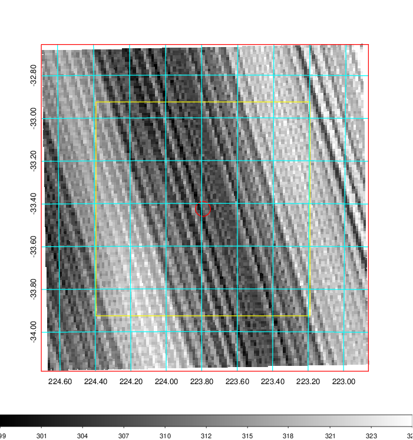
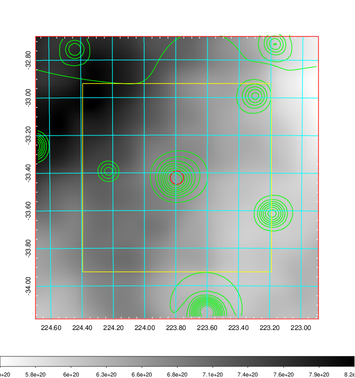
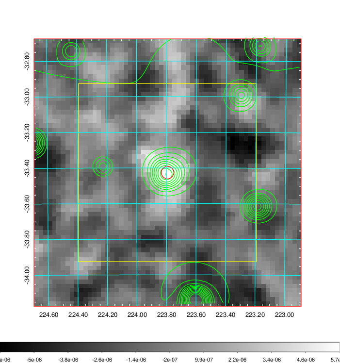
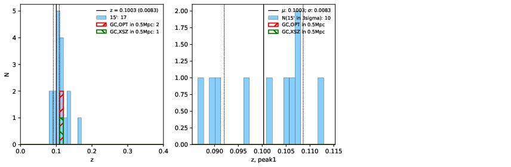
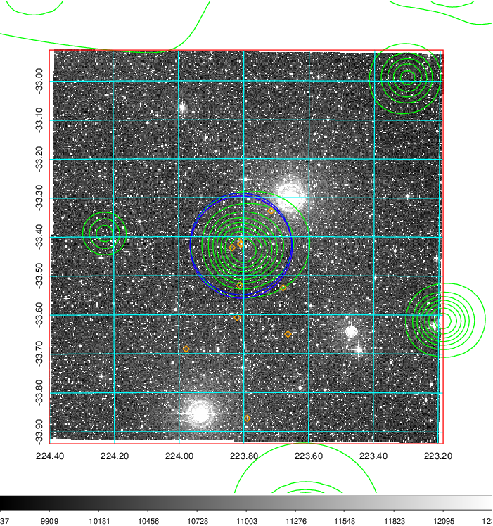
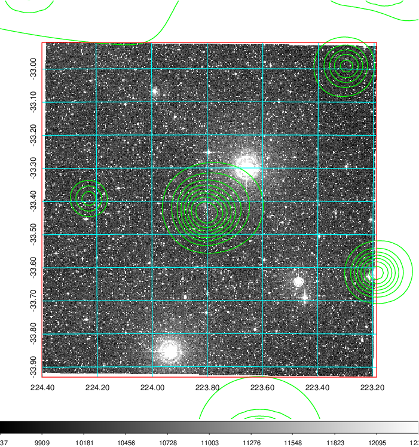
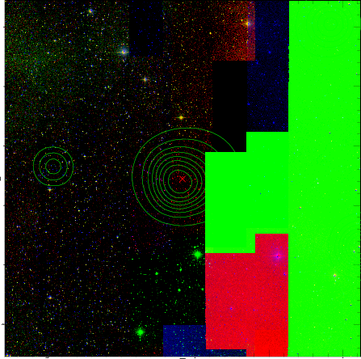

### 579

|Name|RAJ2000[deg]|DEJ2000[deg] |Ext[arcmin]| Ext,ml | z | z_src| C|GC(XSZ,Delta_z<0.01)| GC(OPT,Delta_z<0.01)|GC| R_sig[arcmin] | R500[arcmin] | R500[Mpc]| CRsig[c/s] | CR500[c/s] |L500[1E44 erg/s]|F500[1E-12 erg/s/cm^2]| M500[1E14 Msun]|Tx[keV]|Cnt_sig|Beta|Rc[arcmin]|Comment|Alias|
|---|---|---|---|---|---|------|---|--------|---------|----------|---|---|---|---|---|---|---|---|---|---|---|---|---|---|
|579| 223.793| -33.426| 2.11| 31.37| 0.1158(0.000)| z_xsz| B| MCXC| N, W| MCXC, N, SWXCS, W| 4.900| 7.317| 0.921| 0.148(0.047)| 0.161(0.051)| 0.989(0.134)| 2.848(0.387)| 2.48(0.17)| 3.89(0.17)| 46.9| 0.913(-0.109+0.063)| 3.573(-0.572+0.505)| -| k237|

|[RASS image](../image/579/579_img.pdf)|[filtered image](../image/579/579_fil.pdf)|[Segment image](../image/579/579_seg.pdf)|
|-------------------|--------------------|-------------------|
|   |    |   |

|[Exposure image](../image/579/579_mex.pdf)| [nH image](../image/579/579_nh.pdf)| [Planck image](../image/579/579_p.pdf)|
|-------------------|--------------------|-------------------|
|   |     |  |

|[Redshift Histogram](../image/579/579_zg.pdf) | [DSS image(z1)](../image/579/579_dss_z1.pdf)      |  [DSS image(z2)](../image/579/579_dss_z2.pdf)    |
|-------------------|--------------------|-------------------|
| |  Blue circle for optical clusters;  Magenta circle for XSZ clusters;  all with r=1Mpc;  Only GC with Delta_z<0.01 are shown. |  Blue circle for optical clusters;  Magenta circle for XSZ clusters;  all with r=1Mpc;  Only GC with Delta_z<0.01 are shown.  |

|[Previous-identified clusters](../image/579/579_gc.pdf) | [2MASS image](../image/579/579_2mass.pdf)      |
|-------------------|-------------------|
|  Green, magenta, and blue circles  for optical, X-ray and SZ clusters  respectively, with redshift of clusters  labelled. The radius of circles  are 1Mpc.|  |

