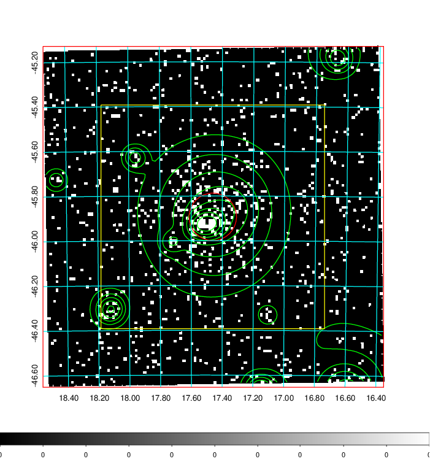
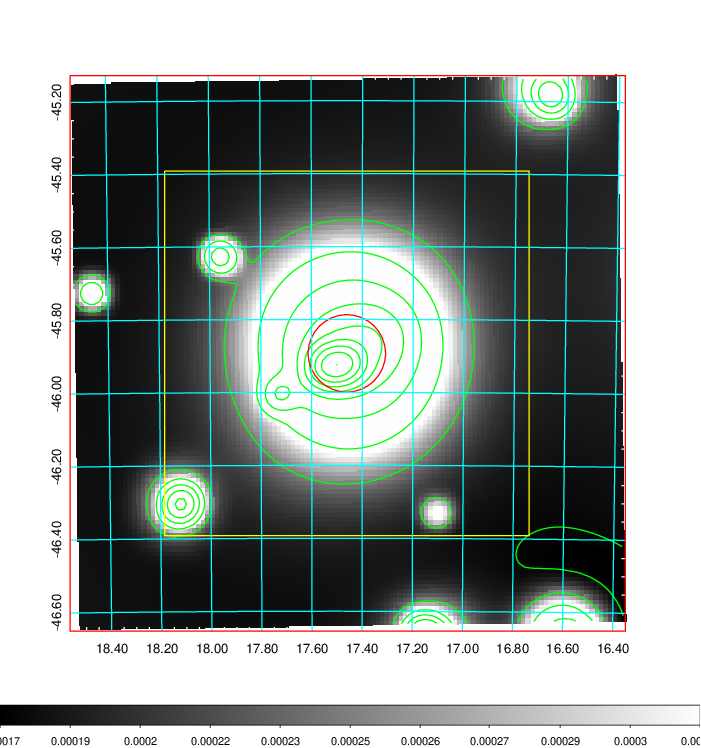
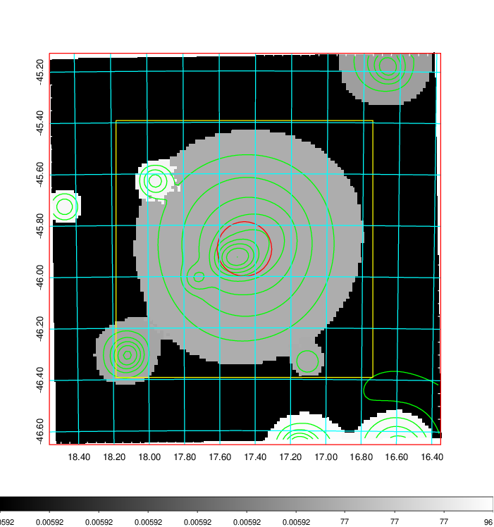
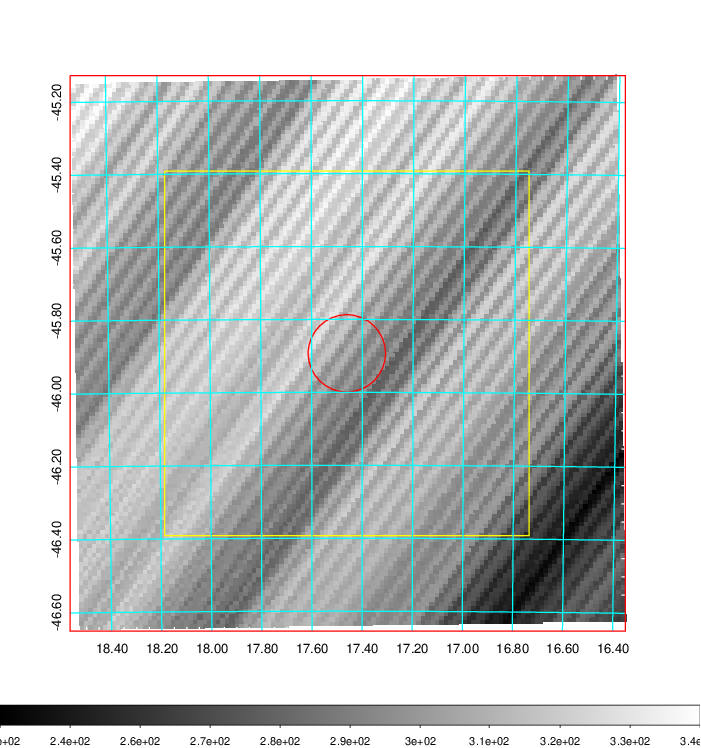
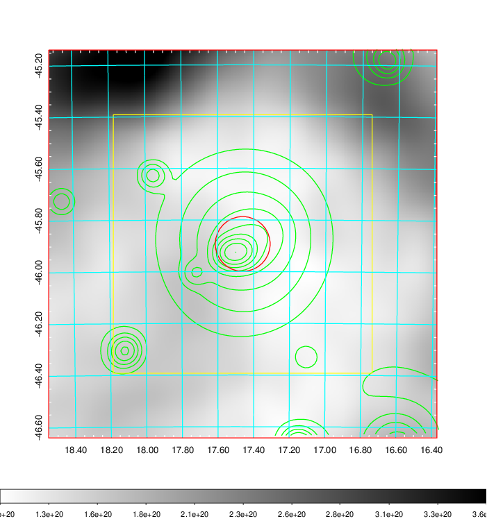
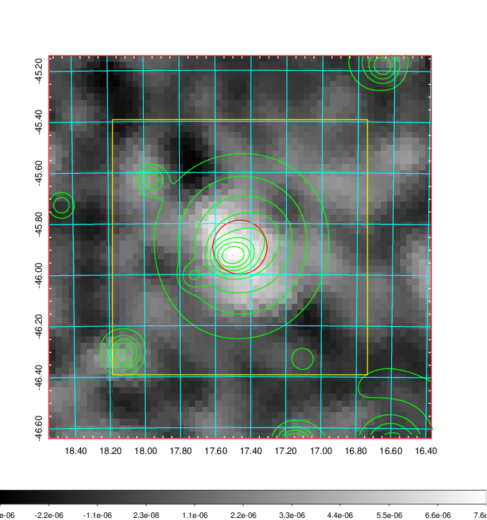
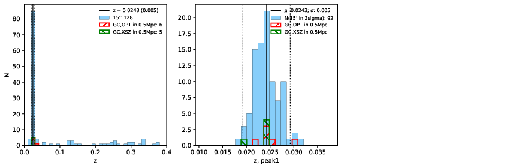
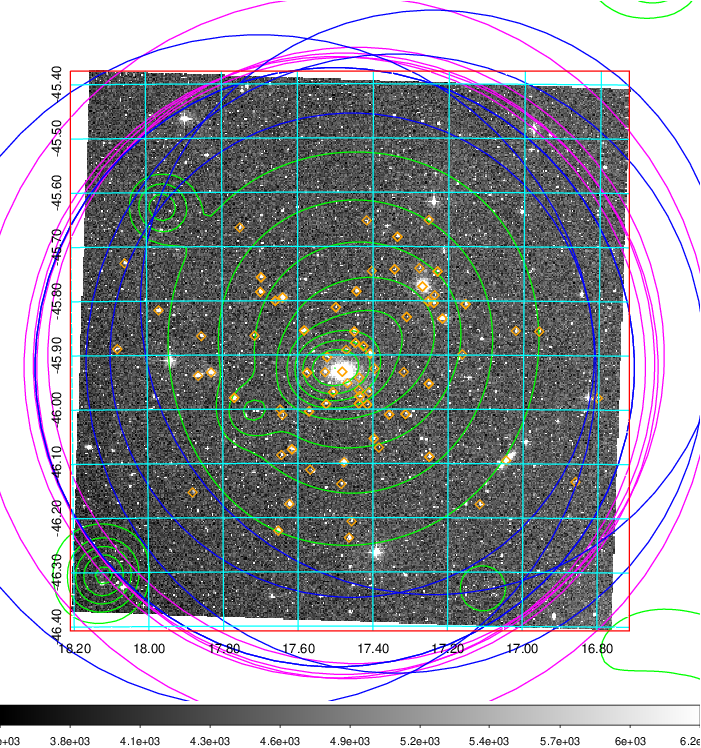
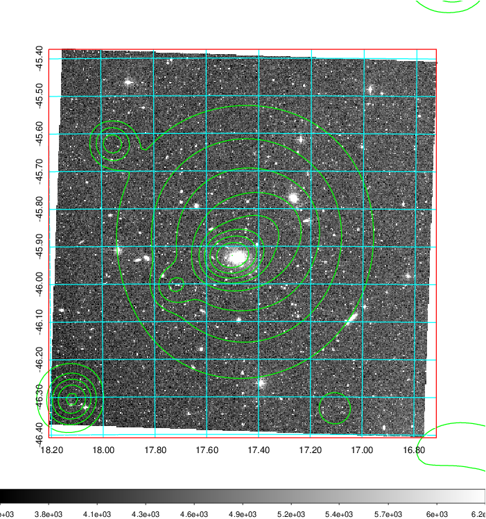
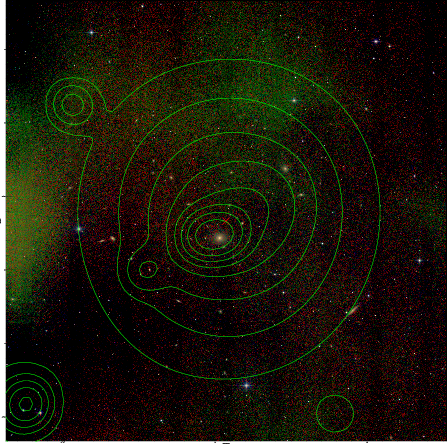

### 58

|Name|RAJ2000[deg]|DEJ2000[deg] |Ext[arcmin]| Ext,ml | z | z_src| C|GC(XSZ,Delta_z<0.01)| GC(OPT,Delta_z<0.01)|GC| R_sig[arcmin] | R500[arcmin] | R500[Mpc]| CRsig[c/s] | CR500[c/s] |L500[1E44 erg/s]|F500[1E-12 erg/s/cm^2]| M500[1E14 Msun]|Tx[keV]|Cnt_sig|Beta|Rc[arcmin]|Comment|Alias|
|---|---|---|---|---|---|------|---|--------|---------|----------|---|---|---|---|---|---|---|---|---|---|---|---|---|---|
|58| 17.461| -45.893| 6.36| 229.73| 0.0243(0.005)| z1, z_xsz| B| MCXC, PSZ2, Tar, XB| A, N| A, MCXC, N, PSZ2, SWXCS, Tar, XB| 17.294| 22.672| 0.666| 0.758(0.085)| 0.799(0.090)| 0.195(0.015)| 14.492(1.111)| 0.86(0.03)| 1.97(0.05)| 223.2| 0.964(-0.050+0.026)| 10.813(-0.641+0.454)| -| k548|

|[RASS image](../image/58/58_img.pdf)|[filtered image](../image/58/58_fil.pdf)|[Segment image](../image/58/58_seg.pdf)|
|-------------------|--------------------|-------------------|
|   |    |   |

|[Exposure image](../image/58/58_mex.pdf)| [nH image](../image/58/58_nh.pdf)| [Planck image](../image/58/58_p.pdf)|
|-------------------|--------------------|-------------------|
|   |     |  |

|[Redshift Histogram](../image/58/58_zg.pdf) | [DSS image(z1)](../image/58/58_dss_z1.pdf)      |  [DSS image(z2)](../image/58/58_dss_z2.pdf)    |
|-------------------|--------------------|-------------------|
| |  Blue circle for optical clusters;  Magenta circle for XSZ clusters;  all with r=1Mpc;  Only GC with Delta_z<0.01 are shown. |  Blue circle for optical clusters;  Magenta circle for XSZ clusters;  all with r=1Mpc;  Only GC with Delta_z<0.01 are shown.  |

|[known Abell/XSZ clusters](../image/58/58_gc.pdf) | [2MASS image](../image/58/58_2mass.pdf)      |
|-------------------|-------------------|
|  Magenta, blue and green circles  for optical, X-ray and SZ clusters  respectively, with redshift of clusters  labelled. The radius of circles  are 1Mpc.|  |

|[DES image](../image/58/58_des.pdf)   |
|-------------------|
|   |
