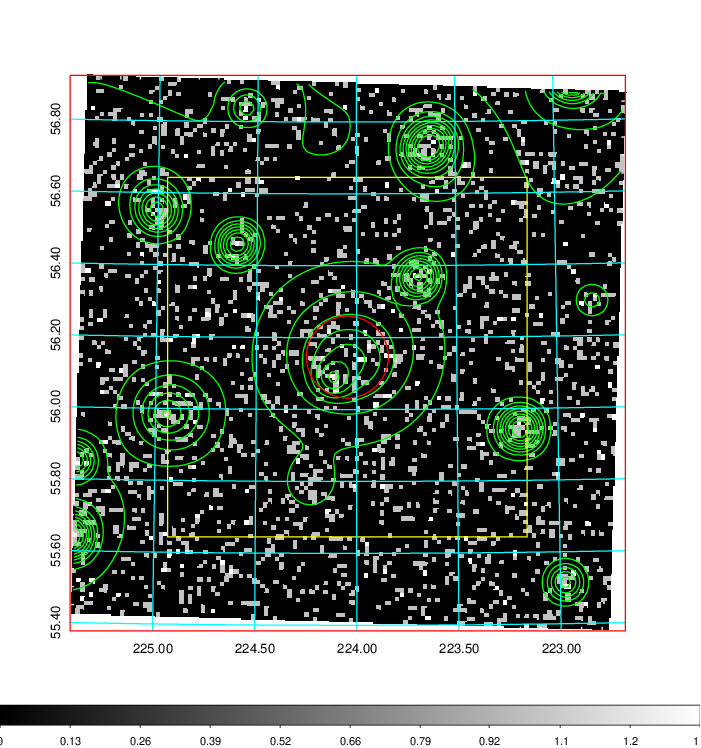
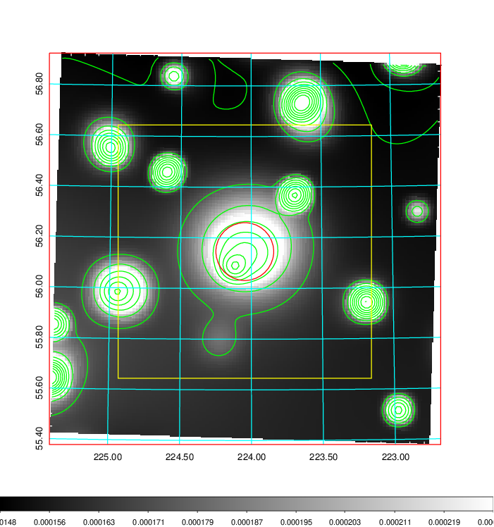
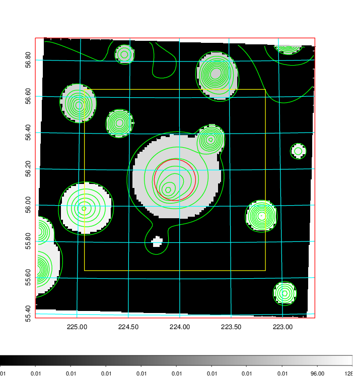
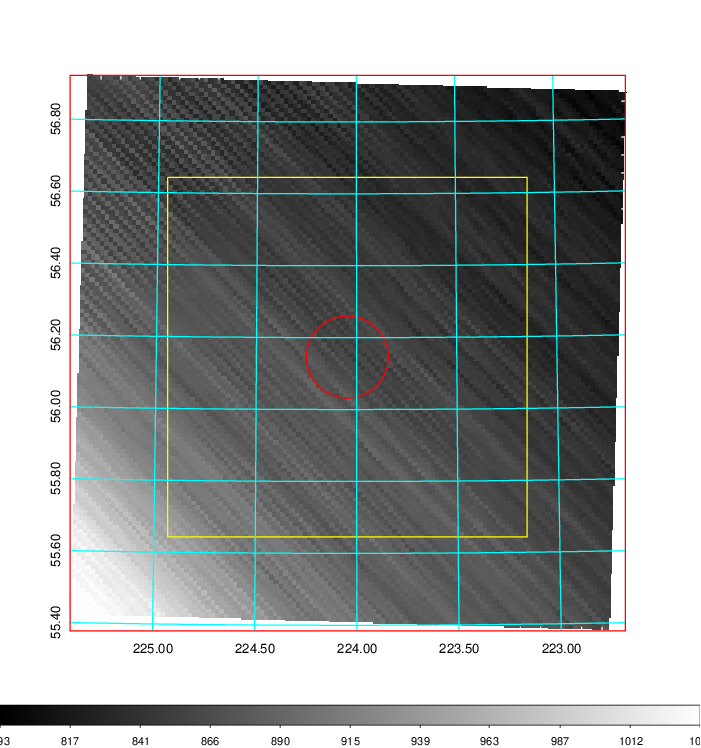
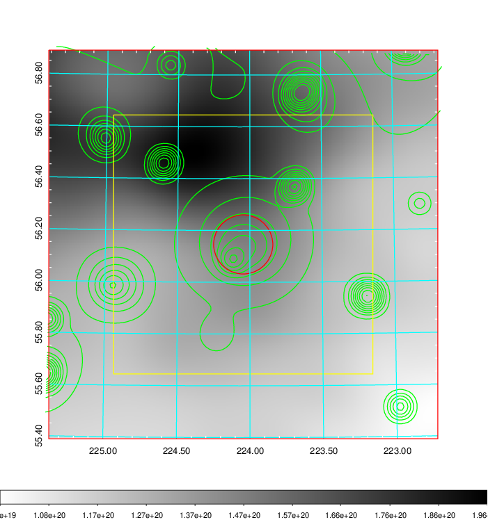
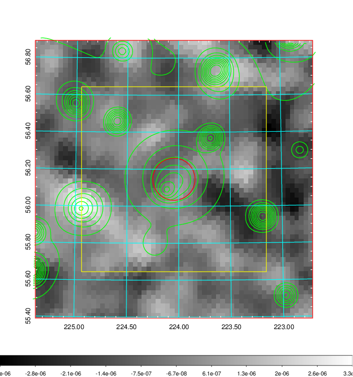
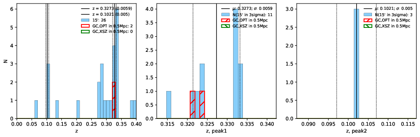
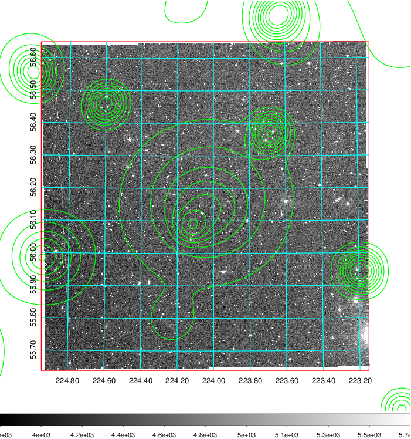
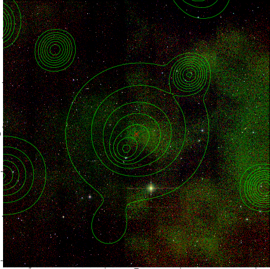
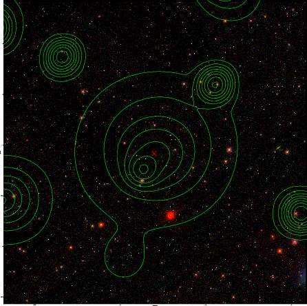

### 580

|Name|RAJ2000[deg]|DEJ2000[deg] |Ext[arcmin]| Ext,ml | z | z_src| C|GC(XSZ,Delta_z<0.01)| GC(OPT,Delta_z<0.01)|GC| R_sig[arcmin] | R500[arcmin] | R500[Mpc]| CRsig[c/s] | CR500[c/s] |L500[1E44 erg/s]|F500[1E-12 erg/s/cm^2]| M500[1E14 Msun]|Tx[keV]|Cnt_sig|Beta|Rc[arcmin]|Comment|Alias|
|---|---|---|---|---|---|------|---|--------|---------|----------|---|---|---|---|---|---|---|---|---|---|---|---|---|---|
|580| 224.046| 56.146| 6.85| 31.96| 0.3273(0.006)| z1, z_opt| S| -| W| C, N, W| 17.788| 3.938| 1.117| 0.089(0.039)| 0.079(0.035)| 5.771(5.660)| 1.635(1.604)| 5.56(2.50)| 6.88(1.99)| 95.7| 0.830(-0.117+0.117)| 7.928(-1.238+1.073)| -| t340|

|[RASS image](../image/580/580_img.pdf)|[filtered image](../image/580/580_fil.pdf)|[Segment image](../image/580/580_seg.pdf)|
|-------------------|--------------------|-------------------|
|   |    |   |

|[Exposure image](../image/580/580_mex.pdf)| [nH image](../image/580/580_nh.pdf)| [Planck image](../image/580/580_p.pdf)|
|-------------------|--------------------|-------------------|
|   |     |  |

|[Redshift Histogram](../image/580/580_zg.pdf) | [DSS image(z1)](../image/580/580_dss_z1.pdf)      |  [DSS image(z2)](../image/580/580_dss_z2.pdf)    |
|-------------------|--------------------|-------------------|
| |  Blue circle for optical clusters;  Magenta circle for XSZ clusters;  all with r=1Mpc;  Only GC with Delta_z<0.01 are shown. |  Blue circle for optical clusters;  Magenta circle for XSZ clusters;  all with r=1Mpc;  Only GC with Delta_z<0.01 are shown.  |

|[known Abell/XSZ clusters](../image/580/580_gc.pdf) | [2MASS image](../image/580/580_2mass.pdf)      |[SDSS image](../image/580/580_sdss.pdf)   |
|-------------------|-------------------|-------------------|
|  Magenta, blue and green circles  for optical, X-ray and SZ clusters  respectively, with redshift of clusters  labelled. The radius of circles  are 1Mpc.|  |   |

