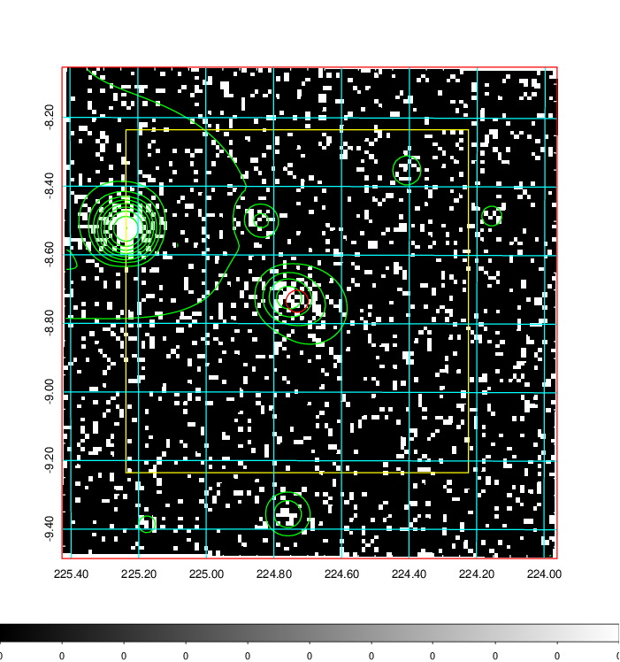
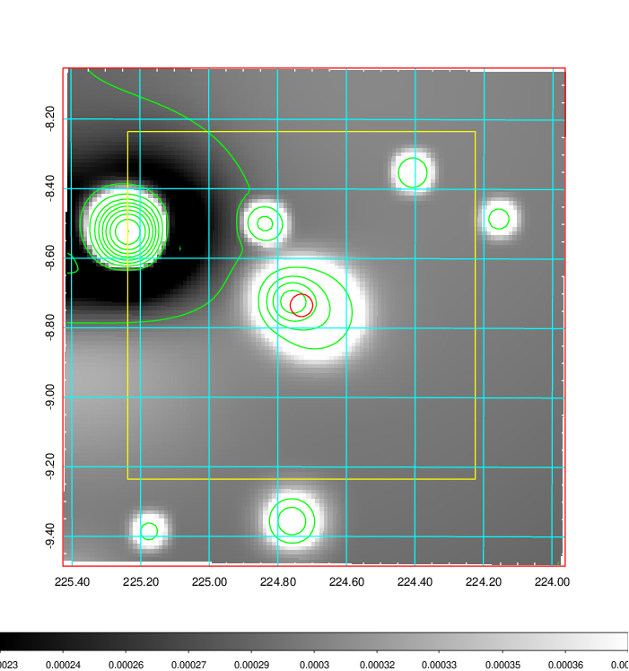
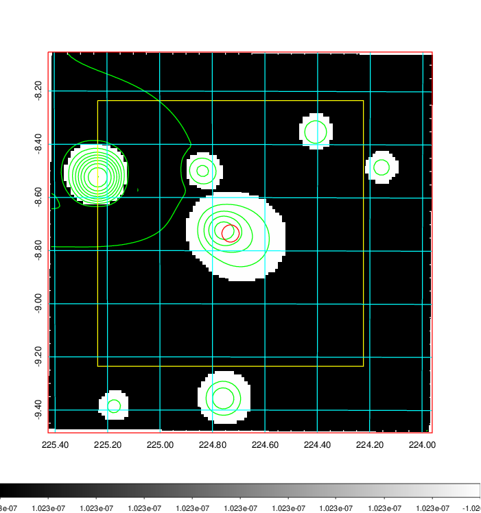
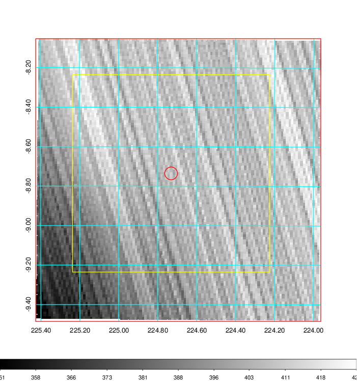
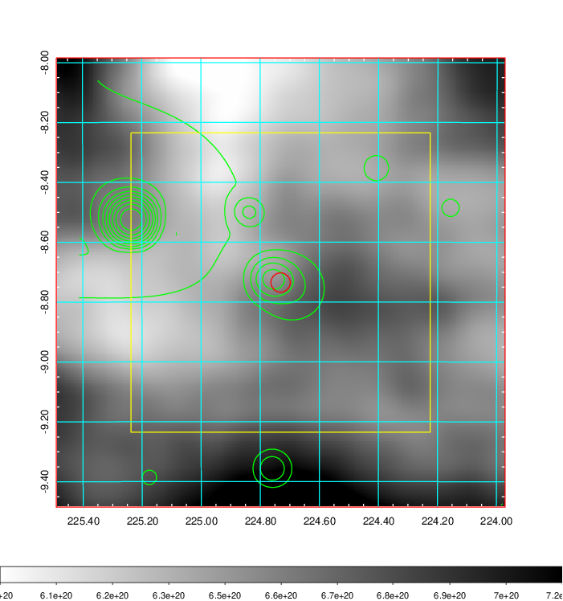
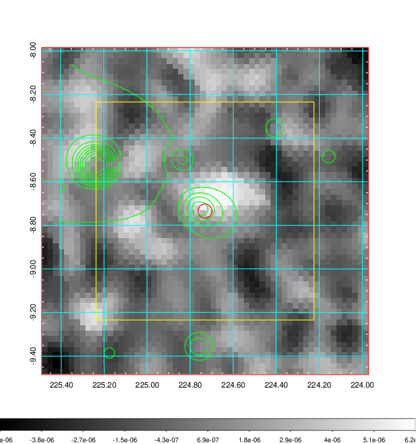
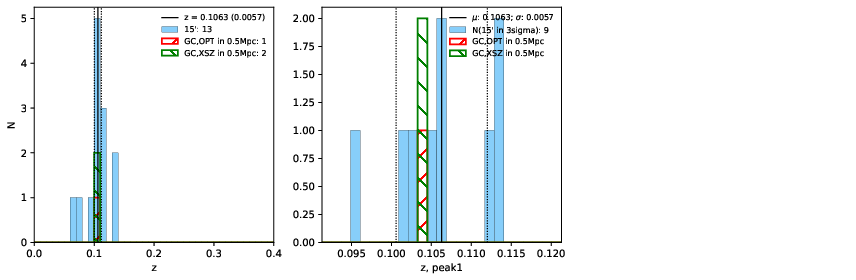
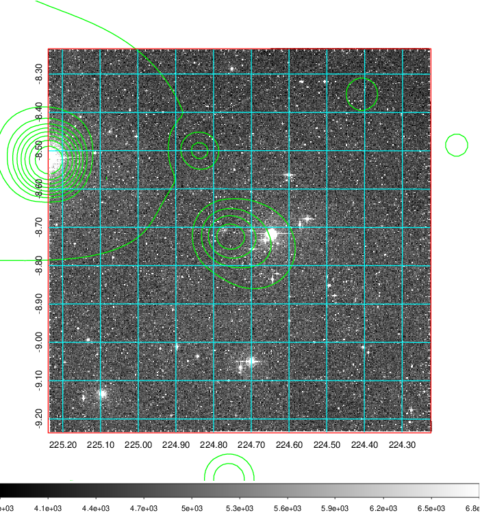
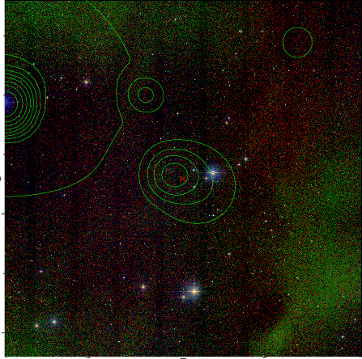
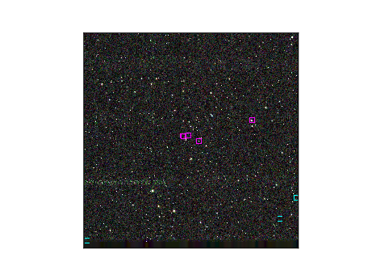

### 581

|Name|RAJ2000[deg]|DEJ2000[deg] |Ext[arcmin]| Ext,ml | z | z_src| C|GC(XSZ,Delta_z<0.01)| GC(OPT,Delta_z<0.01)|GC| R_sig[arcmin] | R500[arcmin] | R500[Mpc]| CRsig[c/s] | CR500[c/s] |L500[1E44 erg/s]|F500[1E-12 erg/s/cm^2]| M500[1E14 Msun]|Tx[keV]|Cnt_sig|Beta|Rc[arcmin]|Comment|Alias|
|---|---|---|---|---|---|------|---|--------|---------|----------|---|---|---|---|---|---|---|---|---|---|---|---|---|---|
|581| 224.731| -8.735| 1.94| 25.74| 0.1063(0.006)| z1, z_xsz| B| MCXC, Tar| N| MCXC, N, Tar| 39.610| 8.945| 1.045| 0.391(0.100)| 0.346(0.088)| 1.792(0.380)| 6.204(1.315)| 3.59(0.37)| 4.87(0.32)| 396.5| 0.504(-0.003+0.007)| 2.012(-0.210+0.240)| -| k205|

|[RASS image](../image/581/581_img.pdf)|[filtered image](../image/581/581_fil.pdf)|[Segment image](../image/581/581_seg.pdf)|
|-------------------|--------------------|-------------------|
|   |    |   |

|[Exposure image](../image/581/581_mex.pdf)| [nH image](../image/581/581_nh.pdf)| [Planck image](../image/581/581_p.pdf)|
|-------------------|--------------------|-------------------|
|   |     |  |

|[Redshift Histogram](../image/581/581_zg.pdf) | [DSS image(z1)](../image/581/581_dss_z1.pdf)      |  [DSS image(z2)](../image/581/581_dss_z2.pdf)    |
|-------------------|--------------------|-------------------|
| |  Blue circle for optical clusters;  Magenta circle for XSZ clusters;  all with r=1Mpc;  Only GC with Delta_z<0.01 are shown. |  Blue circle for optical clusters;  Magenta circle for XSZ clusters;  all with r=1Mpc;  Only GC with Delta_z<0.01 are shown.  |

|[Previous-identified clusters](../image/581/581_gc.pdf) | [2MASS image](../image/581/581_2mass.pdf)      |
|-------------------|-------------------|
|  Green, magenta, and blue circles  for optical, X-ray and SZ clusters  respectively, with redshift of clusters  labelled. The radius of circles  are 1Mpc.|  |

|[ATLAS image](../image/581/581_s.pdf)        |
|-------------------|
|   |
