

### 582

|Name|RAJ2000[deg]|DEJ2000[deg] |Ext[arcmin]| Ext,ml | z | z_src| C|GC(XSZ,Delta_z<0.01)| GC(OPT,Delta_z<0.01)|GC| R_sig[arcmin] | R500[arcmin] | R500[Mpc]| CRsig[c/s] | CR500[c/s] |L500[1E44 erg/s]|F500[1E-12 erg/s/cm^2]| M500[1E14 Msun]|Tx[keV]|Cnt_sig|Beta|Rc[arcmin]|Comment|Alias|
|---|---|---|---|---|---|------|---|--------|---------|----------|---|---|---|---|---|---|---|---|---|---|---|---|---|---|
|582| 224.986| 37.525| 10.35| 45.21| 0.1526(0.005)| z1, z_opt| S| -| N, W| C, F20, N, SPI, W| 21.244| 6.414| 1.021| 0.198(0.045)| 0.178(0.040)| 2.288(1.185)| 3.621(1.875)| 3.51(0.89)| 4.88(0.78)| 136.0| 0.914(-0.107+0.062)| 16.787(-2.010+1.425)| -| t453|

|[RASS image](../image/582/582_img.pdf)|[filtered image](../image/582/582_fil.pdf)|[Segment image](../image/582/582_seg.pdf)|
|-------------------|--------------------|-------------------|
| 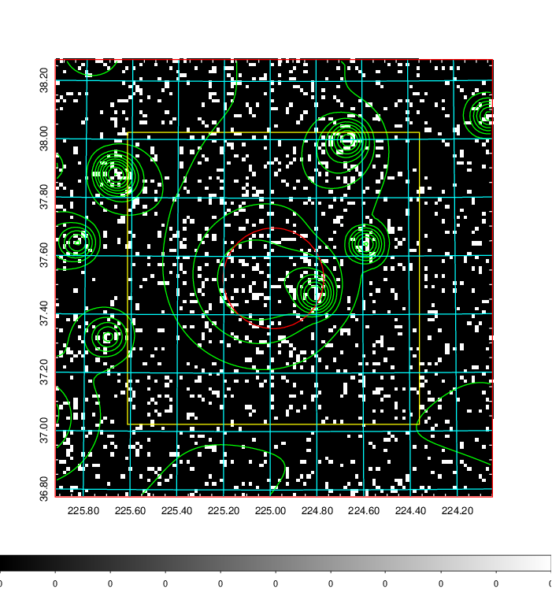  | 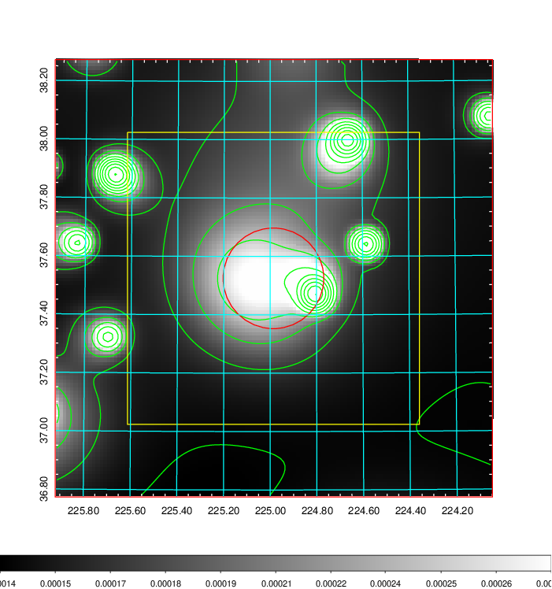   | 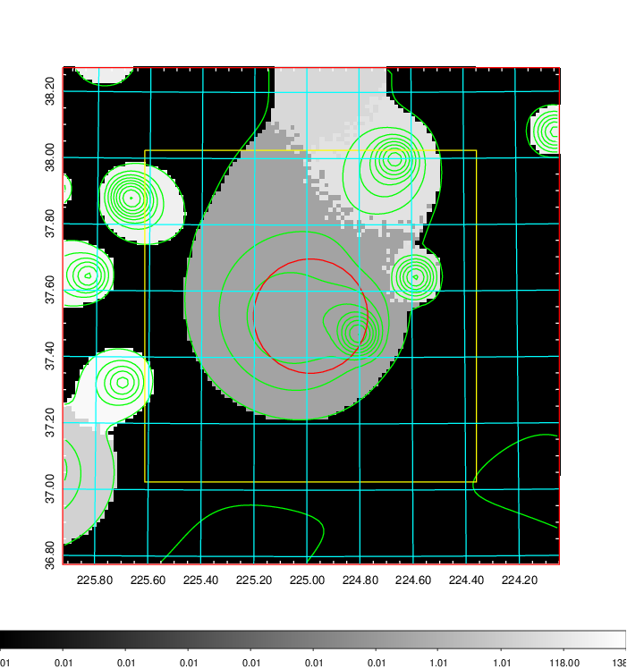  |

|[Exposure image](../image/582/582_mex.pdf)| [nH image](../image/582/582_nh.pdf)| [Planck image](../image/582/582_p.pdf)|
|-------------------|--------------------|-------------------|
|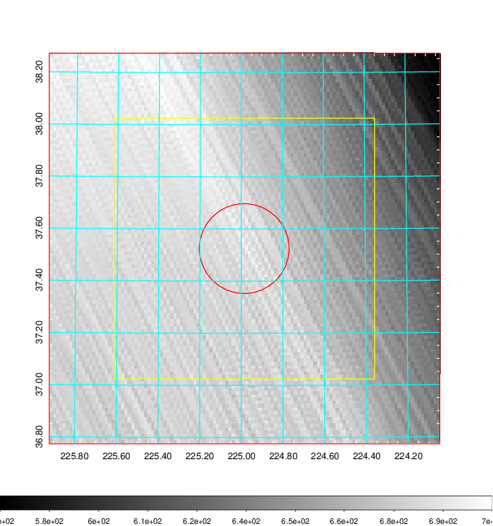   | 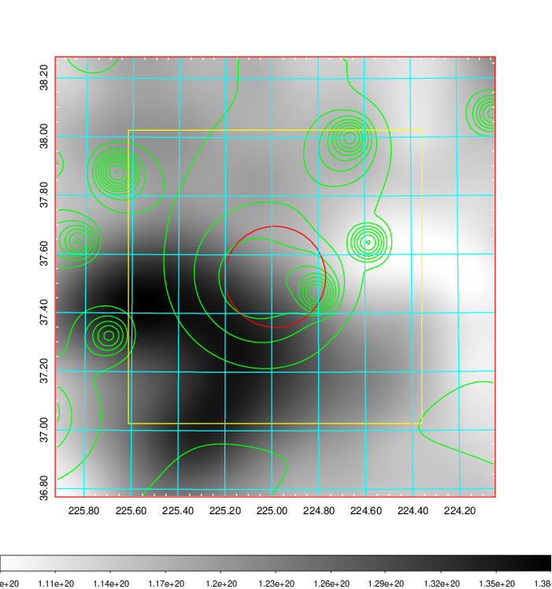    | 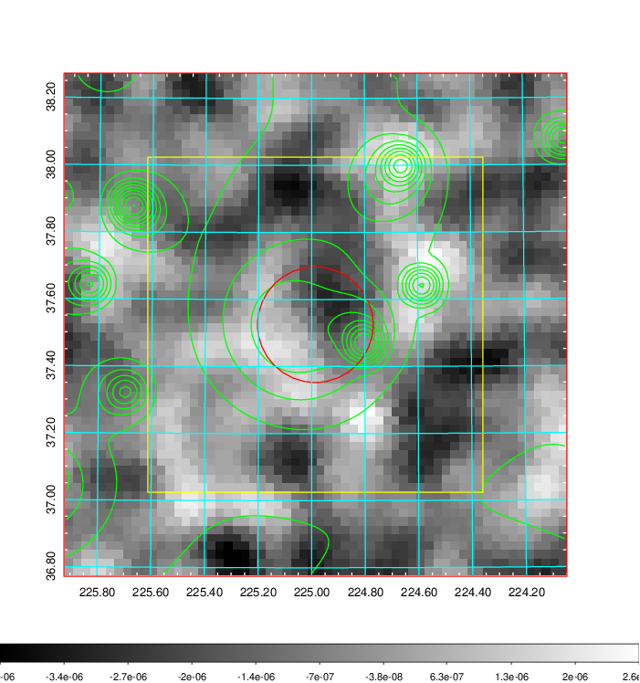 |

|[Redshift Histogram](../image/582/582_zg.pdf) | [DSS image(z1)](../image/582/582_dss_z1.pdf)      |  [DSS image(z2)](../image/582/582_dss_z2.pdf)    |
|-------------------|--------------------|-------------------|
|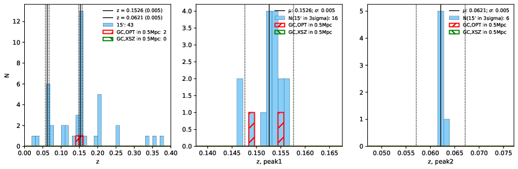 |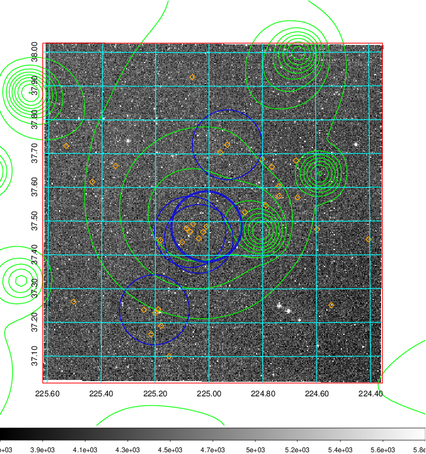  Blue circle for optical clusters;  Magenta circle for XSZ clusters;  all with r=1Mpc;  Only GC with Delta_z<0.01 are shown. | 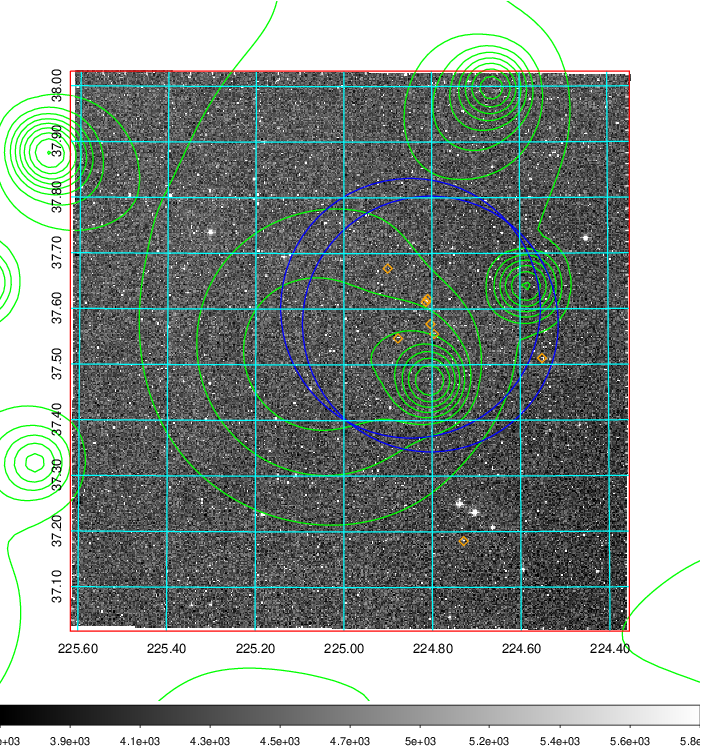 Blue circle for optical clusters;  Magenta circle for XSZ clusters;  all with r=1Mpc;  Only GC with Delta_z<0.01 are shown.  |

|[known Abell/XSZ clusters](../image/582/582_gc.pdf) | [2MASS image](../image/582/582_2mass.pdf)      |[SDSS image](../image/582/582_sdss.pdf)   |
|-------------------|-------------------|-------------------|
|  Magenta, blue and green circles  for optical, X-ray and SZ clusters  respectively, with redshift of clusters  labelled. The radius of circles  are 1Mpc.|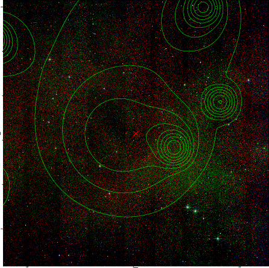  | 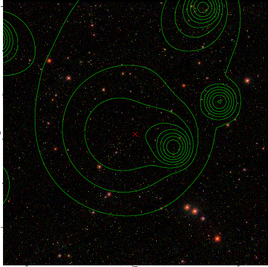  |

