

### 584

|Name|RAJ2000[deg]|DEJ2000[deg] |Ext[arcmin]| Ext,ml | z | z_src| C|GC(XSZ,Delta_z<0.01)| GC(OPT,Delta_z<0.01)|GC| R_sig[arcmin] | R500[arcmin] | R500[Mpc]| CRsig[c/s] | CR500[c/s] |L500[1E44 erg/s]|F500[1E-12 erg/s/cm^2]| M500[1E14 Msun]|Tx[keV]|Cnt_sig|Beta|Rc[arcmin]|Comment|Alias|
|---|---|---|---|---|---|------|---|--------|---------|----------|---|---|---|---|---|---|---|---|---|---|---|---|---|---|
|584| 225.244| 47.269| 4.11| 159.52| 0.0881(0.005)| z1, z_xsz| B| F20, L03, PSZ2, SPI, Tar| A, N, RM| A, C, F20, L03, N, PSZ2, SPI, Tar, W| 10.750| 8.507| 0.841| 0.198(0.028)| 0.192(0.027)| 0.688(0.064)| 3.552(0.329)| 1.84(0.09)| 3.20(0.09)| 153.3| 0.914(-0.103+0.062)| 6.492(-0.824+0.587)| -| k485|

|[RASS image](../image/584/584_img.pdf)|[filtered image](../image/584/584_fil.pdf)|[Segment image](../image/584/584_seg.pdf)|
|-------------------|--------------------|-------------------|
| 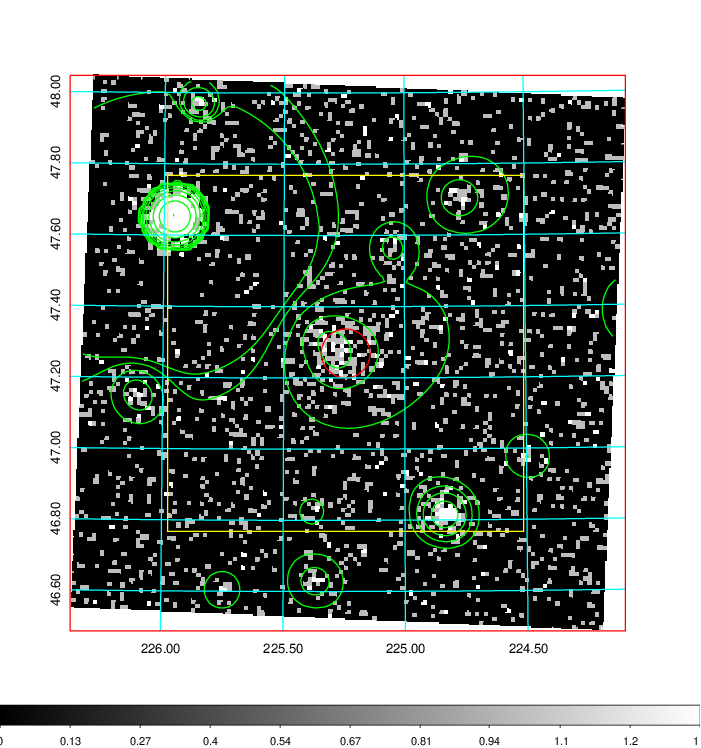  | 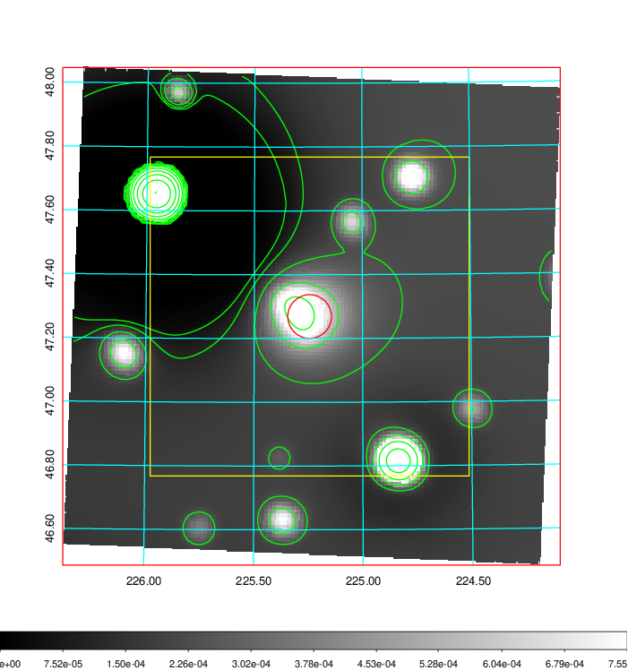   | 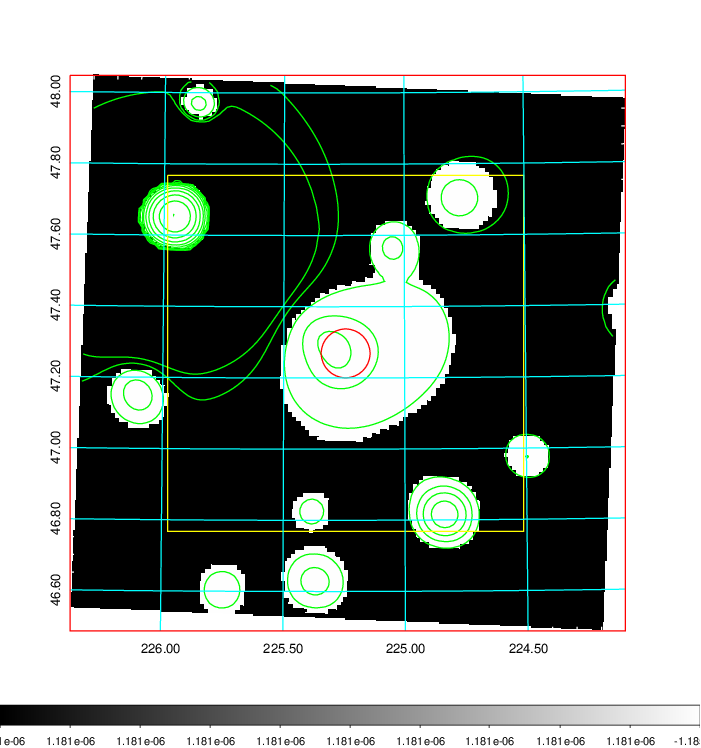  |

|[Exposure image](../image/584/584_mex.pdf)| [nH image](../image/584/584_nh.pdf)| [Planck image](../image/584/584_p.pdf)|
|-------------------|--------------------|-------------------|
|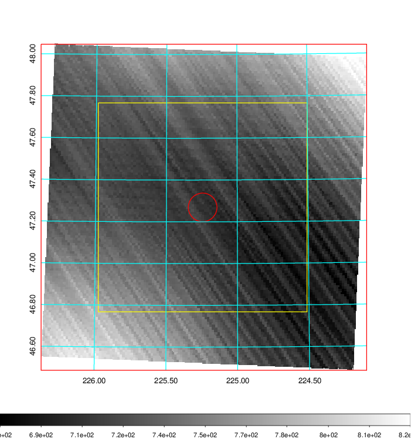   | 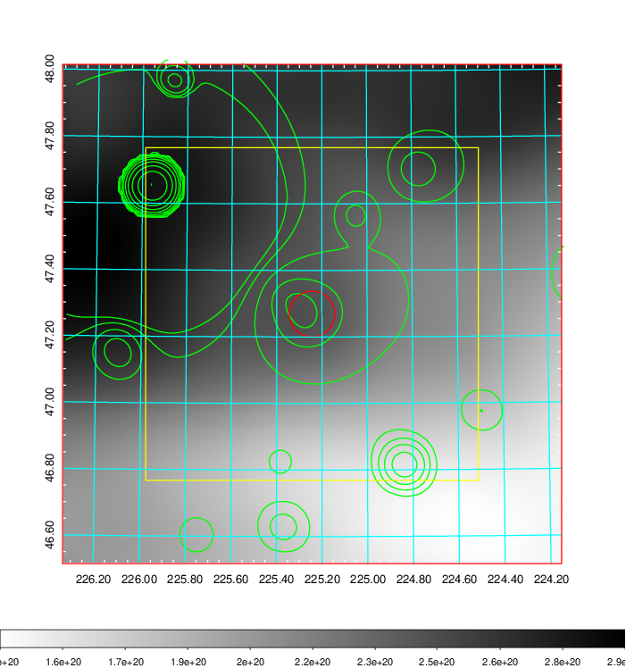    | 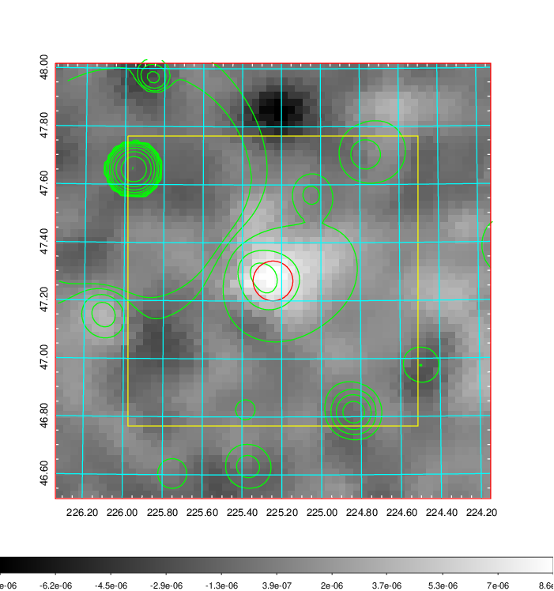 |

|[Redshift Histogram](../image/584/584_zg.pdf) | [DSS image(z1)](../image/584/584_dss_z1.pdf)      |  [DSS image(z2)](../image/584/584_dss_z2.pdf)    |
|-------------------|--------------------|-------------------|
|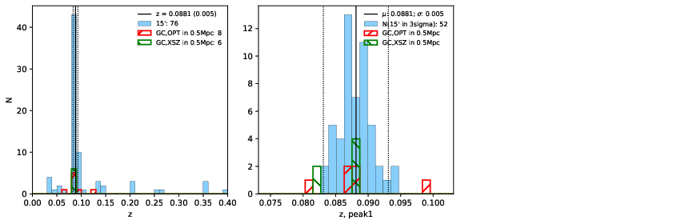 |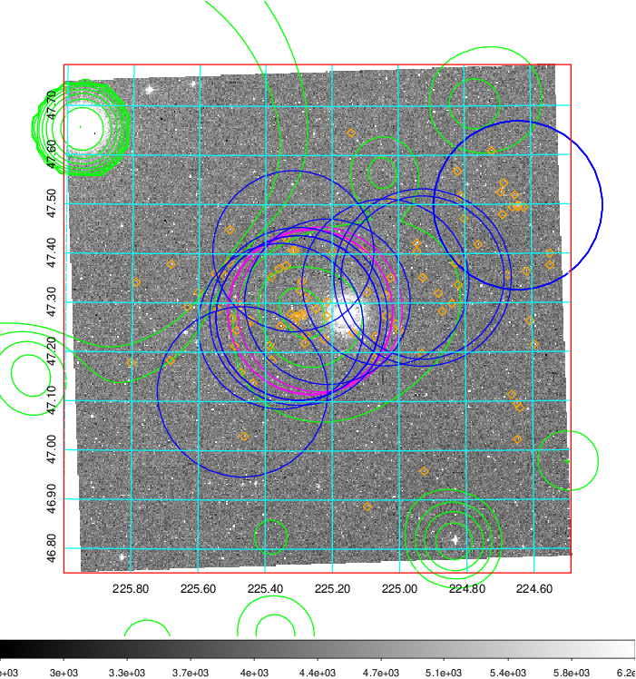  Blue circle for optical clusters;  Magenta circle for XSZ clusters;  all with r=1Mpc;  Only GC with Delta_z<0.01 are shown. | 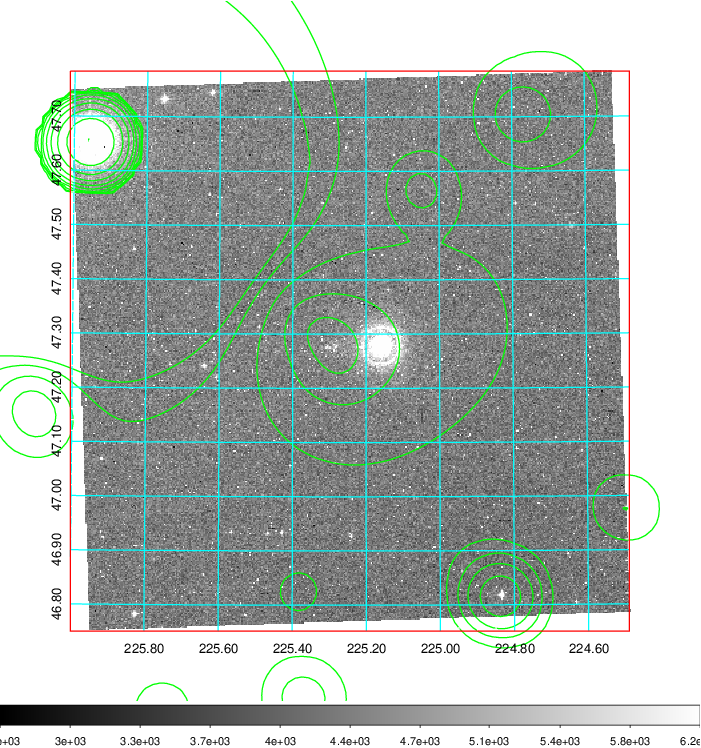 Blue circle for optical clusters;  Magenta circle for XSZ clusters;  all with r=1Mpc;  Only GC with Delta_z<0.01 are shown.  |

|[Previous-identified clusters](../image/584/584_gc.pdf) | [2MASS image](../image/584/584_2mass.pdf)      |[SDSS image](../image/584/584_sdss.pdf)   |
|-------------------|-------------------|-------------------|
|  Green, magenta, and blue circles  for optical, X-ray and SZ clusters  respectively, with redshift of clusters  labelled. The radius of circles  are 1Mpc.|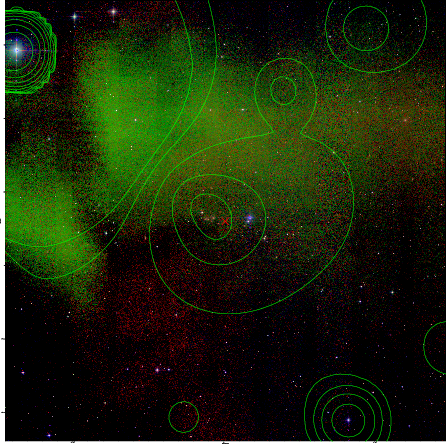  | 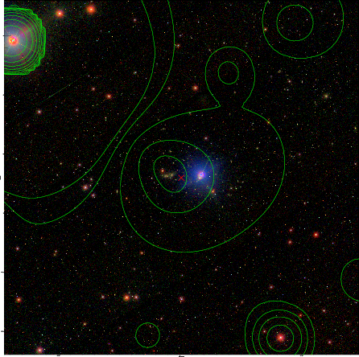  |

