

### 585

|Name|RAJ2000[deg]|DEJ2000[deg] |Ext[arcmin]| Ext,ml | z | z_src| C|GC(XSZ,Delta_z<0.01)| GC(OPT,Delta_z<0.01)|GC| R_sig[arcmin] | R500[arcmin] | R500[Mpc]| CRsig[c/s] | CR500[c/s] |L500[1E44 erg/s]|F500[1E-12 erg/s/cm^2]| M500[1E14 Msun]|Tx[keV]|Cnt_sig|Beta|Rc[arcmin]|Comment|Alias|
|---|---|---|---|---|---|------|---|--------|---------|----------|---|---|---|---|---|---|---|---|---|---|---|---|---|---|
|585| 225.303| 1.699| 1.07| 96.95| 0.0065(0.005)| z1, z_xsz| B| MCXC| N| C, MCXC, N, W| 38.125| 52.369| 0.421| 1.060(0.128)| 1.130(0.136)| 0.013(0.001)| 14.236(1.285)| 0.21(0.01)| 0.83(0.02)| 391.5| 0.677(-0.030+0.036)| 2.026(-0.255+0.284)| -| k038|

|[RASS image](../image/585/585_img.pdf)|[filtered image](../image/585/585_fil.pdf)|[Segment image](../image/585/585_seg.pdf)|
|-------------------|--------------------|-------------------|
| 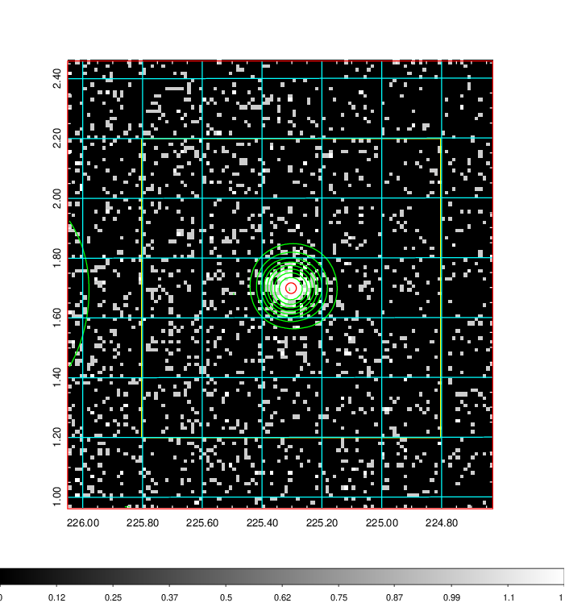  | 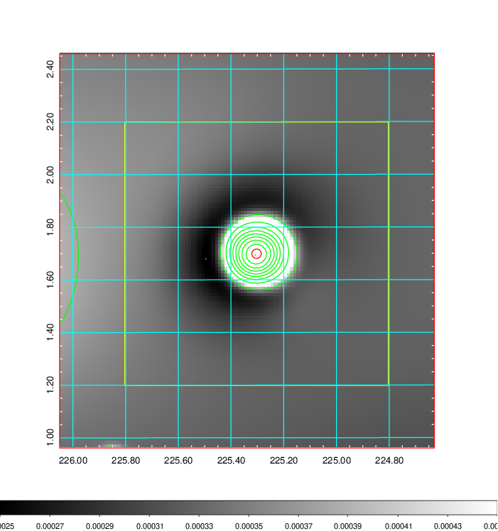   | 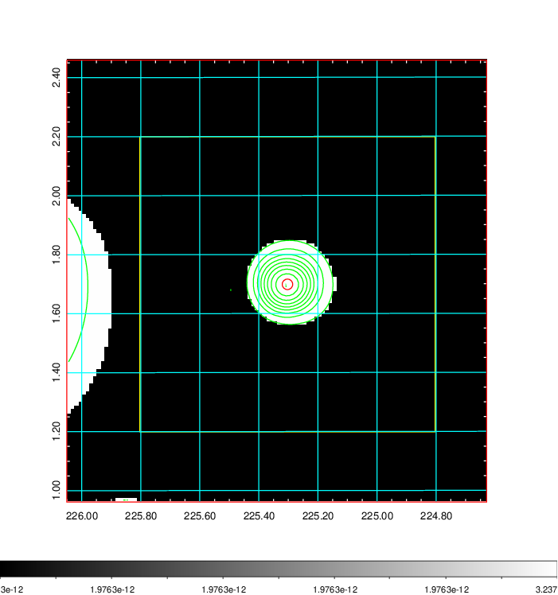  |

|[Exposure image](../image/585/585_mex.pdf)| [nH image](../image/585/585_nh.pdf)| [Planck image](../image/585/585_p.pdf)|
|-------------------|--------------------|-------------------|
|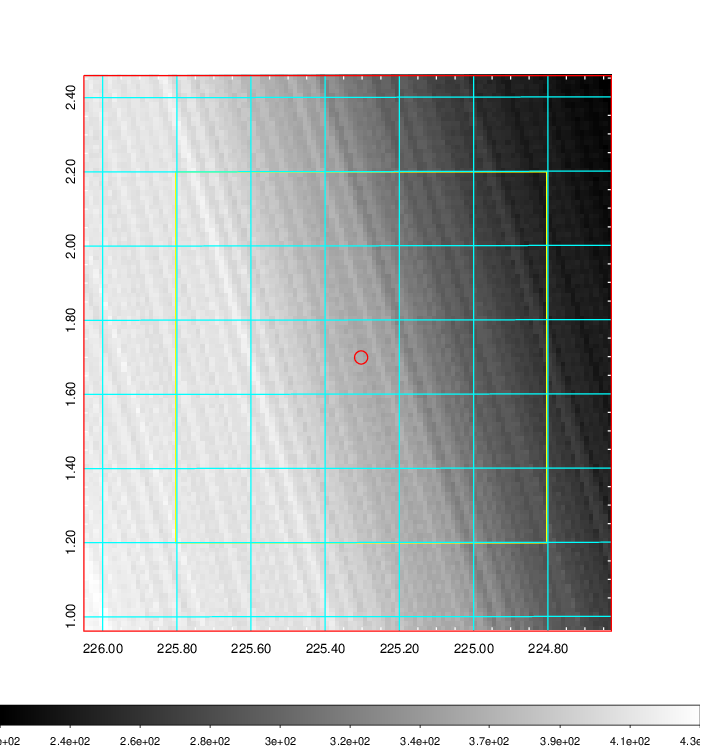   | 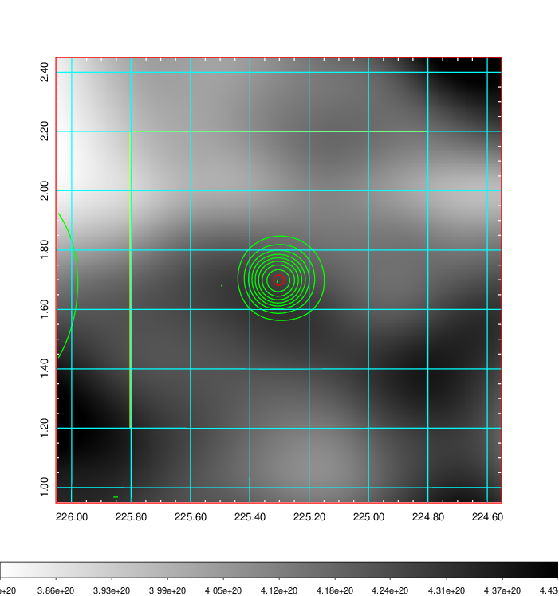    | 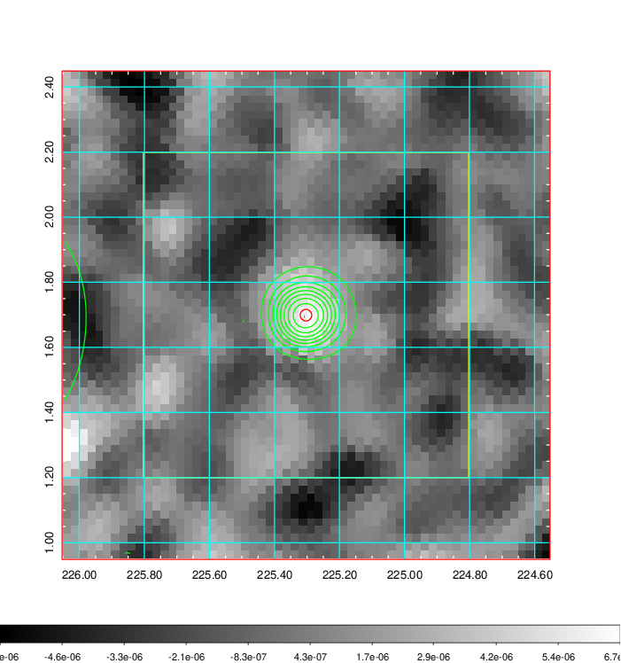 |

|[Redshift Histogram](../image/585/585_zg.pdf) | [DSS image(z1)](../image/585/585_dss_z1.pdf)      |  [DSS image(z2)](../image/585/585_dss_z2.pdf)    |
|-------------------|--------------------|-------------------|
|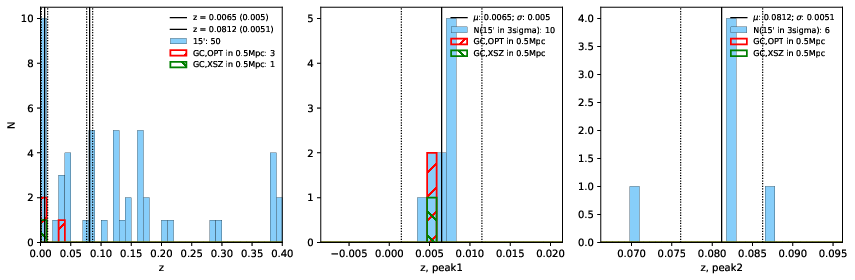 |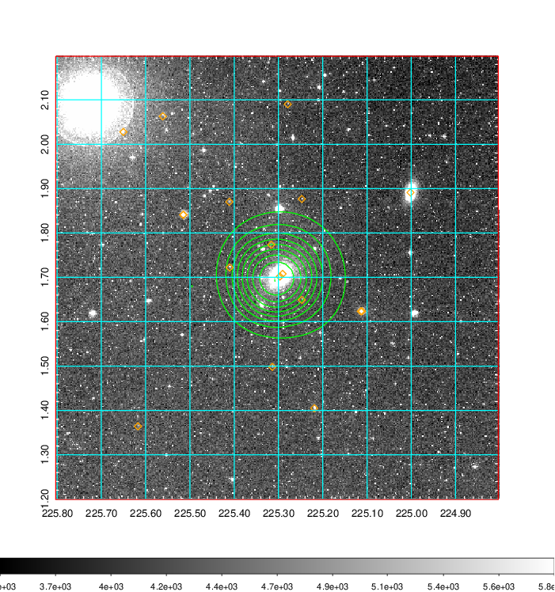  Blue circle for optical clusters;  Magenta circle for XSZ clusters;  all with r=1Mpc;  Only GC with Delta_z<0.01 are shown. | 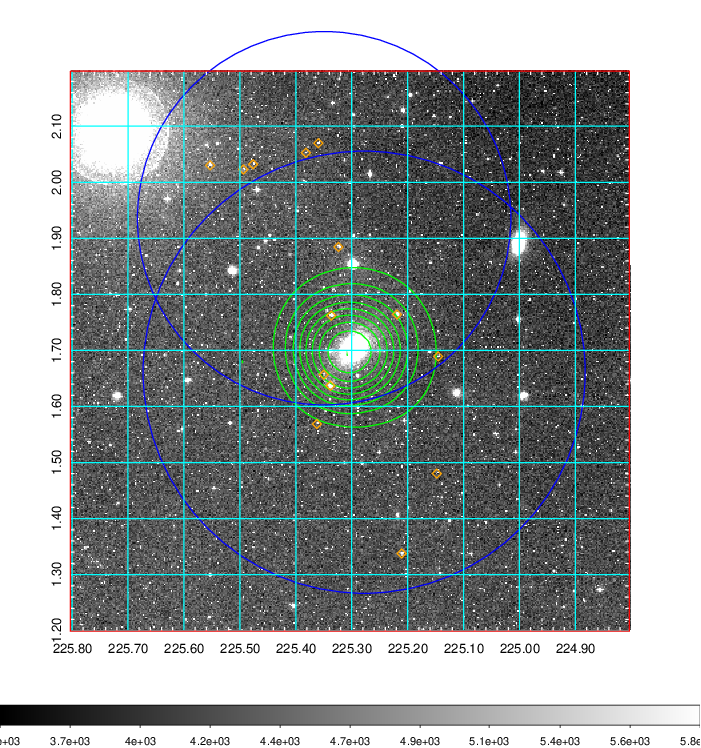 Blue circle for optical clusters;  Magenta circle for XSZ clusters;  all with r=1Mpc;  Only GC with Delta_z<0.01 are shown.  |

|[Previous-identified clusters](../image/585/585_gc.pdf) | [2MASS image](../image/585/585_2mass.pdf)      |[SDSS image](../image/585/585_sdss.pdf)   |
|-------------------|-------------------|-------------------|
|  Green, magenta, and blue circles  for optical, X-ray and SZ clusters  respectively, with redshift of clusters  labelled. The radius of circles  are 1Mpc.|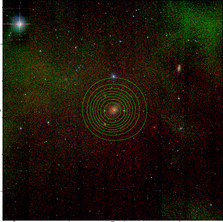  | 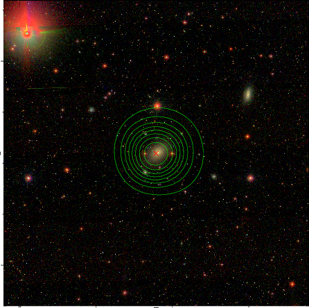  |

