

### 586

|Name|RAJ2000[deg]|DEJ2000[deg] |Ext[arcmin]| Ext,ml | z | z_src| C|GC(XSZ,Delta_z<0.01)| GC(OPT,Delta_z<0.01)|GC| R_sig[arcmin] | R500[arcmin] | R500[Mpc]| CRsig[c/s] | CR500[c/s] |L500[1E44 erg/s]|F500[1E-12 erg/s/cm^2]| M500[1E14 Msun]|Tx[keV]|Cnt_sig|Beta|Rc[arcmin]|Comment|Alias|
|---|---|---|---|---|---|------|---|--------|---------|----------|---|---|---|---|---|---|---|---|---|---|---|---|---|---|
|586| 225.331| 42.335| 1.89| 30.82| 0.2911(0.005)| z1, z_xsz| B| MCXC, PSZ2, Tar| N, W| C, F20, MCXC, N, PSZ2, Tar, W, XCS| 12.700| 4.488| 1.175| 0.132(0.028)| 0.119(0.025)| 6.668(0.929)| 2.478(0.345)| 6.21(0.40)| 7.27(0.30)| 80.3| 0.707(-0.135+0.176)| 2.994(-1.137+1.181)| -| k190|

|[RASS image](../image/586/586_img.pdf)|[filtered image](../image/586/586_fil.pdf)|[Segment image](../image/586/586_seg.pdf)|
|-------------------|--------------------|-------------------|
| 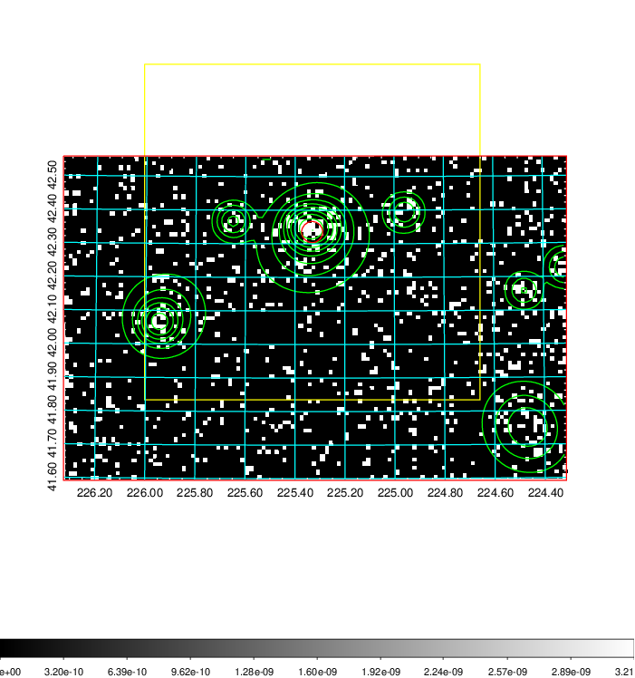  | 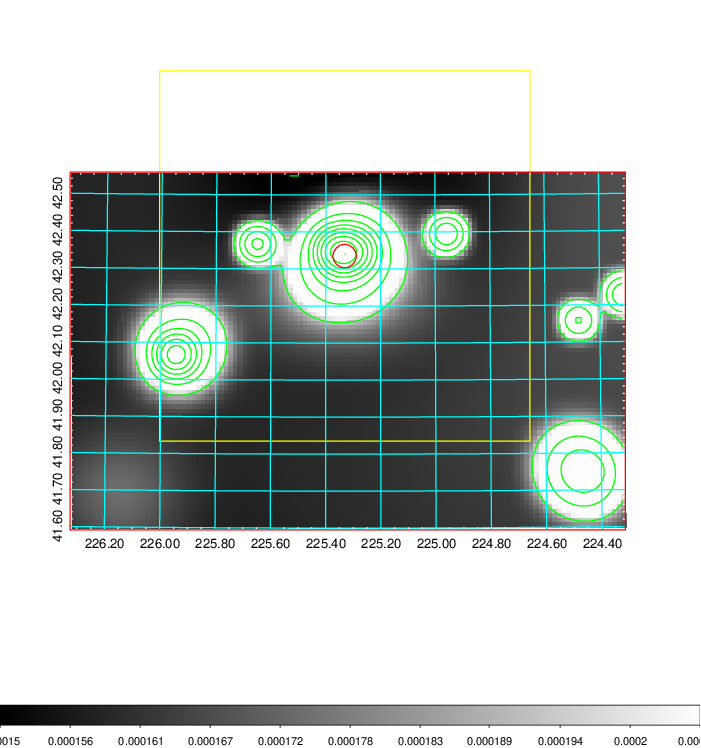   | 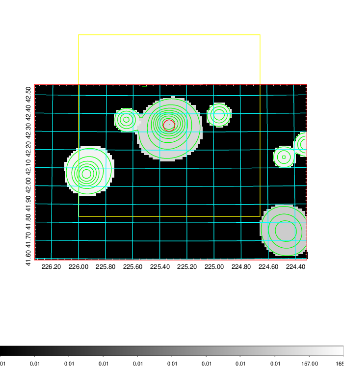  |

|[Exposure image](../image/586/586_mex.pdf)| [nH image](../image/586/586_nh.pdf)| [Planck image](../image/586/586_p.pdf)|
|-------------------|--------------------|-------------------|
|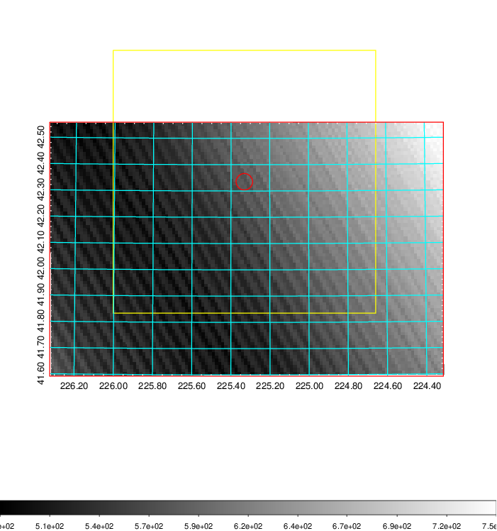   | 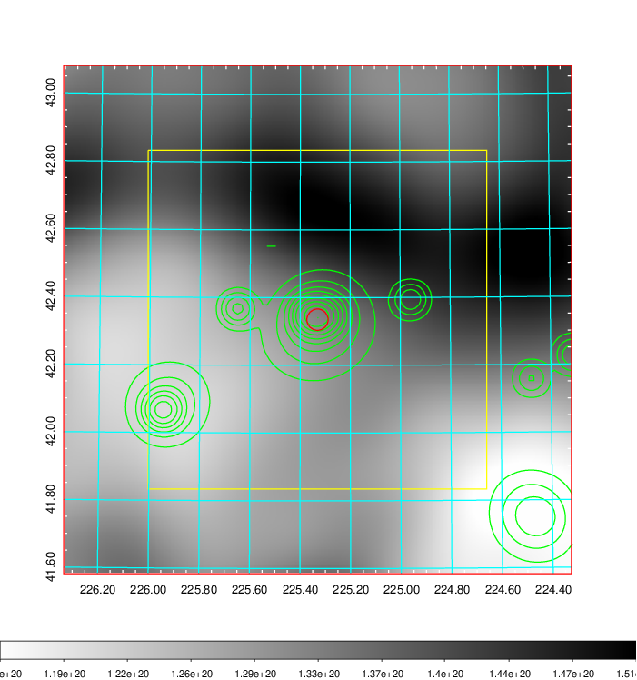    | 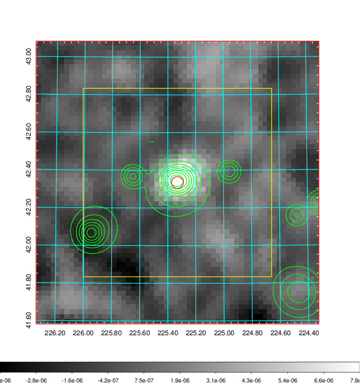 |

|[Redshift Histogram](../image/586/586_zg.pdf) | [DSS image(z1)](../image/586/586_dss_z1.pdf)      |  [DSS image(z2)](../image/586/586_dss_z2.pdf)    |
|-------------------|--------------------|-------------------|
|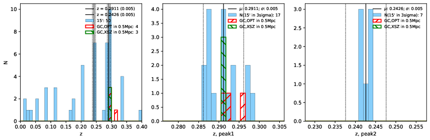 |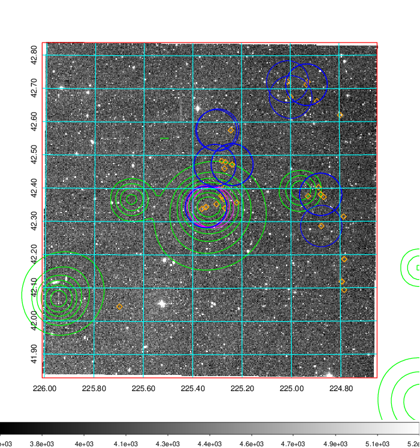  Blue circle for optical clusters;  Magenta circle for XSZ clusters;  all with r=1Mpc;  Only GC with Delta_z<0.01 are shown. | 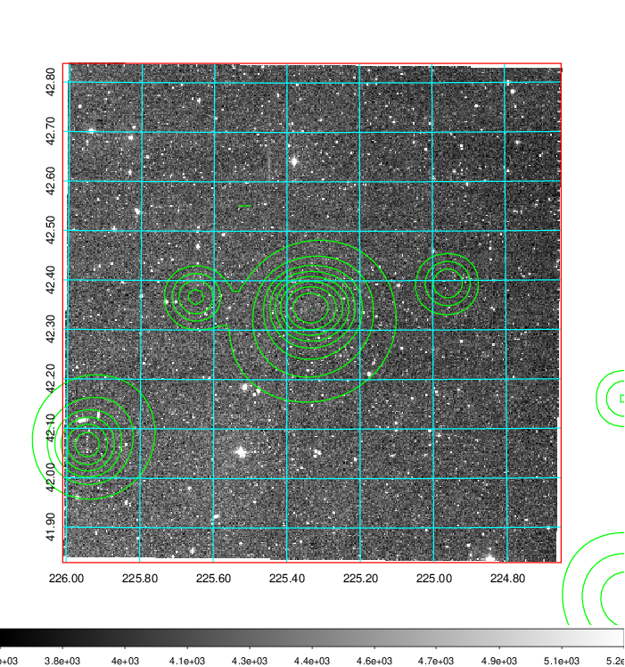 Blue circle for optical clusters;  Magenta circle for XSZ clusters;  all with r=1Mpc;  Only GC with Delta_z<0.01 are shown.  |

|[Previous-identified clusters](../image/586/586_gc.pdf) | [2MASS image](../image/586/586_2mass.pdf)      |[SDSS image](../image/586/586_sdss.pdf)   |
|-------------------|-------------------|-------------------|
|  Green, magenta, and blue circles  for optical, X-ray and SZ clusters  respectively, with redshift of clusters  labelled. The radius of circles  are 1Mpc.|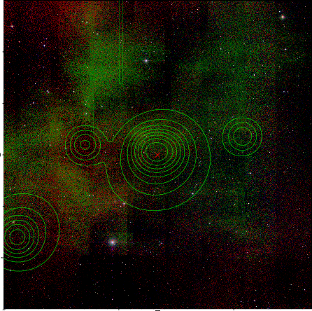  | 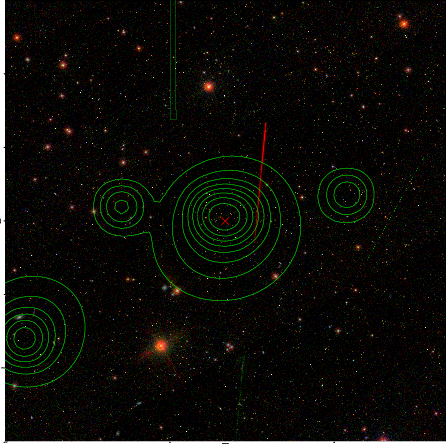  |

