

### 587

|Name|RAJ2000[deg]|DEJ2000[deg] |Ext[arcmin]| Ext,ml | z | z_src| C|GC(XSZ,Delta_z<0.01)| GC(OPT,Delta_z<0.01)|GC| R_sig[arcmin] | R500[arcmin] | R500[Mpc]| CRsig[c/s] | CR500[c/s] |L500[1E44 erg/s]|F500[1E-12 erg/s/cm^2]| M500[1E14 Msun]|Tx[keV]|Cnt_sig|Beta|Rc[arcmin]|Comment|Alias|
|---|---|---|---|---|---|------|---|--------|---------|----------|---|---|---|---|---|---|---|---|---|---|---|---|---|---|
|587| 225.382| 16.550| 14.35| 26.98| 0.1500(0.005)| z1,| G| -| -| A, C, N, W| 29.144| 6.080| 0.954| 0.148(0.094)| 0.131(0.083)| 1.569(1.380)| 2.578(2.268)| 2.86(1.23)| 4.29(1.18)| 137.7| 0.650(-0.106+0.185)| 6.702(-1.754+2.352)| An Abell cluster with $z$ = 0.1512 and offset = 0.74 Mpc(4.65 arcmin)| t523|

|[RASS image](../image/587/587_img.pdf)|[filtered image](../image/587/587_fil.pdf)|[Segment image](../image/587/587_seg.pdf)|
|-------------------|--------------------|-------------------|
| 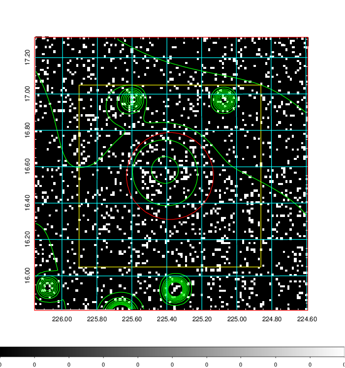  | 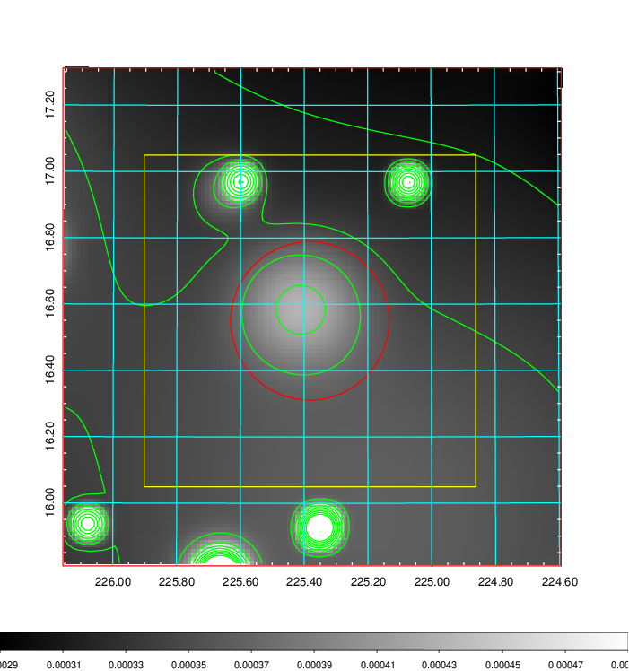   | 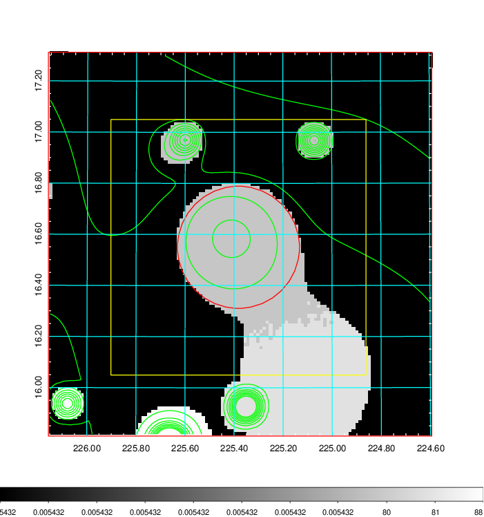  |

|[Exposure image](../image/587/587_mex.pdf)| [nH image](../image/587/587_nh.pdf)| [Planck image](../image/587/587_p.pdf)|
|-------------------|--------------------|-------------------|
|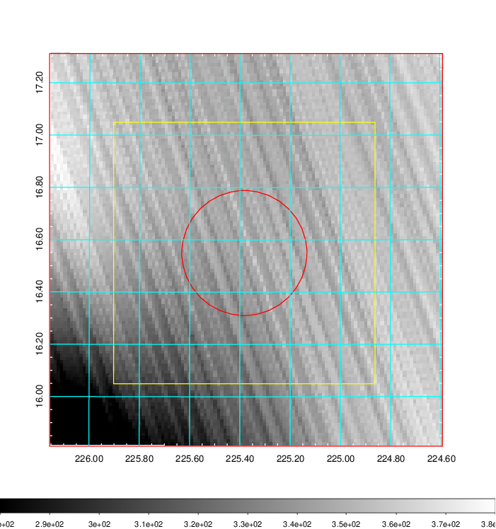   | 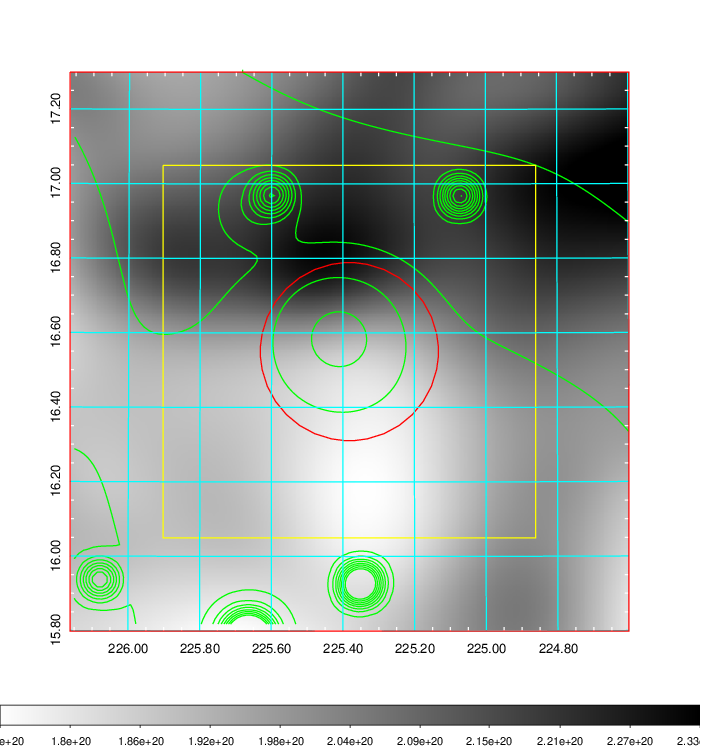    | 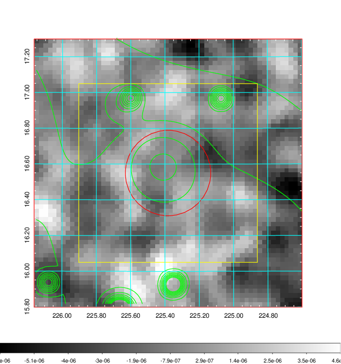 |

|[Redshift Histogram](../image/587/587_zg.pdf) | [DSS image(z1)](../image/587/587_dss_z1.pdf)      |  [DSS image(z2)](../image/587/587_dss_z2.pdf)    |
|-------------------|--------------------|-------------------|
|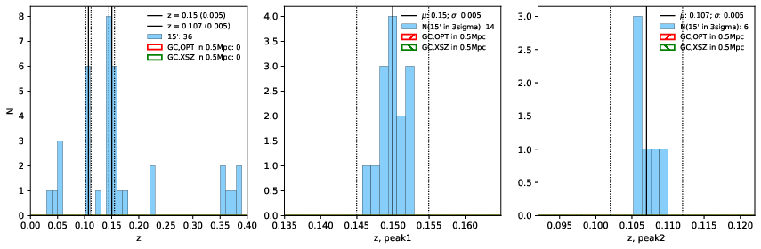 |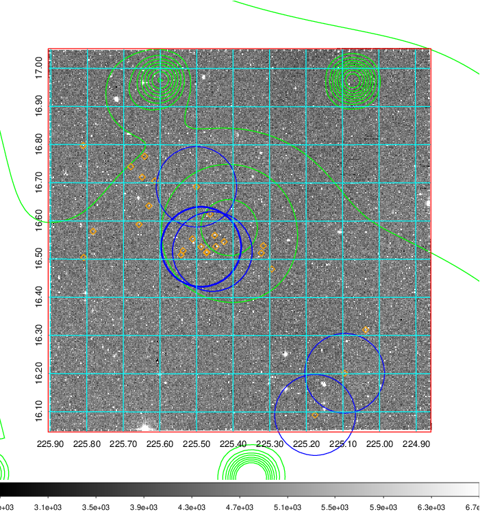  Blue circle for optical clusters;  Magenta circle for XSZ clusters;  all with r=1Mpc;  Only GC with Delta_z<0.01 are shown. | 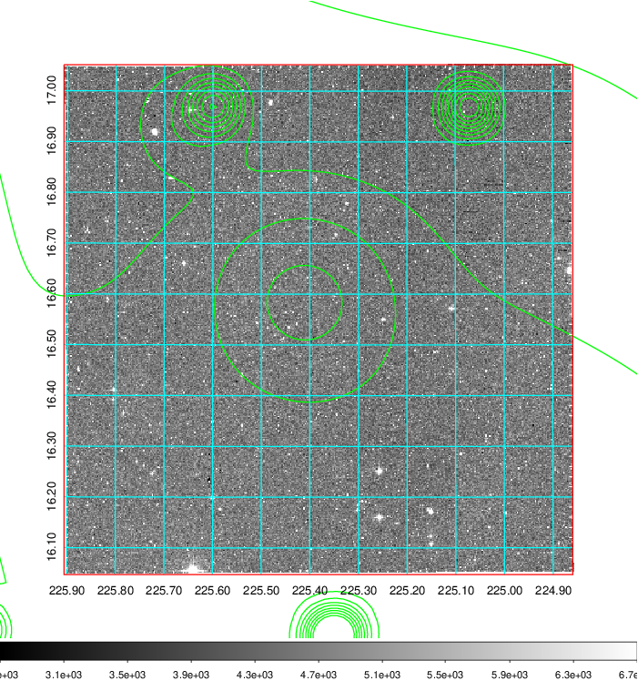 Blue circle for optical clusters;  Magenta circle for XSZ clusters;  all with r=1Mpc;  Only GC with Delta_z<0.01 are shown.  |

|[Previous-identified clusters](../image/587/587_gc.pdf) | [2MASS image](../image/587/587_2mass.pdf)      |[SDSS image](../image/587/587_sdss.pdf)   |
|-------------------|-------------------|-------------------|
|  Green, magenta, and blue circles  for optical, X-ray and SZ clusters  respectively, with redshift of clusters  labelled. The radius of circles  are 1Mpc.|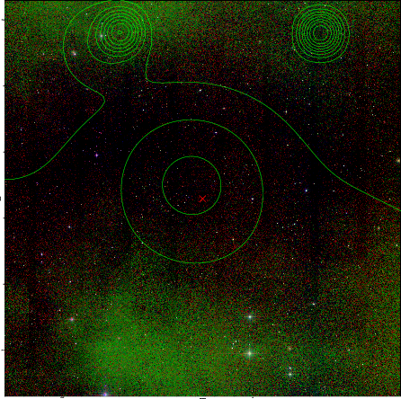  | 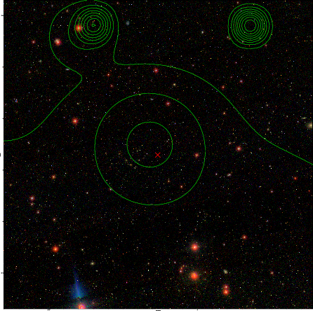  |

