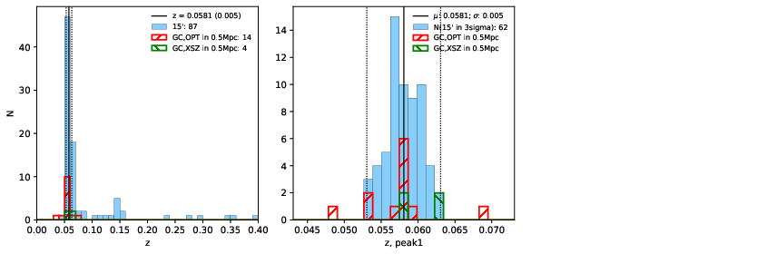

### 588

|Name|RAJ2000[deg]|DEJ2000[deg] |Ext[arcmin]| Ext,ml | z | z_src| C|GC(XSZ,Delta_z<0.01)| GC(OPT,Delta_z<0.01)|GC| R_sig[arcmin] | R500[arcmin] | R500[Mpc]| CRsig[c/s] | CR500[c/s] |L500[1E44 erg/s]|F500[1E-12 erg/s/cm^2]| M500[1E14 Msun]|Tx[keV]|Cnt_sig|Beta|Rc[arcmin]|Comment|Alias|
|---|---|---|---|---|---|------|---|--------|---------|----------|---|---|---|---|---|---|---|---|---|---|---|---|---|---|
|588| 226.069| 28.495| 2.56| 40.63| 0.0581(0.005)| z1, z_xsz| B| F20, L03| A, N, W| A, C, F20, L03, N, W| 27.730| 10.908| 0.736| 0.247(0.080)| 0.225(0.073)| 0.338(0.099)| 4.182(1.224)| 1.20(0.18)| 2.44(0.23)| 160.5| 0.507(-0.005+0.011)| 2.256(-0.239+0.289)| -| t102|

|[RASS image](../image/588/588_img.pdf)|[filtered image](../image/588/588_fil.pdf)|[Segment image](../image/588/588_seg.pdf)|
|-------------------|--------------------|-------------------|
|   |    |   |

|[Exposure image](../image/588/588_mex.pdf)| [nH image](../image/588/588_nh.pdf)| [Planck image](../image/588/588_p.pdf)|
|-------------------|--------------------|-------------------|
|   |     |  |

|[Redshift Histogram](../image/588/588_zg.pdf) | [DSS image(z1)](../image/588/588_dss_z1.pdf)      |  [DSS image(z2)](../image/588/588_dss_z2.pdf)    |
|-------------------|--------------------|-------------------|
| |  Blue circle for optical clusters;  Magenta circle for XSZ clusters;  all with r=1Mpc;  Only GC with Delta_z<0.01 are shown. |  Blue circle for optical clusters;  Magenta circle for XSZ clusters;  all with r=1Mpc;  Only GC with Delta_z<0.01 are shown.  |

|[known Abell/XSZ clusters](../image/588/588_gc.pdf) | [2MASS image](../image/588/588_2mass.pdf)      |[SDSS image](../image/588/588_sdss.pdf)   |
|-------------------|-------------------|-------------------|
|  Magenta, blue and green circles  for optical, X-ray and SZ clusters  respectively, with redshift of clusters  labelled. The radius of circles  are 1Mpc.|  |   |

