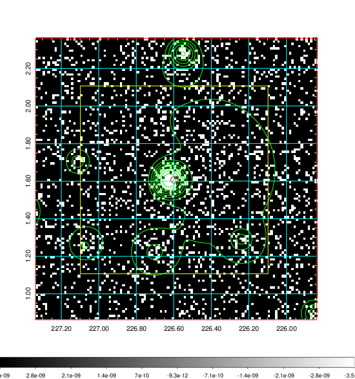
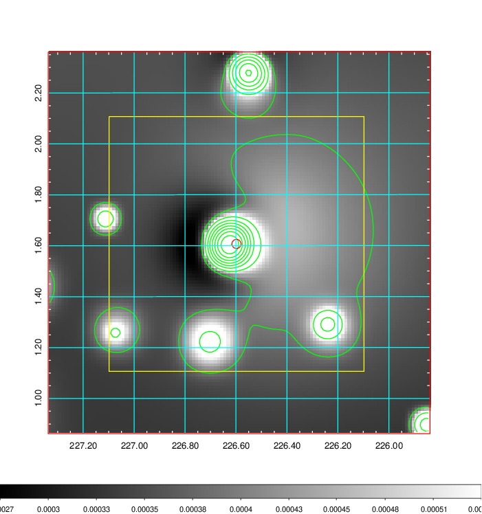
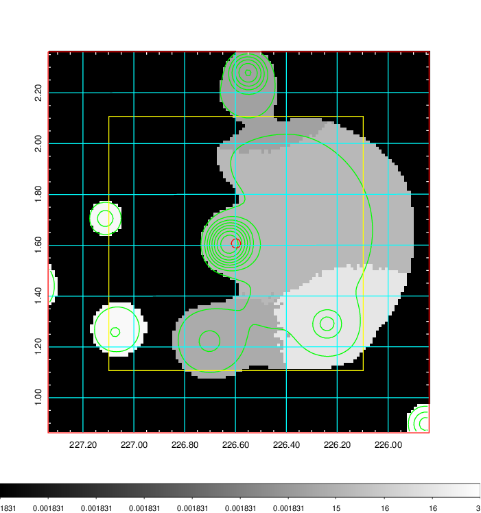
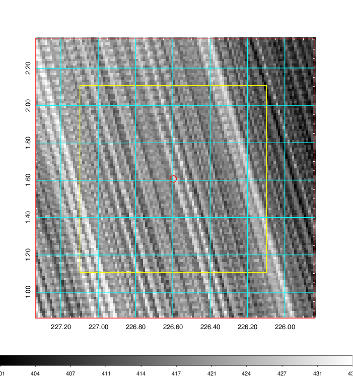
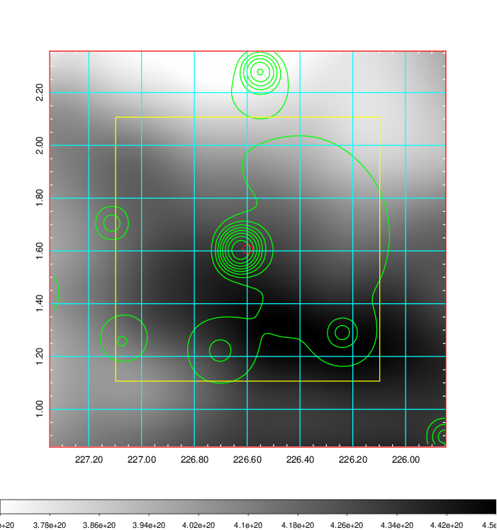
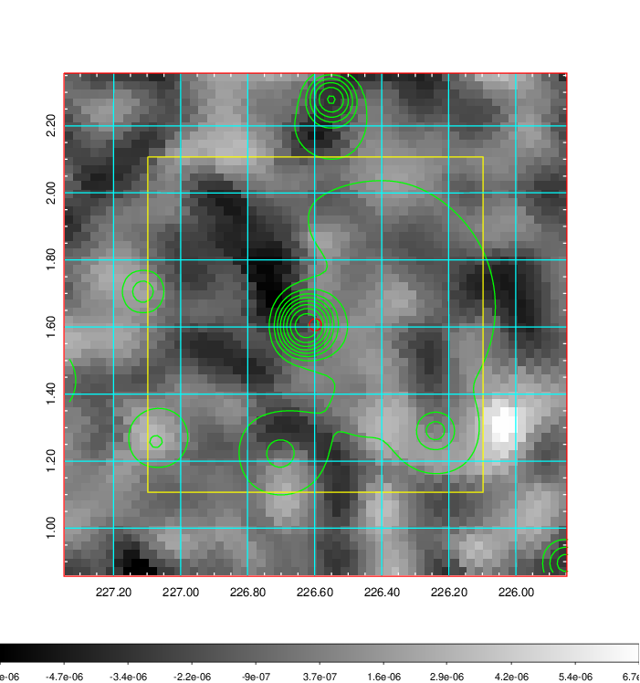
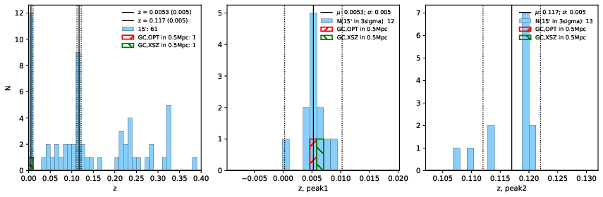
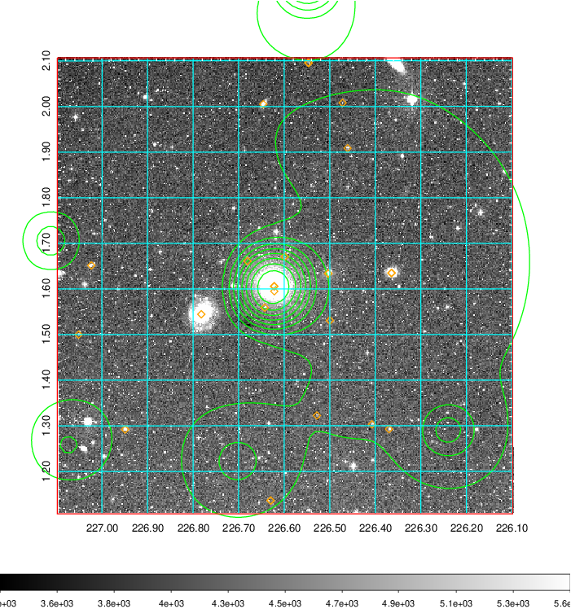
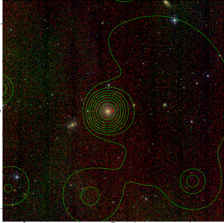
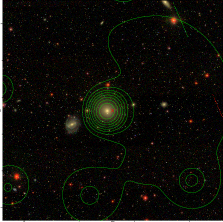

### 589

|Name|RAJ2000[deg]|DEJ2000[deg] |Ext[arcmin]| Ext,ml | z | z_src| C|GC(XSZ,Delta_z<0.01)| GC(OPT,Delta_z<0.01)|GC| R_sig[arcmin] | R500[arcmin] | R500[Mpc]| CRsig[c/s] | CR500[c/s] |L500[1E44 erg/s]|F500[1E-12 erg/s/cm^2]| M500[1E14 Msun]|Tx[keV]|Cnt_sig|Beta|Rc[arcmin]|Comment|Alias|
|---|---|---|---|---|---|------|---|--------|---------|----------|---|---|---|---|---|---|---|---|---|---|---|---|---|---|
|589| 226.598| 1.607| 1.08| 62.03| 0.0053(0.005)| z1, z_xsz| B| MCXC| N| C, MCXC, N, W, XCS| 47.035| 56.351| 0.370| 0.766(0.133)| 0.792(0.138)| 0.006(0.001)| 10.139(1.152)| 0.14(0.01)| 0.65(0.02)| 529.6| 0.534(-0.013+0.014)| 1.736(-0.221+0.224)| -| k039|

|[RASS image](../image/589/589_img.pdf)|[filtered image](../image/589/589_fil.pdf)|[Segment image](../image/589/589_seg.pdf)|
|-------------------|--------------------|-------------------|
|   |    |   |

|[Exposure image](../image/589/589_mex.pdf)| [nH image](../image/589/589_nh.pdf)| [Planck image](../image/589/589_p.pdf)|
|-------------------|--------------------|-------------------|
|   |     |  |

|[Redshift Histogram](../image/589/589_zg.pdf) | [DSS image(z1)](../image/589/589_dss_z1.pdf)      |  [DSS image(z2)](../image/589/589_dss_z2.pdf)    |
|-------------------|--------------------|-------------------|
| |  Blue circle for optical clusters;  Magenta circle for XSZ clusters;  all with r=1Mpc;  Only GC with Delta_z<0.01 are shown. |  Blue circle for optical clusters;  Magenta circle for XSZ clusters;  all with r=1Mpc;  Only GC with Delta_z<0.01 are shown.  |

|[Previous-identified clusters](../image/589/589_gc.pdf) | [2MASS image](../image/589/589_2mass.pdf)      |[SDSS image](../image/589/589_sdss.pdf)   |
|-------------------|-------------------|-------------------|
|  Green, magenta, and blue circles  for optical, X-ray and SZ clusters  respectively, with redshift of clusters  labelled. The radius of circles  are 1Mpc.|  |   |

