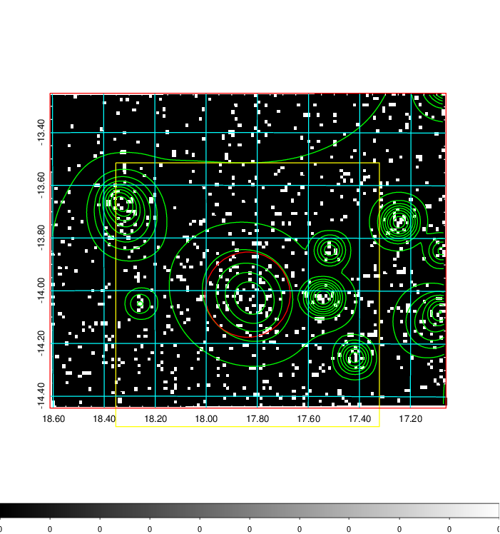
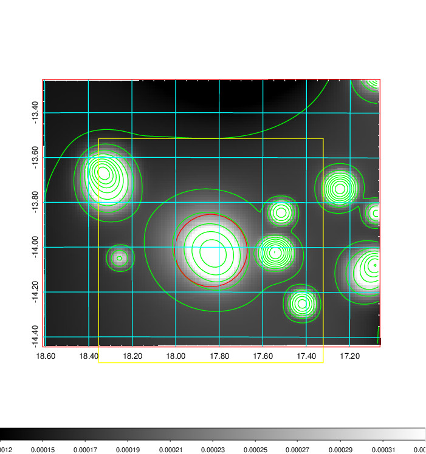
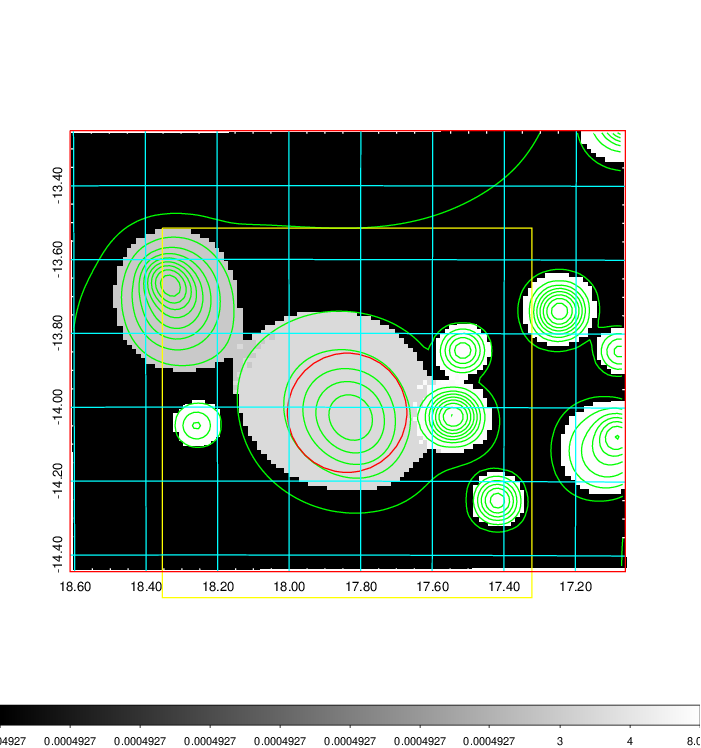
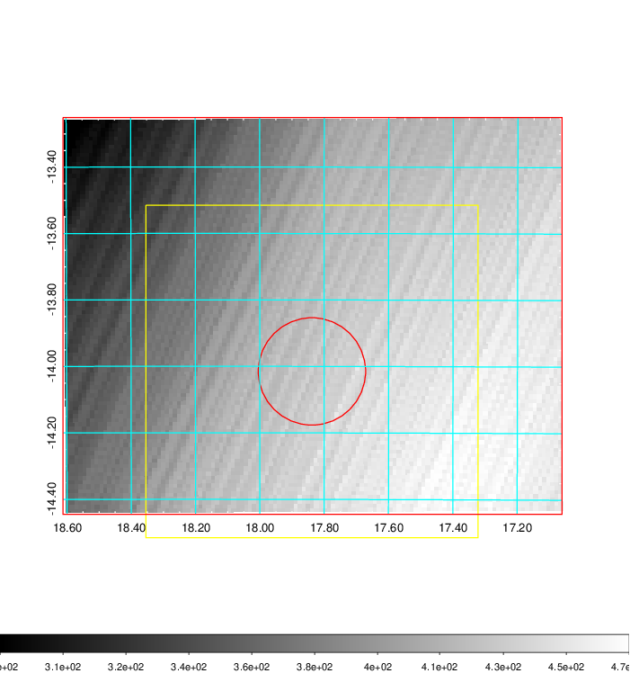
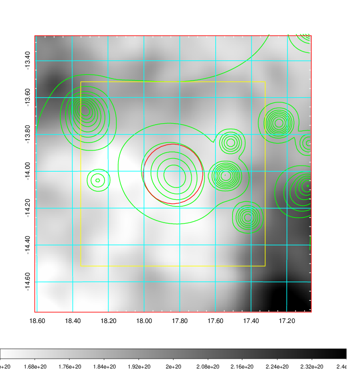
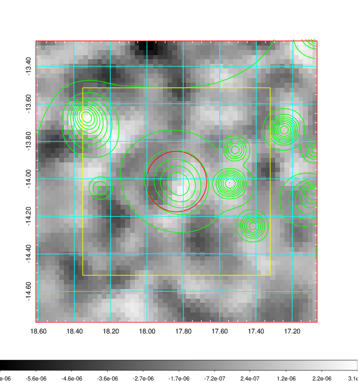
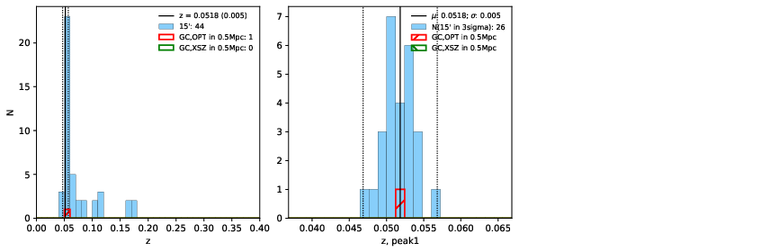
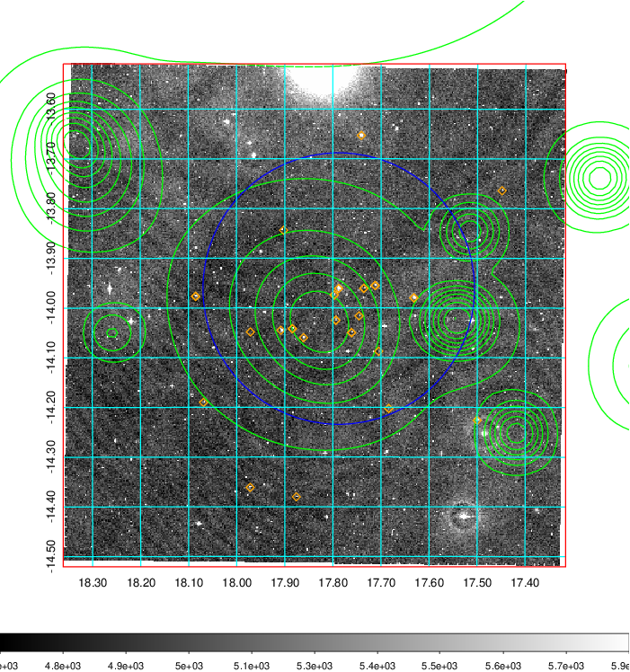
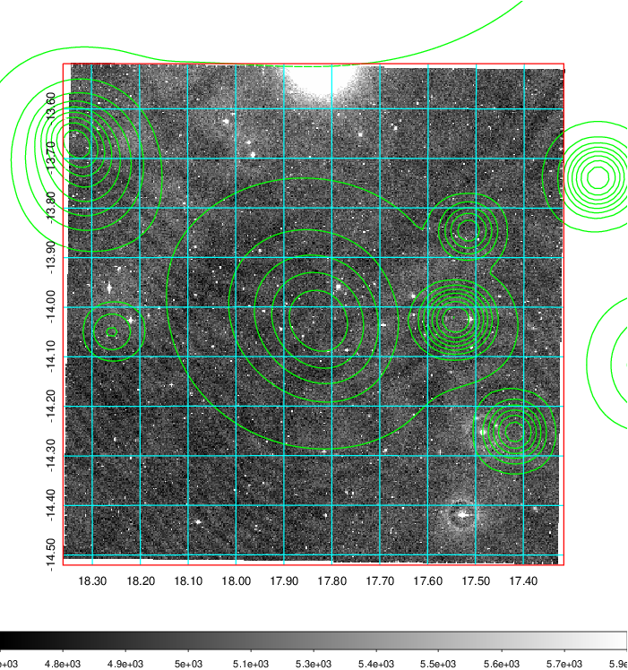
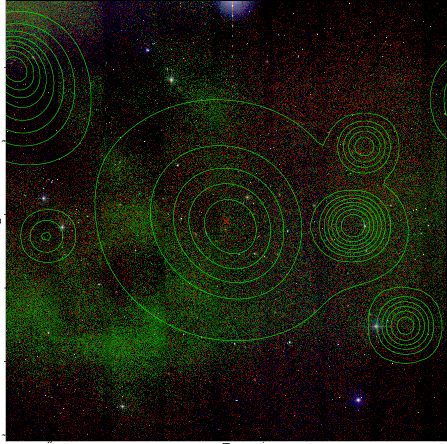

### 59

|Name|RAJ2000[deg]|DEJ2000[deg] |Ext[arcmin]| Ext,ml | z | z_src| C|GC(XSZ,Delta_z<0.01)| GC(OPT,Delta_z<0.01)|GC| R_sig[arcmin] | R500[arcmin] | R500[Mpc]| CRsig[c/s] | CR500[c/s] |L500[1E44 erg/s]|F500[1E-12 erg/s/cm^2]| M500[1E14 Msun]|Tx[keV]|Cnt_sig|Beta|Rc[arcmin]|Comment|Alias|
|---|---|---|---|---|---|------|---|--------|---------|----------|---|---|---|---|---|---|---|---|---|---|---|---|---|---|
|59| 17.838| -14.015| 9.69| 66.90| 0.0518(0.005)| z1, z_opt| S| -| W| W| 36.640| 11.869| 0.720| 0.279(0.071)| 0.251(0.064)| 0.300(0.126)| 4.718(1.983)| 1.11(0.24)| 2.32(0.32)| 238.2| 0.509(-0.007+0.015)| 6.782(-0.689+0.866)| -| t435|

|[RASS image](../image/59/59_img.pdf)|[filtered image](../image/59/59_fil.pdf)|[Segment image](../image/59/59_seg.pdf)|
|-------------------|--------------------|-------------------|
|   |    |   |

|[Exposure image](../image/59/59_mex.pdf)| [nH image](../image/59/59_nh.pdf)| [Planck image](../image/59/59_p.pdf)|
|-------------------|--------------------|-------------------|
|   |     |  |

|[Redshift Histogram](../image/59/59_zg.pdf) | [DSS image(z1)](../image/59/59_dss_z1.pdf)      |  [DSS image(z2)](../image/59/59_dss_z2.pdf)    |
|-------------------|--------------------|-------------------|
| |  Blue circle for optical clusters;  Magenta circle for XSZ clusters;  all with r=1Mpc;  Only GC with Delta_z<0.01 are shown. |  Blue circle for optical clusters;  Magenta circle for XSZ clusters;  all with r=1Mpc;  Only GC with Delta_z<0.01 are shown.  |

|[known Abell/XSZ clusters](../image/59/59_gc.pdf) | [2MASS image](../image/59/59_2mass.pdf)      |
|-------------------|-------------------|
|  Magenta, blue and green circles  for optical, X-ray and SZ clusters  respectively, with redshift of clusters  labelled. The radius of circles  are 1Mpc.|  |

|[DES image](../image/59/59_des.pdf)   |[ATLAS image](../image/59/59_s.pdf)        |
|-------------------|-------------------|
|   |   |
