

### 590

|Name|RAJ2000[deg]|DEJ2000[deg] |Ext[arcmin]| Ext,ml | z | z_src| C|GC(XSZ,Delta_z<0.01)| GC(OPT,Delta_z<0.01)|GC| R_sig[arcmin] | R500[arcmin] | R500[Mpc]| CRsig[c/s] | CR500[c/s] |L500[1E44 erg/s]|F500[1E-12 erg/s/cm^2]| M500[1E14 Msun]|Tx[keV]|Cnt_sig|Beta|Rc[arcmin]|Comment|Alias|
|---|---|---|---|---|---|------|---|--------|---------|----------|---|---|---|---|---|---|---|---|---|---|---|---|---|---|
|590| 227.000| 40.556| 5.23| 38.30| 0.5551(0.000)| z_xsz| B| -| -| C, F20, N, SPI, Tar, W| 10.262| 3.253| 1.257| 0.088(0.020)| 0.079(0.018)| 20.828(6.969)| 1.686(0.564)| 10.35(1.44)| 11.00(0.99)| 61.5| 0.807(-0.175+0.134)| 8.019(-1.703+1.286)| $z$ of XSZ cluster; An SZ cluster with $z$ = 0.5569 and offset = 1.04 Mpc (2.66arcmin)| t269|

|[RASS image](../image/590/590_img.pdf)|[filtered image](../image/590/590_fil.pdf)|[Segment image](../image/590/590_seg.pdf)|
|-------------------|--------------------|-------------------|
| 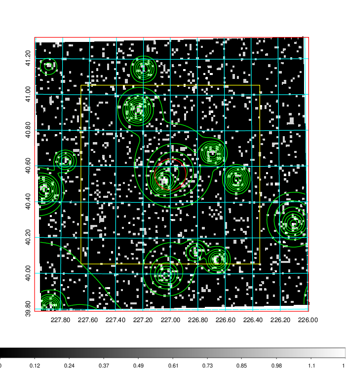  | 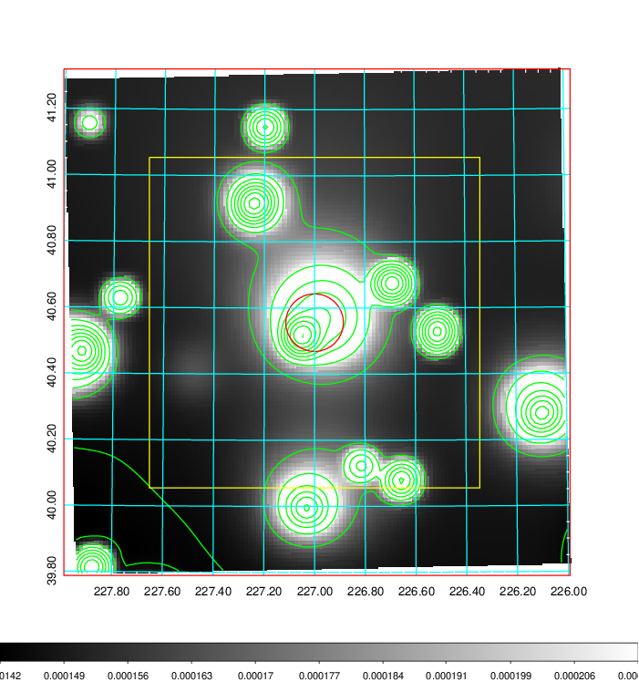   | 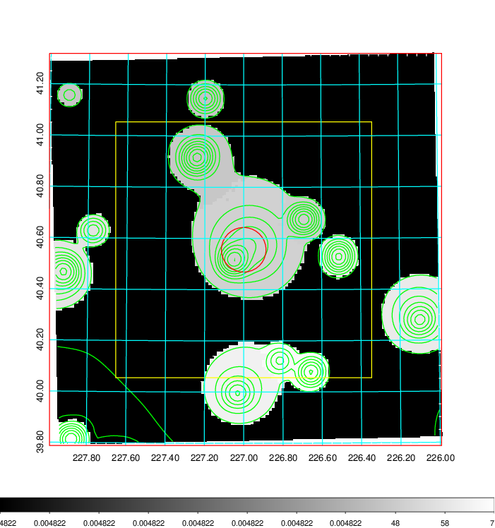  |

|[Exposure image](../image/590/590_mex.pdf)| [nH image](../image/590/590_nh.pdf)| [Planck image](../image/590/590_p.pdf)|
|-------------------|--------------------|-------------------|
|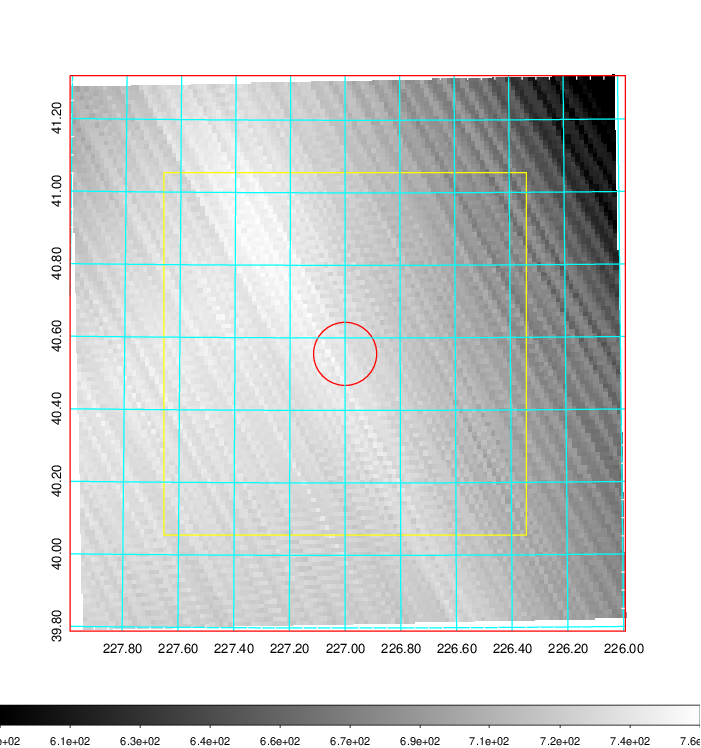   | 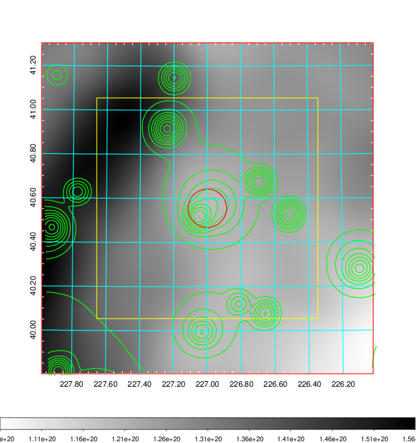    | 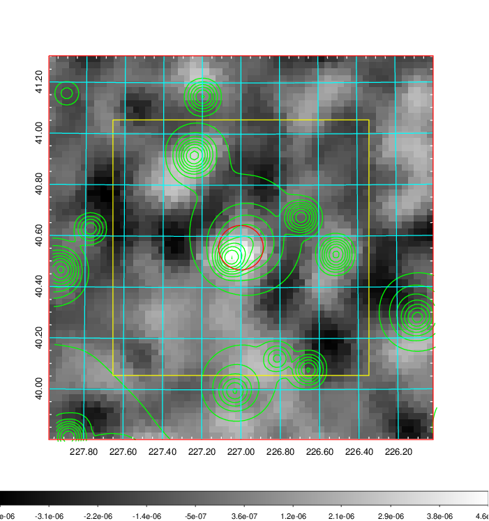 |

|[Redshift Histogram](../image/590/590_zg.pdf) | [DSS image(z1)](../image/590/590_dss_z1.pdf)      |  [DSS image(z2)](../image/590/590_dss_z2.pdf)    |
|-------------------|--------------------|-------------------|
|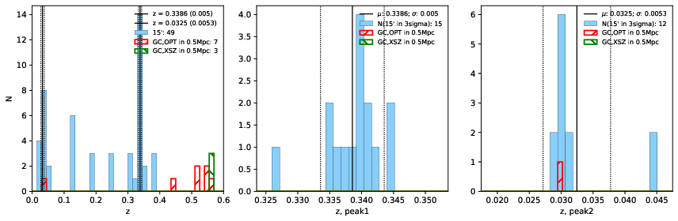 |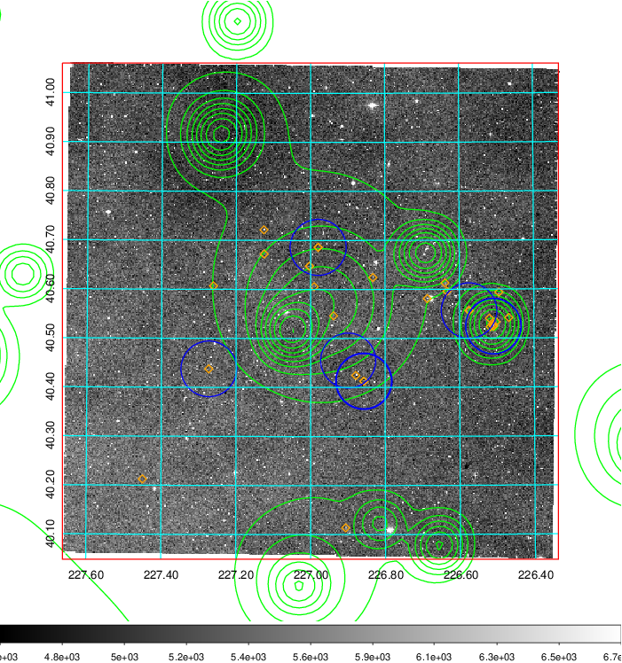  Blue circle for optical clusters;  Magenta circle for XSZ clusters;  all with r=1Mpc;  Only GC with Delta_z<0.01 are shown. | 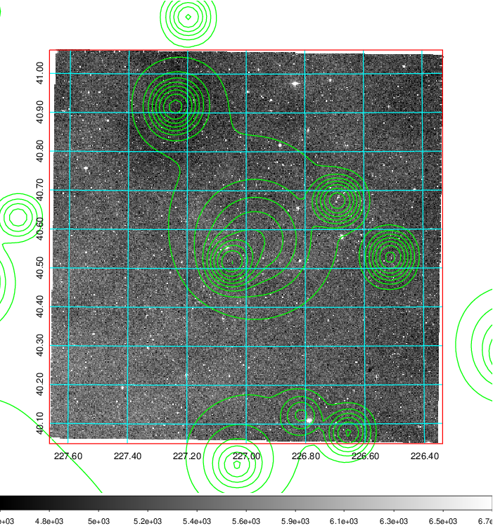 Blue circle for optical clusters;  Magenta circle for XSZ clusters;  all with r=1Mpc;  Only GC with Delta_z<0.01 are shown.  |

|[known Abell/XSZ clusters](../image/590/590_gc.pdf) | [2MASS image](../image/590/590_2mass.pdf)      |[SDSS image](../image/590/590_sdss.pdf)   |
|-------------------|-------------------|-------------------|
|  Magenta, blue and green circles  for optical, X-ray and SZ clusters  respectively, with redshift of clusters  labelled. The radius of circles  are 1Mpc.|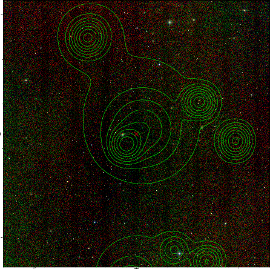  | 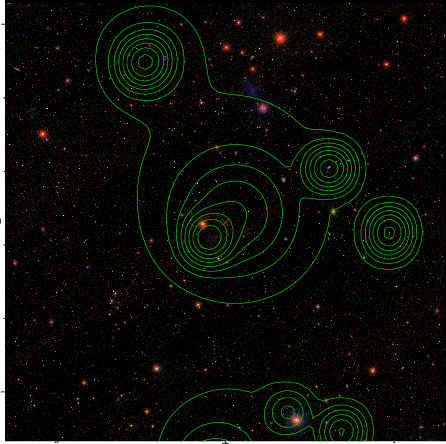  |

