

### 592

|Name|RAJ2000[deg]|DEJ2000[deg] |Ext[arcmin]| Ext,ml | z | z_src| C|GC(XSZ,Delta_z<0.01)| GC(OPT,Delta_z<0.01)|GC| R_sig[arcmin] | R500[arcmin] | R500[Mpc]| CRsig[c/s] | CR500[c/s] |L500[1E44 erg/s]|F500[1E-12 erg/s/cm^2]| M500[1E14 Msun]|Tx[keV]|Cnt_sig|Beta|Rc[arcmin]|Comment|Alias|
|---|---|---|---|---|---|------|---|--------|---------|----------|---|---|---|---|---|---|---|---|---|---|---|---|---|---|
|592| 227.549| 33.517| 1.65| 212.42| 0.1137(0.005)| z1, z_xsz| B| F20, MCXC, PSZ2, Tar, XB| A, C, N, RM, W| A, C, F20, MCXC, N, PSZ2, Tar, W, XB| 12.212| 9.665| 1.197| 0.668(0.041)| 0.646(0.040)| 4.331(0.117)| 12.978(0.351)| 5.44(0.07)| 6.31(0.05)| 456.7| 0.798(-0.073+0.091)| 3.594(-0.509+0.568)| -| k149|

|[RASS image](../image/592/592_img.pdf)|[filtered image](../image/592/592_fil.pdf)|[Segment image](../image/592/592_seg.pdf)|
|-------------------|--------------------|-------------------|
| 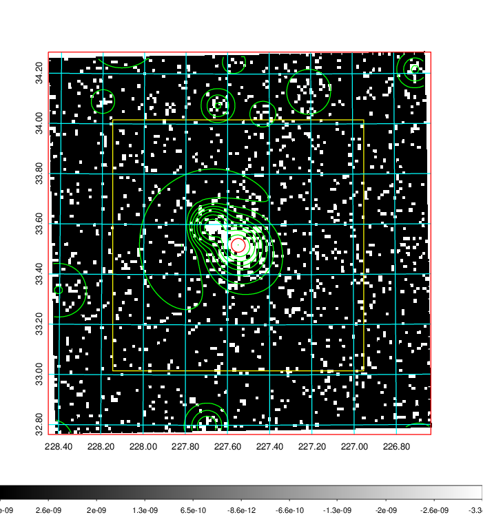  | 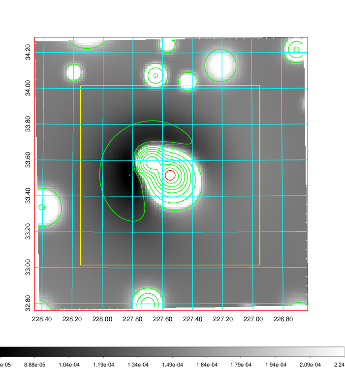   | 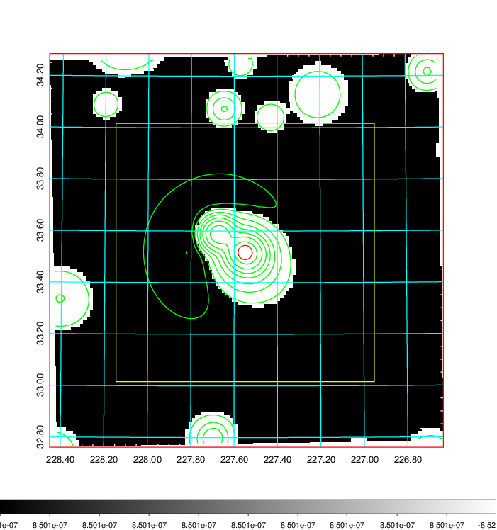  |

|[Exposure image](../image/592/592_mex.pdf)| [nH image](../image/592/592_nh.pdf)| [Planck image](../image/592/592_p.pdf)|
|-------------------|--------------------|-------------------|
|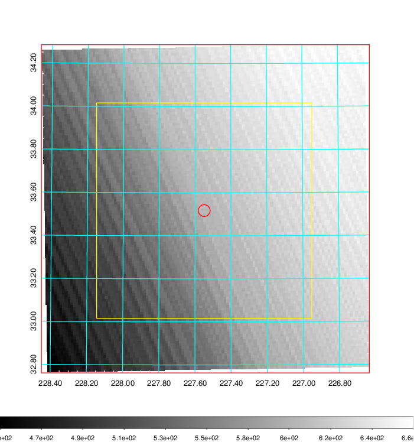   | 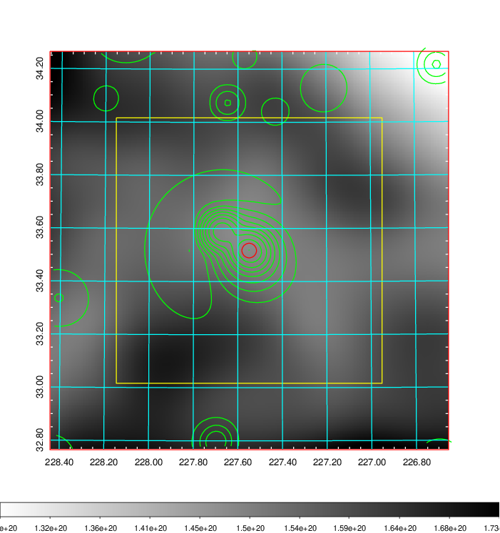    | 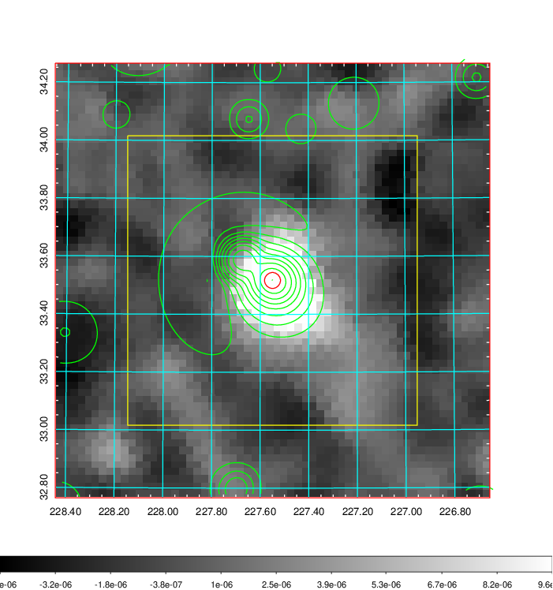 |

|[Redshift Histogram](../image/592/592_zg.pdf) | [DSS image(z1)](../image/592/592_dss_z1.pdf)      |  [DSS image(z2)](../image/592/592_dss_z2.pdf)    |
|-------------------|--------------------|-------------------|
|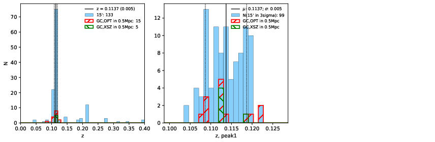 |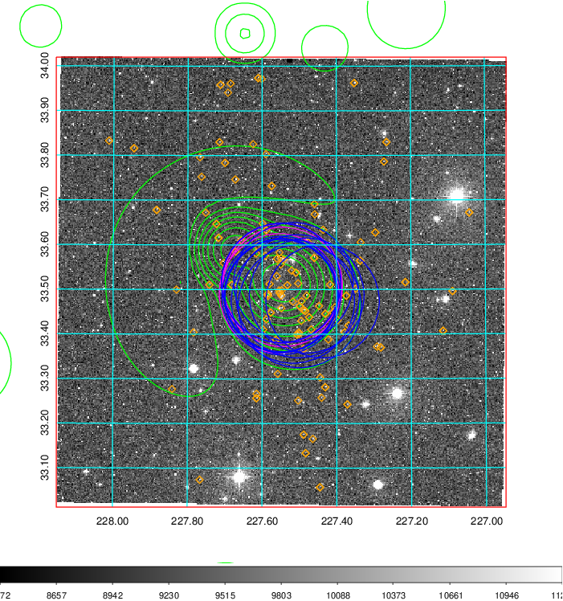  Blue circle for optical clusters;  Magenta circle for XSZ clusters;  all with r=1Mpc;  Only GC with Delta_z<0.01 are shown. | 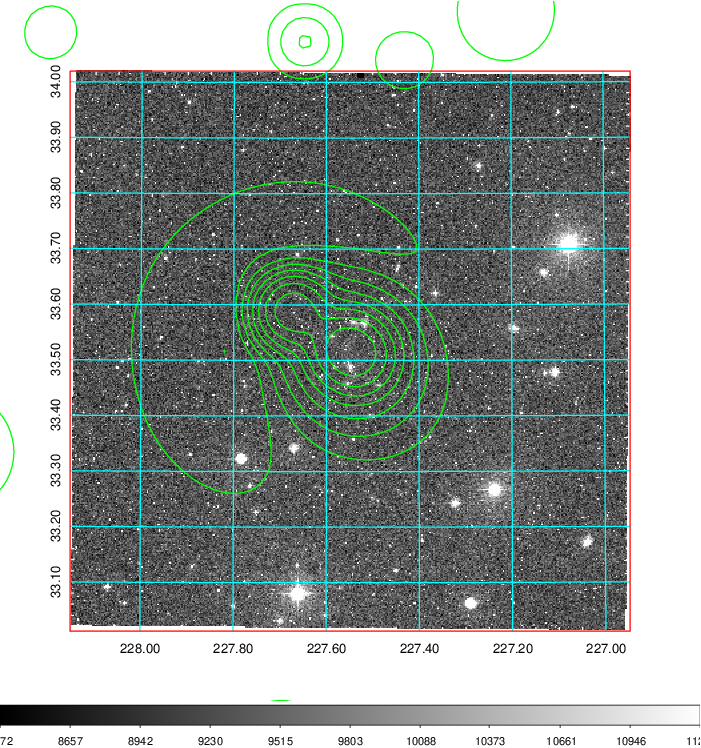 Blue circle for optical clusters;  Magenta circle for XSZ clusters;  all with r=1Mpc;  Only GC with Delta_z<0.01 are shown.  |

|[Previous-identified clusters](../image/592/592_gc.pdf) | [2MASS image](../image/592/592_2mass.pdf)      |[SDSS image](../image/592/592_sdss.pdf)   |
|-------------------|-------------------|-------------------|
|  Green, magenta, and blue circles  for optical, X-ray and SZ clusters  respectively, with redshift of clusters  labelled. The radius of circles  are 1Mpc.|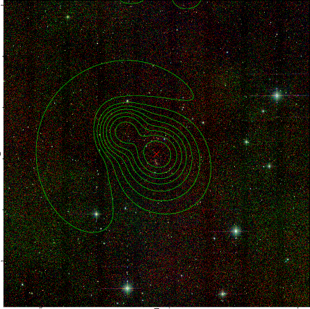  | 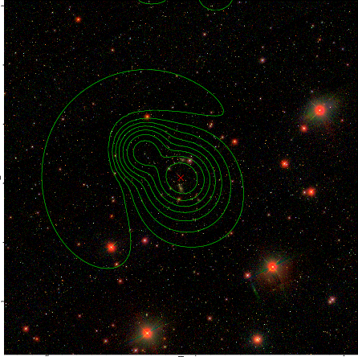  |

